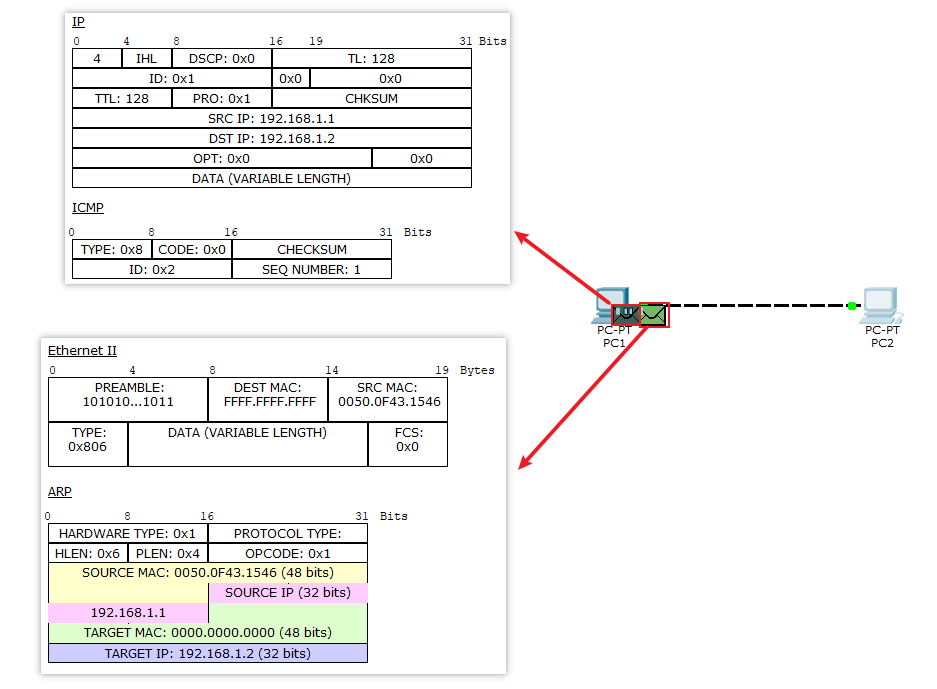
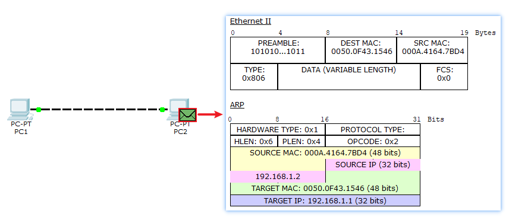
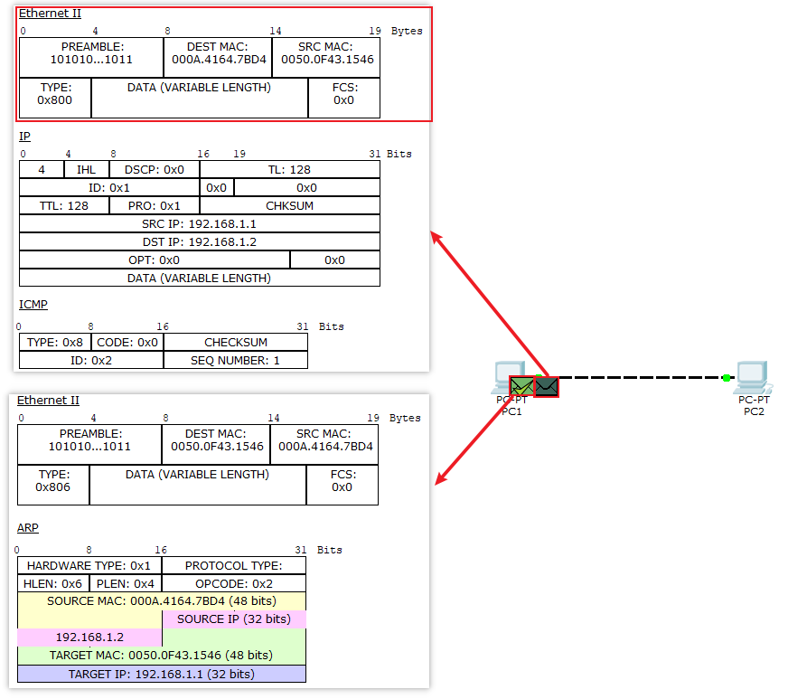
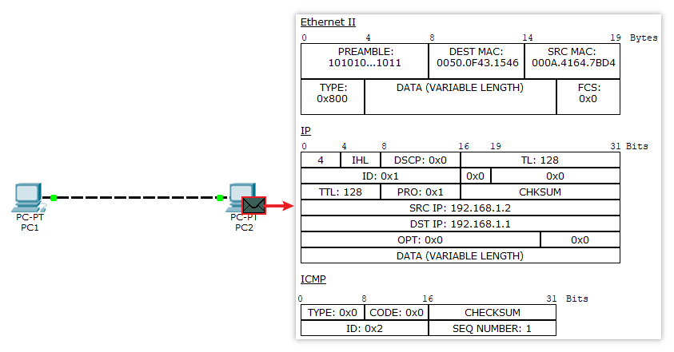
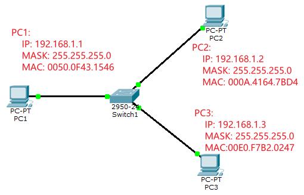
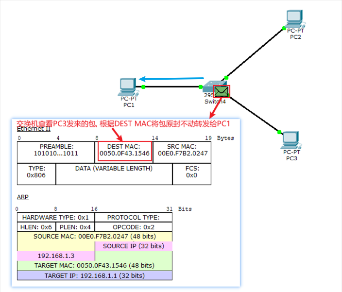
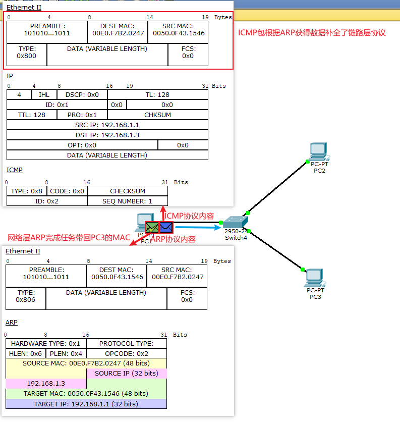
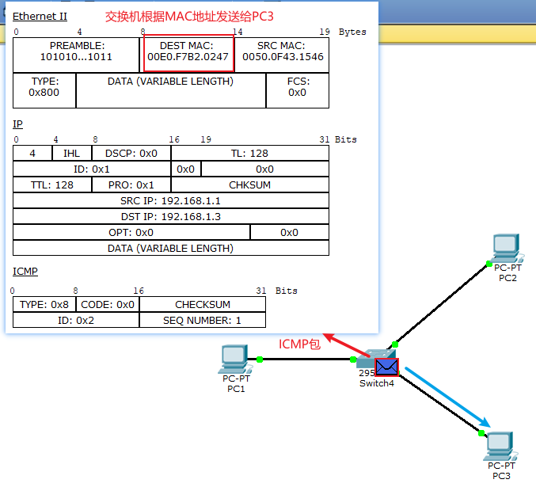
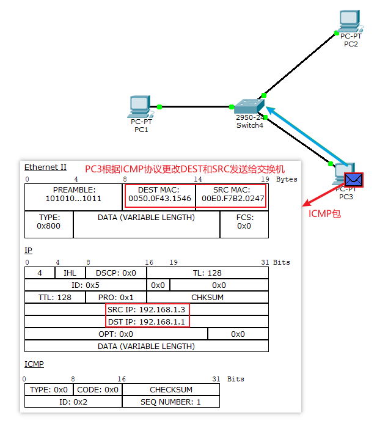
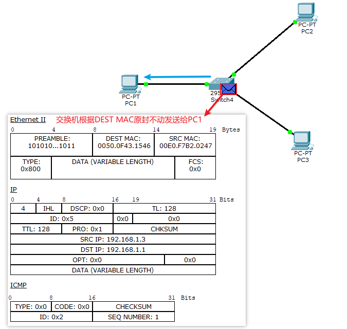

# switch

switch记录每个NIC的MAC地址, 根据MAC地址来发送信息

## 两个NIC直连
### 创建网络
创建如下网络:
PC1:
    IP: 192.168.1.1
    MASK: 255.255.255.0
    MAC: 0050.0F43.1546
PC2:
    IP: 192.168.1.2
    MASK: 255.255.255.0
    MAC: 000A.4164.7BD4


### 模拟通话

1. `PC1`输入`ping 192.168.1.2`, 会创建两个包ARP和ICMP.
由于通讯的前提是知道对方的MAC地址, 所以`ping`命令发送的`ICMP`包会暂停发送, 因为不知道`192.168.1.2`MAC
所以会创建发送ARP包获取指定IP的MAC地址, 这里`DEST MAC`是`F...F`表示发送同网段下所有主机.


2. `PC2`收到ARP包后首先记录主机`PC1`的MAC, 然后发送ARP包返回
```sh
arp -a
## Internet Address      Physical Address      Type
## 192.168.1.1           0050.0f43.1546        dynamic
```



3. `PC1`收到返回的ARP包后, 首先记录`PC2`的MAC地址, 然后将`PC2`的MAC地址添加到`ICMP`包上, 并将`ICMP`包发送给`PC2`
```sh
arp -a
## Internet Address      Physical Address      Type
## 192.168.1.2           000a.4164.7bd4        dynamic
```



4. `PC2`收到`ICMP`包后, 返回`ICMP`包给`PC1`


5. `PC1`收到`ICMP`包后, 此次通信结束


## 通过switch组网
switch的作用
转发过滤： 当⼀个数据帧的⽬的地址在MAC地址表中有映射时， 它被转发到连接⽬的节点的端⼝⽽不是所有端⼝（如该数据帧为⼴播帧`F...F`则转发⾄所有端⼝）
学习功能： 以太⽹交换机了解每⼀端⼝相连设备的MAC地址， 并将地址同相应的端⼝映射起来存放在交换机缓存中的MAC地址表中

### 配置网络
创建三个电脑和一个交换机:
PC1:
    IP: 192.168.1.1
    MASK: 255.255.255.0
    MAC: 0050.0F43.1546
PC2:
    IP: 192.168.1.2
    MASK: 255.255.255.0
    MAC: 000A.4164.7BD4
PC3:
    IP: 192.168.1.3
    MASK: 255.255.255.0
    MAC:00E0.F7B2.0247

如图所示:



1. 操作`PC1`在控制台输入`ping 193.168.1.3`, `PC1`会创建两个包:
    - ARP包, 用来获取目标主机的MAC地址, 因为此时`PC1`不知道`193.168.1.3`的MAC地址
    - ICMP包, ping命令发送的包, 因为不知道`PC3`的MAC所以没有链路层的协议数据, 不能发送
首先, 会发送`ARP`包, 来获取`192.168.1.3`的MAC地址. 将ARP包发给`swtich1`, 


2. `switch1`收到`PC1`的ARP包后, 首先记录下`PC1`的信息, 然后查看`TARGET MAC`是`F...F`, 广播地址, 所以会将包原封不动转换给同网段的所有主机(`PC2`和`PC3`)
```sh
show mac address-table 
##           Mac Address Table
## -------------------------------------------
## 
## Vlan    Mac Address       Type        Ports
## ----    -----------       --------    -----
## 
##    1    0050.0f43.1546    DYNAMIC     Fa0/1
```


3. 同一个subnet下的`PC2`和`PC3`收到`switch1`的ARP包
`PC2`收到包, 查看目的IP是`192.168.1.3`, 和自己不匹配就丢弃
`PC3`收到包, 查看和自己匹配, 于是更改包的内容, 收记录下发来包的`PC1`的地址, 并反向发送ARP包:
```sh
arp -a
## Internet Address      Physical Address      Type
## 192.168.1.1           0050.0f43.1546        dynamic
```


4. `switch1`收到包后, 先记录发来包的`PC3`的MAC地址, 然后通过IP和MAC判断, 将APR包只发给`PC1`
```sh
show mac address-table 
##           Mac Address Table
## -------------------------------------------
## 
## Vlan    Mac Address       Type        Ports
## ----    -----------       --------    -----
## 
##    1    0050.0f43.1546    DYNAMIC     Fa0/1
##    1    00e0.f7b2.0247    DYNAMIC     Fa0/3
```



5. `PC1`拿到包之后, 记录`PC3`的MAC地址, 在ICMP(ping)包中写入`PC3`的MAC地址, 补全链路层的内容, 发送给`switch1`.
```sh
PC>arp -a
  Internet Address      Physical Address      Type
  192.168.1.3           00e0.f7b2.0247        dynamic
```




6. `PC1`通过MAC地址发送ICMP包





## 通过集线器组⽹
hub（集线器） 能够完成多个电脑的链接, 每个数据包的发送都是以⼴播的形式进⾏的， 容易堵塞⽹络


