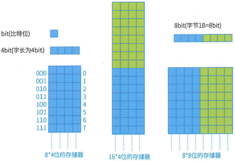
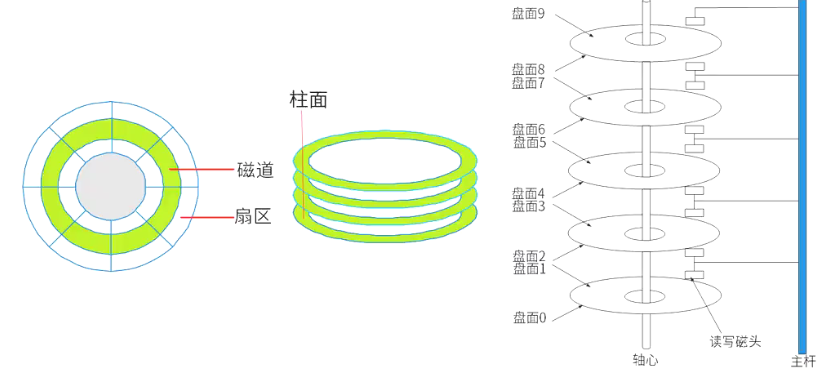
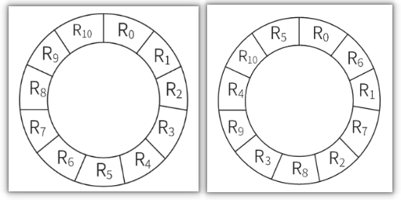
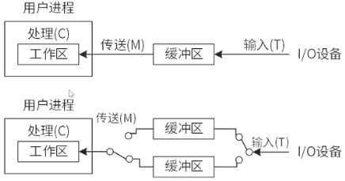

## CPU


### CPU组成

1. 运算器
    1. 算术逻辑单元 ALU：数据的算术运算和逻辑运算
    2. 累加寄存器 AC：通用寄存器，为 ALU 提供一个工作区，用于暂存数据
    3. 数据缓冲寄存器 DR：写内存时，暂存指令或数据
    4. 状态条件寄存器 PSW：存状态标志与控制标志（争议：也有将其归为控制器的）
2. 控制器
    1. 程序计数器 PC：存储指令地址
    2. 指令寄存器 IR：存储指令内容
    3. 指令译码器 ID：对指令中的操作码字段进行分析解释
    4. 时序部件：提供时序控制信号


### CPU结构


1. 冯·诺依曼结构
冯·诺依曼结构, 是一种将程序指令存储器和数据存储器合并在一起的存储器结构。一般用于PC处理器，如I3，I5，I7处理器

2. 哈佛结构
哈佛结构是一种将程序指令存储和数据存储分开的存储器结构。一般用于嵌入式系统处理器（DSP）数字信号处理（DSP，Digital Signal Processing）


### 嵌入式CPU分类

1. DSP: DSP 芯片，也称数字信号处理器，是一种特别适合于进行数字信号处理运算的微处理器，其主要应用是实时快速地实现各种数字信号处理算法。
2. SoC: System on Chip，简称 SoC，也即片上系统。从狭义角度讲，它是信息系统核心的芯片集成，是将系统关键部件集成在一块芯片上；从广义角度讲，SoC 是一个微型系统，如果说中央处理器（CPU）是大脑，那么 SoC 就包括大脑、心脏、眼睛和手的系统。
3. MPU: 微机中的中央处理器（CPU）称为微处理器（MPU），是构成微机的核心部件，也可以说是微机的心脏。它起到控制整个微型计算机工作的作用，产生控制信号对相应的部件进行控制，并执行相应的操作。
4. MCU: 微控制单元（Microcontroller Unit，MCU），又称单片微型计算机（Single Chip Microcomputer）或者单片机，是把中央处理器（Central Process Unit；CPU）的频率与规格做适当缩减，并将内存（memory）、计数器（Timer）、USB、A/D 转换、UART、PLC、DMA 等周边接口，甚至 LCD 驱动电路都整合在单一芯片上，形成芯片级的计算机，为不同的应用场合做不同组合控制。


目前处理器市场中存在 CPU 和 DSP 两种类型处理器，分别用于不同场景，这两种处理器具有不同的体系结构，DSP 采用（B）。
A 冯・诺伊曼结构
B 哈佛结构
C FPGA 结构
D 与 GPU 相同结构


嵌入式处理器是嵌入式系统的核心部件，一般可分为嵌入式微处理器（MPU）、微控制器（MCU）、数字信号处理器（DSP）和片上系统（SOC）。以下叙述中，错误的是（A）。
A MPU 在安全性和可靠性等方面进行增强，适用于运算量较大的智能系统
B MCU 典型代表是单片机，体积小从而使功耗和成本下降
C DSP 处理器对系统结构和指令进行了特殊设计，适合数字信号处理
D SOC 是一个有专用目标的集成电路，其中包括完整系统并有嵌入式软件的全部内容


## 层次化存储结构
解决存储的容量、价格和速度之间的矛盾

|层级|名称|描述|
| ---- | ---- | ---- |
|1|CPU|寄存器|
|2|Cache|按内容存取（相联存储器）|
|3|内存（主存）|DRAM|
|4|外存（辅存）|硬盘、光盘、U盘等| 


## Cache

Cache 的功能：提高 CPU 数据输入输出的速率，突破冯・诺依曼瓶颈，即 CPU 与存储系统间数据传送带宽限制。Cache 对程序员来说是透明的, 不能操作。

使用 Cache 改善系统性能的依据是程序的局部性原理，包括时间局部性和空间局部性。

1. 时间局部性：指程序中的某条指令一旦执行，不久以后该指令可能再次执行，典型原因是由于程序中存在着大量的循环操作。
2. 空间局部性：指一旦程序访问了某个存储单元，不久以后，其附近的存储单元也将被访问，即程序在一段时间内所访问的地址可能集中在一定的范围内，其典型情况是程序顺序执行。

```c
int i, j, s = 0, n = 10000;
for (i = 1; i <= n; i++)
    for (j = 1; j <= n; j++)
        s += j;
printf("结果为:%d", s);
```


如果以$h$代表对Cache的访问命中率，$t_1$表示Cache的周期时间，$t_2$表示主存储器周期时间，以读操作为例，使用“Cache + 主存储器”的系统的平均周期为$t_3$，则：

$$t_3 = h\times t_1+(1 - h)\times t_2$$

其中，$(1 - h)$又称为失效率（未命中率）。 


假设cache的周期$t_1=1$, 主存储器周期$t_2=100$, 命中率$h=0.08$, 则平均周期$t_3 = 100 * 0.08 + 1 * 0.92= 1$. 比没有cache快了100倍.


## 主存编址




1. 存储单元个数 = 最大地址 - 最小地址 + 1
2. 编址内容
    1. 按字编址：存储体的存储单元是字存储单元，即最小寻址单位是一个字。
    2. 按字节编址：存储体的存储单元是字节存储单元，即最小寻址单位是一个字节。
3. 总容量存储单元个数 * 编址内容
4. 根据存储器所要求的容量和选定的存储芯片的容量，就可以计算出所需芯片的总数，即：总片数 = 总容量 / 每片的容量 


内存`按字节编址`，利用 8K×4bit 的存储器芯片构成 84000H 到 8FFFFH 的内存，共需（12）片。


1. 总容量 = 存储单元个数 x 编址内容

    1. = 8FFFFH - 84000H + 1
    2. = 8FFFFH + 1 - 84000H
    3. = 90000H - 84000H 
    4. = C000H
    5. = 12 x 16^3 x 8bit

2. 单位芯片容量: 8K x 4bit = 8 x 2^10 x 4bit

3. 单位芯片数 = 总容量/单位芯片容量

    12 x 16^3 x 8bit/8 x 2^10 x 4bit = 12


注意: 

1. 计算机的千位进制
    $1kb = 2^10bit$
    $1Mb = 2^20bit$
    $1Gb = 2^30bit$

2. 字节和bit

    $1B = 8bit$

3. 十六进制

    $1H = 16$


## 磁盘管理




读取磁盘数据的时间应包括以下三个部分：
1. 找磁道的时间。
2. 找块(扇区)的时间，即旋转延迟时间。
3. 传输时间。


某磁盘磁头从一个磁道移至另一个磁道需要10ms。文件在磁盘上非连续存放，逻辑上相邻数据块的平均移动距离为10个磁道，每块的旋转延迟时间及传输时间分别为100ms和2ms，则读取一个100块的文件需要（  ）ms时间。

答案: 
1. ((磁道个数 x 磁道移动时间) + 旋转延迟时间 + 传输时间) x 文件个数
2. ((10 x 10) + 100 + 2) x 100


假设某磁盘的每个磁道划分成11个物理块，每块存放1个逻辑记录。逻辑记录$R_0$，$R_1$，...，$R_9$，$R_{10}$存放在同一个磁道上，记录的存放顺序如下表所示：

|物理块|1|2|3|4|5|6|7|8|9|10|11|
| ---- | ---- | ---- | ---- | ---- | ---- | ---- | ---- | ---- | ---- | ---- | ---- |
|逻辑记录|$R_0$|$R_1$|$R_2$|$R_3$|$R_4$|$R_5$|$R_6$|$R_7$|$R_8$|$R_9$|$R_{10}$|

如果磁盘的旋转周期为33ms，磁头当前处在$R_0$的开始处。若系统使用单缓冲区顺序处理这些记录，每个记录处理时间为3ms，则处理这11个记录的最长时间为（366ms）；若对信息存储进行优化分布后，处理11个记录的最少时间为（66ms）。


1. $R_0$: 3ms + 3ms(旋转3ms + 处理3ms)
2. $R_1$: 3ms x 10 + 3ms + 3m(等待磁盘再次旋转到$R_1$开始30ms + 旋转3ms + 处理3ms)
3. 依次类推
4. 366ms

上述情况, 时间主要浪费在每次读取依次扇区, 整个磁盘都要旋转一周才能到下一个需要读取的扇区, 所以可以更改扇区内物理块的排序来优化.
1. $R_0$: 3ms + 3ms(旋转3ms + 处理3ms)
2. $R_1$: 3ms + 3ms(旋转3ms + 处理3ms)





假设磁盘块与缓冲区大小相同，每个盘块读入缓冲区的时间为15μs，由缓冲区送至用户区的时间是5μs，在用户区内系统对每块数据的处理时间为1μs，若用户需要将大小为10个磁盘块的Doc1文件逐块从磁盘读入缓冲区，并送至用户区进行处理，那么采用单缓冲区需要花费的时间为（  ）μs；采用双缓冲区需要花费的时间为（  ）μs。 




这道题中处理数据有三个处理步骤：
1. 从磁盘读入到缓冲区（15μs）；
2. 从缓冲区读入到（内存）用户区（5μs）；
3. 处理（内存）用户区数据（1μs）。

步骤1和2都需要访问临界资源——缓冲区，所以需要合并成一个操作阶段。使用缓冲区时不能并行，必须分开执行，时间为15 + 5 = 20μs；其次处理数据1μs。构造流水线后，整个过程划分为2个阶段，分别是20μs，1μs，根据流水线执行公式，单缓冲区时间为20μs + 1μs + (10 - 1)*20μs = 201μs。

双缓冲区：
可以实现读入到缓冲区2和从缓冲区1读入到用户区的并发。读入缓冲区，和从缓冲区读入用户区，可以对不同的缓冲区进行，也就是说，可以并行处理。
对于这里构造成流水线后，整个过程划分为3个阶段，1. 从磁盘读入到缓冲区（15μs）；2. 从缓冲区读入到用户区（5μs）；3. 处理（内存）用户区数据（1μs）。根据流水线执行公式，流水线执行时间为15μs + 5μs + 1μs + (10 - 1)*15μs = 156μs。 


