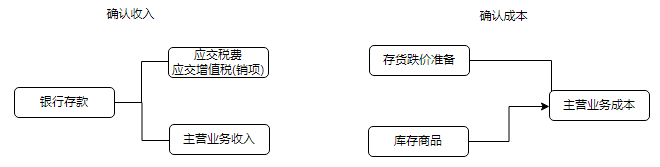
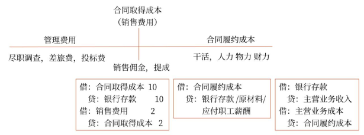
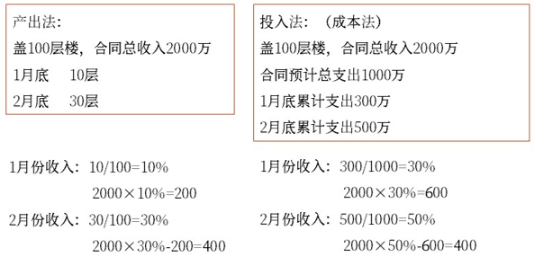

# 收入

## 收入
将收入分为主营业务收入和其他业务收入

“主营业务收入”“其他业务收入”
“主营业务成本”“其他业务成本”
“合同取得成本”“合同履约成本”
“合同资产”“合同负债”等科目，

## `主营业务收入`与`主营业务成本`

科目:
主营业务收入: 本科目`贷方`登记企业主营业务活动实现的`收入增加额`，`借方`登记期末`转入“本年利润”`科目的主营业务收入，结转后本科目应`无余额`（贷加借减）

主营业务成本: 本科目`借方`登记企业应结转的`主营业务成本`，`贷方`登记期末`转入“本年利润”`科目的主营业务成本，结转后本科目应`无余额`（借加贷减）

账务:
分为两个阶段:
1. 确认收入
2. 确认成本

## `其他业务收入`与`其他业务成本`
包括出租固定资产、出租无形资产、出租包装物和商品、销售材料等实现的收入

## `合同取得成本`和`合同履约成本`

科目:
合同取得成本: `借方`登记发生的`合同取得成本`，`贷方`登记`摊销的合同取得成本`，`期末余额在借方`，反映企业尚未结转的合同取得成本
合同履约成本: `借方`登记发生的`合同履约成本`，`贷方`登记`摊销的合同履约成本`，`期末余额在借方`，反映企业尚未结转的合同履约成本

账务:

其他:
`合同取得成本`和`合同履约成本`起到桥梁作用, 最后摊销在`销售费用`或`主营业务成本`中

## `合同资产`与`合同负债`
`合同资产`: `借方`登记因`已转让商品而有权收取的对价金额`，贷方登记取得无条件收款权的金额，期末余额在借方，反映企业已向客户转让商品而有权收取的对价金额
`合同负债`: 贷方登记企业在向客户转让商品之前，已经收到或已经取得无条件收取合同对价权利的金额；借方登记企业向客户转让商品时冲销的金额；期末余额在贷方，

`合同资产`, 是`应收账款`的桥梁
`合同负债`, 是`预收账款`的桥梁

### 合同负债

某公司经营一家健身俱乐部，适用的增值税税率为6%。2021年1月1日与客户签订合同，并收取会员费3816元（含增值税）。客户可在未来12个月内享受健身服务，且没有次数限制。不考虑其他因素，下列各项中，关于该健身俱乐部相关会计处理的表述正确的有（　　）。（2022年·2分）
A.每月确认主营业务收入300元
B.为客户提供健身服务属于在某一时段内履行的履约义务
C.收取会员费时，应确认合同负债增加3600元
D.收取会员费时，应确认预收账款增加3600元
【答案】ABC
【解析】客户可在未来12个月内享受健身服务且没有次数限制，该公司的履约义务是承诺随时准备在客户需要时为其提供健身服务，属于在某一时段内履行的履约义务。
相关账务处理为：
1月1日，收到会员费时：
借：银行存款　　　　　　　　　　 3816
　贷：合同负债　　［3816÷（1+6%）］3600
　　　应交税费——待转销项税额　　　216
1月31日，确认收入，同时将对应的待转销项税额确认为销项税额：
借：合同负债　　　　　［3600÷12］300
　　应交税费——待转销项税额　　　 18
　贷：主营业务收入　　　　　　　　　300
　　　应交税费——应交增值税（销项税额）
　　　　　　　　　　　　　　　　　　 18

## 某一时刻销售收入的账务处理

账务:

确认收入时:
借：银行存款/应收账款/应收票据等
贷：主营业务收入
　　应交税费——应交增值税（销项税额）
结转成本时:
借：主营业务成本
　　存货跌价准备［已销售商品所对应的存货跌价准备，如有］
贷：库存商品

## 委托代销商品

账务:
1. 发出商品时（不符合收入确认条件）
    借：发出商品
    贷：库存商品（成本价）

2. 收到代销清单
借：应收账款　　　　　　　　　　　　　1130
贷：主营业务收入　　　　　　　　　　　1000
　　应交税费——应交增值税（销项税额）　130

借：主营业务成本
贷：发出商品

3. 阶段代销手续费

借：销售费用——代销手续费　　　　　　　100
　　应交税费——应交增值税（进项税额）　　6
贷：应收账款　　　　　　　　　　　　　　106

### 委托代销商品
2021年6月30日，甲公司以支付手续费方式委托乙公司销售商品，商品已发出，其实际成本为100万元。7月，乙公司将受托代销商品全部销售，取得收入150万元。7月31日，甲公司收到代销清单和代销手续费发票，应支付乙公司代销手续费15万元，不考虑增值税等其他因素，下列各项中，关于甲公司委托代销商品的会计处理表述正确的有（　　）。（2022年·2分）
A.收到代销清单时，确认主营业务收入150万元
B.收到代销手续费发票时，确认销售费用15万元
C.发出商品时，结转主营业务成本100万元
D.收到代销清单时，结转主营业务成本100万元
【答案】ABD
【解析】（1）6月30日，发出商品时：
借：发出商品　　　　　　　　　　　100
　贷：库存商品　　　　　　　　　　　100
（2）7月31日，收到代销清单、代销手续费发票时：
借：应收账款　　　　　　　　　　　150
　贷：主营业务收入　　　　　　　　　150
借：主营业务成本　　　　　　　　　100
　贷：发出商品　　　　　　　　　　　100
借：销售费用　　　　　　　　　　　 15
　贷：应收账款　　　　　　　　　　　 15

## 可变对价

（1）对于商业折扣，企业应按扣除商业折扣后的金额确认销售收入和增值税销项税额。
（2）对于现金折扣，通常根据最可能发生的现金折扣率预测其有权获取的对价金额。
企业应确认的销售商品收入=商品单价×销售数量-商业折扣-现金折扣

### 企业应确认的销售商品收入
戊公司为增值税一般纳税人，2022年3月1日销售商品给客户，不含税售价为200万元，商品适用的增值税税率为13%，实际成本为120万元；由于是成批销售，戊公司给予客户10%的商业折扣，并在销售合同中规定现金折扣条件为2/20，N/30，且计算现金折扣时不考虑增值税；当日商品发出，客户收到商品并验收入库。戊公司基于对客户的了解，预计客户20天内付款的概率为90%，20天后付款的概率为10%。2022年3月18日，收到客户支付的货款。该项销售业务属于在某一时点履行的履约义务。
对于现金折扣，戊公司认为按照最可能发生金额能够更好地预测其有权获取的对价金额。
【解析】对于商业折扣，从应确认的销售商品收入中予以扣除。戊公司应确认的销售商品收入的金额=200×（1-10%）×（1-2%）=176.4（万元）；增值税销项税额=200×（1-10%）×13%=23.4（万元）。

### 最可能发生对价

不用期望是因为95%已经很高了
某企业与客户签订装修服务合同，合同价款为20万元，3个月完工；同时约定，若提前1个月完工，将获得额外奖励1万元。该企业估计工程提前1个月完工的概率为95%。不考虑其他因素，该项装修业务的交易价格为（　　）万元。（2022年·2分）
A.19
B.21
C.20
D.20.95
【答案】B
【解析】若合同中存在可变对价，企业应当对计入交易价格的可变对价进行估计。企业应当按照期望值或最可能发生金额确定可变对价的最佳估计数。提前1个月完工的概率为95%，提前完工的奖励应计入交易价格，该项装修业务的交易价格=20+1=21（万元）。

## 某一时段内完成的商品销售收入的账务处理

### 履约进度

2020年9月，某企业与客户签订一项装修服务合同，合同收入总额为300万元，预计合同成本总额为240万元，已收到全部合同款。该企业在合同期间按照履约进度确认收入。2020年已确认收入80万元，截止2021年12月31日履约进度已达到60%，不考虑其他因素，该企业2021年应确认的收入为（　　）万元。（2022年·2分）
A.64
B.100
C.150
D.160
【答案】B
【解析】2021年该企业应确认的收入=300×60%-80=100（万元）。

2020年11月，某企业接受一项建筑装修工程，合同总价款140万元。至2020年年末实际发生劳务成本36万元，预计还将发生成本54万元。2021年3月31日，工程完工并通过验收。该装修劳务属于在某一时段内履行的履约义务，按照实际发生成本占预计总成本的比例确定履约进度。该企业2021年提供该项劳务应确认的收入为（　　）万元。（2022年·2分）
A.56
B.54
C.140
D.84
【答案】D
【解析】2020年年末履约进度=36÷（36+54）×100%=40%，2020年度应确认的劳务收入=140×40%=56（万元）。该企业2021年提供该项劳务应确认的收入=140-56=84（万元）。

