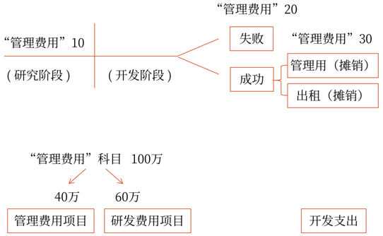
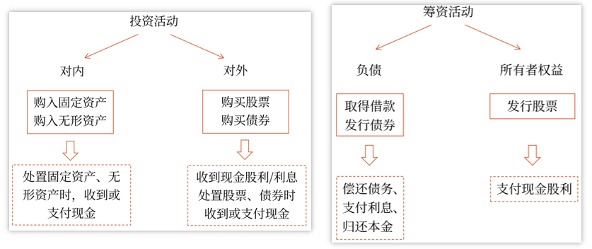

# 财务报告

## 财务报告体系

财务报告包括`财务报表`和`其他`应当在财务报告中披露的相关信息和资料.
财务报表, 也称`财务会计报表`, 至少应当包括`四表一注`，即`资产负债表`、`利润表`、`现金流量表`、`所有者权益变动表`和`附注`.

## 财务报告的分类

- 财务报告
    - 年报
    - 中期报告, 至少应当包括`资产负债表`、`利润表`、`现金流量表`和`附注`
- 财务报表
    - 年度财务会计报表
    - 中期财务会计报表, 中期财务报表分为`月度`、`季度`和`半年`度财务会计报表

## 资产负债表
我国企业的资产负债表采用`账户式结构` ，`左方`为`资产项目`，`右方`为`负债`及`所有者权益`项目。
左方的资产项目，大体按资产的`流动性强弱排列`，`流动性强的资产排在前面`，如“货币资金”“交易性金融资产”等，`流动性弱的资产排在后面`，如“长期股权投资”“固定资产”等。
右方的负债及所有者权益项目，一般按要求`清偿期限长短的先后顺序排列`，需要在`1年内或者长于1`年的一个正常营业周期内偿还的流动负债排在`前面`，如“短期借款”“应付票据”“应付账款”等，在`1年以上`才需偿还的非流动负债排在`中间`，如“长期借款”等. 在企业清算之前`不需要偿还`的`所有者权益项目`排在`后面`。

## 资产负债表的编制
资产负债表各项目均需填列`期末余额`和`上年年末余额`两栏.
资产负债表的`上年年末余额`栏内各项数字，应根据`上年年末资产负债表`的`期末余额`栏内所列数字填列。
资产负债表的`期末余额`栏主要有以下几种填列方法：

- 根据总账科目余额填列

    项目|方法
    --|--
    “短期借款”“应付票据”“实收资本(或股本)”“资本公积”“盈余公积”“其他综合收益”|直接填列
    货币资金|“库存现金”“银行存款”“其他货币资金”, 计算填列
    其他应付款|“应付利息”“应付股利”“其他应付款”, 计算填列

- 根据明细账科目余额计算填列

    1. 过收找收, 付找付确认具体的科目
    2. 通过财务报表的名称(资产类还是负债类)确认借方和贷方
    3. 资产列的要考虑坏账准备
    
    
    项目|方法
    --|--
    `应付账款`|预付账款和应付账款的贷方
    `预收款项`|预收账款和应收账款的贷方
    `应收账款`|预收账款和应收账款的借方
    `预付款项`|预付账款和应付账款的借方
    `交易性金融资产`|交易性金融资产
    `开发支出`|`研发支出`科目中所属的`资本化支出`的期末余额
    `应付职工薪酬`|明细科目期末余额
    `一年内到期的非流动资产`|明细科目余额计算
    `一年内到期的非流动负债`|明细科目余额计算

- 根据总账科目和明细账科目余额分析计算填列

    将不符合长期的, 或非流动的剔除
    项目|方法
    --|--
    `长期借款`|“长期借款”总账科目余额扣除明细科目中将在资产负债表日起一年内到期长期借款后的金额计算填列
    `其他非流动资产`|有关科目的期末余额减去将于一年内（含一年）收回数后的金额计算填列
    `其他非流动负债`|关科目的期末余额减去将于一年内（含一年）到期偿还数后的金额计算填列

- 根据有关科目余额减去其备抵科目余额后的净额填列

    项目|方法
    --|--
    “应收账款”|减`坏账准备`
    “应收票据”|减`坏账准备`
    “其他应收款”|减`坏账准备`
    “在建工程”|`在建工程`减`在建工程减值准备`, `工程物资`减`工程物资减值准备`
    “投资性房地产”|成本模式, 减`投资性房地产累计折旧(摊销)`
    “固定资产”|减`累计折旧`, `固定资产减值准备`, `固定资产清理`
    “无形资产”|减`累计摊销`, `无形资产减值准备`
    “长期股权投资”|减`长期股权投资减值准备`

- 综合运用上述填列方法分析填列

    项目|方法
    --|--
    `存货`|

### 应收账款, 应付账款, 预收账款, 预付账款报表填列

某企业年末“应收账款”科目借方余额为100万元，其中明细科目借方余额合计为120万元，贷方余额合计为20万元，年末“坏账准备——应收账款”科目贷方余额为10万元。不考虑其他因素，该企业年末资产负债表中“应收账款”项目“期末余额”栏应填列的金额为（　　）万元。（2021年·2分）
A.120
B.110
C.90
D.100
【答案】B
【解析】该企业年末资产负债表中“应收账款”项目“期末余额”栏应填列的金额=120-10=110（万元）。

下列各项中，应在企业资产负债表“预付款项”项目填列的有（　　）。（2021年·2分）
A.“预收账款”科目所属明细科目的期末贷方余额
B.“应收账款”科目所属明细科目的期末贷方余额
C.“预付账款”科目所属明细科目的期末借方余额
D.“应付账款”科目所属明细科目的期末借方余额
【答案】CD
【解析】选项AB在“预收款项”项目填列。

### 固定资产报表填列
2020年12月31日，某公司下列会计科目余额为：“固定资产”科目借方余额1000万元，“累计折旧”科目贷方余额400万元，“在建工程”科目借方余额80万元，“固定资产减值准备”科目贷方余额80万元，“固定资产清理”科目借方余额20万元。2020年12月31日，该公司资产负债表中“固定资产”项目期末余额应列报的金额为（　　）万元。（2021年改编·2分）
A.600
B.520
C.620
D.540
【答案】D
【解析】该公司资产负债表中“固定资产”项目期末余额应列报的金额=1000-400-80+20=540（万元），选项D正确。

### 工程物资报表填列

2019年12月31日，某公司有关科目余额如下，“在建工程”科目借方余额80万元，“在建工程减值准备”科目贷方余额8万元，“工程物资”科目借方余额30万元，“工程物资减值准备”科目贷方余额3万元。不考虑其他因素，2019年12月31日，该公司资产负债表“在建工程”项目期末余额应填列的金额为（　　）万元。（2020年·2分）
A.72
B.80
C.99
D.110
【答案】C
【解析】2019年12月31日，该公司资产负债表“在建工程”项目期末余额=80-8+30-3=99（万元）。

## 利润表
`利润表`，又称`损益表`，反映经营成果。通过对当期的收入、费用、支出项目按性质加以归类，分步计算当期净损益

营业利润 = 营业收入 - 营业成本 - 税金及附加 - 销售费用 - 管理费用 - 研发费用 - 财务费用
        + 其他收益 + 投资收益 + 公允价值变动收益 + 资产处置收益
        - 资产减值损失 - 信用减值损失
利润总额 = 营业利润 + 营业外利润(营业外收入-营业外支出)
净利润 = 利润总额 - 所得税费用

项目|科目
--|--
营业收入: `主营业务收入`和`其他业务收入`
营业成本: `主营业务成本`和`其他业务成本`
税金及附加: `消费税`, `印花税`等
销售费用: `包装费`, `广告费`, `职工薪酬`, `业务费`
管理费用: `管理费用`的发生额 - `管理费用_研发费用` - `管理费用_无形资产摊销`
研发费用: `管理费用_研发费用` + `管理费用_无形资产摊销`
财务费用: `财务费用_利息费用`(借款利息及手续费) - `财务费用_利息收入`(存款利息)
其他收益: 政府补助等
投资收益: `投资收益`
公允价值变动收益: `公允价值变动损益`
信用减值损失: `信用减值损失`
资产减值损失: `资产减值损失`
资产处置收益: `资产处置损益`
营业外收入: 非流动资产毁损报废收益, 政府补助、盘盈利得、捐赠利得
营业外支出: 公益性捐赠支出、盘亏损失、非常损失、非流动资产毁损报废损失
所得税费用: 所得税费用

账务:

## 现金流量表
现金流量，是指现金和现金等价物的流入和流出。
现金等价物通常包括三个月内到期的债券投资等。
现金流量表是以现金流入量-现金流出量=现金净流量
现金流量分为三类：`经营活动产生`的现金流量、`投资活动`产生的现金流量和`筹资活动`产生的现金流量

## 所有者权益变动表
本年年初余额=上年年末余额+会计政策变更、前期差错更正及其他变动
本年年末余额=本年年初余额+本年增减变动金额

