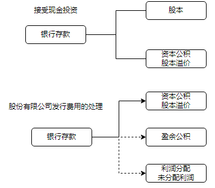
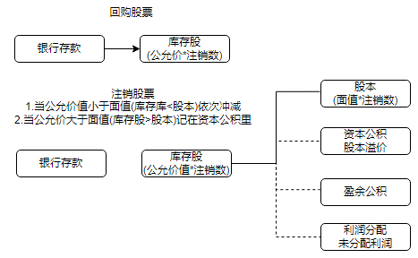

# 实收资本或股本

 

股份有限公司发行费用的处理
属于溢价发行的，发行费用从溢价收入中扣除，冲减资本公积一股本溢价：
溢价金额不足冲减的，或者属于按面值发行无溢价的，依次冲减盈余公积和未分配利润


回购、注销股票对留存收益总额和所有者权益总额的影响


发生时点|库存股|留存收益总额|所有者权益总额
--|--|--|--
回购股票时|增加|不影响|减少
注销股票时|减少|(1)资本公积足够神减时，不影响(2)资本公积不足冲减时，减少|不影响








实收资本是企业按照章程规定或合同、协议约定，接受投资者投入企业的资本。
实收资本的构成比例或股东的股份比例，是确定所有者在企业所有者权益中所占份额的基础，也是企业进行利润或股利分配的主要依据。
股东可以用货币出资，也可以用实物、知识产权、土地使用权等可以用货币估价并可以依法转让的非货币财产作价出资。

## （一）接受现金资产投资

### 接受现金资产投资的账务处理
#### 股份有限公司接受现金资产投资

    借：银行存款等
    贷：股本［按每股股票面值和发行股份总数的乘积计算的金额］
    　　资本公积——股本溢价［实际收到的金额与股本之间的差额］


```json
{
"name": "股份有限公司接受现金资产投资",
"content": "",
"testpoint": ["股本金额","股本溢价金额","账目处理"]
}
```


某股份有限公司对外公开发行普通股2000万股，每股面值为1元，每股发行价格为3元，发行手续费600000元从发行收入中扣除，发行所得款项存入银行。不考虑其他因素，下列各项中，该笔业务会计处理正确的是（）。（2020年·2分）

计入股本的金额=1×20000000=20000000（元）
计入资本公积（股本溢价）的金额=3×20000000-20000000-600000=39400000（元）

借：银行存款　　　　　　　 59400000
贷：股本　　　　　　　　　 20000000
　　资本公积　　　　　　　 39400000


股份有限公司以外的企业接受现金资产投资

    借：银行存款等
    贷：实收资本［按投资合同或协议约定的投资者在注册资本中所占份额的部分］
    　　资本公积——资本溢价［实际收到的金额与实收资本之间的差额］


### 股份有限公司`发行费用`的处理
属于溢价发行的，`发行费`用从溢价收入中扣除，溢价小于`发行费`的, 按照分录中2,3,4的顺序冲减

    借：资本公积——股本溢价(2)
    　　盈余公积(3)
    　　利润分配——未分配利润(4)
    贷：银行存款


```json
{
"name": "股份有限公司`发行费用`的处理",
"content": "",
"testpoint": ["发行费用的扣除顺序:1.溢价 2.资本公积 3.盈余公积 4.未分配利润"]
}

```


下列各项中，关于企业发行股票交易费用的会计处理表述正确的有（　　）。（2022年·2分）
A．应计入管理费用
B．无溢价发行股票的，其交易费用应冲减盈余公积
C．溢价发行股票且溢价足以抵扣交易费用的，应从溢价中抵扣
D．溢价金额不足抵扣交易费用的，应冲减资本公积
【答案】BC


## （二）接受非现金资产投资
借：固定资产、原材料、无形资产等［投资合同或协议约定的价值，不公允的除外］（入账口径）
    `应交税费——应交增值税（进项税额）`
贷：实收资本（或股本）［投资合同或协议`约定`的投资者在企业注册资本或股本中所占份额］
　　资本公积——资本溢价（或股本溢价）［差额］


```json
{
"name": "接受非现金资产投资",
"content": "",
"testpoint": ["账目处理","投视为销售,所以有应交税费","按约定价值非账面价值","实收资本是非现金资产加应交税费"]
}

```

甲企业与乙企业均为增值税一般纳税人。2021年初，甲企业接受乙企业投入设备一台，该设备账面价值为340万元，投资协议约定的不含税价值为400万元，与公允价值相符。乙企业支付了增值税税额为52万元，并提供了增值税专用发票，乙企业的全部投资用于增加注册资本，不考虑其他因素，甲企业接受投资应计入实收资本的金额为（452）万元。（2022年·2分）
借：固定资产　　　　　　　　　　　  400
　　应交税费——应交增值税（进项税额）52
贷：实收资本　　　　　　　　　　　  452


甲公司设立时收到乙公司作为资本投入的不需要安装的设备一台，合同约定的价值400万元与公允价值相同，增值税进项税额为52万元（由投资方支付税款，并开具增值税专用发票）。按照约定，乙公司在甲公司注册资本中所占的份额为300万元。不考虑其他因素，下列各项中，甲公司确认乙公司投资时，会计科目处理正确的有（　　）。（2022年·2分）
借：固定资产　　　　　　　　　　　  400
　　应交税费——应交增值税（进项税额）
　　　　　　　　　　　　　　　　　  52
贷：实收资本　　　　　　　　　　　  300
　　资本公积——资本溢价　　　　　    152


## （三）实收资本（或股本）的增减变动

### 1. 实收资本（或股本）的增加


接受投资者追加投资
借：银行存款等
　贷：实收资本（或股本）
　　　资本公积——资本溢价（或股本溢价）

资本公积转增资本
借：资本公积——资本溢价（或股本溢价）
　贷：实收资本（或股本）

盈余公积转增资本
借：盈余公积
　贷：实收资本（或股本）


用资本公积或盈余公积转增资本时，应按原投资者各自出资比例计算确定各投资者相应增加的出资额；
资本公积转增资本或盈余公积转增资本，企业所有者权益总额不发生变化。

```json
{
"name": "实收资本（或股本）的增加",
"content": "",
"testpoint": ["实收资本（或股本）的增加的三种方式","三种方式如何影响投资者权益"]
}
```

下列各项中，导致企业实收资本增加的有（　　）。（2022年·2分）
A.接受投资者追加投资
B.资本公积转增资本
C.盈余公积转增资本
D.接受固定资产捐赠
【答案】ABC

企业接受新投资者会导致所有者权益总额增加。（　　）（2021年·1分）
【答案】√


### 2．实收资本（或股本）的减少

回购股票时：

借：库存股
贷：银行存款

注销股票时：
（1）如果回购价款大于股票面值(公司亏了)，差额冲减资本公积——股本溢价，不足冲减的，依次冲减盈余公积和利润分配——未分配利润, 即库存股 = 股本+资本公积+盈余公积

借：股本　　　　　　　　　　　　 1000
　　资本公积——股本溢价　　　　   1500
　　盈余公积　　　　　　　　　　　500
贷：库存股　　　　　　　　　　　 3000

（2）如果回购价款小于股票面值(公司赚了)，差额计入资本公积——股本溢价


库存股:
股份有限公司采用回购本公司股票的方式进行减资，并通过“库存股”科目核算回购股份的金额。
“库存股”科目属于所有者权益备抵项，记账方向与所有者权益类科目相反，
借方表示增加，贷方表示减少（类似于累计折旧与固定资产的关系）。

```json
{
"name": "实收资本（或股本）的减少",
"content": "",
"testpoint": ["库存股", "回购账目处理", "亏的话注销账目处理: 库存股 = 股本+资本公积+盈余公积","回购、注销股票对留存收益总额和所有者权益总额"]
}
```


某上市公司折价回购并注销本公司股票，下列各项中，其支付的价款低于股票面值总额的差额应计入的会计科目是（　　）。（2022年·2分）
A.资本公积——股本溢价
B.盈余公积
C.营业外收入
D.利润分配——未分配利润
【答案】A
【解析】如果回购股票支付的价款低于股票面值总额（折价回购），应按股票面值总额，借记“股本”科目，按所注销的库存股账面余额，贷记“库存股”科目，按其差额，贷记“资本公积——股本溢价”科目。


2021年8月1日，某公司资产负债表所有者权益部分项目期初余额如下：股本10000万元，资本公积（股本溢价）1500万元，盈余公积4000万元，未分配利润400万元。同日，该公司经批准回购并注销库存股1000万股，该库存股的账面余额3000万元、股本面值总额1000万元。不考虑其他因素，下列各项中，该公司注销库存股的会计处理结果正确的有（　　）。（2022年·2分）

回购股票时：

    借：库存股　　　　　　　　　　　 3000
    贷：银行存款　　　　　　　　　　 3000

注销股票时：

    借：股本　　　　　　　　　　　　 1000
    　　资本公积——股本溢价　　　　   1500
    　　盈余公积　　　　　　　　　　　500
    贷：库存股　　　　　　　　　　　 3000


甲公司2021年12月31日的股本为10000万股，每股面值为1元，资本公积（股本溢价）4000万元，盈余公积1500万元。经股东大会批准，甲公司以银行存款回购本公司股票1500万股并注销，每股回购价为0.9元。下列各项中，会计处理正确的有（　　）。（2022年·2分）
【解析】回购股票时：
借：库存股　　　　　［1500×0.9］1350
贷：银行存款　　　　　　　　　　 1350

注销股票时：
借：股本　　　　　　　　　　　　 1500
贷：库存股　　　　　　　　　　　 1350
　　资本公积——股本溢价　　　　　 150


## 考点02　资本公积的账务处理　考频★★


资本公积是指企业收到投资者出资额超出其在注册资本（或股本）中所占份额的部分，以及其他资本公积等。

- 资本溢价:`非股份有限公司`接受投资者投入资产的金额超过投资者在企业注册资本中所占份额的部分，通过`资本公积——资本溢价`科目核算
- 股本溢价:`股份有限公司`在溢价发行股票的情况下，企业发行股票取得的收入，等于股票面值的部分作为股本处理，超出股票面值的溢价收入应作为`资本公积——股本溢价`处理


影响资本公积的三种情况:
1. 资本溢价
2. 股本溢价
3. 库存股注销时, 回收价小于票面价, 多余的价值


```json
{
"name": "资本公积",
"content": "",
"testpoint": ["资本溢价","股本溢价","影响资本公积的三种情况"]
}
```


某股份有限公司发行普通股股票10000万股，每股面值1元，每股发行价5元，发生相关的手续费10万元。不考虑其他因素，该公司发行普通股导致“资本公积”科目贷方增加的金额为（　　）万元。（2022年·2分）
【解析】发行普通股导致“资本公积”科目贷方增加金额=10000×（5-1）-10=39990（万元）。


2020年4月1日，甲公司接受投资者投入一台需要安装的设备，该设备市场售价为200万元，与公允价值相符，增值税税额为26万元（由投资方支付税款，并提供增值税专用发票）；发生本公司安装人员工资4万元。2020年4月10日设备达到预定可使用状态。按合同约定，该投资计入实收资本的金额为180万元。不考虑其他因素，该项投资导致资本公积增加的金额为（　　）万元。（2022年·2分）
【解析】该项投资导致资本公积增加的金额=200+26-180=46（万元）。
相关账务处理为：
借：在建工程　　　　　　　　　　　200
　　应交税费——应交增值税（进项税额）
　　　　　　　　　　　　　　　　　 26
贷：实收资本　　　　　　　　　　　180
　　资本公积——资本溢价　　　　　 46

借：在建工程　　　　　　　　　　　　4
贷：应付职工薪酬　　　　　　　　　　4

借：固定资产　　　　　　　　　　　204
贷：在建工程　　　　　　　　　　　204


某公司委托证券公司发行普通股400000股，每股面值为1元，每股发行价格为16元。双方协议约定，证券公司按发行收入的2%收取佣金，并直接从发行收入中扣除。不考虑其他因素，该公司发行股票应计入资本公积的金额为（　　）元。
【解析】该公司发行股票应计入资本公积的金额=400000×（16-1）-400000×16×2%=5872000（元）。


下列各项中，属于资本公积来源的有（　　）。
A.盈余公积转入	
B.股本溢价
C.资本溢价	
D.从企业实现的净利润中提取
【答案】BC
【解析】盈余公积可以转增资本，但不能转入资本公积，选项A错误；从企业实现的净利润中提取的留存于企业的内部积累应计入盈余公积，不计入资本公积，不属于资本公积的来源，选项D错误。


下列各项中，应计入资本公积的有（　　）。
A.注销的库存股账面余额低于所冲减股本的差额
B.投资者超额缴入的资本
C.交易性金融资产发生的公允价值变动
D.溢价发行股票，超出股票面值的溢价收入
【答案】ABD
【解析】选项C计入公允价值变动损益。


（三）资本公积转增资本的核算
资本公积转增资本时，按转增的金额，借记“资本公积”科目，贷记“实收资本”或“股本”科目，企业所有者权益总额不变。

```json
{
"name": "资本公积转增资本的核算",
"content": "",
"testpoint": ["资本公积转增资本的核算"]
}
```


 　某公司年初资本公积为1500万元，经股东大会批准，用资本公积转增资本300万元。不考虑其他因素，该公司年末的资本公积为（　　）万元。
A.1700
B.1500
C.1200
D.1400
【答案】C
【解析】资本公积转增资本会减少资本公积，所以该公司年末的资本公积=1500-300=1200（万元）。


