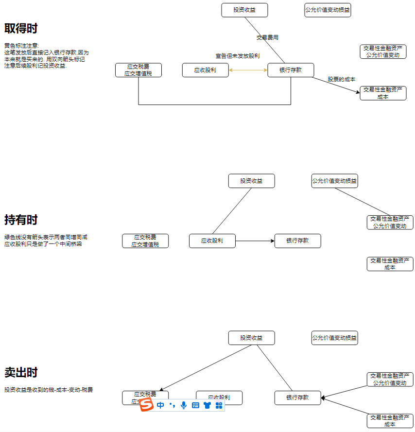

# 流动资产_交易性金融资产

## 金融资产分类
1. 以`摊余成本`计量的金融资产,`债权投资`
2. 以`公允价值`计量且其变动计入`其他综合收益`的金融资产, `其他债权投资`
3. 以`公允价值`计量且其变动计入`当期损益`的金融资产, `交易性金融资产`

### 金融资产分类
6.某金融资产的业务模式是以收取合同现金流量为目标，合同现金流量包括投资期间各期应收的利息和到期日收回的本金，企业应当将该金融资产分类为（　　）。
A.以摊余成本计量的金融资产
B.以公允价值计量且其变动计入当期损益的金融资产
C.以公允价值计量且其变动计入其他综合收益的金融资产
D.长期股权投资
【答案】A

## 交易性金融资产
科目:
交易性金融资产, 资产类, 核算企业分类为以公允价值计量且其变动计入当期损益的金融资产, 并分别设置“成本”，“公允价值变动”明细科目
公允价值变动损益, 损益类, 借方登记公允价值变动的损失额，贷方登记公允价值变动的收益额
投资收益, 损益类, 借方登记投资损失，贷方登记投资收益
账务:

业务事项|归属科目
--|--
取得时支付的交易费用|记入“投资收益”科目借方
持有期间被投资单位宣告分派现金股利或按期计提的利息|记入“投资收益”科目贷方
持有期间的公允价值变动|记入“公允价值变动损益”科目贷方或借方
处置时的处置损益/月末应交的增值税|记入“投资收益”科目贷方或借方

1. 取得交易性金融资产

- 按照取得时的`公允价值`作为其`初始入账金额`，借记“交易性金融资产——成本”科目
- `已宣告但尚未发放`的`现金股利`或`已到付息期但尚未领取`的`债券利息`, 贷记“投资收益”科目
- 交易费用, 冲减投资收益, 借记“投资收益”科目

注意:

购买价款中包含的尚未发放的现金股利或尚未领取的债券利息
- 不影响投资收益
- 不构成交易性金融资产的初始入账价值

2. 持有交易性金融资产

- 收到`购买价款中`包含的现金股利或债券利息
    注意是在取得时就已经付了款项

    借：其他货币资金等
    贷：应收股利/应收利息

- 持有期间`宣告发放`的`现金股利`或`到期计提`的`利息`

    借：应收股利［被投资单位宣告发放的现金股利］
    　　应收利息［到期应计提的利息］
    贷：投资收益

- 资产负债表日，交易性金融资产公允价值变动

    公允价值与账面余额之间的差额计入当期损益（公允价值变动损益）

    盈利:
        借：交易性金融资产——公允价值变动
    　  贷：公允价值变动损益
    贬值:
        借：公允价值变动损益
        贷：交易性金融资产——公允价值变动

3. 出售交易性金融资产
将出售时的公允价值与其账面余额之间的差额确认为投资收益
借：其他货币资金等［实际收到的金额］
贷：交易性金融资产——成本
　　交易性金融资产——公允价值变动［或借方］
　　投资收益［差额倒挤，损失记借方，收益记贷方］

其他:
交易性金融资产相关业务对损益类科目的影响
    业务事项|归属科目
    --|--
    取得时支付的交易费用|记入“投资收益”科目借方
    持有期间被投资单位宣告分派现金股利或按期计提的债券利息|记入“投资收益”科目贷方
    持有期间的公允价值变动|记入“公允价值变动损益”科目
    处置时的处置损益|记入“投资收益”科目贷方或借方

4. 转让金融商品应交增值税

出售时的增值税税额=［卖出价-买入价（不得扣除已宣告未发放的现金股利或已到付息期未领取的债券利息）］÷（1+6%）×6%

- 转让金融资产当月月末，如产生转让收益

    借：投资收益等
    贷：应交税费——转让金融商品应交增值税(相当于销项)

- 转让金融资产当月月末，如产生转让损失，可结转下月抵扣税额
    直接记相反的分录

    借：应交税费——转让金融商品应交增值税
    贷：投资收益等

- 如果跨年, 则不可弥补, 需转出

借：投资收益等
贷：应交税费——转让金融商品应交增值税

其他:
出售交易性金融资产, 计算投资收益, 是卖出价减去最近的一次公允价值
转让金融商品应交增值税, 计算应交税费, 是卖出价减去买入价

### 交易型金融资产
6.下列各项中，关于交易性金融资产会计处理表述正确的有（　　）。
A.资产负债表日公允价值与账面余额之间的差额计入当期损益
B.出售时公允价值与其账面余额的差额计入投资收益
C.持有期间被投资单位宣告发放的现金股利计入投资收益
D.出售时如产生转让收益，计算的转让金融商品应交增值税冲减投资收益
【答案】ABCD

5.关于交易性金融资产的会计处理，下列说法中正确的有（　　）。
A.取得交易性金融资产时，应当按照该交易性金融资产取得时的公允价值作为其初始确认金额
B.取得交易性金融资产所支付价款中包含的已宣告但尚未发放的现金股利或已到付息期但尚未领取的债券利息，应当单独确认为应收项目
C.取得交易性金融资产所发生的相关交易费用应当在发生时计入投资收益
D.资产负债表日，交易性金融资产应当按照公允价值计量，公允价值与账面余额之间的差额计入资本公积
【答案】ABC
【解析】选项D错误，资产负债表日，交易性金融资产应当按照公允价值计量，公允价值与账面余额之间的差额计入当期损益（公允价值变动损益）。

### 取得交易性金融资产账务

某公司委托证券公司购买股票120000股，每股价格10元，其中包含0.5元已宣告但尚未发放的现金股利。另支付相关交易费用2400元，取得增值税专用发票上注明的增值税税额为144元，该公司将其划分为交易性金融资产进行核算。不考虑其他因素，该项交易性金融资产的入账价值为（　　）元。（2022年·2分）
A.1202400
B.1142400
C.1140000
D.1200000
【答案】C
【解析】相关账务处理为：
借：交易性金融资产——成本
　　　　［120000×（10-0.5）］1140000
　　应收股利　　［120000×0.5］60000
　　投资收益　　　　　　　　　　2400
应交税费——应交增值税（进项税额）
　　　　　　　　　　　　　　　　 144
　贷：其他货币资金　　　　　　 1202544

下列各项中，增值税一般纳税人取得交易性金融资产的相关支出应计入投资收益的是（　　）。（2020年·2分）
A.不含增值税的交易费用
B.价款中包含的已宣告但尚未发放的现金股利
C.增值税专用发票上注明的增值税税额
D.价款中包含的已到付息期但尚未领取的债券利息
【答案】A
【解析】选项B计入应收股利；选项C计入应交税费—应交增值税（进项税额）；选项D计入应收利息。

### 持有交易性金融资产

交易性金融资产持有期间，投资单位收到购买价款中包含的投资前被投资单位已宣告但尚未发放的现金股利时，应确认为投资收益。（　　）
【答案】×
【解析】购买价款中包含的投资前已宣告但尚未发放的现金股利，应当单独确认为应收股利，实际收到时冲减应收股利，借记“其他货币资金”等科目，贷记“应收股利”科目。

2022年3月20日，甲公司从深交所购买乙公司股票100万股，将其划分为交易性金融资产，购买价格为每股8元，另支付相关交易费用25000元，6月30日，该股票公允价值为每股10元，当日该交易性金融资产的账面价值应为（　　）万元。
A.802.5
B.800
C.1000
D.1000.5
【答案】C
【解析】交易性金融资产期末的账面价值等于该日的公允价值，2022年6月30日，该交易性金融资产的账面价值=100×10=1000（万元）。

交易性金融资产的账面价值 = 交易性金融资产_成本 + 交易性金融资产_公允价值变动, 也可以说是交易性金融资产_成本 + 公允价值变动损益

企业持有交易性金融资产期间，对于被投资单位宣告发放的现金股利，应借记“交易性金融资产”科目。（　　）
【答案】×
【解析】交易性金融资产持有期间，被投资单位宣告发放的现金股利，借记“应收股利”科目，贷记“投资收益”科目。

14.甲公司2022年7月1日购入乙公司2022年1月1日发行的债券，支付价款2040万元（含已到付息期但尚未领取的债券利息40万元），另支付交易费用15万元。该债券面值为2000万元，票面年利率为4%（票面利率等于实际利率），每半年付息一次，甲公司将其划分为交易性金融资产。甲公司在2022年度由于该项交易性金融资产确认的投资收益为（　　）万元。
A.25
B.40
C.65
D.80
【答案】A
【解析】本题共涉及两笔投资收益：①企业购入交易性金融资产时，支付的交易费用15万元，应记入“投资收益”科目的借方；②企业持有交易性金融资产期间确认的半年的利息收入=2000×4%÷12×6=40（万元），应记入“投资收益”科目的贷方。因此，甲公司2022年度由于该项交易性金融资产确认的投资收益的金额=-15+40=25（万元）。

### 交易性金融资产相关业务对损益类科目的影响
下列各项中，关于交易性金融资产相关会计处理表述正确的是（　　）。
A.资产负债表日，其公允价值与账面余额之间的差额计入投资收益
B.按取得时的公允价值作为初始入账金额
C.出售时公允价值与账面余额的差额计入公允价值变动损益
D.取得时发生相关交易费用计入初始入账金额
【答案】B
【解析】选项A错误：资产负债表日，交易性金融资产应当按照公允价值计量，公允价值与账面余额之间的差额计入公允价值变动损益。选项C错误：企业出售交易性金融资产时，应当将出售时的公允价值与其账面余额之间的差额计入投资收益。选项D错误：企业取得交易性金融资产所发生的相关交易费用应当在发生时计入当期损益，冲减投资收益。

### 出售交易性金融资产

11.某公司2022年3月15日购入M公司发行在外的普通股股票作为交易性金融资产核算。购买时支付价款1200万元（其中包含已宣告但尚未发放的现金股利100万元，交易费用20万元），至2022年6月30日，该股票的公允价值为1200万元。2022年8月19日，该公司将持有的M公司的股票全部出售，收取价款1210万元，不考虑增值税等相关因素，则在处置时应当确认的投资收益为（　　）万元。
A.10
B.130
C.80
D.30
【答案】A
【解析】处置时应确认的投资收益=1210-1200=10（万元），选项A正确。

比较的是2022年8月19日与2022年6月30日的差值

8.某小企业以110000元将上月购入的短期股票予以出售，该批股票的账面余额为100000元。则该企业记入“投资收益”科目的金额应为（　　）元。
A.10000
B.110000
C.100000
D.210000
【答案】A
【解析】出售短期投资，应当按照实际收到的出售价款与该项短期投资的账面余额的差额，贷记或借记“投资收益”科目。即记入“投资收益”科目的金额=110000-100000=10000（元）。

### 转让金融商品应交增值税

下列各项中，应在企业“投资收益”科目贷方登记的有（　　）。（2022年改编·2分）
A.取得交易性金融资产时支付的相关交易费用
B.转让交易性金融资产时账面余额低于其公允价值的差额
C.转让金融资产卖出价低于买入价时确认可结转下月抵扣的增值税额
D.持有期间被投资单位宣告发放的现金股利
【答案】BCD
【解析】选项A在“投资收益”科目借方登记。

2022年1月1日，A公司购入B公司发行的公司债券，支付价款141万元（其中包含已到付息期但尚未领取的债券利息1万元）。2022年3月15日，A公司出售了所持有的全部B公司债券，售价为300万元，已知转让金融商品适用的增值税税率为6%。不考虑其他因素，则该项业务与增值税相关账务处理表述正确的有（　　）。
A.借记“投资收益”科目9万元
B.贷记“应交税费—转让金融商品应交增值税”科目9万元
C.借记“投资收益”科目9.06万元
D.贷记“应交税费—转让金融商品应交增值税”科目9.06万元
【答案】AB
【解析】转让金融商品应交增值税=（300-141）÷（1+6%）×6%=9（万元）。A公司应编制如下会计分录：
借：投资收益　　　　　　　　　　　 9
　贷：应交税费—转让金融商品应交增值税
　　　　　　　　　　　　　　　　　　 9

## 其他
小企业购入各种股票、债券、基金等	

借：`短期投资`［含相关税费］
　　应收股利［已宣告尚未发放的现金股利］
　　应收利息［已到付息期尚未领取的债券利息］
贷：银行存款

4.小企业核算实际收到短期投资的现金股利时，可能涉及的会计科目有（　　）。
A.投资收益
B.短期投资
C.应收股利
D.银行存款
【答案】CD
【解析】小企业核算实际收到短期投资的现金股利，应借记“银行存款”科目，贷记“应收股利”科目。

## 大题

（一）甲公司为增值税一般纳税人，2021年发生交易性金融资产业务如下：
（1）1月5日，从二级市场购入乙上市公司股票200万股，支付价款210万元（其中包含已宣告但尚未发放的现金股利10万元），另支付相关交易费用0.5万元，取得增值税专用发票上注明的增值税税额为0.03万元。甲公司将其划分为交易性金融资产进行管理和核算。
（2）3月31日，持有的乙上市公司股票的公允价值为180万元。
（3）6月30日，出售持有的全部乙上市公司股票，取得价款263万元。转让该金融商品应交的增值税为3万元。
要求：根据上述资料，不考虑其他因素，分析回答下列小题。（2022年）

1.根据资料（1），下列各项中，甲公司购买股票的相关会计科目处理正确的是（　　）。
A.借记“应收股利”科目10万元
B.借记“投资收益”科目0.5万元
C.贷记“银行存款”科目210.53万元
D.贷记“其他货币资金”科目210.53万元
【答案】ABD
【解析】相关账务处理为：
借：交易性金融资产——成本　 2000000
　　应收股利　　　　　　　　　100000
　　投资收益　　　　　　　　　　5000
　　应交税费——应交增值税（进项税额）
　　　　　　　　　　　 　　　　　300
　贷：其他货币资金　　　 　　　2105300

2.根据资料（1），甲公司购买股票应记入“交易性金融资产——成本”科目的金额是（　　）万元。
A.210.53
B.200
C.210
D.200.5
【答案】B
【解析】甲公司购买股票应计入交易性金融资产——成本的金额=210-10=200（万元）。

3.根据资料（1）和（2），下列各项中，关于甲公司3月31日会计处理表述正确的是（　　）。
A.确认投资收益20万元
B.确认交易性金融资产（公允价值变动）减少20万元
C.确认公允价值变动损失20.5万元
D.确认交易性金融资产（公允价值变动）减少20.5万元
【答案】B
【解析】3月31日的账务处理为：
借：公允价值变动损益　　　　　200000
　贷：交易性金融资产——公允价值变动
　　　　　　　　　　　　　　　　200000

4.根据资料（1）至（3），下列各项中，关于甲公司6月30日出售乙上市公司股票的会计处理正确的是（　　）。
A.借：应交税费——转让金融商品应交增值税
　　　　　　　　　　 　　　　　30000
　　贷：投资收益　　　　　 　　　30000
B.借：其他货币资金　　　 　　2630000
　　　交易性金融资产——公允价值变动
　　　　　　　　　　　　　　　200000
　　贷：交易性金融资产——成本 2000000
　　　　投资收益　　　　　　　　830000
C.借：投资收益　　　　　　　　 30000
　　贷：应交税费——转让金融商品应交增值税
　　　　　　　　　　 　　　　　　30000
D.借：其他货币资金　　　　　 2630000
　　贷：交易性金融资产——成本 2005000
　　　　投资收益　　　　　　　　625000
【答案】BC
【解析】出售交易性金融资产的账务处理为：
借：其他货币资金　 　　　　　2630000
　　交易性金融资产——公允价值变动
　　　　　　　　　　　　　　　200000
　贷：交易性金融资产——成本 　2000000
　　　投资收益　　　　　　　　　830000
转让金融商品应交增值税：
借：投资收益　　　　　　　　　 30000
　贷：应交税费——转让金融商品应交增值税
　　　　　　　　　　　　　　　 　30000

5.根据资料（1）至（3），该股票投资对甲公司2021年度营业利润的影响金额是（　　）万元。
A.59.5
B.30.5
C.65.5
D.66
【答案】A
【解析】该股票投资对甲公司2021年度营业利润的影响金额=-0.5-20+83-3=59.5（万元）。
  点题
（1）转让金融商品应交增值税：①转让金融商品应交增值税属于差额征税，与销项税额不同，不能用进项税额抵扣。②转让金融商品应交增值税的对应科目是投资收益，因而影响损益。
（2）营业利润=营业收入-营业成本-税金及附加-销售费用-管理费用-研发费用-财务费用-信用减值损失-资产减值损失+公允价值变动收益（-公允价值变动损失）+投资收益（-投资损失）+其他收益+资产处置收益（-资产处置损失）+净敞口套期收益（-净敞口套期损失）。
