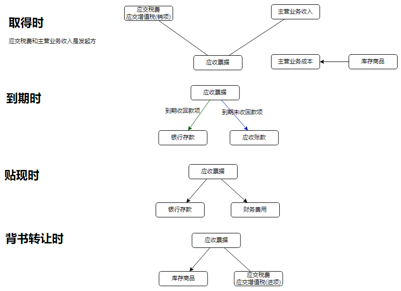
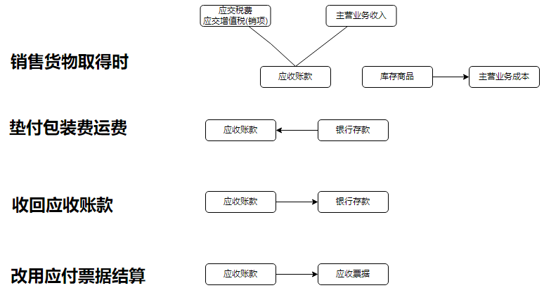
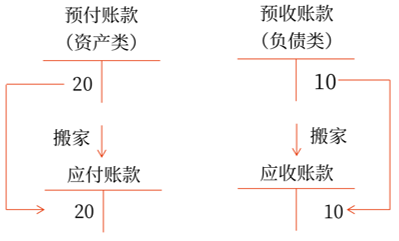
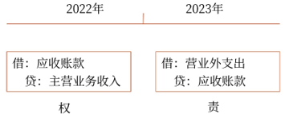
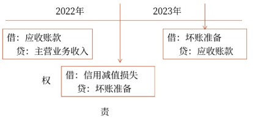
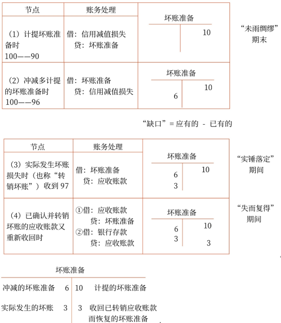
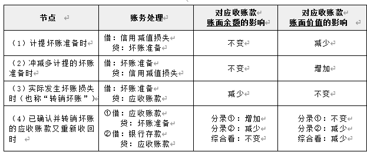

# 应收及预付款项

应收及预付款项分类:
- 应收票据
- 应收账款
- 预付账款
- 应收利息
- 应收股利
- 其他应收款
- 应收款项减值

### `应收账款`和`其他应收款`

2021年12月1日，某企业“其他应收款”科目借方余额为5万元。12月发生业务如下：销售商品为客户代垫运费2万元，增值税税额为0.18万元；收回垫付的房租4万元；支付租入包装物押金2万元。不考虑其他因素，该企业12月31日“其他应收款”科目的借方余额为（　　）万元。（2022年·2分）
A.3
B.5
C.5.18
D.1
【答案】A
【解析】为客户代垫运费和增值税记入“应收账款”科目；垫付的房租记入“其他应收款”科目，收回即减少；支付的包装物押金记入“其他应收款”科目。该企业12月31日“其他应收款”科目的借方余额=5-4+2=3（万元）。

## 应收票据
科目:
`应收票据`: 资产类, 商业汇票, 根据承兑人不同，商业汇票分为商业承兑汇票和银行承兑汇票两种

账务:
贴现时: 贴现息记`财务费用`
背书转让时: 背书转让是把现有“应收票据”给别人了，不是新签发票据，所以“应收票据”减少记在贷方，而不是“应付票据”增加。

### 应收票据
 　通过“应收票据”科目核算的有（　　）。（2022年改编·2分）
A.提供服务收到的银行汇票
B.销售原材料收到银行承兑汇票
C.销售商品收到的银行本票
D.销售商品收到的商业承兑汇票
【答案】BD
【解析】选项AC通过“银行存款”科目核算。

 　企业应收票据贴现，应按实际收到的金额与其票面金额的差额，借记或贷记“管理费用”科目。（　　）（2021年·1分）
【答案】×
【解析】账务处理如下：
借：银行存款
　　财务费用［贴现息，或在贷方］
　贷：应收票据

## 应收账款
账目:
`应收账款`: 资产类, 包括销售商品提供服务的`价款`、`增值税`，以及`垫付`的`包装费、运杂费`等。
账务:

其他:
不单独设置“预收账款”科目的企业，预收的账款应在“应收账款”科目核算。

### 应收账款包含的内容`价款`, `增值税`, `包装费、运杂费`

甲公司为增值税一般纳税人，向乙公司销售商品一批，商品价款20万元、增值税税额2.6万元；以银行存款支付代垫运费1万元、增值税税额0.09万元，上述业务均已开具增值税专用发票，全部款项尚未收到。不考虑其他因素，甲公司应收账款的入账金额为（　　）万元。（2022年·2分）
A.21
B.22.6
C.23.69
D.20
【答案】C
【解析】甲公司应收账款的入账金额=20+2.6+1+0.09=23.69（万元）

## 预付账款
科目:
`预付账款`, 资产类, 

账务:

其他:
预付款项情况不多的企业，可以不设置“预付账款”科目，而直接通过“应付账款”科目核算。相当于冲减的"应付账款", 负债减少.

### 预付账款
下列各项中，应在“预付账款”科目贷方核算的是（　　）。（2022年·2分）
A.预付设备采购款
B.收回多预付款项
C.收回前欠货款
D.支付前赊购货款
【答案】B
【解析】“预付账款”科目借方核算预付的款项及补付的款项，贷方核算收到货物时应结转的预付账款及收回多付款项的金额。选项A，记入“预付账款”科目的借方；选项C，记入“应收账款”科目的贷方；选项D，记入“应付账款”科目的借方。

18.下列各项中，应在“预付账款”科目贷方核算的是（　　）。
A.收回多预付的款项
B.预付购入设备的款项
C.收到赊销货款
D.当企业预付货款小于采购货物所需支付的款项时，补付不足部分
【答案】A
【解析】“预付账款”科目借方核算预付的款项及补付的款项，贷方核算收到货物时应结转的预付账款及收回多付款项的金额。选项B，应记入“预付账款”科目的借方，借记“预付账款”科目，贷记“银行存款”科目；选项C，与预付账款无关，借记“银行存款”科目，贷记“应收账款”科目；选项D，补付货款时，应记入“预付账款”科目的借方，借记“预付账款”科目，贷记“银行存款”科目。

D选项不是直接银行付款, 而是先补入预付账款

### 可以不设置“预付账款”科目，而直接通过“应付账款”科目核算
不单独设置“预付账款”科目的企业，预付的款项可以通过“应收账款”科目核算。（　　）（2022年改编·1分）
【答案】×
【解析】预付款项情况不多的企业，可以不设置“预付账款”科目，而将预付的款项通过“应付账款”科目核算。

## 应收利息

## 应收股利

## 其他应收款

- 应收账款
    - 销售商品时销售方为购货单位垫付的运费
- 其他应收款
    - 应收保险公司的赔款
    - 应收取的包装物的租金
    - 应向职工收取的各种垫付款项
    - 存出保证金（如支付押金，未来会收回）
- 其他应付款
    - 存入保证金（如收取押金，未来会退还）
    - 应支付的包装物的租金

### 其他应收款
下列各项中，企业应通过“其他应收款”科目核算的有（　　）。（2022年改编·2分）
A.应收保险公司的赔款
B.为购货单位垫付的运杂费
C.应向职工收取的代垫医药费
D.应收被投资单位分配的现金股利
【答案】AC

11.下列各项中，企业应通过“其他应收款”科目核算的有（　　）。
A.为职工垫付的水电费
B.企业应向保险公司收取的财产损失赔款
C.销售商品应收取的增值税
D.为购货单位垫付的运杂费
【答案】AB
【解析】选项CD，均通过“应收账款”科目核算。

7.租入包装物支付的押金，应记入“其他应收款”科目的借方。（　　）
【答案】√
【解析】租入包装物支付的押金，借记“其他应收款”科目，贷记“银行存款”等科目。

## 应收款项减值
无法收回的应收款项通常称为坏账。企业因此而遭受的损失为坏账损失。
`小企业会计准则`规定，应收款项减值采用`直接转销法`。
`企业会计准则`规定，应收款项减值的核算应采用`备抵法`。

### 应收款项减值
企业在确定应收账款减值的核算方式时，应根据企业实际情况，按照成本效益原则，在备抵法和直接转销法之间合理选择。（　　）
【答案】×
【解析】我国企业会计准则规定，应收款项减值的核算应采用备抵法。小企业会计准则规定，应收款项减值采用直接转销法。

## 直接转销法

采用直接转销法时，应收款项只有在实际发生坏账时，才作为坏账损失计入当期损益(`营业外支出`)，而日常核算中可能发生的坏账损失不进行会计处理。

### 直接转销法
22.下列关于直接转销法的表述不正确的是（　　）。
A.直接转销法的账务处理简单
B.直接转销法不符合权责发生制会计基础，也与资产定义存在一定的冲突
C.直接转销法采用一定的方法按期确认预期信用损失，计入当期损益
D.直接转销法在一定程度上高估了期末应收款项
【答案】C
【解析】直接转销法的优点是账务处理简单（选项A正确），将坏账损失在实际发生时确认为损失符合其偶发性特征和小企业经营管理的特点。其缺点是不符合权责发生制会计基础，也与资产定义存在一定的冲突（选项B正确）。在这种方法下，只有坏账实际发生时，才将其确认为当期损益（选项C错误），导致资产和各期损益不实；另外，在资产负债表上，应收款项是按账面余额而不是按账面价值反映，这在一定程度上高估了期末应收款项（选项D正确）。

## 坏账准备-备抵法
概念:
备抵法：把损失往前拉，体现权责发生制, 损失事实在2022年已发生。借助了一个“坏账准备”，2022年先做损失，等2023年破产了再冲应收

科目:
`信用减值损失`: 损类科目, 应收款项的账面余额和预计可收回金额的差额
`坏账准备`: 资产类的备抵科目，与资产类科目的借贷方向相反，为借减贷增。
账务:

实际发生坏账损失时（也称“转销坏账”）: 就是应收账款减去坏账准备, 两个账户同时减少
已确认并转销坏账的应收账款又重新收回时 : 收回转销的坏账, 所以坏账准备增加(银行存款也增加), 应付账款还是那么多

其他:
- 当期应计提的坏账准备=当期按应收款项计算的坏账准备-（或+）“坏账准备”科目的贷方（或借方）余额
- 应收账款账面价值=应收账款账面余额-与应收账款有关的坏账准备
- 对应收账款的影响
    
- 直接转销法减值记`营业外支出`, 而备抵法是`信用减值损失`

### 小企业坏账减值处理
某小企业2016年发生的一笔30000元应收账款，因债务人财务状况原因长期未能收回，于2022年年末经催收收回10000元，存入银行，其余款项确实无法收回确认为坏账，下列账务处理正确的是（　　）。
A.借：银行存款　　　　　　　　 10000
　　　资产减值损失　　　　　　 20000
　　贷：应收账款　 　　　　　　　30000
B.借：银行存款　　　　　　　　 10000
　　　营业外支出　　　　　　　 20000
　　贷：应收账款　　　　　　　　 30000
C.借：银行存款　　　　　　　　 10000
　　　坏账准备 　　　　　　　　20000
　　贷：应收账款　　　　　　　　 30000
D.借：银行存款　　　　　　　　 10000
　　　信用减值损失　　　　　　 20000
　　贷：应收账款　　　　　　　　 30000
【答案】B
【解析】按照小企业会计准则规定确认应收账款实际发生的坏账损失，作如下账务处理：
借：银行存款等［实际收到的款项］
　　营业外支出—坏账损失［差额］
　贷：应收账款［账面余额］

### 坏账准备账务处理

14.某企业采用备抵法核算应收账款的减值损失。下列各项中，该企业应借记“坏账准备”科目的有（　　）。
A.转销坏账损失
B.计提坏账准备
C.收回已转销的应收账款而恢复的坏账准备
D.冲减多计提的坏账准备
【答案】AD
【解析】选项BC错误，均应贷记“坏账准备”科目。

### 应收账款账面价值=应收账款账面余额-与应收账款有关的坏账准备
某企业采用备抵法核算应收款项减值损失，下列各项中，导致该企业当期应收账款账面价值发生变动的有（　　）。（2022年改编·2分）
A.转销实际发生的应收账款坏账
B.收回已作为坏账转销的应收账款
C.计提应收账款坏账准备
D.冲减多计提的坏账准备
【答案】BCD

下列各项中，引起应收账款账面价值发生变动的有（　　）。（2022年改编·2分）
A.结转到期不能收回款项的商业承兑汇票
B.向客户赊销商品
C.为客户代垫商品包装费
D.收回应收账款
【答案】ABCD

A:
借：应收账款
　贷：应收票据
增加应收账款的账面价值

B:
借：应收账款
　贷：主营业务收入
　　　应交税费——应交增值税（销项税额）
增加应收账款的账面价值

C:
借：应收账款
　贷：银行存款
增加应收账款的账面价值

D:
借：银行存款
　贷：应收账款
减少应收账款的账面价值

### 当期应计提的坏账准备=确定本期预期信用损失-坏账准备余额
2021年12月1日，某企业“坏账准备”科目贷方余额为50万元。本月发生坏账损失30万元。12月31日，确定本期预期信用损失为80万元。不考虑其他因素，2021年12月31日应计提的坏账准备金额为（　　）万元。（2022年·2分）
A.30
B.60
C.80
D.0
【答案】B
【解析】2021年12月31日应计提的坏账准备金额=80-（50-30）=60（万元）。

21.2022年12月1日，某公司“坏账准备——应收账款”科目贷方余额为1万元。12月16日，收回已作坏账转销的应收账款2万元。12月31日，应收账款账面余额为120万元。经评估，应收账款的账面价值为110万元，不考虑其他因素，12月31日该公司应计提的坏账准备金额为（　　）万元。
A.10
B.8
C.7
D.9
【答案】C
【解析】应计提的坏账准备=期末应有的金额-已有金额=（120-110）-（1+2）=7（万元）。

15.下列关于采用备抵法核算信用减值损失的表述中，正确的有（　　）。
A.备抵法符合权责发生制和会计谨慎性要求
B.有利于落实企业管理者的经管责任
C.有利于企业外部利益相关者如实评价企业的经营业绩
D.预期信用损失的确定足够客观
【答案】ABC
【解析】备抵法下，预期信用损失的估计需要考虑的因素众多，且有部分估计因素带有一定的主观性，对会计职业判断的要求较高，可能导致预期信用损失的确定不够准确、客观，选项D不正确。

9.在备抵法下，应收账款已确认坏账，以后又收回的，仍然应通过“应收账款”科目核算，并贷记“坏账准备”科目。（　　）
【答案】√
【解析】相关会计分录如下：
借：应收账款
　贷：坏账准备
同时：
借：银行存款
　贷：应收账款

###  坏账准备对账面余额和账面价值的影响
#### 考点
节点 |账务处理|对应收账款账面余额的影响|对应收账款账面价值的影响 
--|--|--|--
（1）计提坏账准备时|借：信用减值损失贷：坏账准备|不变|减少
（2）冲减多计提的坏账准备时|借：坏账准备贷：信用减值损失|不变|增加
（3）实际发生坏账损失时（也称“转销坏账”）|借：坏账准备贷：应收账款|减少|不变
（4）已确认并转销坏账的应收账款又重新收回时 |①借：应收账款贷：坏账准备②借：银行存款贷：应收账款|分录①：增加分录②：减少综合看：不变|分录①：不变 分录②：减少综合看：减少

#### 题目

9.下列各项中，会引起应收账款账面余额发生增减变动的有（　　）。
A.计提坏账准备
B.收回应收账款
C.转销坏账
D.已转销的坏账又收
【答案】BC
如果改成账面价值呢
A, 账面余额不变, 账面价值减少
B, 账面余额减少, 账面价值减少
C, 账面余额减少, 账面价值不变
D, 账面余额不变, 账面价值减少 转销后直接记入的银行存款

