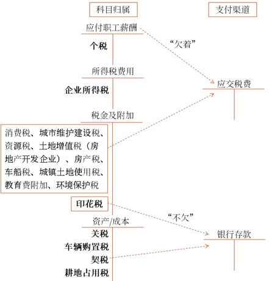
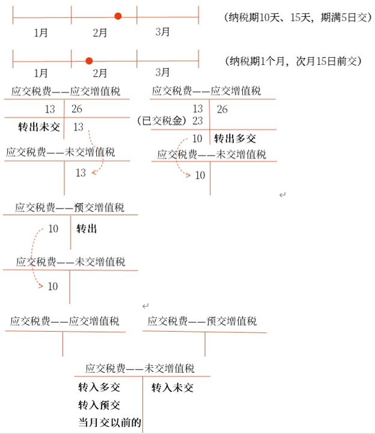
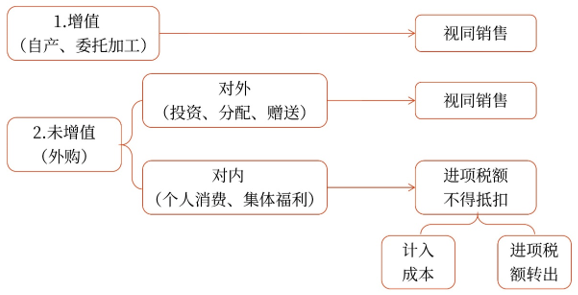

# 负债_应交税费

## 税种分类

科目:
个人所得税: 借`应付职工薪酬`, 贷`应交税费`
企业所得税: 借`所得税费用`, 贷`应交税费`
消费税: 借`税金及附加`, 贷`应交税费`
印花税: 借`税金及附加`, 贷`银行存款`
关税, 车辆购置税, 契税: 借`成本`, 贷`银行存款`

### 税种分类

24.下列各项中，房地产开发经营企业确认当期因销售房地产应交纳的土地增值税，应借记的会计科目是（　　）。
A.营业外支出
B.税金及附加
C.管理费用
D.销售费用
【答案】B
【解析】会计分录为：
借：税金及附加
　贷：应交税费——应交土地增值税

21.下列关于消费税核算的表述中，错误的是（　　）。
A.企业销售应税消费品应交的消费税应通过“税金及附加”科目核算
B.企业在建办公大楼领用生产的应税消费品时，应当将消费税的金额计入在建工程成本中
C.进口环节交纳的消费税需要计入进口货物的成本中
D.委托加工物资收回后直接出售，受托方代收代缴的消费税应记入“应交税费——应交消费税”科目
【答案】D
【解析】选项D错误，委托加工物资收回后直接出售，受托方代收代缴的消费税应记入“委托加工物资”科目。

12.下列各项中，应通过“应交税费”科目核算的有（　　）。
A.自产应税消费品用于在建工程应交纳的消费税
B.应交的城市维护建设税
C.交纳的车船税
D.代扣代交的个人所得税
【答案】ABCD

## 应交增值税
在`流转过程`中实现的`增值额`作为计税依据而征收的一种流转税。

一般计税方法
应纳税额=当期销项税额-当期进项税额
当期销项税额小于当期进项税额不足抵扣时，其不足部分可以结转下期继续抵扣。(当期一直进货，没有卖货)

可抵扣:
1. 增值税专用发票
2. 海关`增值税专用缴款书`
3. 税务机关`完税凭证`
4. 农产品`收购发票或者销售发票`农产品`买价`和`扣除率`计算的进项税额
5. 火车票

简易计税方法
应纳税额=不含税销售额×征收率
不含税销售额=含税销售额÷（1+征收率）

科目:
应交税费_应交增值税: 
应交税费_未交增值税:
应交税费_预交增值税:

应交税费_应交增值税_进项税额: 负债类, 准予从当期销项税额中抵扣的增值税税额
应交税费_应交增值税_销项税额: 负债类, 一般纳税人销售货物收取的增值税税额
应交税费_应交增值税_进项税额转出: 负债类, 1.购入的商品（福利了）2.非正常损失（管理不善）
应交税费_应交增值税_销项税额抵减: 负债类, 旅行社取得收入，销项。但很难取得进项，则计算出一个数额，让抵减

账务:

其他:

### 题目
20.企业缴纳上月应交未交的增值税时，应借记的会计科目是（　　）。
A.应交税费——应交增值税（转出未交增值税）
B.应交税费——未交增值税
C.应交税费——应交增值税（转出多交增值税）
D.应交税费——应交增值税（已交税金）
【答案】B
【解析】企业交纳上月未交的增值税，借记“应交税费——未交增值税”科目，贷记“银行存款”科目。

16.某增值税一般纳税人当月销项税额合计100万元，进项税额80万元，进项税额转出5万元，预交增值税10万元，则月末的账务处理正确的有（　　）。
A.借：应交税费——应交增值税（已交税金）
　　　　　　　　　　　　　　　　　 15
　　贷：应交税费——应交增值税（转出未交增值税）
　　　　　　　　　　　　　　　　　　 15
B.借：应交税费——应交增值税（转出多交增值税）
　　　　　　　　　　　　　　　　　 10
　　贷：应交税费——未交增值税　　　 10
C.借：应交税费——应交增值税（转出未交增值税）
　　　　　　　　　　　　　　　　　 25
　　贷：应交税费——未交增值税　　　 25
D.借：应交税费——未交增值税　　　 10
　　贷：应交税费——预交增值税　　　 10
【答案】CD
【解析】“应交税费——应交增值税”科目贷方余额=100+5-80=25（万元），应从借方转入“应交税费——未交增值税”科目贷方，选项C正确；当月预交增值税在月末应转入“应交税费——未交增值税”科目借方，选项D正确。

## 消费税
1. 消费税, 关税在销售价格内, 是价内税
2. 增值税, 在销售价格外, 是价外税

科目:
应交税费_应交消费税:应交纳的消费税计入该科目贷方，已交纳的消费税计入该科目借方；期末余额在借方，反映企业多交纳的消费税。

账务:

## 题目
17.下列各项中，销售商品时不符合收入确认条件，但已开具了增值税专用发票，应贷记的科目是（　　）。
A.应交税费——应交增值税（销项税额）
B.应交税费——待抵扣进项税额
C.应交税费——应交增值税（进项税额转出）
D.应交税费——待转销项税额
【答案】A
【解析】销售商品时开具了增值税专用发票，已发生增值税纳税义务，应确认应交增值税的销项税额

14.某企业为增值税一般纳税人，下列各项中，能作为其当期进项税额进行抵扣的有（　　）。
A.从销售方取得的增值税专用发票上注明的增值税税额
B.从海关取得的海关进口增值税专用缴款书上注明的增值税税额
C.购进农产品准予抵扣的增值税税额
D.外购生产用设备取得的增值税专用发票上注明的增值税税额
【答案】ABCD

17.下列有关小规模纳税人的说法中，正确的有（　　）。
A.小规模纳税人在购进货物、应税服务或应税行为时，取得的增值税专用发票上注明的增值税，一律不予抵扣
B.“应交税费——应交增值税”科目期末借方余额，反映小规模纳税人尚未交纳的增值税
C.在进行账务处理时，只需在“应交税费”科目下设置“应交增值税”明细科目，该明细科目不再设置增值税专栏
D.一般来说，小规模纳税人采用销售额和应纳税额合并定价的方法向客户结算款项的，应进行价税分离，确定不含税的销售额
【答案】ACD
【解析】“应交税费——应交增值税”科目期末贷方余额反映小规模纳税人尚未交纳的增值税，期末借方余额反映小规模纳税人多交纳的增值税，选项B错误。

