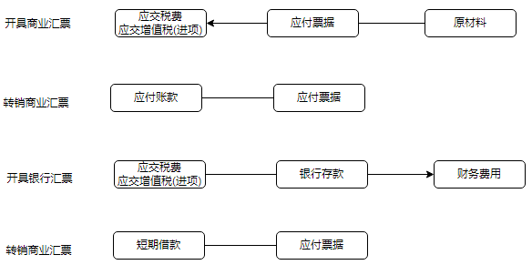
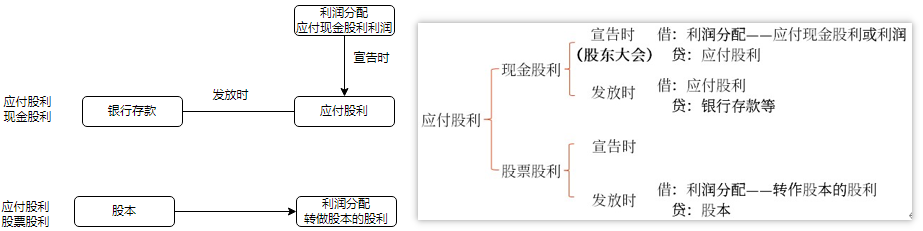

# 负债_应付及预收账款

## 应付及预收账款
- 应付票据
    - 商业承兑汇票
    - 银行承兑汇票
- 应付账款
- 预收账款
- 合同负债(合同类的预收账款)
- 应付股利
- 应付利息
- 其他应付款

### `应付账款`和`其他应付款`的区别

2021年12月月初某企业“应付账款”科目贷方余额为200万元，当月以银行存款偿还上月的外购材料货款30万元，退还出借包装物押金5万元。不考虑其他因素，2021年12月月末该企业“应付账款”科目余额为（　　）万元。（2022年·2分）
A.235
B.165
C.170
D.200
【答案】C
【解析】2021年12月月末该企业“应付账款”科目余额=200-30=170（万元）。退还出借包装物押金5万元通过“其他应付款”科目核算，不冲减应付账款。

### 应付及预收账款分类

下列各项中，企业应通过“其他应付款”科目核算的是（　　）。（2022年·2分）
A.应付企业债券的利息
B.应付租入包装物的租金
C.应付供应商的材料采购款
D.应付投资者的现金股利
【答案】B
【解析】选项A计入应付利息等；选项C计入应付账款；选项D计入应付股利。

下列各项中，应通过“其他应付款”科目核算的是（　　）。（2022年改编·2分）
A.应付销货方代垫的运杂费
B.应付出借包装物收取的保证金
C.应付职工抚恤费
D.为职工垫付的水电费
【答案】B
【解析】选项A，计入应付账款, 代垫运费属于购入产品的成本；选项C，计入应付职工薪酬；选项D，计入其他应收款。

下列各项中，企业应通过“其他应付款”科目核算的有（　　）。（2022年改编·2分）
A.购进商品时发生的供货方代垫运费
B.应付的合同违约金
C.代垫职工家属医药费
D.存入保证金
【答案】BD

## 应付票据

账目:
应付票据, 即商业汇票, 包括`商业承兑汇票`和`银行承兑汇票`

账务处理:
开出银行承兑汇票支付给银行的手续费, 记`财务费用`
商业承兑汇票到期无力偿还票款, 记`应付账款`
银行承兑汇票到期无力偿还票款, 记`短期借款`

### 承兑的商业汇票中的银行承兑汇票与银行本票, 银行汇票区别

2021年10月，某企业支付材料采购款180万元，其中以商业承兑汇票付款125万元，申请签发银行本票25万元、银行汇票30万元。不考虑其他因素，该企业当月应记入“应付票据”科目贷方的金额为（　　）万元。（2022年·2分）
A25
B.125
C.55
D.30
【答案】B
【解析】选项B正确，应付票据是指企业购买材料、商品和接受服务等而开出、承兑的商业汇票，包括`商业承兑汇票`和`银行承兑汇票`。而`银行本票、银行汇票`通过`其他货币资金`科目核算。

### 转销应付票据（商业承兑汇票/银行承兑汇票）的不同账务处理

下列各项中，关于企业应付票据会计处理的表述正确的是（　　）。（2022年改编·2分）
A.企业采购原材料以商业汇票结算货款，应通过“应付票据”科目核算，并以商业汇票的票面金额作为“应付票据”科目的入账金额
B.应将到期无力支付的银行承兑汇票的账面余额转作应付账款
C.申请银行承兑汇票支付的手续费应计入当期管理费用
D.应将到期无力支付的商业承兑汇票的账面余额转作短期借款
【答案】A
【解析】选项B：应将到期无力支付的银行承兑汇票的账面余额转作短期借款。借记“应付票据”科目，贷记“短期借款”科目。选项C：申请银行承兑汇票支付的手续费应计入当期财务费用。按照确认的手续费，借记“财务费用”科目，取得增值税专用发票的，按注明的增值税进项税额，借记“应交税费——应交增值税（进项税额）”科目，按照实际支付的金额，贷记“银行存款”科目。选项D：应将到期无力支付的商业承兑汇票的账面余额转作应付账款。借记“应付票据”科目，贷记“应付账款”科目。

## 应付账款
`应付账款`: 负债类, 包括销售商品提供服务的`价款`、`增值税`，以及`垫付`的`包装费、运杂费`等。

确实无法支付的应付账款予以转销时, 记`营业外收入`

### 应付账款计算(材料+运费+税费)

2021年8月1日，某企业购入一批原材料并验收入库，取得`增值税专用发票注明的价款`为600000元，`增值税税额`为78000元。对方`代垫的运费`为12000元，`增值税专用发票上注明的增值税税额`为1080元，全部款项尚未支付。不考虑其他因素，该企业确认应付账款的金额为（　　）元。（2022年·2分）
A.600000
B.678000
C.612000
D.691080
【答案】D
【解析】该企业确认应付账款的金额=600000+78000+12000+1080=691080（元）。

## 预收账款
不单独设置“预收账款”科目的企业，发生的预收款通过“应收账款”科目贷方核算；
不单独设置“预付账款”科目的企业，发生的预付款通过“应付账款”科目的借方核算。
收找收, 付找付, 从负债类转到资产类, 从`预收账款`到`应收账款`相当于冲减了`应收账款`

### 不设置预收账款
6.企业预收款项业务不多的情况下可以不设置“预收账款”科目，而是将预收的款项通过（　　）核算。
A.应付账款的贷方
B.应收账款的贷方
C.预付账款的贷方
D.其他应付款的贷方
【答案】B
【解析】预收款项业务不多的企业可以不单独设置“预收账款”科目，其所发生的预收款项通过“应收账款”科目的贷方核算。

## 合同负债
同`预收账款`记忆

## 应付利息
科目:
`应付利息`: 预提`短期借款`的利息，以及`分期付`息到期还本的`长期借款`、`企业债券`等应支付的利息

## 应付股利

`应付股利`: 企业根据股东大会或类似机构审议批准的利润分配方案确定分配给投资者的现金股利或利润. 包含:

- 现金股利——流出企业
- 股票股利——出不去

账务:

- 企业宣告分配`股票股利`不需要进行账务处理。
- 企业实际分配`股票股利`不通过“应付股利”科目核算，通过`股本`科目核算：
    借：利润分配——转作股本的股利
    贷：股本

### 应付股利确认的时间及账务处理
下列各项中，股份有限公司应通过“应付股利”科目核算的有（　　）。（2020年·2分）
A.实际发放股票股利
B.宣告发放现金股利
C.宣告发放股票股利
D.实际发放现金股利
【答案】BD
【解析】宣告发放股票股利不作账务处理，实际发放股票股利的会计分录：
借：利润分配——转作股本的股利
　贷：股本
选项AC均不通过“应付股利”科目核算。

### 企业董事会通过的利润分配方案中拟分配的现金股利，不需要进行账务处理
企业董事会通过的利润分配方案中拟分配的现金股利，不需要进行账务处理。（　　）（2020年·1分）
【答案】√

### 企业宣告分配的股票股利不需要进行账务处理
企业根据股东大会或类似机构审议批准的利润分配方案中确认分配的股票股利，应通过“应付股利”科目核算。（　　）
【答案】×

## 其他应付款
科目:
`其他应付款`, 负债类, 包括`租金`, `押金`, `保证金`, `合同违约的赔款`、`罚款`

有真实买卖是`应付账款`, 没有是`其他应付款`.

拓展:
- `其他应付款`核算的内容
    - 应付短期租赁固定资产`租金`
    - 应付低价值资产租赁的`租金`
    - 应付租入包装物`租金`
    - 从职工工资中代扣的应由职工个人负担的社会保险费和住房公积金
    - 出租或出借包装物向客户收取的`押金`
    - 存入`保证金`等
- `其他应收款`核算的内容:
    - 应收的各种赔款、罚款
    - 应收的出租包装物租金
    - 应向职工收取的各种垫付款项，如为职工垫付的水电费、应由职工负担的医药费、房租费等
    - 存出保证金，如租入包装物支付的押金
    - 其他各种应收、暂付款项

### 其他应付款

8.下列各项中，应通过“其他应付款”科目核算的是（　　）。
A.收到租出包装物的押金
B.确认应付的职工福利费
C.应付采购材料的价款
D.确认应交的教育费附加
【答案】A
【解析】选项B，通过“应付职工薪酬”科目核算；选项C，通过“应付账款”科目核算；选项D，通过“应交税费”科目核算。

5.下列各项中，不应通过“其他应付款”科目核算的有（　　）。
A.租入包装物支付的押金
B.应缴纳的教育费附加
C.为职工垫付的水电费
D.外单位存入的保证金
【答案】ABC
【解析】选项AC，租入包装物支付的押金、为职工垫付的水电费应记入“其他应收款”科目；选项B，应缴纳的教育费附加应记入“应交税费”科目。

## 其他

9.某企业2022年1月1日以短期租赁方式租入管理用办公设备一批，月租金为2000元，每季度末一次性支付本季度租金。不考虑其他因素，该企业1月31日计提租入设备租金时相关会计科目处理正确的是（　　）。
A.贷记“应付账款”科目2000元
B.贷记“预收账款”科目2000元
C.贷记“预付账款”科目2000元
D.贷记“其他应付款”科目2000元
【答案】D
【解析】计提租入设备租金分录如下：
借：管理费用　　　　　　　　　　 2000
　贷：其他应付款　　　　　　　　　 2000

4.其他应付款的核算范围包括应付短期租赁固定资产的租金、租入包装物的租金等，但是不包括存入保证金。（　　）
【答案】×
【解析】存入保证金属于其他应付款的核算范围。

