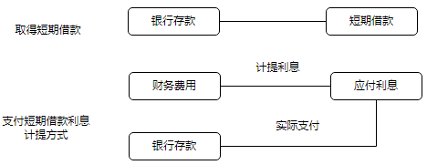

# 短期借款

## 短期借款定义

### 考察
短期借款是指企业向银行或其他金融机构等借入的期限在1年以下（含1年）的各种借款。

### 题目

2.下列各项中，企业无力支付到期银行承兑汇票票款时，应将该票据的票面金额从“应付票据”科目的账面余额转入的会计科目是（　　）。
A.其他应付款
B.营业外收入
C.应付账款
D.短期借款
【答案】D
【解析】企业无力支付到期银行承兑汇票票款时：
借：应付票据
　贷：短期借款

如果改成商业承兑汇票, 则变成应付账款

## 其他

3.下列各项中，企业以银行存款支付银行承兑汇票手续费应借记的会计科目是（　　）。
A.财务费用
B.管理费用
C.研发费用
D.在建工程
【答案】A
【解析】企业因开出银行承兑汇票而支付给银行的承兑汇票手续费，应当计入当期财务费用，选项A正确。
