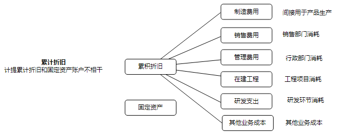
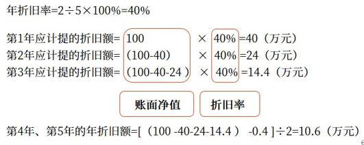
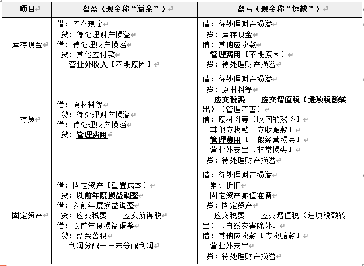
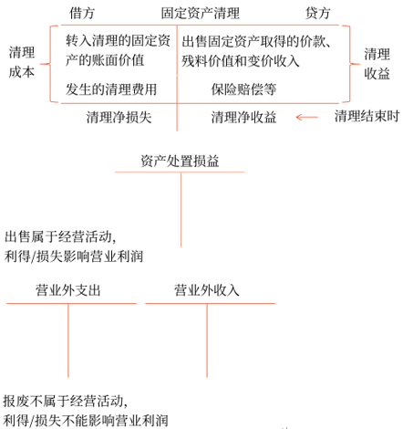
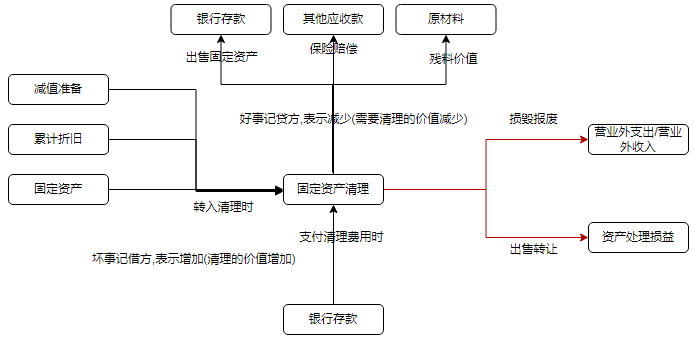

# 非流动资产_固定资产

## 固定资产

### 固定资产综合

11.甲公司系增值税一般纳税人，销售设备适用的增值税税率为13%，2022年8月31日以不含增值税的价格100万元出售一台生产用机床，增值税销项税额为13万元，该机床原价为200万元（不含增值税），已计提折旧120万元，已计提减值30万元，处置发生清理费用15万元。不考虑其他因素，该业务影响当期营业利润的金额为（　　）万元。
A.66
B.20
C.35
D.50
【答案】C
【解析】甲公司出售该机床的净收益=100-（200-120-30）-15=35（万元），计入资产处置损益，影响当期营业利润。

## 余额,净值,价值
账面余额 = 固定资产
账面净值 = 固定资产-累积折旧
账面价值 = 固定资产-累积折旧-固定资产减值准备

### 

## 固定资产取得
企业外购的固定资产，应按实际支付的购买价款、相关税费（不含可抵扣增值税）、使固定资产达到预定可使用状态前所发生的可归属于该项资产的`运输费、装卸费、安装费`和`专业人员服务费`等，作为固定资产的取得成本。
挖坑1：`相关税费`要看能不能抵扣, 不能抵扣才记入成本. 如果是一般纳税人, 增值税可抵则不需要记入
挖坑2:`人员培训费`是培训人员使用设备, 不算设备成本

### 固定资产成本计算

3.甲公司为增值税一般纳税人，自行建造某项生产用大型设备，建造过程中发生`外购设备和材料成本`共100万元，增值税税额共13万元，已全部投入使用。另发生`人工成本`80万元，`资本化的借款费用`5万元，`安装费用`10万元，`为达到正常运转发生测试费`2万元，`外聘专业人员服务费`1万元，员工培训费0.5万元，则甲公司建造该设备的成本为（　　）万元。
A.198.5
B.211.5
C.198
D.211
【答案】C
【解析】发生的员工培训费计入当期损益，建造该设备的成本=100+80+5+10+2+1=198（万元）。

4.甲公司为一家制造型企业，为增值税一般纳税人。2022年5月10日，为降低采购成本，向乙公司一次性购入三套不同型号且有不同生产能力的设备A、B、C。甲公司以银行存款支付价款1900万元，增值税税额为247万元，保险费20万元（假定不考虑增值税）。A设备在安装过程中领用账面价值为10万元的生产用原材料，支付安装工人工资8万元。A设备于2022年12月21日达到预定可使用状态。假定A、B、C设备均满足固定资产定义及确认条件，公允价值分别为750万元、600万元、650万元。不考虑其他因素，则A设备的入账价值为（　　）万元。
A.600
B.738
C.658
D.750
【答案】B
【解析】A设备入账价值=（1900+20）×750÷（750+600+650）+10+8=738（万元）。

## 固定资产折旧

概念:
`应计折旧额`，是指应当计提折旧的固定资产`原价`扣除其预计`净残值`后的金额。已计提减值准备的固定资产，还应当扣除已计提的固定资产减值准备累计金额。

固定资产原价, 指固定资产的成本.
预计净残值, 寿命终了时的价值
固定资产减值准备, 指固定资产已计提的固定资产减值准备累计金额

固定资产计提折旧的范围：
①更新改造、改扩建期间——不计提折旧。
②日常维修、未使用、不需用——仍计提折旧。

计提折旧的起止时间:
- 固定资产应当按月计提折旧，
    当月增加的固定资产，当月不计提折旧，从下月起计提折旧；
    当月减少的固定资产，当月仍计提折旧，从下月起不计提折旧
- 已达到预定可使用状态但尚未办理竣工决算的固定资产，应当按照估计价值确定其成本，并计提折旧；
- 待办理竣工决算后，再按实际成本调整原来的`暂估价值`，但不需要调整原已计提的折旧额

账目:

账户:

### 题目 

6.下列关于固定资产折旧的表述中，错误的是（　　）。
A.处于季节性修理过程中的固定资产在修理期间应当停止计提折旧
B.已达到预定可使用状态但尚未办理竣工决算的固定资产应当按暂估价值计提折旧
C.处于更新改造过程中的固定资产不计提折旧
D.与固定资产有关的经济利益预期消耗方式发生重大改变的，应当调整折旧方法
【答案】A
【解析】选项A错误，处于季节性修理过程中的固定资产在修理期间应继续计提折旧。

3.下列固定资产中，当月不计提折旧的有（　　）。
A.已提足折旧仍继续使用的固定资产
B.当月减少的固定资产
C.当月增加的固定资产
D.日常修理停用的固定资产
【答案】AC
【解析】选项A，已提足折旧仍继续使用的固定资产不计提折旧；选项C，当月增加的固定资产，当月不计提折旧。

## 折旧方法
1.年限平均法
    年限平均法, 也称也称直线法, 年折旧率=（1-预计净残值率）÷预计使用寿命（年）×100%
2.工作量法
    单位工作量折旧额=［固定资产原价×（1-预计净残值率）］÷预计总工作量
3.双倍余额递减法(直线法的折旧率)
    年折旧率=2÷预计使用寿命（年）×100%
    年折旧额=每个折旧年度年初固定资产账面净值×年折旧率
    月折旧额=年折旧额÷12
4.年数总和法
    年折旧率=尚可使用年限÷预计使用寿命的年数总和×100%
    年折旧额=（固定资产原价-预计净残值）×年折旧率
    月折旧额=年折旧额÷12

### 年限平均法
7.2022年3月31日，甲公司采用出包方式对某固定资产进行更新改造，该固定资产账面原值为1800万元，预计使用年限为5年，截至2022年3月31日已使用3年，预计净残值为零，采用年限平均法计提折旧。更新改造过程中，甲公司支付出包工程款48万元（不考虑增值税）。2022年8月31日，更新改造后的固定资产达到预定可使用状态并投入使用，预计尚可使用4年，预计净残值为零，仍采用年限平均法计提折旧。2022年度该固定资产应计提的折旧额为（　　）万元。
A.154
B.90
C.64
D.192
【答案】A
【解析】2022年8月31日更新改造后固定资产的账面价值=1800-1800÷5×3+48=768（万元）；2022年9月份到12月份应计提折旧额=768÷4÷12×4=64（万元）；2022年1月份到3月份应计提折旧额=1800÷5÷12×3=90（万元），所以2022年该固定资产应计提折旧额=90+64=154（万元）。

### 工作量法

### 双倍余额递减法
某企业一项固定资产的原价为100万元，预计使用年限为5年，预计净残值为0.4万元。按双倍余额递减法计提折旧，每年的折旧额计算如下：

### 年数总和法

8.2021年12月3日，某企业购入一台不需要安装的生产设备并投入使用，原价为60000元，预计净残值为3000元，预计使用年限为5年，按年数总和法计提折旧。不考虑其他因素，2022年12月31日该设备的账面价值为（　　）元。
A.48600
B.48000
C.41000
D.40000
【答案】C
【解析】2021年12月购入的设备，2022年1月开始计提折旧，所以折旧年度和会计年度是一致的，由于该企业采用年数总和法计提折旧，所以2022年计提的折旧额=（60000-3000）×5/（1+2+3+4+5）=19000（元），该设备的账面价值=账面原值-累计折旧-固定资产减值准备（本题不涉及）=60000-19000=41000（元）

## 固定资产资本化后续支出
1. 资本化

### 固定资产更新改造
10.2022年4月，由于生产技术更新，甲公司将一条生产线进行更新改造，并替换了生产线上的一台设备。该生产线为2018年4月购入，原值200万元，预计使用年限10年，预计净残值为0，采用年限平均法计提折旧，至2022年4月30日已计提折旧4年。该生产线更新改造期间，发生相关支出30万元，符合资本化条件，被替换设备账面价值为40万元，新设备价值50万元。2022年12月1日，该生产线更新改造完毕，假定不考虑其他因素，则更新改造后该生产线的入账价值为（　　）万元。
A.150
B.160
C.200
D.280
【答案】B
【解析】更新改造后该生产线的入账价值=（200-200÷10×4）-40+30+50=160（万元）。

## 固定资产费用化后续支出
与固定资产有关的修理费用等后续支出时, 计入当期管理费用、销售费用等。

借：管理费用［行政管理部门固定资产修理费用］
  销售费用［专设销售机构固定资产修理费用］
  应交税费——应交增值税（进项税额）
贷：原材料、应付职工薪酬、银行存款等

### 固定资产费用化后续支出
某企业为增值税一般纳税人，发生行政管理部门设备日常维修费50000元，专设销售机构管理用办公设备维修费30000元，增值税专用发票上注明的增值税税额为10400元。不考虑其他因素，下列各项中，该企业发生设备维修费的会计处理结果正确的是（　　）。（2021年·2分）
A.管理费用增加30000元
B.管理费用增加50000元
C.销售费用增加50000元
D.管理费用增加90400元
【答案】B
【解析】相关账务处理为：
借：管理费用　　　　　　　　　　50000
　　销售费用　　　　　　　　　　30000
　　应交税费——应交增值税（进项税额）
　　　　　　　　　　　　　　　　10400
　贷：银行存款等　　　　　　　　　90400

## 减值准备
科目:
固定资产减值准备, 资产类备抵类, 和固定资产借贷方向相反
资产减值损失, 损益类, 损方向, 按资产类记忆

账务:

### 题目
16.某企业2021年12月31日购入一台设备，入账价值为200万元，预计使用寿命为10年，预计净残值为10万元，采用年限平均法计提折旧。2022年12月31日该设备存在减值迹象，经测试，预计可收回金额为150万元。2022年12月31日该设备账面价值应为（　　）万元。
A.150
B.160
C.180
D.181
【答案】A
【解析】确定减值之前固定资产的账面价值=200-（200-10）÷10=181（万元），大于可收回金额150万元，因此固定资产发生了减值，减值以后固定资产应该按照可收回金额确认账面价值，因此2022年12月31日该设备账面价值应为150万元。

## 固定资产盘点

- 盘盈, 记`以前年度损益调整`
    借：`以前年度损益调整`
    贷：盈余公积
    　　利润分配——未分配利润	

- 盘亏, 记`营业外支出`
    借：其他应收款
    　　`营业外支出`
    贷：待处理财产损溢

其他:

### 固定资产盘点

14.下列各项中，按管理权限报经批准后计入营业外支出的是（　　）。
A.因管理不善造成的原材料盘亏净损失
B.固定资产盘亏净损失
C.无法查明原因的现金短缺
D.应由过失人赔付的库存商品毁损部分
【答案】B
【解析】选项AC计入管理费用；选项D计入其他应收款。

## 固定资产清理
科目:
固定资产清理, 损益类, 借方表示转入清理的固定资产和发生的费用, 贷方表示出售固定资产的收入和保险赔偿等
资产处置损益, 损益类, 

账务:

`毁损``报废`清理产生的利得或损失应计入`营业外收支`
`出售`、`转让`等原因产生的固定资产处置利得或损失应计入`资产处置损益`

其他:
①固定资产的毁损通过“固定资产清理”科目核算。
②存货的毁损通过“待处理财产损溢”科目核算。

资产负债表中“固定资产”项目期末余额=“固定资产”科目期末余额-“累计折旧”科目期末余额-“固定资产减值准备”科目期末余额±“固定资产清理”科目期末余额（借+贷-）。

### 固定资产清理
4.下列各项中，应通过“固定资产清理”科目核算的有（　　）。
A.盘亏固定资产的账面价值
B.固定资产更新改造支出
C.固定资产毁损净损失
D.出售固定资产的账面价值
【答案】CD
【解析】选项A通过“待处理财产损溢”科目进行核算；选项B通过“在建工程”科目进行核算。

**跨章节知识点**
固定资产出售转让, 报废毁损 固定资产清理
盘盈盘亏, 待处理财产损益
固定资产盘盈, 以前年度损益调整

6.下列各项表述中，正确的有（　　）。
A.存货盘盈计入营业外收入
B.固定资产盘盈计入营业外收入
C.出售固定资产的净收益计入资产处置损益
D.无法查明原因的现金溢余计入营业外收入
【答案】CD
【解析】选项A，冲减管理费用；选项B，计入以前年度损益调整，最终影响期初留存收益。

7.下列各项中，通过“待处理财产损溢”科目核算的有（　　）。
A.盘盈固定资产
B.盘盈存货
C.盘亏固定资产
D.毁损固定资产
【答案】BC
【解析】选项A，通过“以前年度损益调整”科目核算；选项D，通过“固定资产清理”科目核算。

## 其他
1.与使用固定资产有关的员工培训费应计入固定资产成本。（　　）
【答案】×
【解析】员工培训费应计入当期损益。

4.已达到预定可使用状态但尚未办理竣工决算的固定资产，应当按照估计价值确定其成本，并计提折旧；待办理竣工决算后，再按实际成本调整原来的暂估价值，并调整原已计提的折旧额。（　　）
【答案】×
【解析】已达到预定可使用状态但尚未办理竣工决算的固定资产，应当按照估计价值确定其成本，并计提折旧；待办理竣工决算后，再按实际成本调整原来的暂估价值，但不需要调整原已计提的折旧额。

8.企业对固定资产进行更新改造时，应当将该固定资产账面价值转入在建工程，并将被替换部件的变价收入冲减在建工程。（　　）
【答案】×
【解析】被替换部件的变价收入冲减营业外支出。

12.固定资产盘盈应先按重置成本记入“待处理财产损溢”科目，经批准后再转入营业外收入。（　　）
【答案】×
【解析】盘盈的固定资产作为前期差错进行处理，应当按重置成本确定其入账价值，借记“固定资产”科目，贷记“以前年度损益调整”科目。经批准后，调整期初留存收益。

## 大题

（一）
甲公司为增值税一般纳税人，2021年度该公司发生与固定资产相关业务如下：
（1）1月8日，购入一台需要安装的M设备，取得的增值税专用发票上注明的`价款`为500000元，`增值税税额`为65000元，另支付安装费取得的增值税专用发票上注明的价款为40000元，增值税税额为3600元，全部款项以银行存款支付。该设备预计可使用5年，预计净残值为30000元，采用年限平均法计提折旧。1月10日M设备达到预定可使用状态并交付生产车间使用。
（2）6月30日，委托外单位对本公司设备进行日常维护修理，其中行政管理部门设备的修理费为30000元，销售部门设备修理费为10000元，取得的增值税专用发票上注明的`价款`为40000元，增值税税额为5200元，全部款项以银行存款支付。
（3）12月5日，报废一台N设备，该设备原值为800000元，已计提折旧760000元，未发生资产减值损失。设备报废取得变价收入20000元，开具的增值税专用发票上注明的增值税税额为2600元，报废过程中发生清理费用6000元，全部款项均已通过银行办理结算。
（4）12月31日，对固定资产进行减值测试，发现2021年1月购入的M设备存在减值迹象，其可收回金额为440000元。
要求：根据上述资料，不考虑其他因素，分析回答下列小题。（2022年）

1.根据资料（1），下列各项中，甲公司购入M设备的入账价值是（　　）元。
A.540000
B.605000
C.565000
D.500000
【答案】A
【解析】甲公司购入M设备的入账价值=500000+40000=540000（元）。

2.根据资料（1），下列各项中，甲公司购入M设备计提折旧的表述正确的是（　　）。
A.自2021年1月开始计提折旧
B.2021年计提折旧93500元
C.自2021年2月开始计提折旧
D.每月折旧额为8500元
【答案】BCD
【解析】1月10日M设备达到预定可使用状态，固定资产于次月开始计提折旧，所以从2月开始计提折旧，选项A错误，选项C正确；采用年限平均法计提折旧，月折旧额=（540000-30000）÷5÷12=8500（元），选项D正确；2021年计提折旧额=8500×11=93500（元），选项B正确。

3.根据资料（2），下列各项中，甲公司支付设备修理费的会计处理正确的是（　　）。
A.确认管理费用40000元
B.确认制造费用40000元
C.确认销售费用10000元
D.确认管理费用30000元
【答案】CD
【解析】本题会计分录如下：
借：管理费用　　　　　　　　 　30000
　　销售费用　　　　　　　　 　10000
　　应交税费——应交增值税（进项税额）
　　　　　　　　　　　　　　　　5200
　贷：银行存款　　　　　　 　　　45200

4.根据资料（3），下列各项中，甲公司报废N设备会计处理正确的是（　　）。
A.支付清理费用时：
借：固定资产清理　　　　　　　　6000
　贷：银行存款　　　　　　　　　　6000
B.转入清理时：
借：固定资产清理　　　　　　 　40000
　　累计折旧　　　　　　　　　760000
　贷：固定资产　　　　　　　　　800000
C.取得变价收入时：
借：银行存款　　　　　　　　　 22600
　贷：固定资产清理　　　　　 　　20000
　　　应交税费——应交增值税（销项税额）
　　　　　　　　　　　　　　　　　2600
D.结转报废净损失时：
借：资产处置损益　　　　 　　　26000
　贷：固定资产清理　　　　 　　　26000
【答案】ABC
【解析】结转报废净损失分录如下：
借：营业外支出　　　　　　　　 26000
　贷：固定资产清理　　　　　　　 26000

5.根据资料（1）和（4），下列各项中，12月31日关于M设备期末计量和报表填列正确的是（　　）。
A.M设备应计提减值准备6500元
B.期末M设备在资产负债表“固定资产”项目填列的金额为446500元
C.M设备的减值损失在以后会计期间不得转回
D.期末M设备在资产负债表“固定资产”项目填列的金额为440000元
【答案】ACD
【解析】年末时，M设备计提减值准备前的账面价值=540000-93500=446500（元），大于可收回金额440000元，需计提减值准备的金额=446500-440000=6500（元），选项A正确；固定资产减值准备一经计提，以后会计期间不得转回，选项C正确；固定资产期末按照计提减值准备后的金额填列“固定资产”项目，选项B错误，选项D正确。

