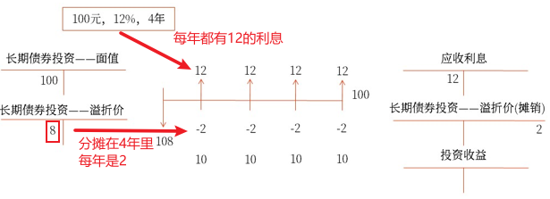
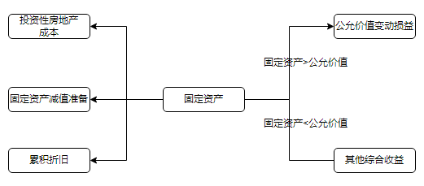

# 非流动资产_投资性房地产

## 投资性房地产
包括已`出租的土地使用权`、`持有并准备增值后转让的土地使用权`、`已出租的建筑物`。

## 投资性房地产的计量

成本模式-折旧减值
公允价值模式-不折旧不减值

- `同一企业``只能`采`用一种模式`对`所有`投资性房地产进行后续计量，不得同时采用两种计量模式。
- 企业通常应当采用成本模式对投资性房地产进行后续计量，对采用公允价值模式的条件作了限制性规定（只有存在确凿证据表明投资性房地产的公允价值能够持续可靠取得的情况下，企业才可以采用公允价值模式进行后续计量）。
- 企业可以从成本模式变更为公允价值模式，已采用公允价值模式不得转为成本模式。

## 成本模式
按一般固定资产处理，包括折旧(摊销)，减值

科目：
投资性房地产(对应固定资产)
投资性房地产累积折旧(对应累积折旧)
投资性房地产减值准备(对应减值准备)

账务:

其他:
成本模式投资性房地产后续的账务处理, 折旧摊销在`其他业务成本`, 收入(如租金)记入`其他业务收入`

### 成本模式
32.2022年1月，甲公司出售一项以成本模式计量的投资性房地产，实际收到的金额为200万元，已存入银行。投资性房地产的账面余额为1000万元，累计折旧金额为600万元，计提的减值准备金额为250万元。假设不考虑相关税费，则甲公司出售该项投资性房地产对当期损益的影响金额为（　　）万元。
A.50
B.200
C.150
D.300
【答案】A
【解析】甲公司出售该项投资性房地产产生的净收益=200-（1000-600-250）=50（万元）。账务处理为：
借：银行存款　　　　　　　 　　　200
　贷：其他业务收入　　　　　 　　　200
借：其他业务成本　　　　　　 　　150
　　投资性房地产累计折旧　　 　　600
　　投资性房地产减值准备　　 　　250
　贷：投资性房地产　　　　　　　　1000

19.企业对投资性房地产采用成本模式进行后续计量的，下列表述中正确的有（　　）。
A.按期计提折旧或摊销
B.资产负债表日发生减值的计提减值准备
C.同一企业只能采取一种模式对所有投资性房地产进行后续计量，不得同时采用成本模式和公允价值模式
D.企业可以从成本模式变更为公允价值模式，也可以从公允价值模式变更为成本模式
【答案】ABC
【解析】选项D错误，企业可以从成本模式变更为公允价值模式，已采用公允价值模式不得转为成本模式。

## 公允价值模式

账务:
`转换日`是指非转投那一天, 比如把厂房出租那一天
固定资产-累积折旧-固定资产减值准备 > 转换日公允价值, 记`公允价值变动损益`(借方, 表示损失)
固定资产-累积折旧-固定资产减值准备 < 转换日公允价值, 记`其他综合收益`(贷方, 表收益)

其他:
公允价值模式, 不折旧(摊销)、不减值
企业购入的房地产，部分用于出租（或资本增值）、部分自用，用于出租（或资本增值）的部分应当予以单独确认的，应按照不同部分的公允价值占公允价值总额的比例将成本在不同部分之间进行分配。
成本模式投资性房地产后续的账务处理, 不提折旧和减值, 而记`公允价值变动损益`, 收入(如租金)记`替他业务收入`

### 题目
27.某企业的投资性房地产采用公允价值模式进行后续计量。2022年1月1日，该企业将一项固定资产转换为投资性房地产。当日，该固定资产的账面余额为200万元，已提折旧30万元，已提减值准备20万元，公允价值为135万元。不考虑其他因素，转换日影响本期营业利润的金额是（　　）万元。
A.15
B.25
C.30
D.5
【答案】A
【解析】账务处理如下：
借：投资性房地产——成本　　 　　135
　　公允价值变动损益　　　　　　　15
　　累计折旧　　　　　　　　　　　30
　　固定资产减值准备　　　　　　　20
　贷：固定资产　　　　　　　　　 　200
公允价值变动损益属于损益类科目，影响本期的营业利润。

29.甲公司于2022年1月1日将一幢商品房对外出租，采用公允价值模式进行后续计量，租期为5年，每年1月1日收取租金150万元，出租时，该幢商品房成本为3000万元，公允价值为4500万元，2022年12月31日，该幢商品房的公允价值为5200万元。则甲公司2022年年末应确认的公允价值变动损益为（　　）万元。
A.3000
B.1500
C.2200
D.700
【答案】D
【解析】转换日投资性房地产的入账价值为4500万元，2022年年末公允价值为5200万元，所以应计入公允价值变动损益的金额=5200-4500=700（万元）。

转换日公允价值4500万元与成本3000万元的差额1500万元计入其他综合收益。

17.企业将自用房地产转换为以公允价值模式计量的投资性房地产时，转换日公允价值与原账面价值的差额，可能计入的会计科目有（　　）。
A.投资收益
B.资本公积
C.其他综合收益
D.公允价值变动损益
【答案】CD
【解析】企业将自用房地产转换为以公允价值模式计量的投资性房地产时，转换日的公允价值大于账面价值的差额应计入其他综合收益，转换日的公允价值小于账面价值的差额应计入公允价值变动损益。账务处理如下：
借：投资性房地产——成本
　　累计折旧
　　固定资产减值准备［如有］
　　公允价值变动损益［借方差额］
　贷：固定资产
　　　其他综合收益［贷方差额］

21.针对企业采用公允价值模式进行后续计量的投资性房地产，下列相关账务处理表述正确的有（　　）。
A.不需要对投资性房地产计提折旧或摊销
B.资产负债表日对投资性房地产进行减值测试并计提减值准备
C.取得租金收入计入其他业务收入
D.资产负债表日公允价值高于其账面价值的差额计入其他综合收益
【答案】AC
【解析】采用公允价值模式进行后续计量的投资性房地产无须计提减值准备，选项B错误；资产负债表日公允价值高于其账面价值的差额计入公允价值变动损益，选项D错误。

21.企业将自有房地产部分用于出租，部分自用，如果用于出租的部分能单独计量，企业应将该部分确认为投资性房地产；若这部分不能单独计量，则不应确认为投资性房地产。（　　）
【答案】√

