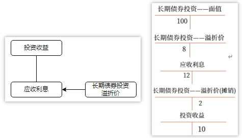
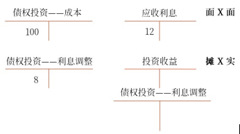

# 长期债权投资

## 债券和债权

长期债券投资,包含子科目`面值`和`溢折价`
债权投资,包含子科目`成本`和`利息调整`(`应计利息`不常考)

小企业和大企业的账务处理区别:
小企业债券是通过`应收利息`和`长期债券投_资溢折价`计算每期的`投资收益`
大企业债权是通过`应收利息`和`投资收益`来计算`债权投资_利息调整`

## 长期债权投资(小企业会计准则)
以摊余成本计量的金融资产中的债权投资

科目:
长期债券投资_面值: 资产类, 债券的面值
长期债券投资_溢折价: 资产类, 买债券多花的钱, 手续费之类, 多了记借方
应收利息: 资产类, 分期付息、到期还本的应收未收的利息。
投资收益: 损益类, 长期债券投资实际获得的利息收入
账务:

买入债券的成本为: 长期债券投资_面值+长期债券投资_溢折价(购买时的交易费用)+应收未收的利息
投资收益为: 应收利息-长期债券投资_溢折价
长期债券投资_溢折价和应收利息平均到每年分别计算

### 长期债权投资
24.甲公司为一家小企业（执行《小企业会计准则》），2022年1月1日，从二级市场购入乙公司债券，以银行存款支付价款合计1050万元（含已到付息期但尚未收到的利息50万元），另支付交易费用4万元。该债券面值1000万元，剩余期限为4年，票面年利率为5%，每年付息一次，每年1月10日支付上一年利息，合同现金流量特征仅为本金和以未偿付本金金额为基础的利息的支付，甲公司准备持有至到期，作为长期债券投资核算。甲公司2022年的账务处理正确的有（　　）。
A.1月1日，长期债券投资的入账价值为1004万元
B.1月10日，实际收到利息时贷记“应收利息”50万元
C.12月31日，确认投资收益49万元
D.12月31日，长期债券投资的账面价值为1004万元
【答案】ABC
【解析】2022年1月1日，甲公司取得长期债券投资的入账价值=1050-50+4=1004（万元），选项A正确。账务处理如下：
借：长期债券投资——面值　　　　1000
　　　　　　　　——溢折价　　 　　4
　　应收利息　　　　　　　　　　　50
　贷：银行存款　　　　　　　　　　1054
2022年1月10日，实际收到购买价款中包含的已到付息期但尚未收到的利息时：
借：银行存款　　　　　　　　　　　50
　贷：应收利息　　　　　　　　　　　50
选项B正确。
2022年12月31日，确认投资收益并采用直线法对溢折价进行摊销时：
借：应收利息　　　　　［1000×5%］50
　贷：长期债券投资——溢折价 ［4÷4］1
　　　投资收益　　　　　　　　　　　49
选项C正确。
2022年12月31日，长期债券投资的账面价值=1004-1=1003（万元），选项D错误。

甲公司为一家小企业。2019年1月1日，从二级市场购入乙公司债券，支付价款合计51万元（含已到期但尚未收到的利息1万元），另支付交易费用2万元。该债券面值50万元，剩余期限为4年，票面年利率为4%，每年付息一次，合同现金流量特征仅为本金和以未偿付本金 金额为基础的利息的支付。甲企业准备持有至到期，分类为长期债券投资进行核算与管理。

借：长期债券投资——面值　　　　　　 50
　　　　　　　　——溢折价　　　　　　2
　　应收利息　　　　　　　　　　　　　1
　贷：银行存款　　　　　　　　　　　　 53

借：应收利息　　　　　　　　　　　　　2
　贷：长期债券投资——溢折价　　　　　 0.5
　　　投资收益　　　　　　　　　　　　1.5

甲公司为一家小企业（执行《小企业会计准则》）。2021年1月1日，从二级市场购入乙公司债券，支付价款合计510000元（含已到付息期但尚未收到的利息10000元），另支付交易费用10000元。该债券面值500000元，剩余期限为2年，票面年利率为4%，每半年付息一次，合同现金流量特征仅为本金和以未偿付本金金额为基础的利息的支付。甲公司准备持有至到期，分类为长期债券投资进行核算与管理，下列处理中，正确的有（　　）。
A.交易费用10000元应记入“长期债券投资——溢折价”科目
B.支付价款中已到付息期但尚未收到的利息10000元应记入“应收利息”科目
C.每半年应收利息为10000元
D.每半年溢折价的摊销额为2500元
【答案】ABCD
【解析】选项A，交易费用10000元在“长期债券投资——溢折价”科目进行核算，在以后确认投资收益时采用直线法摊销。选项B，实际支付价款中包含的已到付息期但尚未收到的债券利息，应当单独确认为应收利息。选项C，每半年应收利息=500000×4%÷2=10000（元）。选项D，溢折价摊销额=10000÷4（剩余期限2年，每半年付息一次，摊销次数为4次）=2500（元）。

24.企业购入债权投资，实际支付价款中包含的已到付息期但尚未领取的债券利息，应当单独确认为应收利息，不计入债权投资的成本。（　　）
【答案】√

## 债权投资(适用于企业会计准则)

账目:
- 债权投资:
    - 债权投资——成本: (对应债券的面值)
    - 债权投资——利息调整: (溢折价, 手续费税费)
    - 债权投资——应计利息: `一次还本付息`债券投资按票面利率计算确定的应收未收的利息
- 应收利息: 资产类科目，核算债权投资为分期付息、一次还本债券投资的应按票面利率计算确定的应收未收的利息。
- 投资收益: 损益类科目，每期的面值*利息 - 摊销额(利息调整) * 实际利率

账务处理:
1. 应收利息: 面x面计算应收利息
2. 投资收益: 摊x实(摊余成本x实际利率), 题目直接会给出
3. 债券投资_利息调整 = 投资收益-应收利息, 每次调整一点, 慢慢就把`利息调整`调玩

### 债权投资(适用于企业会计准则)
　下列各项中，关于“债权投资”科目核算内容的表述正确的是（　　）。（2022年·2分）
A.以公允价值计量且其变动计入其他综合收益的债券投资
B.以公允价值计量且其变动计入当期损益的债券投资
C.以摊余成本计量的债券投资
D.以公允价值计量且其变动计入其他综合收益的权益投资
【答案】C
【解析】选项C正确，债权投资是指以摊余成本计量的金融资产中的债权投资。选项A属于其他债权投资，选项B属于交易性金融资产，选项D属于其他权益工具投资。

企业对分期付息、一次还本的债券投资计提的利息，应通过“债权投资——应计利息”科目核算。（　　）（2022年·1分）
【答案】×
【解析】企业对分期付息、一次还本的债券投资计提的利息，应通过“应收利息”科目核算。

2022年1月1日甲公司从市场上购入乙公司当日发行的3年期、分期付息（于次年1月5日付息）、到期一次还本的债券，面值总额为2000万元，实际支付价款为1980万元，另发生相关税费2万元。甲公司将该债券划分为以实际利率法摊销的债权投资。则2022年1月1日该债权投资的入账`价值`为（　　）万元。
A.2000
B.2002
C.1982
D.1880
【答案】C
【解析】甲公司取得该债权投资的入账价值=1980+2=1982（万元）。相关账务处理：
借：债权投资——成本　　　　　　 2000
　贷：银行存款　　　　　 ［1980+2］1982
　　　债权投资——利息调整　　　　　 18

下列关于债权投资的说法中，正确的有（　　）。
A.债权投资应当按照取得时的购买价款和相关税费之和作为初始确认金额
B.在取得时，如果实际支付的价款中包含已到付息期但尚未领取的债券利息，应一并计入债权投资成本
C.采用实际利率法时，债权投资在持有期间应当按照摊余成本和实际利率计算确认利息收入，计入投资收益
D.持有期间预期发生信用减值损失的应计提债权投资减值准备
【答案】ACD
【解析】选项B，实际支付价款中包含的已到付息期但尚未领取的债券利息，应当单独确认为应收利息，不计入债权投资的成本。

债权投资无须计提减值准备。（　　）
【答案】×
【解析】债权投资预期发生信用减值损失，应计提债权投资减值准备。

