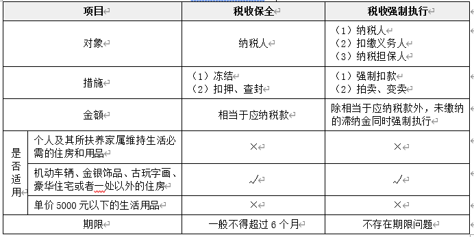
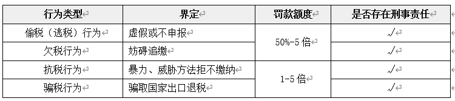

# 税收征管法律制度

## 税务登记管理
`国家机关`、`个人`和无固定生产经营场所的流动性`农村小商贩`，不办理税务登记。
自`领取工商营业执照`之日起`30日`内申报办理`税务登记`

## 账簿和凭证管理
自`领取营业执照`或者发生纳税义务之日起`15日内`，按照国家有关规定`设置账簿`。
`扣缴义务发生`之日起`10日内`，按照所代扣、代收的税种，分别设置代扣代缴、代收代缴`税款账簿`。
自`领取税务登记证件`之日起`15日内`，将其财务、会计制度或者财务、会计处理办法报送主管税务机关`备案`。

## 发票管理
先征收税款，再开具发票

## 纳税申报
自行申报
邮寄申报
数据电文申报
简易申报

## 税款征收方式
查账征收
查定征收
查验征收
定期定额征收
扣缴征收
委托征收

## 税款的退还、追征与补征

1.税款的退还
（1）主动退还, 纳税人超过应纳税额缴纳的税款，`税务机关发现`后，应当自发现之日起`10日`内办理退还手续。
（2）申请退还, 纳税人自结算缴纳税款之日起`3年内`发现多缴税款的，可以向税务机关要求退还多缴的税款并加算银行同期存款利息，税务机关应当自接到纳税人退还申请之日起`30日`内查实并办理退还手续
2.税款的追征
（1）因`纳税人、扣缴义务人计算错误`等失误，未缴或者少缴税款的，税务机关在3年内可以追征税款、滞纳金；有特殊情况的，追征期可以延长到`5年`。
（2）对`偷税（逃税）、抗税、骗税的`，税务机关追征其未缴或者少缴的税款、滞纳金或者所骗取的税款，`不受前述规定期限的限制`。
3.税款的补征
`因税务机关的责任`，致使纳税人、扣缴义务人未缴或者少缴税款的，税务机关在`3年内`可以要求纳税人、扣缴义务人补缴税款，但是`不得加收滞纳金`。

## 责令缴纳
- 责令缴纳的最长期限`不得超过15日`；逾期仍未缴纳，税务机关可以依法采取`强制执行措施`。
- 加收滞纳金
（1）从滞纳税款之日起加收，即自税款法定缴纳期限届满次日起至纳税人、扣缴义务人实际缴纳税款之日止。
（2）按日加收滞纳税款`万分之五`的滞纳金。

## 责令提供纳税担保
适用情形:
- 在限期内发现纳税人有明显的转移、隐匿其应纳税的商品、货物
- 法定代表人需要出境的
- 未缴清税款，需要申请行政复议

## 税收保全与税收强制执行

## 税务检查中税务机关的权利与义务
- 查账权
- 场地检查权
- 责成提供资料权
- 询问权
- 交通邮政检查权
- 存款账户查询权

## 重大税收违法失信案件信息公布
- 100万元以上或10%
- 骗取国家出口退税款的
- 以暴力、威胁方法拒不缴纳税款的
- 虚开增值税普通发票100份以上或者金额400万元以上的
- 私自印制、伪造、变造发票，非法制造发票防伪专用品，伪造发票监制章的；
- 在稽查案件执行完毕前，不履行税收义务并脱离税务机关监管，经税务机关检查确认走逃（失联）的

## “偷欠抗骗”四大税收违法行为

## 首违不罚制度

