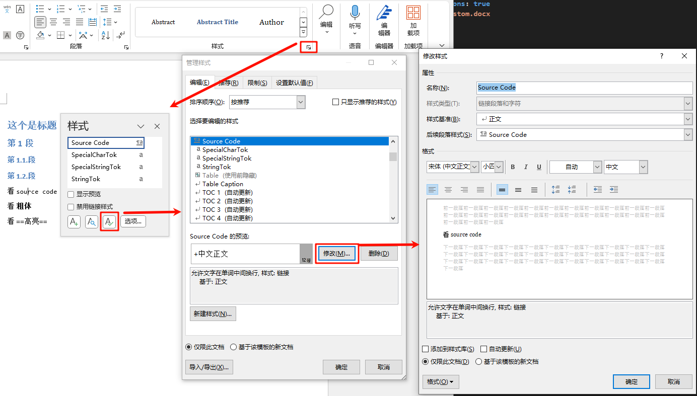

# pandoc模板


## 样式制作

1. 随便写一个`.md`文档

    ```markdown
    # 这个是标题

    ## 第1段

    ### 第1.1.段

    ### 第1.2.段

    看`resource code`

    看**粗体**

    看==高亮==
    ```


2. 生成word文档, 获得`.docx`文件, 并修改相应的样式

    

3. 将该文档放在`C:\Users\name\AppData\Roaming\pandoc`中, 并在`option.yml`中配置:\
    ```yml
    reference-doc: custom.docx
    resource-path: ['C:\Users\Xinyu\AppData\Roaming\pandoc'] # 指定reference-doc(模板文件)的路径
    ```

4. 执行命令`pandoc test.md -o test.docx -d option.yml`


注意:
1. 设置了首行缩进后, 发现表格里的正文内容也变成了首行缩进, 通过样式很难修改, 可以直接在word里的`布局`中, 反向调节缩进.


## 样式修改

1. 表格居中, 图片居中
2. 一级标题, 改为三号


## 参考
- https://blog.csdn.net/fengdu78/article/details/103907960
