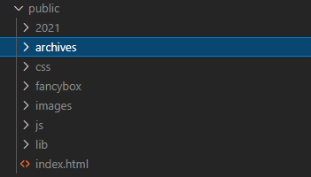
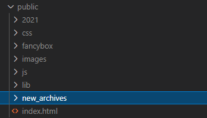

# 配置

hexo的配置文件`_config.yml`中修改.

## 应用

### 更改首页

1. 首先要改掉默认的列表首页

    ```yml
    index_generator:  # 首页生成的路径, 默认是生成一个文章列表作为首页
    path: 'xxx' # 只要不是'/'或者''就行
    ```

2. 自己编写首页

在`source`文件夹下创建`index.md`文件, 该文件会自动放在`public`文件夹下, 此时由于`index_generator`生成的页面被移到别处, 所以不会覆盖.


### 修改样式

1. 在浏览器中查看样式选择器, 在vscode中全工程搜索样式选择器, 定位文件为`/public/css/default.css`
2. 在`/public/css/default.css`直接修改看效果
3. 将`/public/css/default.css`复制到`/source/css/default.css`下


## 参数理解

### Directory

**xxxx_dir**:是用来设置生成静态文件(public)中的文件名称.

默认**archive_dir: archives**会在public文件夹中生成**archives**,可以通过`http://127.0.0.1:5003/archives/`来访问.



当我们修改**archive_dir: new_archives**,则会生成**new_archives**,访问时也需要通过`http://127.0.0.1:5003/new_archives/`.



也可以修改为 **archive_dir: /**,则会在根目录生成 **index.html**,这样就可以在首页直接显示archive了(要更改index_generator.path,不然会被覆盖).

```yml
## Directory
source_dir: source
public_dir: public
tag_dir: tags
archive_dir: archives
category_dir: categories
code_dir: downloads/code
i18n_dir: :lang
skip_render:
```

### index_generator

同 **Directory**,`index_generator.path`限定了文章列表页的路径,默认是空,既`/`.当使用其他页面,比如`archives`作为首页时,要先将`index_generator.path`,定位到非`/`根路径才行

```yml
## Home page setting
## path: Root path for your blogs index page. (default = '')
## per_page: Posts displayed per page. (0 = disable pagination)
## order_by: Posts order. (Order by date descending by default)
index_generator:
  path: ''
  per_page: 10
  order_by: -date
```