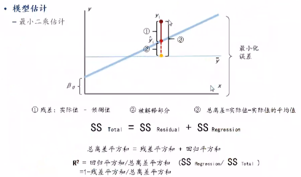
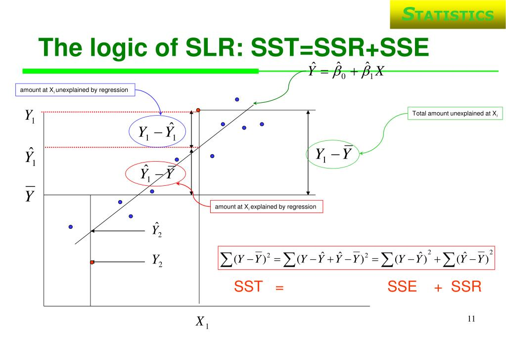

# 第七章使用统计学方法进行变量有效性测试


## 统计量(补充知识统计学8版)❤️

在实际应用中，当我们从某总体中抽取一个样本$(X_1,X_2,...,X_n)$后，并不能直接用它去对总体的有关性质和特征进行推断，这是因为样本虽然是从总体中获取的代表，含有总体性质的信息，但仍比较分散。为了使统计推断成为可能，首先必须把分散在样本中我们关心的信息集中起来，针对不同的研究目的构造不同的样本函数，这种函数在统计学中称为统计量。


设$X_1,X_2,...,X_n$是从总体$X$中抽取的容量为$n$的一个样本，如果由此样本构造一个函数$T(X_1,X_2,...,X_n)$,不依赖于任何未知参数，则称函数$T(X_1,X_2,...,X_n)$是一个统计量。
通常，又称$T(X_1,X_2,...,X_n)$为样本统计量。当获得样本的一组具体观测值，$x_1, x_2,...,x_n$时，代入$T$,计算出$T(x_1, x_2,...,x_n)$的数值，就得到一个具体的统计量值。

如, 设$X_1,X_2,...,X_n$是从某总体$X$抽取的一个样本, 则
$$
\overline{X} = \frac{1}{n}\sum_{i=1}^n X_i \\
S^2 = \frac{1}{n-1}\sum_{i=1}^n(X_i - \overline{X})^2
$$

都是统计量, 而

$$
\sum_{i=1}^n[X_i - E(X)]^2 \\
[X_i - E(X)]/D(X)
$$

都不是统计量, 这是因为其中的$E(X)$和$D(X)$都是依赖于总体分布的未知参数.


## 正态分布的定义及图形特点 ❤️
如果随机变量$X$的概率密度为：
$$
f(x)=\frac{1}{\sqrt{2\pi}\sigma }exp(-\frac{(x-\mu)^2}{2\sigma^2}),(-\infty < x < \infty)
$$
称$X$服从正态分布, 记作$X \sim N(\mu, \sigma^2)$, 其中$-\infty < \mu < +\infty, \sigma > 0$, $\mu$为随机变量$X$的均值, $\sigma$为随机变量$X$的标准差, 它们是正态分布的两个参数.

正态分布图的特点:
- $f(x) \geq 0$，即整个概率密度曲线都在x轴的上方。
- 曲线$f(x)$相对于$x = \mu$对称, 并达到最大值, $f(\mu)=\frac{1}{\sqrt{2\pi}\sigma}$
- 曲线的陡缓程度由$\sigma$决定，$\sigma$越大，曲线越平缓；$\sigma$越小，曲线越陡峭。
- 当$x$趋于无穷时，曲线以$x$轴为其渐近线。


## 总体均值的区间估计❤️

当抽样为大样本($n \geq 30$), 样本均值$\overline{x}$的抽样分布均为正态分布，其数学期望为总体均值$\mu$，方差为$s^2/n$。而样本均值经过标准化以后的随机变量服从标准正态分布，即

$$
z = \frac{\overline{x}-\mu}{s/\sqrt{n}} \sim N(0, 1)
$$

总体均值$\mu$在$1-\alpha$置信水平下置信区间为:
$$
\overline{x} \pm z_{\alpha/2}\frac{s}{\sqrt{n}}
$$


其中:
- $\overline{x} - z_{\alpha/2}\frac{s}{\sqrt{n}}$称为置信下限
- $\overline{x} + z_{\alpha/2}\frac{s}{\sqrt{n}}$称为置信上限
- $\alpha$是事先确定的概率值, 也称风险值, 指总体均值不包含在置信区间内的概率；
- $1-\alpha$是置信水平
- $z_{\alpha/2}$是标准正态分布右侧面积为$\alpha/2$时的$z$值
- $z_{\alpha/2}\frac{s}{\sqrt{n}}$是估计总体均值时的估计误差（estimate error）。

## 中心极限定理❤️

中心极限定理(central limit theorem):设从均值为$\mu$、方差为$\sigma^2$（有限）的任意一个总体中抽取样本量为$n$的样本，当$n$充分大时，样本均值$\overline{X}$的抽样分布近似服从均值为$\mu$、方差为$\sigma^2/n$的正态分布。


## 离散系数❤️


离散系数(coefficient of variation,CV)也称变异系数，它是一组数据的标准差与其相应的平均数之比。由于离散系数消除了数据取值大小和计量单位对标准差的影响，因而可以反映一组数据的相对离散程度。其计算公式为：

$$
CV = \frac{s}{\overline{x}}
$$


## 区间估计❤️

区间估计(interval estimate)是在点估计的基础上，给出总体参数估计的一个区间范围和置信程度，该区间通常由样本统计量加减估计误差得到。

由样本均值的抽样分布可知，在重复抽样或无限总体抽样的情况下，样本均值的数学期望等于总体均值，即$E(\overline{x})=\mu$，样本均值的标准误差为$\sigma_{\overline{X}} = \sigma/\sqrt{n}$, 由此可知样本均值$\overline{x}$落在总体均值$\mu$的两侧各为1个抽样标准差范围内的概率为0.6827；落在2个抽样标准差范围内的概率为0.9545；落在3个抽样标准差范围内的概率为0.9973。

实际上，可以求出样本均值$\overline{x}$落在总体均值$\mu$的两侧任何一个抽样标准差范围内的概率。但实际估计时，情况恰好相反。$\overline{x}$是已知的，而$\mu$是未知的，也正是将要估计的。由于$\overline{x}$与$\mu$的距离是对称的，如果某个样本的平均值落在$\mu$的2个标准差范围之内，反过来，$mu$也就被包含在以x为中心左右2个标准差的范围之内。因此约有95%的样本均值会落在$\mu$的2个标准差的范围之内。也就是说，约有95%的样本均值所构造的2个标准差的区间会包含$\mu$。

通俗地说，如果抽取100个样本来估计总体均值，由100个样本所构造的100个区间中，约有95个区间包含总体均值，另外5个区间则不包含总体均值。

在区间估计中，由样本统计量所构造的总体参数的估计区间称为置信区间(coidence interval), 其中，区间的最小值称为置信下限，最大值称为置信上限。由于统计学家在某种程度上确信这个区间会包含真正的总体参数，所以给它取名为置信区间。比如说抽取100个样本，根据每个样本构造一个置信区间，这样，由100个样本构造的总体参数的100个置信区间中，有95%的区间包含总体参数的真值，有5%没包含，则95%这个值称为置信水平。一般地，如果将构造置信区间的步骤重复多次，置信区间中包含总体参数真值的次数所占的比例称为置信水平(cofidence level), 也称为置信度或置信系数(confidence coefficient)。


## 假设检验
如果想知道某市住宅价格增长率是否是7.4%,那么可以首先`假设`北京市住宅价格增长率为7.4%,设定`显著性水平`为0.05, `抽样`发现样本住宅价格增长率`均值为10%`, 经过统计学检验，发现检验的`p值小于0.05`,表明`差异10%-7.4%=2.6% 是显著的`，有理由`拒绝原假设`，即北京市住宅价格增长率不是7.4%.

### 假设检验的基本概念
[假设检验的基本问题](../../统计学/8假设检验/1_0假设检验的基本问题.md#假设问题的提出)
[假设检验的基本问题](../../统计学/8假设检验/1_0假设检验的基本问题.md#假设的表达式)


### 假设检验的两类错误
参考[假设检验的基本问题](../../统计学/8假设检验/1_0假设检验的基本问题.md#两类错误)


### 假设检验与区间估计的联系
- 描述统计
- 推断统计
    - 参数估计
        - 点估计
        - 区间估计(顺推法)
    - 假设检验(反证法)


`假设检验`和`区间估计`同属于统计方法中的`推断统计`。其中，假设检验和参数估计属于并列关系，区间估计属于参数估计的一种。假设检验与区间估计的相同点是，二者均是用通过样本得到的统计量对总体参数进行推断。假设检验与区间估计的不同点是，假设检验使用反证法，先对总体参数u提出假设，再通过样本检验假设是否成立:区间估计使用顺推法，总体参数u未知，通过样本估计u的置信区间。


### 假设检验的基本步骤

参考[假设检验的基本问题](../../统计学/8假设检验/1_0假设检验的基本问题.md#假设检验的流程)


1. 提出原假设，确定业务需求。
2. 选择合适的检验统计量。
3. 确定显著性水平a。
4. 计算检验统计量。
5. 做出统计决策，接受或拒绝原假设。


假设检验的详细步骤如下:

1. 提出原假设，确定业务需求。在实际问题中，提出原假设与备择假设其他统计学教科书中会提出3种检验问题，建议仅掌握等种问题检验的方法即可。
- 检验是否有变化、有差异或无变化、无差异. 双边检测
    - H0:无变化、无差异 H0:$\mu=\mu_{0}$ 
    - H1:有变化、有差异 H1:$\mu \neq \mu_{0}$

- 检验是否好于、大于或是否不好于、不大于. 右侧检验
    - H0:不好于、不大于 H0: $\mu \leq \mu_{0}$
    - H1:好于、大于  H1:$\mu \gt \mu_{0}$

- 检验是否差于、小于或是否不差于、不小于. 左侧检验

    - H0:不差于、不小于 H0: $\mu \geq \mu_{0}$
    - H1:差于、小于 H1: $\mu \lt \mu_{0}$

2. 检验合适的统计量。选择统计量的方法与选择参数估计的方法相同，先考虑是大样本还是小样本，然后考虑总体方差已知还是未知(在实际工作中很难遇到已知方差的情况)。


3. 检验统计量的基本形式如下。
    - 总体方差已知: $Z = \frac{\overline{X}-\mu_{0}}{\sigma / \sqrt{n}}$
    - 总体方差未知: $t = \frac{\overline{x}-\mu_{0}}{S_{\overline{x}}}$

4. 确定显著性水平a。显著性水平a即原假设H0为真却拒绝原假设时的概率。a也被称为抽样分布的拒绝域，常用的取值有0.01、0.05等。

5. 计算检验统计量。把待检验的值代入统计量中进行计算。
6. 做出统计决策，接受或拒绝原假设。决策方法有3种: 
    - $\alpha$临界值法，该方法最常用
    - $p$值法，该方法最好用
    - 置信区间法, 该方法原理最简单, 也最好理解


### 配对t检验
主要用于同一个试验前后效果的比较, 或者同一个样本用两种方法得到的检验结果的比较. 把配对样本的差作为变量, 其中差值的总体均值为0, 且服从正态分布.
- 对同一个研究对象给与两种不同的处理结果
- 对同一个研究对象的试验前后效果进行比较

检验步骤如下:
1. 提出假设
    - 原假设$H_0: \mu=\mu_{1}=\mu_{2}$
    - 被选假设$H_1: \mu_{1} \neq \mu_{2}$

2. 建立检验统计量. 设两个总体$X$和$Y$都服从正态分布, 两个样本之差$d \sim N(\mu,\sigma^2)$


## 方差分析


### 方差分析的相关概念(统计学第8版新增)

[方差分析引论](../../统计学/10方差分析/1方差分析引论.md#基本概念)

### 方差分析的基本假定(统计学第8版新增)

[方差分析引论](../../统计学/10方差分析/1方差分析引论.md#方差分析的基本假定)

### 单因素方差分析

[单因素方差分析](../../统计学/10方差分析/2单因素方差分析.md)


研究信用卡消费是否受教育程度的影响.

数据的总变异可以分为组内变异($SS_E$)和组间变异($SS_M$). 组内变异是同类别下数据的离均差平方和, 代表同类别下数据的离均差平方和; 组间变异是组内均值与总均值的离均差平方和, 代表不同类别数据变异的程度. 组内变异和组间变异之和为总变异($SS_T$), 即$SS_T = SS_E + SS_M$ 公式推导如下: 


具体案例:
A组数据为3, 4, 5, 均值为4; B组数据为7, 8, 9, 均值为8. 则:
- 组内变异$SS_E = (3-4)^2 + (4-4)^2 + (5-4)^2 + (7-8)^2 + (8-8)^2 + (9-8)^2 = 4$
- 组间变异$SS_M = 3*(4-6)^2 + 3*(8-6)^2 = 24$
- 总变异$SS_T = (3-6)^2 + (4-6)^2 + (5-6)^2 + (7-6)^2 + (8-6)^2 + (9-6)^2 = 28$

组间变异表示类别间的数据差异, 组内变异表示类别内数据差异, 两者之和为总变异, 在总变异不变时, 组间差异变大, 组内差异就变小, 也就是说当各个类别差异较大时, 各类别内数据差异较小, 构造以下统计量进行量化:

$$
F = \frac{SS_M/(k-1)}{SS_E/(n-k)} \sim F(k-1, n-k)
$$

分子表示组间变异除以自由度, 分母表示组内变异除以自由度, 两者的比值服从自由度为$(k-1, n-k)$的$F$分布.

当$F$值越大时, 组间的变异越大, 越倾向于拒绝原假设, 即组间是有差异的.

```python
from statsmodels.formula.api import ols
from statsmodels.stats.anova import anova_lm
import pandas as pd

data = pd.read_csv('creditcard_exp.csv')
df = data[['Income','edu_class']].dropna(how='any',axis=0)
df['edu_class'] = df['edu_class'].astype('str')
df['Income'] = df['Income'].astype('float')

formula = f'Income ~ C(edu_class)'
anova = ols(formula=formula, data=df).fit()
anova_results = anova.summary()
print(anova_results)

'''
F值约为32.29,P值接近于, 所以拒绝原假设, 即教育程度会显著影响收入.
'''

```

### 多因素方差分析


单因素方差分析检测一个分类变量和一个连续变量之间的关系.  
多因素方差分析检验多个分类变量和一个连续变量之间的关系.
多因素方差分析中, 除了考虑多个分类变量对连续变量的影响外, 还应考虑分类型变量之间的交互效应.例, 在探讨信用卡消费与性别, 教育程度的关系时, 应考虑性别与教育程度的交互效应, 即教育程度对不同性别的信用卡消费人群的影响可能存在差异.

- 无交互效应: 因变量 = 原假设成立均值 + 自变量$\alpha$的变更效应 + 自变量$\tau$的变更效应 + 残差

    $$
    Y_{ij} = \mu + \alpha_i + \tau_i + \epsilon_{ij}
    $$

其中, $i$表示分类自变量$\alpha$的第$i$个水平, $j$表示分类自变量$\tau$的第$j$个水平.


- 有交互效应: 因变量 = 原假设成立均值 + 自变量$\alpha$的变更效应 + 自变量$\tau$的变更效应 + 交互效应 + 残差

    $$
    Y_{ij} = \mu + \alpha_i + \tau_j + \alpha_i * \tau_j + \epsilon_{ij}
    $$

其中, $i$表示分类自变量$\alpha$的第$i$个水平, $j$表示分类自变量$\tau$的第$j$个水平.


```python
from statsmodels.formula.api import ols
from statsmodels.stats.anova import anova_lm
import pandas as pd

data = pd.read_csv('creditcard_exp.csv')
df = data[['avg_exp','edu_class','gender']].dropna(how='any',axis=0)
df['edu_class'] = df['edu_class'].astype('str')
df['gender'] = df['gender'].astype('str')
df['avg_exp'] = df['avg_exp'].apply(lambda x: 0 if x==' ' else x)
df['avg_exp'] = df['avg_exp'].astype('float')

formula = f'avg_exp ~ C(edu_class) + C(gender) + C(edu_class)*C(gender)'

anova = ols(formula=formula, data=df).fit()
anova_results = anova.summary()
print(anova_results)
```

## 列联表分析和卡方检验
看之前总结的笔记


## 线性回归


### 线性回归模型的经典假设
[回归模型](../../统计学/11一元线性回归/2一元线性回归.md#回归模型)


### 判定系数

[判定系数](../../统计学/11一元线性回归/2一元线性回归.md#判定系数)


### 简单线性回归
$$
Y=\beta_0 + \beta_1X_1+\epsilon
$$

其中, $Y$表示因变量, $\beta_0$表示截距, $\beta_1$表示回归系数, $X_1$表示自变量, $\epsilon$表示残差, 其服从均值为0的正态分布.

原理是拟合一条直线, 使得实际值与预测值之差的平方和最小. 实际值和预测值之差被称为残差, 线性回归旨在使残差平方和最小, 即:
$$
min\sum \epsilon_i^2 = min \sum(y_i - \hat{y}_i)^2
$$

### SSR, SSE, SST
本节参考[sst-ssr-sse](https://www.statology.org/sst-ssr-sse/)


$\hat{y}$表示线性回归的预测值, $y_i$表示实际值.

Sum of Squares Total(SST): 实际值和平均值之间的误差平方和

$SST = \sum(y_i-\overline{y})^2$

Sum of Squares Regression (SSR): 回归预测值和平均值之间的误差平方和

$SSR = \sum(\hat{y}_i-\overline{y})^2$

Sum of Squares Error (SSE) : 回归预测值和真实值之间的残差平方和

$SSR = \sum(\hat{y}_i-y)^2$

$SST = SSR + SSE$

$R^2= \frac{SSR}{SST} = 1- \frac{SSE}{SST}$







对回归系数进行检验, 即回归系数是否为0:
原假设: 简单线性回归模型拟合得没有基线模型好, $\beta_1=0$
备选假设: 简单线性回归模型拟合得比基线模型好, $\beta_1 \neq 0$
检验统计量为:
$$
t=\frac{\hat{\beta}_1}{S_{\hat{\beta}_1}}
$$

即系数估计值除以估计值的方差, 服从自由度为$t-2$的$t$分布.


在多元线性回归中, 除检验单个系数是否为0外, 还需要检验回归系数是否全部为0.
原假设: 回归系数全部为0, 即$\beta_1=\beta_2=...=0$
备选假设: 回归系数不都为0.
检验的统计量为:
$$
F=\frac{MS_M}{MS_E}
$$

$MS_M$表示可解释的变异, $MS_E$表示不可解释的变异.

## 多元线性回归
参考[](../../统计学/统计模型/回归模型/多元回归(multi%20regression).md)


### 线性回归模型的经典假设

- 线性参数

    自变量与因变量之间有线性关系的几何解释, 当自变量和因变量是非线性关系时, 可以进行变换, 转换为线性关系. 如,

    $Y=\beta_0 + \beta_1 X_1^2 + \epsilon \rightarrow Y=\beta_0 + \beta_1 ln(X_1) + \epsilon$

    因变量是指数型, 可以对自变量取自然对数, 称为可线性化模型.

    还有一种是不可线性化模型, 如下, 其中$P$为$Y=1$的概率.

    $ln(\frac{P}{1-P})=\beta_0 + \beta_1X_1 + \epsilon$

    这种变换即逻辑回归, 已经不是线性回归模型可以处理的了, 被称为一般线性模型.

- 正交假定: 扰动项与自变量不相关, 期望值为0

> - 误差(error): 观察值与真实值之间的差, 观察值等于真值加上误差. 误差是随机分布，且误差均值为0。因此，经过多次测验后，将观测值求平均就可以看作为真值。
> - 残差(residual): 残差是观察值与模型估计值之间的差。以回归分析为例，回归方程y=b0+b1x，当知道b0和b1时这就是一个真实的回归模型。比如y=2+3x。取一个数值（1,2），则模型估计值为y=2+3×1=5。残差为2-5=-3。
> - 扰动项 (disturbance) 或 误差项 (error term)，指的是在 构建 回归模型 时 ，建模者自己就已经知道，这个模型不可能是100%准确的，比如可能存在变量遗漏、 测量误差 、以及自然活动与人的行为的不确定性，但是这些种种因素由于技术原因又无法全部纳入模型中作为 解释变量 ,所以就用扰动项ε来代替。


- 扰动项之间相互独立且服从方差相等的同一个正态分布

扰动项代表个体的差异性, 如果不独立, 说明个体之间相互影响, 仍有重要的信息没有提取出来.


### 多重共线性
在线性

自变量（解释变量）之间彼此相关的现象，我们称这种现象为多重共线性。


## 模型评估
ROC(Receiver Operating Characterstic)接收操作特征曲线, 基于混淆矩阵(Confusion Matrix).


