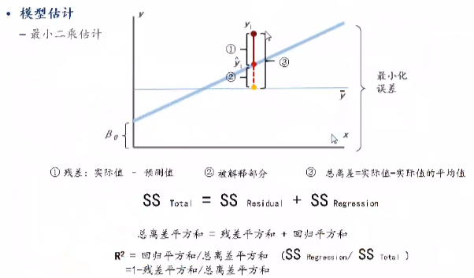
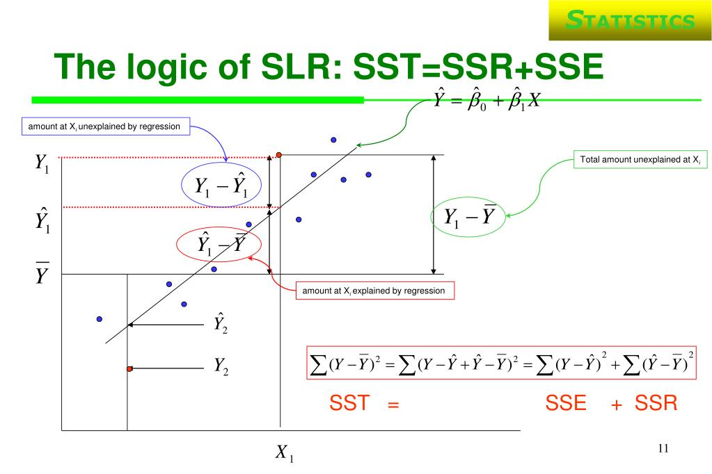

# 第七章使用统计学方法进行变量有效性测试

## 假设检验
如果想知道某市住宅价格增长率是否是7.4%,那么可以首先`假设`北京市住宅价格增长率为7.4%,设定`显著性水平`为0.05, `抽样`发现样本住宅价格增长率`均值为10%`, 经过统计学检验，发现检验的`p值小于0.05`,表明`差异10%-7.4%=2.6% 是显著的`，有理由`拒绝原假设`，即北京市住宅价格增长率不是7.4%.


### 假设检验的基本概念
1. 对总体分布或总体参数做出假设(原假设), 然后用样本信息判断原假设是否成立
2. 假设检验分为参数假设检验和非参数假设检验
3. 小概率事件: 如果A是小概率事件, 而A发生了, 那就不正常
4. 假设检验的基本思路:


### 假设检验的两类错误
小概率事件原理认为小概率事件在一次试验中是不可能发生的，但现实并非如此。例如，有人买彩票确实中了500万元。此时小概率事件原理说明的问题就不对了，这种情况称为“统计学所犯的错误”，主要有两类，如表7-1所示:


假设|接受H0|拒绝H0
--|--|--
H0为真|正确|$\alpha$型错误(1型)
H0为假|$\beta$型错误(2型)|正确


第一类错误(弃真错误):当原假设$H_0$为真时，拒绝原假设，犯第一类错误的概率为a，也称为“显著性水平”。
第二类错误(取伪错误):当原假设H0为假时，接受原假设，犯第二类错误的概率为B。
a型错误就是犯第一类统计错误的概率，虽然一般认为显著性越小越好，但是随着显著性的减小，犯第二类统计错误(B型错误)的概率会上升。如图7-4所示，H_0为原假设，H1为备择假设。a是阈值点X。以右、以$\mu_0$为均值的分布曲线下的面积。B是阈值点X, 以左、以$\mu_1$为均值的分布曲线下的面积。a取值越小，阈值越向右移，B值越大，因此不建议a取值过小。


注意事项如下。
(1)拒绝或无法拒绝假设，并不能说明该结论100%的正确。
(2)两类错误的概率相加并不一定等于1。
(3)在样本量不变的情况下，a与不能同时增大或同时减小。

参考: [statistic_假设检验的两类错误](/statistic_假设检验的两类错误/)


### 假设检验与区间估计的联系
- 描述统计
- 推断统计
    - 参数估计
        - 点估计
        - 区间估计(顺推法)
    - 假设检验(反证法)


`假设检验`和`区间估计`同属于统计方法中的`推断统计`。其中，假设检验和参数估计属于并列关系，区间估计属于参数估计的一种。假设检验与区间估计的相同点是，二者均是用通过样本得到的统计量对总体参数进行推断。假设检验与区间估计的不同点是，假设检验使用反证法，先对总体参数u提出假设，再通过样本检验假设是否成立:区间估计使用顺推法，总体参数u未知，通过样本估计u的置信区间。


### 假设检验的基本步骤

1. 提出原假设，确定业务需求。
2. 选择合适的检验统计量。
3. 确定显著性水平a。
4. 计算检验统计量。
5. 做出统计决策，接受或拒绝原假设。


假设检验的详细步骤如下:

1. 提出原假设，确定业务需求。在实际问题中，提出原假设与备择假设其他统计学教科书中会提出3种检验问题，建议仅掌握等种问题检验的方法即可。
- 检验是否有变化、有差异或无变化、无差异. 双边检测
    - H0:无变化、无差异 H0:$\mu=\mu_{0}$ 
    - H1:有变化、有差异 H1:$\mu \neq \mu_{0}$

- 检验是否好于、大于或是否不好于、不大于. 右侧检验
    - H0:不好于、不大于 H0: $\mu \leq \mu_{0}$
    - H1:好于、大于  H1:$\mu \gt \mu_{0}$

- 检验是否差于、小于或是否不差于、不小于. 左侧检验

    - H0:不差于、不小于 H0: $\mu \geq \mu_{0}$
    - H1:差于、小于 H1: $\mu \lt \mu_{0}$

2. 检验合适的统计量。选择统计量的方法与选择参数估计的方法相同，先考虑是大样本还是小样本，然后考虑总体方差已知还是未知(在实际工作中很难遇到已知方差的情况)。


3. 检验统计量的基本形式如下。
    - 总体方差已知: $Z = \frac{\overline{X}-\mu_{0}}{\sigma / \sqrt{n}}$
    - 总体方差未知: $t = \frac{\overline{x}-\mu_{0}}{S_{\overline{x}}}$

4. 确定显著性水平a。显著性水平a即原假设H0为真却拒绝原假设时的概率。a也被称为抽样分布的拒绝域，常用的取值有0.01、0.05等。

5. 计算检验统计量。把待检验的值代入统计量中进行计算。
6. 做出统计决策，接受或拒绝原假设。决策方法有3种: 
    - $\alpha$临界值法，该方法最常用
    - $p$值法，该方法最好用
    - 置信区间法, 该方法原理最简单, 也最好理解


### 配对t检验
主要用于同一个试验前后效果的比较, 或者同一个样本用两种方法得到的检验结果的比较. 把配对样本的差作为变量, 其中差值的总体均值为0, 且服从正态分布.
- 对同一个研究对象给与两种不同的处理结果
- 对同一个研究对象的试验前后效果进行比较

检验步骤如下:
1. 提出假设
    - 原假设$H_0: \mu=\mu_{1}=\mu_{2}$
    - 被选假设$H_1: \mu_{1} \neq \mu_{2}$

2. 建立检验统计量. 设两个总体$X$和$Y$都服从正态分布, 两个样本之差$d \sim N(\mu,\sigma^2)$


## 方差分析

### 单因素方差分析
研究信用卡消费是否受教育程度的影响.

数据的总变异可以分为组内变异($SS_E$)和组间变异($SS_M$). 组内变异是同类别下数据的离均差平方和, 代表同类别下数据的离均差平方和; 组间变异是组内均值与总均值的离均差平方和, 代表不同类别数据变异的程度. 组内变异和组间变异之和为总变异($SS_T$), 即$SS_T = SS_E + SS_M$ 公式推导如下: 


具体案例:
A组数据为3, 4, 5, 均值为4; B组数据为7, 8, 9, 均值为8. 则:
- 组内变异$SS_E = (3-4)^2 + (4-4)^2 + (5-4)^2 + (7-8)^2 + (8-8)^2 + (9-8)^2 = 4$
- 组间变异$SS_M = 3*(4-6)^2 + 3*(8-6)^2 = 24$
- 总变异$SS_T = (3-6)^2 + (4-6)^2 + (5-6)^2 + (7-6)^2 + (8-6)^2 + (9-6)^2 = 28$

组间变异表示类别间的数据差异, 组内变异表示类别内数据差异, 两者之和为总变异, 在总变异不变时, 组间差异变大, 组内差异就变小, 也就是说当各个类别差异较大时, 各类别内数据差异较小, 构造以下统计量进行量化:

$$
F = \frac{SS_M/(k-1)}{SS_E/(n-k)} \sim F(k-1, n-k)
$$

分子表示组间变异除以自由度, 分母表示组内变异除以自由度, 两者的比值服从自由度为$(k-1, n-k)$的$F$分布.

当$F$值越大时, 组间的变异越大, 越倾向于拒绝原假设, 即组间是有差异的.

```python
from statsmodels.formula.api import ols
from statsmodels.stats.anova import anova_lm
import pandas as pd

data = pd.read_csv('creditcard_exp.csv')
df = data[['Income','edu_class']].dropna(how='any',axis=0)
df['edu_class'] = df['edu_class'].astype('str')
df['Income'] = df['Income'].astype('float')

formula = f'Income ~ C(edu_class)'
anova = ols(formula=formula, data=df).fit()
anova_results = anova.summary()
print(anova_results)

'''
F值约为32.29,P值接近于, 所以拒绝原假设, 即教育程度会显著影响收入.
'''

```

### 多因素方差分析
单因素方差分析检测一个分类变量和一个连续变量之间的关系.  
多因素方差分析检验多个分类变量和一个连续变量之间的关系.
多因素方差分析中, 除了考虑多个分类变量对连续变量的影响外, 还应考虑分类型变量之间的交互效应.例, 在探讨信用卡消费与性别, 教育程度的关系时, 应考虑性别与教育程度的交互效应, 即教育程度对不同性别的信用卡消费人群的影响可能存在差异.

- 无交互效应: 因变量 = 原假设成立均值 + 自变量$\alpha$的变更效应 + 自变量$\tau$的变更效应 + 残差

    $$
    Y_{ij} = \mu + \alpha_i + \tau_i + \epsilon_{ij}
    $$

其中, $i$表示分类自变量$\alpha$的第$i$个水平, $j$表示分类自变量$\tau$的第$j$个水平.


- 有交互效应: 因变量 = 原假设成立均值 + 自变量$\alpha$的变更效应 + 自变量$\tau$的变更效应 + 交互效应 + 残差

    $$
    Y_{ij} = \mu + \alpha_i + \tau_j + \alpha_i * \tau_j + \epsilon_{ij}
    $$

其中, $i$表示分类自变量$\alpha$的第$i$个水平, $j$表示分类自变量$\tau$的第$j$个水平.


```python
from statsmodels.formula.api import ols
from statsmodels.stats.anova import anova_lm
import pandas as pd

data = pd.read_csv('creditcard_exp.csv')
df = data[['avg_exp','edu_class','gender']].dropna(how='any',axis=0)
df['edu_class'] = df['edu_class'].astype('str')
df['gender'] = df['gender'].astype('str')
df['avg_exp'] = df['avg_exp'].apply(lambda x: 0 if x==' ' else x)
df['avg_exp'] = df['avg_exp'].astype('float')

formula = f'avg_exp ~ C(edu_class) + C(gender) + C(edu_class)*C(gender)'

anova = ols(formula=formula, data=df).fit()
anova_results = anova.summary()
print(anova_results)
```

## 列联表分析和卡方检验
看之前总结的笔记


## 线性回归
Pearson相关系数衡量两个连续变量相关性强弱, 线性回归算法分析一个连续变量对另外一个连续变量的影响. 方差分析自变量为分类变量, 因变量为连续变量.


### 简单线性回归
$$
Y=\beta_0 + \beta_1X_1+\epsilon
$$

其中, $Y$表示因变量, $\beta_0$表示截距, $\beta_1$表示回归系数, $X_1$表示自变量, $\epsilon$表示残差, 其服从均值为0的正态分布.

原理是拟合一条直线, 使得实际值与预测值之差的平方和最小. 实际值和预测值之差被称为残差, 线性回归旨在使残差平方和最小, 即:
$$
min\sum \epsilon_i^2 = min \sum(y_i - \hat{y}_i)^2
$$

### SSR, SSE, SST
本节参考[sst-ssr-sse](https://www.statology.org/sst-ssr-sse/)


$\hat{y}$表示线性回归的预测值, $y_i$表示实际值.

Sum of Squares Total(SST): 实际值和平均值之间的误差平方和

$SST = \sum(y_i-\overline{y})^2$

Sum of Squares Regression (SSR): 回归预测值和平均值之间的误差平方和

$SSR = \sum(\hat{y}_i-\overline{y})^2$

Sum of Squares Error (SSE) : 回归预测值和真实值之间的残差平方和

$SSR = \sum(\hat{y}_i-y)^2$

$SST = SSR + SSE$

$R^2= \frac{SSR}{SST} = 1- \frac{SSE}{SST}$







对回归系数进行检验, 即回归系数是否为0:
原假设: 简单线性回归模型拟合得没有基线模型好, $\beta_1=0$
备选假设: 简单线性回归模型拟合得比基线模型好, $\beta_1 \neq 0$
检验统计量为:
$$
t=\frac{\hat{\beta}_1}{S_{\hat{\beta}_1}}
$$

即系数估计值除以估计值的方差, 服从自由度为$t-2$的$t$分布.


在多元线性回归中, 除检验单个系数是否为0外, 还需要检验回归系数是否全部为0.
原假设: 回归系数全部为0, 即$\beta_1=\beta_2=...=0$
备选假设: 回归系数不都为0.
检验的统计量为:
$$
F=\frac{MS_M}{MS_E}
$$

$MS_M$表示可解释的变异, $MS_E$表示不可解释的变异.

## 多元线性回归


