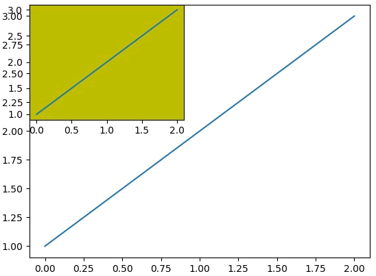

# subplot

`fig.add_subplot`仅仅返回指定位置的1个坐标系(axes), 不同于`fig.subplots`同时返回多个坐标系(axes)


## 参数
`fig.add_subplot(nrows, ncols, index)`

nrows 与 ncols 表示要划分几行几列的子区域（nrows*nclos表示子图数量），index 的初始值为1，用来选定具体的某个子区域。
例如： add_subplot(233)表示在当前画布的右上角创建一个两行三列的绘图区域（如下图所示），同时，选择在第 3 个位置绘制子图。
需要注意的是, 其他没有选择的区域并没有绘制任何图形
![1.png]


## 返回
`fig.add_subplot`仅仅返回指定位置的1个坐标系(axes)


## 应用

```python
import matplotlib.pyplot as plt
fig = plt.figure()
ax1 = fig.add_subplot(111)
ax1.plot([1,2,3])
ax2 = fig.add_subplot(221, facecolor='y')  # 覆盖第一次绘画的区域
ax2.plot([1,2,3])
```



参考:
https://matplotlib.org/stable/api/figure_api.html#matplotlib.figure.Figure.add_subplot
http://m.biancheng.net/matplotlib/subplot.html