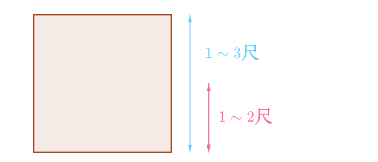
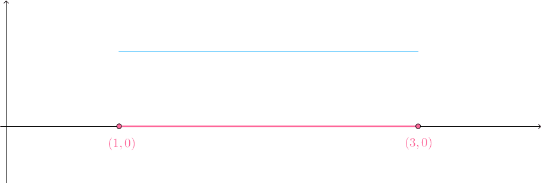
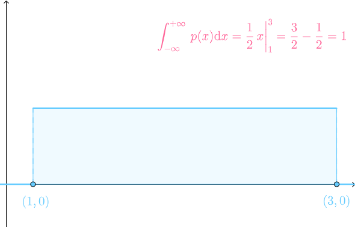
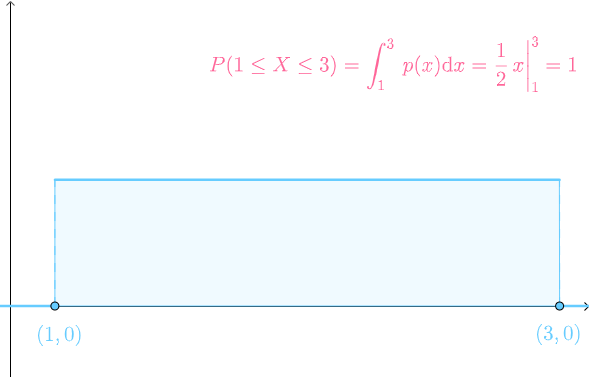
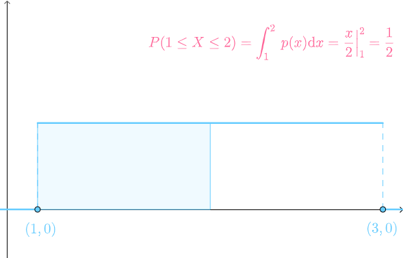
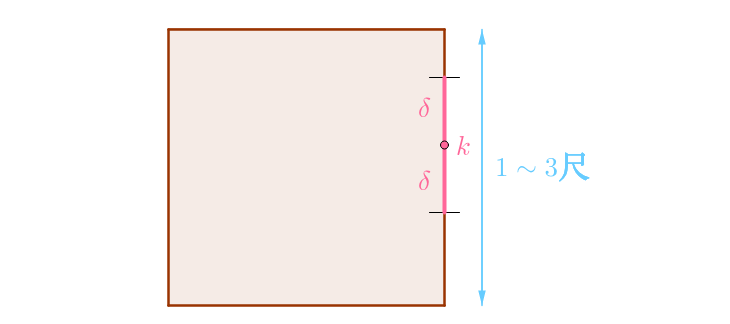
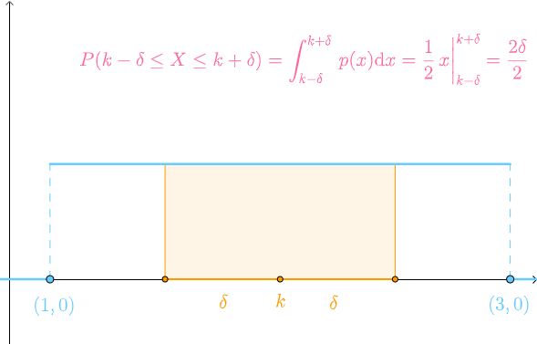
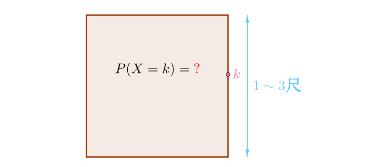

# 连续_概率密度函数

有一家原木加工厂，它会把木头切成不同的木方，木方的截面都是正方形，边长会在$1\sim3$尺之间随机浮动：

那么根据古典概率，正方形边长在$1\sim2$尺之间的概率为多少？
这个问题在古典概率是这么回答的，因为没有办法判断哪一种边长更容易出现，那么就应该给予它们相同的概率，也就是说$1\sim3$之间每一种长度都是等可能的。而$1\sim2$包含了一半的可能长度：

所以正方形边长在$1\sim2$尺之间的概率为：
$$
\frac{2-1}{3-1}=\frac{1}{2}
$$

下面看看怎么用随机变量来表示这个问题吧。首先假设随机变量为：
$$
X=生产出来的正方形边长
$$
很显然这是一个连续的随机变量：
$$
1\le X\le 3
$$
正方形边长在$1\sim2$尺之间的概率可以表示为：
$$
P(1\le X\le 2)=\frac{1}{2}
$$

## 平均分配
首先根据概率的三大公理，样本空间即$\Omega=\{1\le X\le 3\}$的概率必然为1，即：
$$
P(1\le X\le 3)=1
$$
然后，可以用一个区间来表示$1\le X\le 3$这个连续的随机变量：

又古典派假设生产长度为$1\sim 3$的木方是等可能性的，所以让我们把概率1均匀地分配给$1\le X\le 3$这个区间：

可以用除法来表示这种平均分配, 其中分子是必为1的概率之和, 分母是长度:
$$
\frac{1}{3-1}=\frac{1}{2}
$$
根据上述思考，最终得到下面这个函数：
$$
p(x)=
\begin{cases}
    \frac{1}{2}, &1 \le x \le 3\\
    0, & 其它
\end{cases}
$$
此函数的图像如下：

## 密度
对于一根均匀材质的棍子，长度重量分别为：它的密度定义为单位长度的质量，也就是把质量平均分配给这根棍子：
$$
密度=\frac{重量}{长度}=\frac{m}{l}
$$
刚才对概率1进行了平均分配，所以也可以类比为：
$$
概率密度=\frac{概率1}{随机变量X的长度}
$$

## 概率密度函数
因此在数学上沿用物理的名词，p(x)也称为概率密度函数，严格定义如下：

> 如果函数p(x)满足下列两个条件（对应了概率的三大公理）：
非负性：
$$
p(x) \ge 0
$$
规范性（暗含了可加性），因为是连续的，所以通过积分相加：
$$
\int_{-\infty}^{+\infty}p(x)\mathrm{d}x=1
$$
则称其为`概率密度函数`（Probability Density Function，简写为PDF）。

我们验算下刚才得到的p(x)：
$$
p(x)=
\begin{cases}
    \frac{1}{2}, &1 \le x \le 3\\
    0, & 其它
\end{cases}
$$
很显然非负性是没有问题的：
$$
p(x) \ge 0
$$
其次规范性（可加性，或者称为可积性）也是满足的（积分的意义是曲线下面积）：

所以p(x)是`概率密度函数`。

注意和离散中的概率质量函数(PMF)来区分, 在概率质量函数中对应的值就是概率本身, 而概率密度函数是**质量/长度**是概率的密度, 需要乘以随机变量$X$才能表示概率, 参考[概率质量函数](/probability_离散_概率质量函数/)

## 验算
下面要验算刚才得到的概率密度函数p(x)：
$$
p(x)=
\begin{cases}
    \frac{1}{2}, &1 \le x \le 3\\
    0, & 其它
\end{cases}
$$
是否可以用于计算锯木方问题的概率。验算的方法是，比较按照古典派计算出来的结果与概率密度函数计算出来的结果是否一致。

### 验算1
根据古典派，生产出来的木方必然在$1\sim 3$尺之间；而通过p(x)的话，就是要把[1,3]区间内的所有概率加起来，因为是连续变量所以要通过积分加起来，根据微积分的几何意义，所得的就是p(x)曲线下[1,3]之间的面积：

验算通过.

### 验算2
根据题意，不可能生产出1尺以下，3尺以上的正方形木方；而通过p(x)计算得到的结果为:
$$
P(X < 1)=\int_{-\infty}^{1}p(x)\mathrm{d}x=0
$$
$$
P(X > 3)=\int_{3}^{+\infty}p(x)\mathrm{d}x=0
$$
验算通过。

### 验算3
根据古典派，生产出木方在￥1\sim 2￥尺之间的概率为：
$$
\frac{2-1}{3-1}=\frac{1}{2}
$$
而通过p(x)计算得到的结果为：

验算通过

### 验算4
生产出木方长度为$(k-\delta,k+\delta)$点，即：

根据古典派，此概率为：
$$
\frac{(k+\delta)-(k-\delta)}{3-1}=\frac{2\delta}{2}
$$
而通过p(x)计算得到的结果为：

验算通过.

## 单点概率
边长为k时概率为多少：

### 点的长度
根据古典派，这点的概率应该为：
$$
\frac{k点的长度}{3-1}
$$
但是一个点的长度是多少？在数学中，一个点的长度是没有定义的（注意是没有定义，而非长度为0），所以这一条路走不通。
### 通过极限求出单点的概率
可以考虑极限，先计算k点附近线段的概率：

这个概率刚才也通过古典派算过了：
$$
\frac{(k+\delta)-(k-\delta)}{3-1}=\frac{2\delta}{2}
$$
当$\delta\to 0$时：

通过极限求出此点的概率为：
$$
\lim_{\delta \to 0}\frac{2\delta}{2}=0
$$
通过p(x)算出来概率也是0：
$$
P(X=k)=\int_{k}^{k}p(x)\mathrm{d}x=0
$$
虽然很古怪，但是连续型随机变量的单点概率确实为0。

### 概率为0
锯木厂生产的木方边长在1\sim 3之间变动，生产出其中某一个特定边长k的木方的概率：
$$
P(X=k)=0
$$
明明这个边长的木方是有可能生产出来的，怎么概率为0呢？这实在很反直觉，下面让我们尝试重建正确的直觉。

#### 如果概率不为0
假如生产出其中某一个特定边长k的木方的概率不为0，为非常非常小的数字：
$$
P(X=k)=1\times 10^{-1000}
$$
但是不管多小，要知道1\sim 3之间有无穷多个类似的点，这些点的概率相加必然会无穷大，违背了概率的规范性公理。

#### 抓球实验
想象你面前有刻着$0、1、2、\cdots、9$这十个数字的小球：

通过这十个小球来玩抓数字游戏，比如说想抓出：
$$
\pi = 3.1415926\cdots
$$
那么第一次得抓到3，这是\frac{1}{10}的概率；放回小球之后，第二次得抓到1，这也是\frac{1}{10}的概率。无限重复下去，所以抓到\pi的概率可以如此计算：
$$
\frac{1}{10}\times \frac{1}{10}\times\frac{1}{10}\times\cdots=\lim_{n\to \infty}\left(\frac{1}{10}\right)^n=0
$$
生产出特定长度为k的木方，相当于玩抓小球游戏要求抓出特定的数字k，所以概率确实为0。

#### 概率为0并非不可能事件

之前已经得出过结论，对于不可能事件$\phi$，它发生的概率为：
$$
\phi是不可能事件\implies P(\phi)=0
$$
这并非一定充要条件，假如事件A的概率为0，不能反过来说它是不可能事件，只能说几乎不可能发生：
$$
A是不可能事件\mathrel{\rlap{\hskip .5em/}}\Longleftarrow P(A)=0
$$
同样的道理，假如事件B的概率为1，也是几乎必然发生的事件：
$$
B是必然事件\mathrel{\rlap{\hskip .5em/}}\Longleftarrow P(B)=1
$$

参考:
马同学