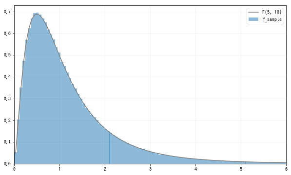
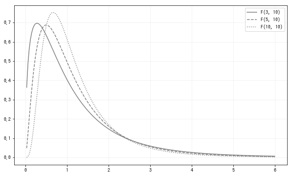

# 连续_F分布

F分布(F distribution)是用于方差分析的概率分布, F分布由两个独立的卡方分布定义:
$$
概率变量Y_1,Y_2相互独立, Y_1 \sim \chi^2(n_1), Y_2 \sim \chi^2(n_2), 则: \\
F = \frac{Y_1/n_1}{Y_2/n_2} \\
的概率分布被称为自由度为n_1,n_2的F分布F(n_1,n_2)
$$
记自由度为$n_1,n_2$的F分布为$F(n_1,n_2)$.F分布的可取值为0以上的实数.
下面用两个卡方分布构造F分布, 这里取$Y_1 \sim \chi^2(5), Y_2 \sim \chi^2(10)$, 从$\frac{Y_1/5}{Y_2/10}$中随机抽取样本数据:
```python
n1 = 5
n2 = 10
rv1 = stats.chi2(n1)
rv2 = stats.chi2(n2)

sample_size = int(1e6)
sample1 = rv1.rvs(sample_size)
sample2 = rv2.rvs(sample_size)

f_sample = (sample1/n1) / (sample2/n2)
```
依据定义, $\frac{Y_1/5}{Y_2/10}$应该服从$F(5,10)$分布. `scipy.stats`可以用f函数生成F分布, 第1个参数和第2个参数分别指定自由度为$n_1和n_2$. 利用$\frac{Y_1/5}{Y_2/10}$随机抽取的样本数据做直方图, 同时与F(5,10)的密度函数图像进行对比:
```python
fig = plt.figure(figsize=(10, 6))
ax = fig.add_subplot(111)

rv = stats.f(n1, n2)
xs = np.linspace(0, 6, 200)[1:]
ax.hist(f_sample, bins=100, range=(0, 6),
        density=True, alpha=0.5, label='f_sample')
ax.plot(xs, rv.pdf(xs), label=f'F({n1}, {n2})', color='gray')

ax.legend()
ax.set_xlim(0, 6)
plt.show()
```

通过观察可以确认$\frac{Y_1/5}{Y_2/10}$为F(5,10)分布.
接下来看一下F分布随自由度$n_1,n_2$的变化情况. 将$n_2$固定为10, 让$n_1$在3,5,10中进行变化:
```python
fig = plt.figure(figsize=(10, 6))
ax = fig.add_subplot(111)

xs = np.linspace(0, 6, 200)[1:]
for n1, ls in zip([3, 5, 10], linestyles):
    rv = stats.f(n1, 10)
    ax.plot(xs, rv.pdf(xs),
            label=f'F({n1}, 10)', ls=ls, color='gray')
    
ax.legend()
plt.show()
```


F分布的特征有以下2个:
1. 左右分布不对称, 向右偏斜
2. 分布的峰值接近1


## 总结
标签|描述
--|--
参数|$n_1,n_2$
可取值|非负实数
`scipy.stats`|$f(n_1,n_2)$


参考:
