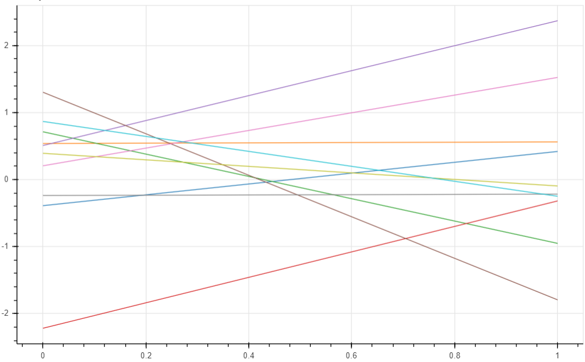
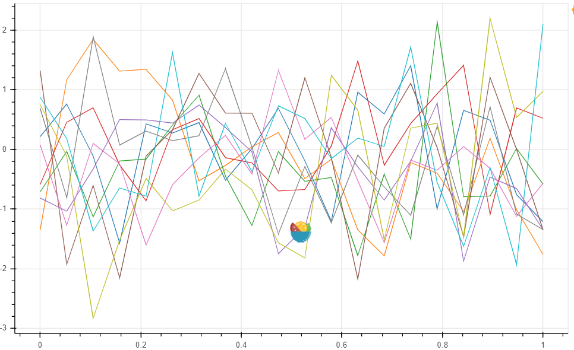
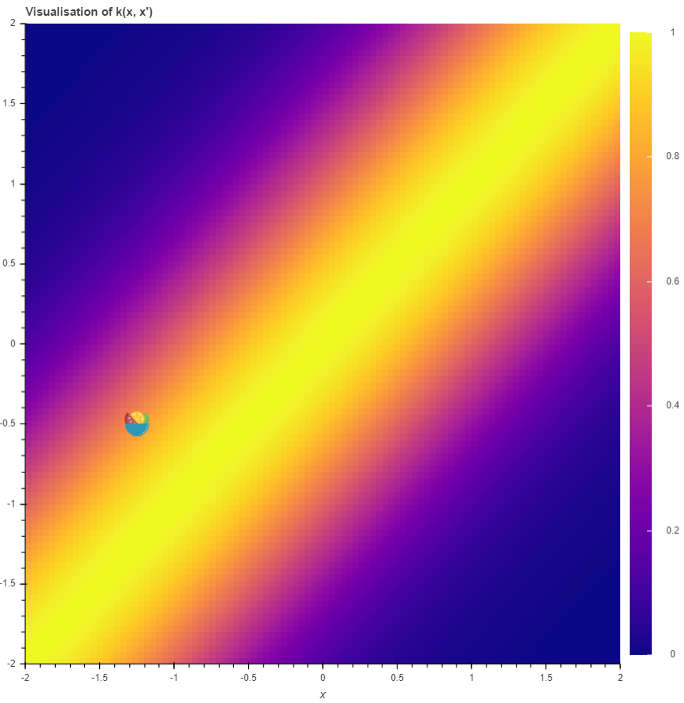
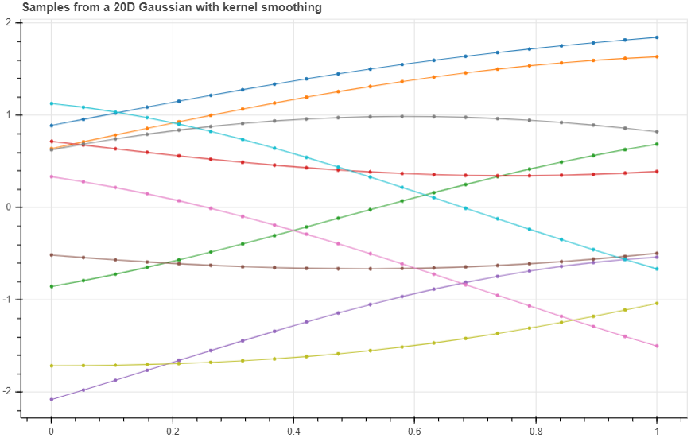
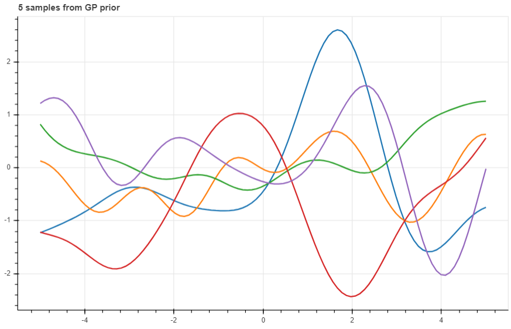
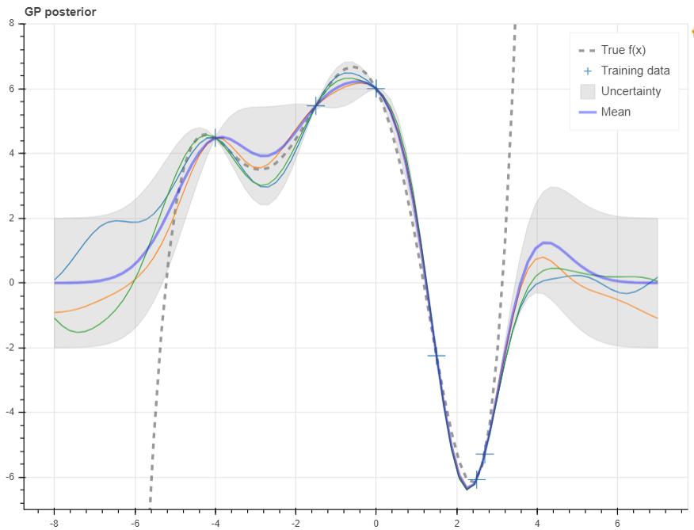

# processes

1. 假设我们需要求一个hidden function $f:\mathbb{R}\rightarrow\mathbb{R}$
2. 我们有 $\mathbf{x}=[x_ 1, \ldots, x_N]^T, \mathbf{y}=[y_ 1, \ldots, y_N]^T$ 且 $y_i = f(x_i)$
3. 我们希望使用 $f$预测未被观测到的 $\mathbf{x}_*$

假设一个2D的Gaussian:
$$
\begin{pmatrix} y_0 \\ y_1 \end{pmatrix} 
\sim\mathcal{N}
\left(\begin{pmatrix} 0\\ 0 \end{pmatrix}, \begin{pmatrix} 1 & 0 \\ 0 & 1 \end{pmatrix}\right)
$$
正常情况下, 我们可以做成3D的probability density钟图. 这里我们选择两个值, $x=0$ 和 $x=1$, 然后采样10次, 并做出线图.
```python
def plot_unit_gaussian_samples(D):
    p = figure(plot_width=800, plot_height=500,
               title='Samples from a unit {}D Gaussian'.format(D))

    xs = np.linspace(0, 1, D)
    for color in Category10[10]:
        ys = np.random.multivariate_normal(np.zeros(D), np.eye(D))
        p.line(xs, ys, line_width=1, color=color)
    return p

show(plot_unit_gaussian_samples(2))
```


如果升级到20D,则
```python
show(plot_unit_gaussian_samples(20))
```

如上图, 我们这在$x=0,0.1,0.2,...,2$分别根据高斯分布取值.

multivariate Gaussian 有两个参数, 分别是mean and covariance matrix. 
- 如果我们改变mean, 则会改变整体的走势(图中直线会整体上下移动). 但是仍然解决不了波动的的问题. 所以我们设置GP的mean为0, 因为这样足以估算函数.

- 如果两个点靠的比较近, 那么我们期望他们的值也是相近的. 相邻的随机变量在依据joint distribution采样时有相似的值(比如, high covariance). 这些点的covariance在Gaussian中的covariance matrix定义, 假设我们有$N$ dimensional Gaussian 模型$y_0,...,y_N$, covariance matrix $\sum$ 是 $N * N$, 它的$(i,j)$-th元素是$\sum_{ij}=cov(y_i,y_j)$.


## Smoothing with Kernels
使用squared exponential kernel 作为 covariance function:
$$ \kappa(x, x')=\exp\left(-~\frac{(x-x')^2}{2}\right) $$

当$x = x'$时结果为1, 而当$x 与 x'$距离变大时趋近于1
```python
def k(xs, ys, sigma=1, l=1):
    """Sqared Exponential kernel as above but designed to return the whole
    covariance matrix - i.e. the pairwise covariance of the vectors xs & ys.
    Also with two parameters which are discussed at the end."""

    # Pairwise difference matrix.
    dx = np.expand_dims(xs, 1) - np.expand_dims(ys, 0)
    return (sigma ** 2) * np.exp(-((dx / l) ** 2) / 2)

def m(x):
    """The mean function. As discussed, we can let the mean always be zero."""
    return np.zeros_like(x)
```
画图:
```python
N = 100
x = np.linspace(-2, 2, N)
y = np.linspace(-2, 2, N)
d = k(x, y)

color_mapper = LinearColorMapper(palette="Plasma256", low=0, high=1)

p = figure(plot_width=400, plot_height=400, x_range=(-2, 2), y_range=(-2, 2),
           title='Visualisation of k(x, x\')', x_axis_label='x',
           y_axis_label='x\'', toolbar_location=None)
p.image(image=[d], color_mapper=color_mapper, x=-2, y=-2, dw=4, dh=4)

color_bar = ColorBar(color_mapper=color_mapper, ticker=BasicTicker(),
                     label_standoff=12, border_line_color=None, location=(0,0))

p.add_layout(color_bar, 'right')

show(p)
```



假设有两个随机变量$y_i,y_j$,在$x_i,x_j$ 有 $\text{cov}(y_i, y_j)=\kappa(x_i, x_j)$(既离得越近就有更高的covariance)

使用kernel function, 计算`k(xs, xs)`可以获得`ys`. 现在我们试着画之前的10个样本的20D Gaussian, 但这次我们使用计算出来的covariance matrix.

```python
p = figure(plot_width=800, plot_height=500)
D = 20
xs = np.linspace(0, 1, D)
for color in Category10[10]:
    ys = np.random.multivariate_normal(m(xs), k(xs, xs))
    p.circle(xs, ys, size=3, color=color)
    p.line(xs, ys, line_width=1, color=color)

show(p)
```



似乎有点规律可寻了


扩大输入的维度
```python
n = 100
xs = np.linspace(-5, 5, n)
K = k(xs, xs)
mu = m(xs)

p = figure(plot_width=800, plot_height=500)

for color in Category10[5]:
    ys = np.random.multivariate_normal(mu, K)
    p.line(xs, ys, line_width=2, color=color)
show(p)

```



## Making Predictions using the Prior & Observations
现在我们已经通过functions来获得一个distribution, 那么如何训练数据来获得hidden function呢.

首先, 我们需要training data.

### Target Function $f$
我们选用5次多项式:
$$f(x)=0.03 x^5 + 0.2 x^4 - 0.1 x^3 - 2.4 x^2 - 2.5 x + 6$$

```python
## coefs[i] is the coefficient of x^i
coefs = [6, -2.5, -2.4, -0.1, 0.2, 0.03]

def f(x):
    total = 0
    for exp, coef in enumerate(coefs):
        total += coef * (x ** exp)
    return total

xs = np.linspace(-5.0, 3.5, 100)
ys = f(xs)

p = figure(plot_width=800, plot_height=400, x_axis_label='x',
           y_axis_label='f(x)', title='The hidden function f(x)')
p.line(xs, ys, line_width=2)
show(p)
```


### Getting into the Maths
到目前我们使用multivariate normal来获得$p(y|x)$:
$$p(\mathbf{y}\vert\mathbf{x})=\mathcal{N}(\mathbf{y}\vert m(\mathbf{x}),\mathbf{K})$$ 
其中 $\mathbf{K}=\kappa(\mathbf{x}, \mathbf{x})$, $m(\mathbf{x})=\mathbf{0}$这是prior distribution.

我们有一些训练数据$x$, 和 $\mathbf{y}=f(\mathbf{x})$. 我们现在又一些新的数据$x_*$, 我们希望预测$\mathbf{y}_*=f(\mathbf{x}_*)$
```python
x_obs = np.array([-4, -1.5, 0, 1.5, 2.5, 2.7])
y_obs = f(x_obs)

x_s = np.linspace(-8, 7, 80)
```

根据GP的定义, 我们有

$$
\begin{pmatrix}\mathbf{y} \\ \mathbf{y}_*\end{pmatrix} \sim\mathcal{N}\left(\begin{pmatrix}m(\mathbf{x})\\ m(\mathbf{x}_*)\end{pmatrix}, \begin{pmatrix}\mathbf{K} & \mathbf{K}_* \\ \mathbf{K}_*^T & \mathbf{K}_{**}\end{pmatrix}\right)
$$
其中$\mathbf{K}=\kappa(\mathbf{x}, \mathbf{x})$, $\mathbf{K}_* = \kappa(\mathbf{x}, \mathbf{x}_*)$, $\mathbf{K}_{**}=\kappa(\mathbf{x}_*, \mathbf{x}_*)$

但是这其实计算的是$p(\mathbf{y}, \mathbf{y}_*\vert \mathbf{x}, \mathbf{x}_*)$, 而我们希望的是$\mathbf{y}_*$.

### Conditioning Multivariate Gaussians
如果我们有$y$和$y_*$的joint distribution, 根据这个[公式](https://en.wikipedia.org/wiki/Multivariate_normal_distribution#Conditional_distributions)我们可得:
$$
\begin{align}
p(\mathbf{y}_*\vert \mathbf{x}_*, \mathbf{x}, \mathbf{y})&=\mathcal{N}(\mathbf{y}_*\vert \mu_*, \Sigma_*)\\
\mu_*&=m(\mathbf{x}_*)+\mathbf{K}_*^T\mathbf{K}^{-1}(\mathbf{y}-m(\mathbf{x}))\\
\Sigma_*&=\mathbf{K}_{**}-\mathbf{K}_*^T\mathbf{K}^{-1}\mathbf{K}_*
\end{align}
$$

```python
K = k(x_obs, x_obs)
K_s = k(x_obs, x_s)
K_ss = k(x_s, x_s)

K_sTKinv = np.matmul(K_s.T, np.linalg.pinv(K))

mu_s = m(x_s) + np.matmul(K_sTKinv, y_obs - m(x_obs))
Sigma_s = K_ss - np.matmul(K_sTKinv, K_s)
```

这里我们画出±2 standard deviations的预测值

```python
p = figure(plot_width=800, plot_height=600, y_range=(-7, 8))

y_true = f(x_s)
p.line(x_s, y_true, line_width=3, color='black', alpha=0.4,
       line_dash='dashed', legend='True f(x)')

p.cross(x_obs, y_obs, size=20, legend='Training data')

stds = np.sqrt(Sigma_s.diagonal())
err_xs = np.concatenate((x_s, np.flip(x_s, 0)))
err_ys = np.concatenate((mu_s + 2 * stds, np.flip(mu_s - 2 * stds, 0)))
p.patch(err_xs, err_ys, alpha=0.2, line_width=0, color='grey',
        legend='Uncertainty')

for color in Category10[3]:
    y_s = np.random.multivariate_normal(mu_s, Sigma_s)
    p.line(x_s, y_s, line_width=1, color=color)

p.line(x_s, mu_s, line_width=3, color='blue', alpha=0.4, legend='Mean')
show(p)

```


参考:
http://bridg.land/posts/gaussian-processes-1
https://www.pianshen.com/article/2919365756/
https://www.jiqizhixin.com/articles/2019-02-12-3
http://katbailey.github.io/post/gaussian-processes-for-dummies/

