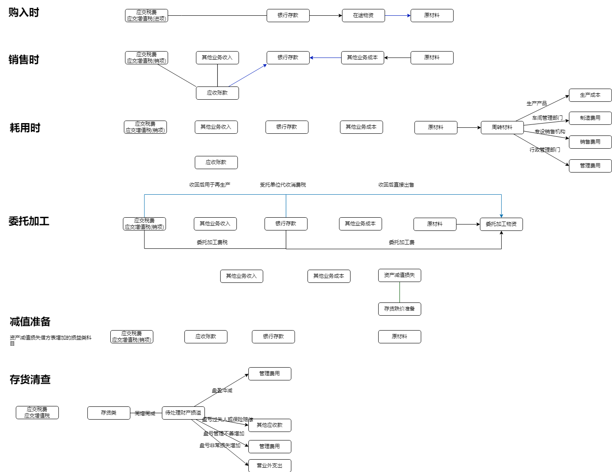
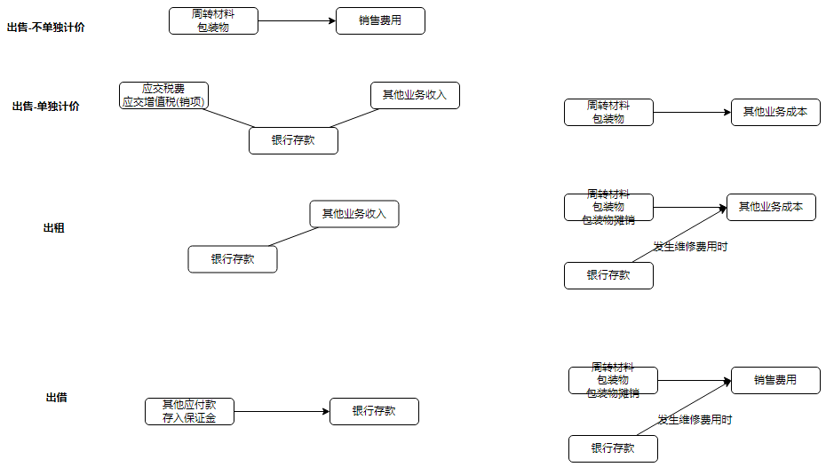
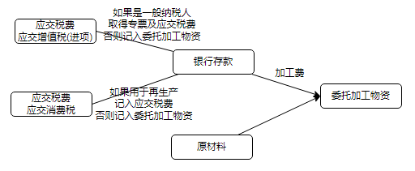
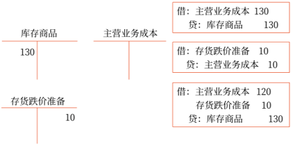

# 流动资产_存货

## 存货采购成本

存货的采购成本，包括购买价款、相关税费、运输费、装卸费、保险费、仓储费、包装费、运输途中的合理损耗、入库前的挑选整理费用
### 存货采购成本
小规模纳税人, 进项税不能抵扣, 要记入成本

24.某企业为增值税`小规模纳税人`，本月购入甲材料2060千克，每千克不含税单价50元，增值税专用发票上注明的增值税税额为13390元，另外支付运杂费及保险费共计3500元，运输途中发生合理损耗60千克，入库前发生挑选整理费用620元。另支付甲材料的包装物押金3000元。该批材料入库的实际单位成本为（　　）元。
A.50
B.51.81
C.52
D.60.255
【答案】D
【解析】小规模纳税人取得的增值税专用发票上注明的增值税，一律不予抵扣，应计入原材料成本中，该企业甲材料的入账价值=2060×50+13390+3500+620=120510（元），材料应按照实际数量入库，实际单位成本=120510÷（2060-60）=60.255（元）。

16.下列各项与存货相关的费用中，应计入存货成本的有（　　）。
A.材料采购过程中支付的保险费和装卸费用
B.材料入库后发生的不属于为达到下一生产阶段所必需的储存费用
C.材料入库前发生的挑选整理费
D.运输途中的合理损耗
【答案】ACD
【解析】材料入库后发生的储存费用若不属于为达到下一生产阶段必需的费用，应计入管理费用。

25.存货的可变现净值是指在日常活动中，存货的估计售价减去至完工时估计将要发生的成本、估计的销售费用及估计的相关税费后的金额。（　　）
【答案】√

## 发出存货的计价方法

1. 个别计价法
2. 先进先出法, 计算同个别计价, 多了一个排序的工作
    在物价持续上升时，期末存货成本接近于市价，而发出成本偏低，会高估企业当期利润和库存存货价值
3. 月末一次加权平均法: 以月为单位, 使用总价/数量计算平均价
4. 移动平均法

### 先进先出法
某企业存货按实际成本计价，采用先进先出法计算发出成本。2021年3月，M存货的期初结存数量300件，单价10元；3月5日购入200件，单价12元；3月11日销售400件；3月20日购入100件，单价14元。不考虑其他因素，2021年3月31日该企业M存货的期末结存成本为（　　）元。（2022年·2分）
A.2400
B.2000
C.2800
D.2600
【答案】D
【解析】2021年3月31日该企业M存货的期末结存成本=［200-（400-300）］×12+100×14=2600（元）。

13.月末一次加权平均法只在月末计算加权平均单价，可以简化成本计算工作。但由于月末一次计算加权平均单价和发出存货成本，不便于存货成本的日常管理与控制。（　　）
【答案】√

### 月末一次加权平均法

27.某企业采用月末一次加权平均法核算发出材料成本。2022年6月1日结存乙材料200件、单位成本35元，6月10日购入乙材料400件、单位成本40元，6月20日购入乙材料400件、单位成本45元。当月发出乙材料600件。不考虑其他因素，该企业6月份发出乙材料的成本为（　　）元。
A.24600
B.25000
C.26000
D.23000
【答案】A
【解析】该企业6月份发出乙材料的成本=（200×35+400×40+400×45）÷（200+400+400）×600=24600（元）。

### 移动加权平均法

## 材料成本差异
`原材料`和`材料成本差异`一起构成了原材料的成本, `材料成本差异`来调节`原材料`

科目:
`原材料`: 资产类, 核算材料`计划成本`
`材料采购`: 资产类, 核算材料`实际成本`
`材料成本差异`: 资产类, 核算材料实际成本与计划成本的差额, 实际小于计划, 节约了成本, 是收益, 记贷方. 反之记借方.

其他:
五个个常见账户，账户性质为贷方记“好事”，借方记“坏事”：
1. 待处理财产损溢(资产)
2. 材料成本差异(资产)
3. 公允价值变动损益(损益)
4. 投资收益(损益)
4. 固定资产清理(资产)

### 材料成本差异

20.下列各项中，应在“材料成本差异”科目借方登记的有（　　）。
A.购进材料实际成本小于计划成本的差额
B.发出材料应负担的超支差异
C.发出材料应负担的节约差异
D.购进材料实际成本大于计划成本的差额
【答案】CD
【解析】“材料成本差异”科目借方登记超支差异（实际成本＞计划成本）及发出材料应负担的节约差异，贷方登记节约差异（实际成本＜计划成本）及发出材料应负担的超支差异。选项AB登记在“材料成本差异”科目的贷方。

30.某企业材料采用计划成本核算。月初结存材料计划成本为200万元，材料成本差异为节约差20万元，当月购入材料一批，实际成本为135万元，计划成本为150万元，领用材料的计划成本为180万元。当月结存材料的实际成本为（　　）万元。
A.153
B.162
C.170
D.187
【答案】A
【解析】本月材料成本差异率=（-20+135-150）÷（200+150）×100%=-10%。方法1：当月结存材料的实际成本=（200+150-180）×（1-10%）=153（万元）。方法2：领用原材料的实际成本=180×（1-10%）=162（万元），当月结存材料的实际成本=期初结存材料实际成本+本期购入材料实际成本-本期发出材料实际成本=200-20+135-162=153（万元）。

关键是实际和计划的比值
计划成本: 200 + 150 = 350元
实际成本: 180 + 135 = 315元
实际成本 = (350-180)* 315/360

## 包装物
企业的周转材料包括包装物和低值易耗品
- `作为产品组成部分`的包装物, 记`生产成本`, 比如糖果
- `随同商品出售而不单独计价`的包装物, 记`销售费用`
- `随同商品出售单独计价`的包装物, 记`其他业务收入`和`其他业务成本`
- `出租`, 收租金, 租金记`其他业务收入`, 成本和摊销记`其他业务成本`
- `出借`, 收押金, 押金记`其他应收款`, 摊销记`销售费用`

科目:

账务:

1. 出租是营业外收入, 出借是销售费用

### 包装物
21.下列各项中，关于包装物的会计处理表述正确的有（　　）。
A.随同商品出售不单独计价的包装物，按实际成本计入其他业务成本
B.随同商品出售单独计价的包装物，按实际成本计入销售费用
C.出租的包装物发生的修理费用，按实际支出计入其他业务成本
D.出借包装物摊销时的实际成本应计入销售费用
【答案】CD
【解析】选项A错误，随同商品出售不单独计价的包装物，按实际成本计入销售费用；选项B错误，随同商品出售单独计价的包装物，按实际成本计入其他业务成本。

## 委托加工物资

科目:
委托加工物资, 资产类
账目:

企业委托外单位加工物资的成本包括：
（1）加工中实际耗用物资的成本；
（2）支付的加工费用及应负担的运杂费等；
（3）支付的税费，包括委托加工物资收回后直接出售的应税消费品应负担的消费税等。

增值税:
`一般纳税人`，取得`增值税专用发票`, 记入`应交税费——应交增值税（进项税额）`科目借方
`小规模纳税人`或者`一般纳税人未取得增值税专用发票`, 记入`委托加工物资`科目借方
消费税:
收回后`用于直接销售`,	记入`委托加工物资`科目借方
收回后`用于生产应税消费品`, 	记入`应交税费——应交消费税`科目借方 

### 委托加工物资
34.甲、乙公司均为增值税一般纳税人。甲公司委托乙公司加工一批收回后用于`连续生产`应税消费品的半成品。甲公司发出原材料的实际成本为200万元，支付加工费10万元、增值税1.3万元以及消费税20万元（乙公司代收代缴），以上款项均以银行存款支付。不考虑其他因素，甲公司收回该半成品的入账价值为（　　）万元。
A.210
B.220
C.221.3
D.231.3
【答案】A
【解析】委托加工物资收回后用于连续生产应税消费品的，受托方代收代缴的消费税应当记入“应交税费—应交消费税”科目的借方，不计入委托加工物资的成本。因此收回该半成品的入账价值=200+10=210（万元），选项A正确。

25.甲企业委托乙企业加工一批物资，发出原材料的实际成本为100万元，支付运杂费3万元、加工费2万元（均不考虑增值税）。乙企业代收代缴消费税8万元，该物资收回后用于直接出售。不考虑其他税费，下列各项中，关于甲企业委托加工物资会计处理结果表述正确的有（　　）。
A.支付的运杂费3万元应计入委托加工物资成本
B.乙企业代收代缴的消费税8万元应计入委托加工物资成本
C.乙企业代收代缴的消费税8万元应借记“应交税费—应交消费税”科目
D.委托加工物资成本为113万元
【答案】ABD
【解析】甲企业委托加工物资的账务处理为：
借：委托加工物资　　 ［100+3+2+8］113
　贷：原材料　　　　　　 　　　　　 100
　　　银行存款等　　　　　　　　　   13

## 库存商品的核算
库存商品具体包括库存产成品、外购商品

1. 毛利率法
销售出去的成本 = 销售额 x (1-毛利率)
现存 = 已有库存 + 进货量 - 销售出去的库存

2. 售价金额核算法
进销比 = 进货价值/销售价值的比值
当月实现销售收入 * 进销比 = 售出的成本

现存 = 已有库存 + 进货量 - 销售出去的库存

### 毛利率法

企业采用毛利率法对库存商品进行核算。2022年4月1日，“库存商品”科目期初余额为150万元，本月购进商品一批，采购成本为250万元，本月实现商品销售收入300万元。上季度该类商品的实际毛利率为20%。不考虑其他因素，该企业本月末“库存商品”科目的期末余额为（　　）万元。
A.160
B.100
C.80
D.110
【答案】A
【解析】销售毛利=300×20%=60（万元）；本期销售成本=300-60=240（万元）；该企业本月末“库存商品”科目的期末余额=150+250-240=160（万元）。

37.某商品流通企业采用毛利率法计算发出存货成本。该企业2022年4月份实际毛利率为20%，5月1日的存货成本为3000万元，5月份购入存货成本为2500万元，销售收入为3000万元，销售退回为500万元。该企业5月末存货成本为（　　）万元。
A.1300
B.1900
C.2110
D.3500
【答案】D
【解析】销售毛利=（销售收入-销售退回）×毛利率=（3000-500）×20%=500（万元）；5月份销售成本=（销售收入-销售退回）-销售毛利=（3000-500）-500=2000（万元）；5月末存货成本=3000（期初结存）+2500（5月份购入）-2000（5月份销售成本）=3500（万元）。

库存-销售=现存, 销售的成本用毛利率求出

### 售价金额核算法

某公司库存商品采用售价金额法核算，2021年12月初库存商品的进价成本总额为200万元，售价总额为220万元，当月购进的商品的进价成本总额为150万元，售价总额为180万元，当月实现销售收入总额为240万元，不考虑其他因素，2021年12月31日该公司结存商品的实际成本总额为（　　）万元。（2022年·2分）
A.110
B.180
C.160
D.140
【答案】D
【解析】商品进销差价率=［（220-200）+（180-150）］÷（220+180）×100%=12.5%。本期销售商品应分摊的商品进销差价=240×12.5%=30（万元）。本期销售商品的成本=240-30=210（万元）。期末结存商品的成本=200+150-210=140（万元）。

## 存货清查

科目:
待处理财产损益: 损益类, 借方盘亏、毁损金额, 贷方盘盈金额

账务:

盘盈:
冲减`管理费用`

盘亏:
管理不善:
批准前:
待处理财产损益 = 存货成本(非售价) + 应交税费_应交增值税(进项转出)
批准后:
管理费用 + 保险赔偿 = 待处理财产损益

自然灾害:
待处理财产损益 = 存货成本
批准后:
营业外支出 + 保险赔偿 = 待处理财产损益

其他:
库存现金清查, 盘盈记`营业外收入`, 盘亏记`管理费用`
小企业存货发生毁损，按取得的处置收入、可收回的责任人赔偿和保险赔款，扣除其成本、相关税费后的净额，应当计入营业外支出或营业外收入。

### 存货清查

41.某企业因台风造成一批原材料毁损，该批原材料取得时的成本为20万元，负担的增值税税额为2.6万元，该批原材料的计税价格为22万元。取得保险公司的赔款为10万元。则与此项业务相关的下列表述中正确的是（　　）。
A.应确认应交税费——应交增值税（销项税额）2.86万元
B.应计入待处理财产损溢22.86万元
C.应计入营业外支出10万元
D.应确认应交税费——应交增值税（进项税额转出）2.6万元
【答案】C
【解析】因自然灾害导致的原材料毁损，增值税进项税额不需要转出。该企业应当编制的会计分录为：
批准处理前：
借：待处理财产损溢　　　　　　　　 20
　贷：原材料　　　　　　　　　　　　 20
按管理权限报经批准后：
借：其他应收款　　　　　　　　　　 10
　　营业外支出　　　　　　　　　　 10
　贷：待处理财产损溢　　　　　　　　 20

42.某企业原材料采用实际成本核算。2022年6月29日，该企业对存货进行全面清查。发现短缺原材料一批，账面成本12000元，增值税税率13%。经确认，由保管人员过失造成，应由保险公司赔偿4000元，由过失人员赔偿3000元，存货清查业务应确认的净损失为（　　）元。
A.5000
B.9560
C.6560
D.3000
【答案】C
【解析】存货清查业务应确认的净损失=12000×（1+13%）-4000-3000=6560（元）。

44.小企业存货发生盘盈，按实现的收益计入的会计科目是（　　）。
A.待处理财产损溢
B.管理费用
C.营业外支出
D.营业外收入
【答案】D
【解析】小企业发生的存货盘盈，按实现的收益计入营业外收入；发生的存货盘亏损失应当计入营业外支出。

## 存货减值

账目:
资产减值损失: 损益类科目
存货跌价准备: 资产类科目的备抵科目

账务:
当期应计提的存货跌价准备=（存货成本-可变现净值）-存货跌价准备已有贷方余额
1. 结果大于零
表示当期应当计（补）提存货跌价准备：
借：资产减值损失
　贷：存货跌价准备

2. 结果小于零
借：存货跌价准备
　贷：资产减值损失

### 存货减值

2022年3月31日，某企业乙存货的实际成本为100万元，加工该存货至完工产成品估计还将发生的成本为25万元，估计销售费用和相关税费为3万元，估计该存货生产的产成品售价为120万元。假定乙存货月初“存货跌价准备”科目余额为12万元，2022年3月31日应计提的存货跌价准备为（　　）万元。
A．-8
B．4
C．8
D．-4
【答案】D
【解析】乙存货的可变现净值=存货的估计售价-进一步加工成本-估计的销售费用和相关税费=120-25-3=92（万元），乙存货的实际成本为100万元，高于可变现净值，应计提存货跌价准备，2022年3月31日应计提的存货跌价准备=（存货成本-可变现净值）-存货跌价准备已有贷方余额=（100-92）-12=-4（万元）。

30.下列关于存货减值的说法中，正确的有（　　）。
A.资产负债表日，存货应当按照成本与可变现净值孰低计量
B.当存货成本高于可变现净值时，企业应当计提存货跌价准备
C.存货跌价准备科目的期末余额一般在借方，反映企业已计提但尚未转销的存货跌价准备
D.企业计提的存货跌价准备在持有期间不可以进行转回
【答案】AB
【解析】“存货跌价准备”科目的期末余额一般在贷方，反映企业已计提但尚未转销的存货跌价准备，选项C错误；如果以前减记存货价值的影响因素已经消失，应将其在原已计提存货跌价准备的金额内转回，选项D错误。

## 消耗性生物资产

农：收获前发生的必要支出
林：郁闭前发生的必要支出
牧、渔：出售前发生的必要支出

借：消耗性生物资产
贷：银行存款等

### 消耗性生物资产
27.下列关于消耗性生物资产账务处理的表述中，正确的有（　　）。
A.自行营造的林木类消耗性生物资产，应按照郁闭前发生的必要支出，借记“消耗性生物资产”科目，贷记“银行存款”等科目
B.外购的消耗性生物资产，按照应计入消耗性生物资产成本的金额，借记“消耗性生物资产”科目，贷记“银行存款”“应付账款”等科目
C.林木类消耗性生物资产达到郁闭后发生的管护费用等后续支出，借记“消耗性生物资产”科目，贷记“银行存款”等科目
D.消耗性生物资产收获为农产品时，应按照其账面余额，借记“农产品”科目，贷记“消耗性生物资产”科目
【答案】ABD
【解析】林木类消耗性生物资产达到郁闭后发生的管护费用等后续支出，借记“管理费用”科目，贷记“银行存款”等科目，选项C错误。

22.消耗性生物资产发生减值一经计提，不可转回。（　　）
【答案】×
【解析】消耗性生物资产按照可变现净值低于账面价值的差额，计提生物资产跌价准备，并计入当期损益。减值的影响因素已经消失的，减记金额应当予以恢复，并在原已计提的跌价准备金额内转回，转回的金额计入当期损益。

## 其他

36.下列各项中，不会引起企业期末存货账面价值发生变动的是（　　）。
A.已确认销售收入但尚未发出商品
B.结转完工入库产品成本
C.已收到材料但尚未收到发票账单
D.已收到发票账单并付款但尚未收到材料
【答案】B
【解析】结转完工入库产品成本，借记“库存商品”科目，贷记“生产成本”科目，两者均属于存货，因此不会引起企业期末存货账面价值发生变动。

## 大题

甲企业“原材料”科目余额为500万元，与原材料有关的“存货跌价准备”科目无余额，2020年12月该企业发生如下经济业务：
（1）2日，购入一批原材料，价款为400万元，增值税税额为52万元，材料已验收入库。供货方代垫运费8万元，增值税税额为0.72万元。该业务已取得全部增值税专用发票，全部款项尚未支付。
（2）25日，销售一批原材料，开具的增值税专用发票注明价款为50万元，增值税税额为6.5万元，符合收入确认条件，全部款项尚未收到，所售原材料成本为30万元，确认收入的同时结转销售成本。
（3）31日，根据“发料凭证汇总表”的记录，除当月25日因销售发出的原材料成本外，当月还耗用原材料共计418万元，其中，生产车间生产产品400万元，车间管理部门10万元，专设销售机构6万元，行政管理部门2万元。
（4）31日，该企业原材料及其生产的产品发生减值，原材料预计可变现净值为450万元。
要求：根据上述资料，不考虑其他因素，分析回答下列小题。（答案中的金额单位用万元表示）（2021年）

1.根据资料（1），下列各项中，甲企业购进原材料的入账成本是（　　）万元。
A.452
B.408
C.400
D.408.72
【答案】B
【解析】甲企业购进原材料的入账成本=400+8=408（万元）。

2.根据资料（2），下列各项中，甲企业销售原材料的会计处理正确的是（　　）。
A.结转成本时：
借：主营业务成本　　　　　　　　　30
　贷：原材料　　　　　　　　　　　　30
B.确认收入时：
借：应收账款　　　　　　　　　　56.5
　贷：其他业务收入　　　　　　　　　50
　　　应交税费——应交增值税（销项税额）
　　　　　　　　　　　　　　　　 　6.5
C.结转成本时：
借：其他业务成本　　　　　　　　　30
　贷：原材料　　　　　　　　　　　　30
D.确认收入时：
借：应收账款　　　　　　　　　　56.5
　贷：主营业务收入　　　　　　　　　50
　　　应交税费——应交增值税（销项税额）
　　　　　　　　　　　　　　　　　 6.5
【答案】BC
【解析】会计处理如下：确认收入时：
借：应收账款　　　　　　　　　　56.5
　贷：其他业务收入　　　　　　　　　50
　　　应交税费——应交增值税（销项税额）
　　　　　　　　　　　　　　 　　　6.5
结转成本时：
借：其他业务成本　　　　　　　　　30
　贷：原材料　　　　　　　　　　　　30

3.根据资料（3），下列各项中，甲企业发出原材料的会计科目处理正确的是（　　）。
A.借记“销售费用”科目6万元
B.借记“管理费用”科目12万元
C.借记“生产成本”科目400万元
D.贷记“原材料”科目418万元
【答案】ACD
【解析】根据资料（3），相关会计处理如下：
借：生产成本　　　　　　　　　　 400
　　制造费用　　　　　　　　　　　10
　　销售费用　　　　　　　　　　　 6
　　管理费用　　　　　　　　　　　 2
　贷：原材料　　　　　　　　　　　 418

4.根据期初资料、资料（1）至（4），下列各项中，甲企业原材料减值的会计处理正确的是（　　）。
A.借记“原材料”科目2万元
B.借记“信用减值损失”科目2万元
C.借记“资产减值损失”科目10万元
D.贷记“存货跌价准备”科目10万元
【答案】CD
【解析】期末“原材料”的账面余额=500+408-30-418=460（万元）。原材料预计可变现净值为450万元，发生减值，减值的金额=460-450=10（万元），分录如下：
借：资产减值损失　　　　　　　　　10
　贷：存货跌价准备　　　　　　　　　10

尚未总结
5.根据期初资料、资料（1）至（4），下列各项中，甲企业原材料相关业务对2020年12月营业利润的影响金额是（　　）万元。
A.2
B.10
C.8
D.12
【答案】A
【解析】甲企业原材料相关业务对2020年12月营业利润的影响金额=50-30-6-2-10=2（万元）。

## 存货
某企业为增值税一般纳税人，采用实际成本核算存货。2019年11月30日资产负债表“存货”项目的“期末余额”栏为200000元。12月发生存货相关业务如下：
（1）10日，购入原材料2000千克，采购单价为100元，取得经税务机关认证的增值税专用发票注明的价款为200000元，增值税税额为26000元；由销售方代垫运费，取得经税务机关认证的增值税专用发票注明的运费为2000元，增值税税额为180元；全部款项以银行存款支付。12日，原材料验收入库，发现短缺10千克，经查属于运输途中的合理损耗。
（2）20日，企业行政管理部门领用周转材料（低值易耗品）一批，实际成本为9000元，采用分次摊销法进行摊销。该批周转材料估计使用3次，此次为第1次摊销。
（3）25日，委托外单位加工一批应交消费税的材料，发出材料并支付加工费。发出材料的成本为80000元，取得经税务机关认证的增值税专用发票注明的加工费为15000元，增值税税额为1950元，由受托加工单位代收代缴消费税为5000元。全部款项以银行存款支付。月末材料加工完成后收回验收入库，将用于直接对外销售。
要求：根据上述资料，不考虑其他因素，分析回答下列小题。（2019年改编）

1.根据资料（1），下列各项中，关于企业购入原材料的相关会计处理表述正确的是（　　）。
A.运输途中发生合理损耗不应调整原材料单位成本
B.价款已付尚未验收入库的原材料采购成本记入“在途物资”科目
C.销售方代垫运费2000元应计入原材料采购成本
D.销售方代垫运费的增值税税额作为可抵扣的进项税额入账
【答案】BCD
【解析】运输途中发生的合理损耗计算采购成本时不用扣除，但是计算单位成本时需要将合理损耗的数量扣除，按照实际入库的数量计算，选项A不正确。12月10日购入时：
借：在途物资　　　　　　　　　202000
　　应交税费——应交增值税（进项税额）
　　　　　　　　　　　 　　　　26180
　贷：银行存款　　　　　　　　　228180
12月12日验收入库时：
借：原材料　　　　　　　　　　202000
　贷：在途物资　　　　　　　　　202000
选项BCD正确。

2.根据资料（1），该批原材料的采购成本是（　　）元。
A.200000
B.201000
C.199000
D.202000
【答案】D
【解析】该批原材料的采购成本=200000+2000=202000（元），选项D正确。

3.根据资料（2），下列各项中，关于行政管理部门领用并摊销周转材料的会计处理正确的是（　　）。
A.借：周转材料——低值易耗品——在用
　　　　　　　　　　　　　　　　9000
　　贷：周转材料——低值易耗品——在库
　　　　　　　　　　　　　　　　　9000
B.借：管理费用　　　　　　　　　3000
　　贷：周转材料——低值易耗品——摊销
　　　　　　　　　　　　　　　　　3000
C.借：管理费用　　　　　　　　　9000
　　贷：周转材料——低值易耗品——在库
　　　　　　　　　　　　　　　　　9000
D.借：周转材料——低值易耗品——摊销
　　　　　　　　　　　　　　　　3000
　　贷：周转材料——低值易耗品——在用
　　　　　　　　　　　　　　　　　3000
【答案】AB
【解析】会计分录如下：领用时：
借：周转材料——低值易耗品——在用
　　　　　　　　　　　　　　　　9000
　贷：周转材料——低值易耗品——在库
　　　　　　　　　　　　　　　　　9000
第1次摊销时：
借：管理费用　　　　　　　　　　3000
　贷：周转材料——低值易耗品——摊销
　　　　　　　　　　　　　　　　　3000
选项AB正确，选项CD不正确。

4.根据资料（3），下列各项中，构成企业委托加工物资成本的是（　　）。
A.材料成本80000元
B.增值税1950元
C.加工费15000元
D.消费税5000元
【答案】ACD
【解析】会计分录如下：
发出材料：
借：委托加工物资　　　 　　　　80000
贷：原材料　　　　　　　　　 　80000

支付加工费：
借：委托加工物资　　　　　　 　15000
　　应交税费——应交增值税（进项税额）
　　　　　　　　　　　　　　　　1950
贷：银行存款　　　　　 　　　　16950

受托单位代收代缴的消费税（收回后直接对外销售）：
借：委托加工物资　　　　　　　　5000
　贷：银行存款　　　　　　　　　　5000

5.根据期初资料、资料（1）至（3），2019年12月31日，该企业资产负债表“存货”项目“期末余额”栏的列报金额是（　　）元。
A.410000
B.414000
C.499000
D.419000
【答案】D
【解析】2019年12月31日，该企业资产负债表中“存货”项目“期末余额”栏的列报金额=200000（期初资料）+202000（资料1）-3000（资料2）+（15000+5000）（资料3）=419000（元），选项D正确。
  点题
（1）需注意的是，资料（3）中发出材料：
借：委托加工物资　　　　　　　　 80000
　贷：原材料　　　　　　　　　　　 80000
两者都列入“存货”项目，一增一减，不影响存货期末余额。
（2）“存货”项目应根据“材料采购”“原材料”“库存商品”“周转材料”“委托加工物资”“发出商品”“生产成本”“受托代销商品”等科目的期末余额合计数，减去“受托代销商品款”“存货跌价准备”科目期末余额后的净额填列。

