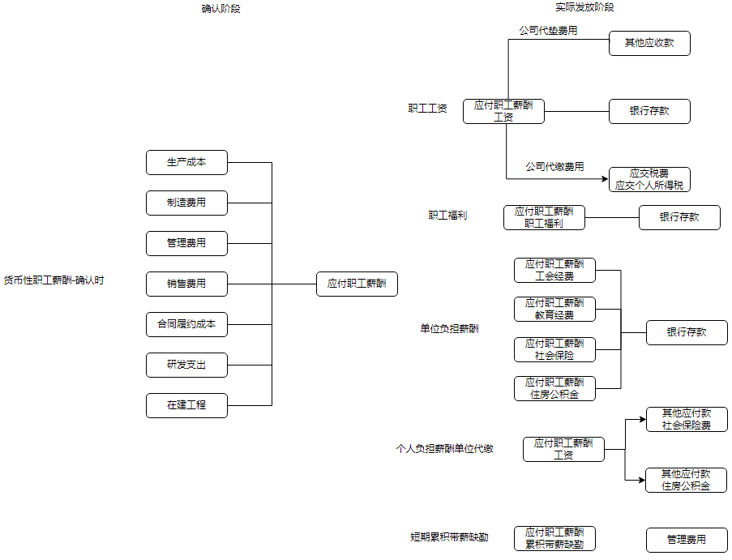
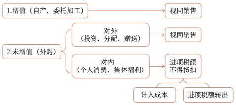

# 负债_应付职工薪酬

## 职工薪酬定义

职工薪酬包括`短期薪酬`、`离职后福利`、`辞退福利`和`其他长期职工福利`

- 短期
    - 职工工资、奖金、津贴和补贴
    - 职工福利费
    - `医疗保险费`、`工伤保险费`等社会保险费
    - `住房公积金`
    - 工会经费和职工教育经费
    - 短期带薪缺勤
    - 短期利润分享计划
    - 其他短期薪酬

- 长期
    - 离职后福利
        - 养老保险
        - 失业保险
    - 辞退福利
    - 其他长期职工福利
        - 长期带薪缺勤
        - 长期残疾福利
        - 长期利润分享计划等

### 题目
11.下列各项中，不属于企业职工薪酬组成内容的是（　　）。
A.根据设定提存计划计提应向单独主体缴存的提存金
B.为鼓励职工自愿接受裁减而给予职工的补偿
C.按国家规定标准提取的职工教育经费
D.为职工代扣代交的个人所得税
【答案】D
【解析】职工薪酬主要包括以下内容：（1）短期职工薪酬，具体包括：①职工工资、奖金、津贴和补贴；②职工福利费；③医疗保险费、工伤保险费等社会保险费；④住房公积金；⑤工会经费和职工教育经费（选项C）；⑥短期带薪缺勤；⑦短期利润分享计划；⑧其他短期薪酬。
（2）长期职工薪酬，具体包括：①离职后福利，分为设定提存计划和设定受益计划（选项A）；②辞退福利（选项B）；③其他长期职工福利，包括长期带薪缺勤、长期残疾福利、长期利润分享计划等。
选项D，为职工代扣代交的个人所得税不属于职工薪酬。

15.下列有关离职后福利的说法中，不正确的是（　　）。
A.离职后福利是指企业在职工提供相关服务的年度报告期间结束后十二个月内需要全部予以支付的职工薪酬
B.离职后福利包括设定提存计划和设定受益计划
C.设定提存计划是指向独立的基金缴存固定费用后，企业不再承担进一步支付义务的离职后福利计划
D.设定受益计划是指除设定提存计划以外的离职后福利计划
【答案】A
【解析】短期薪酬是指企业在职工提供相关服务的年度报告期间结束后十二个月内需要全部予以支付的职工薪酬，因解除与职工的劳动关系给予的补偿除外。离职后福利是指企业为获得职工提供的服务而在职工退休或与企业解除劳动关系后，提供的各种形式的报酬和福利，短期薪酬和辞退福利除外，选项A错误。

## 短期职工薪酬的账务处理
企业应当在职工为其提供服务的会计期间，将实际发生的短期薪酬确认为负债，并计入当期损益，其他会计准则要求或允许计入资产成本的除外。

科目:
“应付职工薪酬”科目包括“工资”“职工福利费”“非货币性福利”“社会保险费”“住房公积金”“工会经费”“职工教育经费”“带薪缺勤”“利润分享计划”“设定提存计划”“设定受益计划”“辞退福利”等明细科目
应付职工薪酬——工资, 负债类, 职工工资、奖金、津贴和补贴等
应付职工薪酬——职工福利费

账务:

1. 货币职工薪酬

    - 职工工资、奖金、津贴和补贴
    - 职工福利费
    - 国家规定计提标准的职工薪酬（单位应负担的）

        `医疗保险费`、`工伤保险费`和`住房公积金`，以及按规定提取的`工会经费`（工资总额的2%）和`职工教育经费`（工资总额的8%）,按照受益对象计入`当期损益`或相关`资产成本`。

        对于需要个人承担的社会保险费和住房公积金，由企业每月从职工的工资中代扣代缴，具体账务处理如下：
        企业代扣时:
            借：应付职工薪酬——工资
    　      贷：其他应付款——社会保险费
    　　　　　　 其他应付款——住房公积金
        企业代缴时:
            借：其他应付款——社会保险费
            　　其他应付款——住房公积金
            贷：银行存款等
    - 短期带薪缺勤

        确认累积带薪缺勤时：
            借：管理费用等
            贷：应付职工薪酬
        非累积带薪缺勤: 不必额外作账务处理

2. 非货币职工薪酬

### 非货币职工薪酬
14.某企业将自产的一批产品作为非货币性福利发给车间的生产工人，该批产品不含税售价为50000元，适用的增值税税率为13%，成本为35000元，下列各项中，发放该项非货币性福利确认应付职工薪酬的金额为（　　）元。
A.41500
B.35000
C.56500
D.50000
【答案】C
【解析】确认应付职工薪酬的金额=50000×（1+13%）=56500（元）。
计提时：
借：生产成本　　　　　　　　　　56500
　贷：应付职工薪酬——非货币性福利
　　　　　　　　　　　　　　　　　56500
实际发放时：
借：应付职工薪酬——非货币性福利
　　　　　　　　　　　　　　　　56500
　贷：主营业务收入　　　　　　　　50000
　　　应交税费——应交增值税（销项税额）
　　　　　　　　　　　　　　　　　 6500
借：主营业务成本　　　　　　　　35000
　贷：库存商品　　　　　　　　　　35000
　　　应付职工薪酬——非货币性福利
　　　　　　　　　　　　　　　　　56500

11.甲企业为高级管理人员提供企业自有公寓免费使用，应编制的会计分录有（　　）。
A.借记“累计折旧”科目，贷记“固定资产”科目
B.借记“管理费用”科目，贷记“固定资产”科目
C.借记“管理费用”科目，贷记“应付职工薪酬——非货币性福利”科目
D.借记“应付职工薪酬——非货币性福利”科目，贷记“累计折旧”科目
【答案】CD
【解析】相关会计分录为：
借：管理费用
　贷：应付职工薪酬——非货币性福利
同时：
借：应付职工薪酬——非货币性福利
　贷：累计折旧

### 货币职工薪酬
7.下列职工薪酬中，应当根据职工提供服务的受益对象计入相关资产成本或当期损益的有（　　）。
A.职工福利费
B.因解除与职工的劳动关系给予的补偿
C.工会经费和职工教育经费
D.社会保险费
【答案】ACD
【解析】选项B，因解除与职工的劳动关系给予的补偿，不区分受益对象，一律计入管理费用。

9.下列各项中，企业应记入“应付职工薪酬”科目借方的有（　　）。
A.支付职工的培训费
B.发放职工工资
C.确认因解除与职工劳动关系应给予的补偿
D.缴存职工基本养老保险费
【答案】ABD
【解析】选项ABD，支付职工的培训费、发放职工工资和缴存职工基本养老保险费的分录如下：
借：应付职工薪酬
　贷：银行存款等
选项C，确认因解除与职工劳动关系应给予的补偿的分录如下：
借：管理费用
　贷：应付职工薪酬

借方表示是实际发放时的动作

12.下列各项中，企业按税法规定代扣个人所得税，应借记的会计科目是（　　）。
A.财务费用
B.应付职工薪酬
C.税金及附加
D.管理费用
【答案】B
【解析】代扣个人所得税时：
借：应付职工薪酬
　贷：应交税费——应交个人所得税

7.对于短期带薪缺勤，不管是累积带薪缺勤还是非累积带薪缺勤，均应确认因累积未行使权利而增加的预期支付的金额。（　　）
【答案】×
【解析】只有累积带薪缺勤应确认因累积未行使权利而增加的预期支付的金额。

9.某企业职工张某经批准休探亲假5天，根据企业规定确认为非累积带薪缺勤，该企业应当在其休假期间确认与非累积带薪缺勤相关的职工薪酬。（　　）
【答案】√

## 长期职工薪酬的账务处理

- 离职后福利
借：生产成本
　　制造费用
　　管理费用
　　销售费用等
贷：应付职工薪酬——设定提存计划

- 辞退福利
借：`管理费用`
贷：应付职工薪酬——辞退福利

其他:
解除劳动关系的赔偿金, 无论是哪个部门的人, 都记入管理费用

### 长期职工薪酬的账务处理
12.对于设定提存计划，企业应当根据在资产负债表日为换取职工在会计期间提供的服务而应向单独主体缴存的提存金，确认为应付职工薪酬，并计入当期损益或相关资产成本。（　　）
【答案】√

## 大题
（一）
某企业为增值税一般纳税人，适用的增值税税率为13%。2021年12月1日，“应付职工薪酬”科目期初贷方余额为80万元。12月份，该企业发生与职工薪酬相关的经济业务如下：
（1）3日，结算上月应付职工工资80万元，其中：企业代垫职工房租3万元，代扣职工个人所得税2万元，以银行存款实际发放职工工资75万元。
（2）20日，以其生产的产品作为福利发放给专设销售机构人员，该批产品的生产成本为3万元、市场售价（不含增值税）为5万元。
（3）31日，当月“工资费用分配汇总表”中列示的产品生产人员工资32万元、车间管理人员工资8万元、行政管理人员工资20万元、销售人员工资10万元。根据有关规定，企业分别按照职工工资总额的2%和8%计提工会经费和职工教育经费。
要求：根据上述资料，不考虑其他因素，分析回答下列小题。（2022年）
1.根据期初资料和资料（1），下列各项中，该企业发放工资会计处理正确的是（　　）。
A.以银行存款发放工资时：
借：应付职工薪酬——工资　　　 750000
　贷：银行存款　　　　　　　　　 750000
B.扣回代垫款项时：
借：应付职工薪酬——工资　　　　30000
　贷：其他应付款　　　　　　　　　30000
C.代扣个人所得税时：
借：所得税费用　　　　　　　　　20000
　贷：应交税费——应交个人所得税　20000
D.扣回代垫款项时：
借：应付职工薪酬——工资　　　　30000
　贷：其他应收款　　　　　　　　　30000
【答案】AD
【解析】相关账务处理为：
借：应付职工薪酬——工资　　　 800000
　贷：其他应收款　　　　　　　　　30000
　　　应交税费——应交个人所得税　20000
　　　银行存款　　　　　　　　　 750000
2.根据资料（2），下列各项中，该企业确认并发放非货币性福利相关的会计科目处理正确的是（　　）。
A.确认非货币性福利时，贷记“应付职工薪酬——非货币性福利”科目5.65万元
B.确认非货币性福利时，借记“销售费用”科目5万元
C.实际发放非货币性福利时，确认主营业务收入5万元
D.实际发放非货币性福利时，结转主营业务成本3万元
【答案】ACD
【解析】相关账务处理为：
确认非货币性福利时：
借：销售费用　[50000×（1+13%）]56500
　贷：应付职工薪酬——非货币性福利
　　　　　　　　　　　　　　　　　56500
实际发放时：
借：应付职工薪酬——非货币性福利
　　　　　　　　　　　　　　　　56500
　贷：主营业务收入　　　　　　　　50000
　　　应交税费——应交增值税（销项税额）
　　　　　　　　　　　　　　　　　 6500
同时，结转成本：
借：主营业务成本　　　　　　　　30000
　贷：库存商品　　　　　　　　　　30000
3.根据资料（3），下列各项中，有关职工薪酬的表述正确的是（　　）。
A.职工薪酬应根据职工提供服务的受益对象确认当期损益或成本
B.工会经费和职工教育经费属于长期职工薪酬
C.职工工资属于短期职工薪酬
D.实际发生的短期职工薪酬在职工提供服务的会计期间确认为负债
【答案】ACD
【解析】选项B错误，工会经费和职工教育经费属于短期职工薪酬。
4.根据资料（3），下列各项中，该企业分配应付职工薪酬会计处理正确的是（　　）。
A.车间管理人员薪酬8.8万元计入制造费用
B.行政管理人员薪酬22万元计入管理费用
C.销售人员薪酬11万元计入销售费用
D.产品生产人员薪酬35.2万元计入生产成本
【答案】ABCD
【解析】相关账务处理为：
借：生产成本
　　　　　[320000×（1+2%+8%）]352000
　　制造费用
　　　　　　[80000×（1+2%+8%）]88000
　　管理费用
　　　　　[200000×（1+2%+8%）]220000
　　销售费用
　　　　　[100000×（1+2%+8%）]110000
　贷：应付职工薪酬　　　　　　　 770000
5.根据期初资料、资料（1）至（3），下列各项中，该企业2021年12月31日资产负债表中“应付职工薪酬”项目“期末余额”栏应填列的金额是（　　）万元。
A.82.65
B.75.65
C.70
D.77
【答案】D
【解析】该企业2021年12月31日资产负债表中“应付职工薪酬”项目“期末余额”栏应填列的金额=80-80+5.65-5.65+77=77（万元）。

