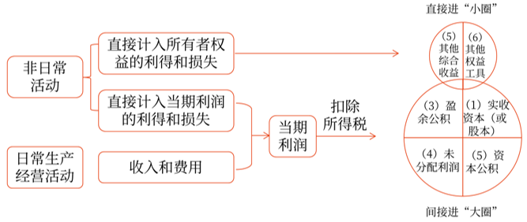
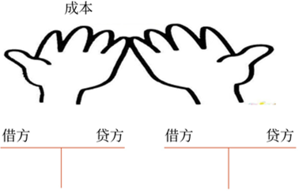
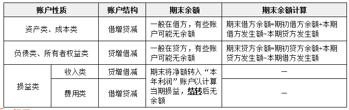
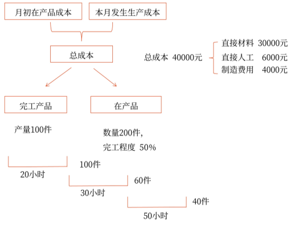

# 基础

## 会计要素及其确认与计量
- 资产
    - 应为企业拥有或者控制的资源（所有权、使用权）
    - 预期会给企业带来经济利益（淘汰的，过保质期的不可以）
    - 是由企业过去的交易或者事项形成的（现实的资产，预计未来的不可以）
- 负债
    - 是企业承担的现时义务
    - 预期会导致经济利益流出企业
    - 是由企业过去的交易或者事项形成的
- 所有者权益
    - 所有者投入的资本，包括构成企业注册资本或者股本的金额，也包括资本溢价或股本溢价
    - 留存收益，包括盈余公积和未分配利润
    - 其他综合收益，是指企业根据会计准则规定未在当期损益中确认的各项利得和损失
- 收入
    - 是企业在日常活动中形成的
    - 是与所有者投入资本无关的经济利益的总流入
    - 会导致所有者权益的增加
- 费用
    - 是企业在日常活动中形成的
    - 是与向所有者分配利润无关的经济利益的总流出
    - 会导致所有者权益的减少
- 利润
    包括收入减去费用后的净额、直接计入当期利润的利得和损失等（利润总额）

### 考察

### 题目

## 利得与损失、收入与费用进入所有者权益的路径

### 考察
#### 直接计入当期利润的利得和损失的常见业务

- 营业外收入、营业外支出	
    - 固定资产报废净损益
    - 捐赠收支
    - 固定资产盘亏净损失
    - 罚款、违约金
- 资产处置损益
    - 固定资产、无形资产出售净损益
- 公允价值变动损益
    - 交易性金融资产期末公允价值变动
- 投资收益
    - 交易性金融资产出售净损益

#### 其他
固定资产处置, 通过`固定资产清理`(周转类科目), 清理完毕后要进行结转:
- 出售或转让(主动), 结转到`资产处置损益` 
- 报废或毁损(被动), 结转到`营业外收入`或`营业外支出`

盘盈盘亏, 现金盘盈盘亏, 存货盘盈盘亏, 固定资产盘盈盘亏
- 一般使用`待处理财产损益`
- 特殊固定资产盘盈, 使用`以前年度损益调整`

### 题目

## 会计要素计量属性及其应用原则

计量属性|含义|常见实际案例应用
--|--|--
历史成本|又称实际成本，是指取得或制造某项财产物资时所实际支付的现金或现金等价物|固定资产初始入账价值
重置成本|又称现行成本，是指按照当前市场条件，重新取得同样一项资产所需支付的现金或现金等价物金额|盘盈固定资产
可变现净值|是指在生产经营过程中，以资产预计售价减去进一步加工成本和预计销售所必需的费用以及相关税金后的净值|存货的期末计量
现值|是指对未来现金流量以恰当的折现率进行折现后的价值，是考虑货币时间价值因素等的一种计量属性|具有融资性质的分期付款购入固定资产
公允价值|是指市场参与者在计量日发生的有序交易中，出售一项资产所能收到或者转移一项负债所需支付的价格|交易性金融资产期末计量
### 考察

### 题目

## 会计等式
- 资产=负债+所有者权益
    - 该等式反映了企业在某一特定时点资产、负债和所有者权益三者之间的平衡关系，该等式被称为财务状况等式、基本会计等式或静态会计等式
    - 它是复式记账法的理论基础，也是编制资产负债表的依据

- 收入-费用=利润
    - 该等式反映了企业利润的实现过程，被称为经营成果等式或动态会计等式
    - 收入、费用和利润之间的关系，是编制利润表的依据

### 考察
每一项经济业务的发生，都必然会引起会计等式的一边或两边有关项目相互联系地发生等量变化，
- 一边时，有关项目的金额发生`相反`方向的等额变动, 总额不变
- 两边时，有关项目的金额发生`相同`方向的等额变动，总额变化。

序号|资产|=|负债|+|所有者权益|对资产总额的影响
--|--|--|--|--|--|--
（1）|↑↓|||||不变
（2）|||↑↓|||不变
（3）|||||↑↓|不变
（4）|||↑||↓|不变
（5）|||↓||↑|不变
（6）|↑||↑|||增加
（7）|↑||||↑|增加
（8）|↓||↓|||减少
（9）|↓||||↓|减少

### 题目

下列各项中，不会引起企业资产总额发生变化的是（　　）。
A.购入原材料一批，款项尚未支付
B.发行股票收到银行存款
C.结转销售商品成本
D.收回应收账款存入银行
【答案】D
【解析】（1）解题关键：已知某种业务案例，来判断对会计等式的影响是“单边”还是“双边”。（2）选项A，资产（原材料）和负债（应付账款）同时增加；选项B，资产（银行存款）和所有者权益（股本等）同时增加；选项C，资产（库存商品）和所有者权益减少（主营业务成本）；选项D，属于资产内部增减变动，不会引起资产总额发生变化。

## 借贷记账法
- 会计科目
会计科目，简称科目，是对会计要素具体内容进行分类核算的项目，是进行会计核算和提供会计信息的基础。
- 账户
账户是根据会计科目设置的，具有一定格式和结构，用于分类反映会计要素增减变动情况及其结果的载体。
- 借贷记账法的账户结构
    
    
- 备抵账户
备抵账户的结构与所调整账户的结构正好相反。

备抵账户|所调整账户
--|--
坏账准备|应收账款、应收票据、应收利息、应收股利、其他应收款等
存货跌价准备|原材料、库存商品、委托加工物资、周转材料等
累计折旧、固定资产减值准备|固定资产
累计摊销、无形资产减值准备|无形资产
在建工程减值准备|在建工程

### 考察

### 题目

## 试算平衡
- 发生额试算平衡
    全部账户本期借方发生额合计=全部账户本期贷方发生额合计直接依据是借贷记账法的记账规则，即“有借必有贷，借贷必相等”
- 余额试算平衡
    全部账户借方期末（初）余额合计=全部账户贷方期末（初）余额合计.直接依据是财务状况等式，即：资产=负债+所有者权益

- 不影响借贷双方平衡关系的错误
    - 漏记某项经济业务，使本期借贷双方的发生额等额减少，借贷仍然平衡
    - 重记某项经济业务，使本期借贷双方的发生额等额虚增，借贷仍然平衡
    - 某项经济业务记录的应借、应贷科目正确，但借贷双方金额同时多记或少记，且金额一致，借贷仍然平衡
### 考察

### 题目

## 会计凭证和会计账簿
- 原始凭证:
 - 原始凭证金额有错误的，应当由出具单位重开，不得在原始凭证上更正
 - 原始凭证有其他错误的，应当由出具单位重开或者更正，更正处应当加盖出具单位印章
- 记账凭证: 有原始凭证为依据

补充：
对于涉及“库存现金”和“银行存款”之间的相互划转业务，一般只编制付款凭证，不编制收款凭证

### 考察

### 题目

## 会计账簿的种类
三栏式账簿: 资本, 负债, 总账, 日记账
多栏目: 收入, 成本, 费用
数量金额: 原材料, 库存商品
![12.png]

## 会计账簿-核对

- 账证核对
    将账簿记录与会计凭证核对
- 账账核对
    - `总分类账簿`之间的核对, 依据：按照“资产=负债+所有者权益”这一会计等式和“有借必有贷，借贷必相等”的记账规则（`试算平衡`）
    - 总分类账簿与所辖明细分类账簿之间的核对, 依据：总分类账各账户的期末余额=其所辖各明细分类账的期末余额之和
    - 明细分类账簿之间的核对, 核对方法：一般是由财产物资保管部门或使用部门定期编制收、发、结存汇总表报会计机构核对
    - 总分类账簿与序时账簿之间的核对, 依据：库存现金总账的期末余额=库存现金日记账的期末余额
- 账实核对
    - 库存现金日记账账面余额与现金实际库存数逐日核对是否相符
    - 银行存款日记账账面余额与银行对账单余额定期核对是否相符
    - 各项财产物资明细账账面余额与财产物资实有数额定期核对是否相符
    - 有关债权债务明细账账面余额与对方单位债权债务账面记录核对是否相符

### 考察

### 题目

## 会计账簿-更正
- 结账前，`凭证正确，账簿错误`, 划线更正法
- `会计科目`错误, 红字更正法(红字冲销, 蓝字补充)
- `金额`错误
    多记, 红字更正法(红字冲销, 蓝字补充)
    少记, 补充登记法(单独蓝字)

### 考察

### 题目

## 产品成本核算

- 材料、燃料、动力费用的归集和分配, 待分配费用 * 产品分配占比
- 职工薪酬的归集和分配, 各种产品生产职工薪酬总额 * 定额公式比例
- 辅助生产费用的归集和分配
    - 直接分配法: 不考虑自身消耗的, 让其他人承担
        ![3.png]
    - 交互分配法
        进行两次分配。首先，在各辅助生产车间之间进行一次交互分配；然后将各辅助生产车间交互分配后的实际费用在辅助生产车间以外的各受益单位进行分配
        ![4.png]
- 制造费用的归集和分配, 制造费用总额 * 分配占比

### 考察

### 题目

## 生产费用在完工产品和在产品之间的归集和分配 

关键是第二道工序的物品, 已经完成了第一道工序

### 题目
甲产品的生产需经过两道工序，第一道工序定额工时2小时，第二道工序定额工时3小时。期末，甲产品在第一道工序的在产品40件，在第二道工序的在产品20件。假定每道工序平均完工程度为50%，作为分配计算在产品加工成本的依据，其期末在产品约当产量为（　　）件。
A.18
B.22
C.28
D.36
【答案】B
【解析】第一道工序的完工程度=（2×50%）÷（2+3）×100%=20%；第二道工序的完工程度=（2+3×50%）÷（2+3）×100%=70%；期末在产品约当产量=40×20%+20×70%=22（件）。

