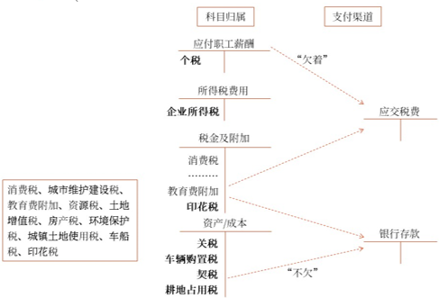

# 费用

1.营业成本
2.税金及附加
3.期间费用

## 营业成本

主营业务成本和其他业务成本

## 税金及附加

### 题目

下列各项中，通过“税金及附加”科目核算的是（　　）。（2022年改编·2分）
A.委托加工物资受托方代收代缴的消费税
B.厂部车辆应交的车辆购置税
C.企业因订立买卖合同而交纳的印花税
D.应交的企业所得税
【答案】C
【解析】选项A，委托加工应税消费品，受托方代收代缴的消费税计入委托加工物资或应交税费——应交消费税，不通过“税金及附加”科目核算。销售应税消费品应交的消费税通过“税金及附加”科目核算；选项B，计入固定资产成本；选项D，计入所得税费用。

下列各项中，企业应通过“税金及附加”科目核算的有（　　）。（2022年·2分）
A.代扣代缴的职工个人所得税
B.销售应税消费品应交的消费税
C.以自产产品对外捐赠应交的增值税
D.销售应税矿产品应交的资源税
【答案】BD

某企业销售应税消费品应交增值税150万元，消费税90万元，城市维护建设税16.8万元，全部税金尚未交纳。不考虑其他因素，上述税金计入的会计科目正确的有（　　）。（2022年·2分）
A.“税金及附加”科目166.8万元
B.“税金及附加”科目106.8万元
C.“应交税费”科目256.8万元
D.“管理费用”科目90万元
【答案】BC
【解析】增值税不通过“税金及附加”科目核算，故“税金及附加”科目金额=90+16.8=106.8（万元），选项B正确；“应交税费”科目金额=150+90+16.8=256.8（万元），选项C正确。

 　某企业为增值税一般纳税人，2022年应交的各种税金为：增值税300万元，消费税100万元，城市维护建设税28万元，教育费附加12万元，房产税10万元，车船税2万元，印花税1万元，个人所得税80万元，企业所得税200万元。上述各项税金中应计入税金及附加的金额为（　　）万元。
A.533
B.233
C.153
D.453
【答案】C
【解析】应计入税金及附加的金额=100+28+12+10+2+1=153（万元）。

　2022年12月，某企业当月交纳增值税50万元，销售应税消费品交纳消费税20万元，经营用房屋交纳房产税10万元。该企业适用的城市维护建设税税率为7%，教育费附加征收率为3%，不考虑其他因素。下列各项中，关于该企业12月份应交纳城市维护建设税和教育费附加的相关会计科目处理正确的有（　　）。
A.借记“税金及附加”科目7万元
B.贷记“应交税费——应交教育费附加”科目2.1万元
C.贷记“应交税费——应交城市维护建设税”科目5.6万元
D.借记“管理费用”科目7万元
  提示
题目问的是“应交纳的城市维护建设税和教育费附加”，因此计算税金及附加的时候不需要考虑其他相关税费。
【答案】AB
【解析】应交城市维护建设税=（实际交纳的增值税+实际交纳的消费税）×适用税率=（50+20）×7%=4.9（万元），选项C错误；应交教育费附加=（50+20）×3%=2.1（万元），选项B正确；企业的城市维护建设税以及教育费附加计入税金及附加，因本月城市维护建设税和教育费附加而计入税金及附加的金额=4.9+2.1=7（万元），选项A正确，选项D错误。

## 期间费用

1. 销售费用

下列各项中，制造业企业应计入销售费用的是（　　）。（2022年·2分）
A.随同商品出售单独计价包装物的成本
B.筹建期间发生的开办费
C.专设销售网点发生的业务费
D.董事会成员开会发生的会议费
【答案】C
【解析】选项A计入其他业务成本；选项BD计入管理费用。
 　下列各项中，企业应计入销售费用的是（　　）。（2022年·2分）
A.因产品质量原因给予的销售折让
B.计提存货跌价准备
C.行政管理人员报销的差旅费
D.专设销售机构发生的固定资产维修费
【答案】D
【解析】选项A冲减当期营业收入；选项B计入资产减值损失；选项C计入管理费用。
 　下列各项中，企业应计入销售费用的有（　　）。（2022年·2分）
A.销售商品发生的商业折扣
B.销售部门办公设备的折旧费
C.售后服务中心员工的薪酬
D.销售商品负担的运费
【答案】BCD
【解析】选项A，从应确认的销售商品收入中扣除。
 　下列各项中，应通过“销售费用”科目核算的有（　　）。（2021年改编·2分）
A.销售商品为购货方代垫的保险费
B.预计产品质量保证损失
C.随同商品出售不单独计价的包装物成本
D.出借包装物的摊销额
【答案】BCD
【解析】选项A计入应收账款。

2. 管理费用

[2.png](2.png)

下列各项中，应计入管理费用的是（　　）。（2022年·2分）
A.外币汇兑损失	
B.支付的法律诉讼费
C.因违反协议支付的违约金
D.支付的专设销售机构房屋维修费
【答案】B
【解析】选项A计入财务费用；选项C计入营业外支出；选项D计入销售费用。
 　下列各项中，应计入企业管理费用的是（　　）。（2022年改编·2分）
A.董事会成员的津贴	
B.生产车间机器设备的折旧费
C.销售产品保险费
D.银行存款利息
【答案】A
【解析】选项B计入制造费用，选项C计入销售费用，选项D计入财务费用。
 　下列各项中，企业应计入管理费用科目的是（　　）。（2022年·2分）
A.经营活动的借款利息
B.发生的税收滞纳金
C.聘请中介机构的费用
D.发生产品广告费
【答案】C
【解析】选项A计入财务费用，选项B计入营业外支出，选项D计入销售费用。
 　2020年12月某企业计提固定资产折旧共计55万元，其中：车间管理部门30万元，行政管理部门15万元，专设销售机构10万元。企业行政管理部门负担的工会经费5万元，不考虑其他因素，应计入管理费用的金额为（　　）万元。（2021年改编·2分）
A.20
B.45
C.55
D.40
【答案】A
【解析】车间管理部门固定资产折旧计入制造费用；专设销售机构固定资产折旧计入销售费用。应计入管理费用的金额=15+5=20（万元）。
 　管理费用不多的商品流通企业可以不设置“管理费用”科目，相关费用并入“销售费用”科目核算。（　　）（2021年·1分）
【答案】√

3．财务费用

下列各项中，企业应贷记“财务费用”科目的有（　　）。（2022年·2分）
A.确认银行存款产生的利息收入
B.支付银行承兑汇票的手续费
C.计提短期借款的利息费用
D.发生的汇兑收益
【答案】AD
【解析】选项BC，应借记“财务费用”科目。
 　下列各项中，不通过“财务费用”科目核算的有（　　）。（2022年改编·2分）
A.财务部门发生的办公费用
B.财务人员的薪酬
C.发生的销售折让
D.支付的年度财务报表审计费
【答案】ABCD
【解析】选项ABD，通过“管理费用”科目核算；选项C，冲减当期的销售收入。
 　下列各项中，属于“财务费用”科目核算内容的有（　　）。（2020年改编·2分）
A.支付公开发行普通股的佣金
B.销售商品发生的商业折扣
C.流动资金存款利息收入
D.确认的生产经营用短期借款利息费用
【答案】CD
【解析】选项A：冲减资本公积等。选项B：销售商品发生的商业折扣在确认收入时要进行扣除，不通过“财务费用”科目核算。

