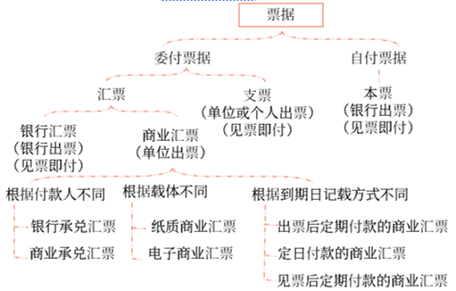
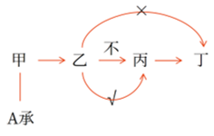
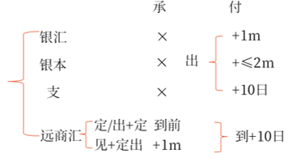
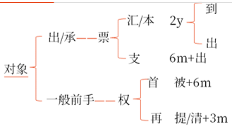

# 票据法律制度

## 票据的种类

未记载各种日期的处理:
情形|性质|效果
--|--|--
未记载出票日期|必须记载事项|票据无效
未记载背书日期|相对记载事项|视为到期日前背书
未记载承兑日期|相对记载事项|以收到提示承兑的汇票之日起3日内的最后一日为承兑日期
未记载保证日期|相对记载事项|出票日期为保证日期

各种附条件（综述）:
情形|效果
--|--
附条件背书|条件无效而背书有效
附条件承兑|视为拒绝承兑
附条件保证|条件无效而票据保证有效

## 票据行为——出票
出票，是指`出票人签发票据`, 并将票据`交付收款人`的行为。多方法律行为
出票行为的必须记载事项:
`本无付`，`支无收`， `电子商业汇票`还要加`出票人名`称和`到期日`

项目|纸质商业汇票|电子商业汇票|本票|支票
--|--|--|--|--
表明“××票”字样|√|√|√|√
无条件支付的委托/承诺|√|√|√（承诺）|√
确定的金额|√|√|√|√（可补记）
出票日期|√|√|√|√
付款人名称|√|√|×|√
收款人名称|√|√|√|×（可补记）
出票人签章|√|√|√|√
出票人名称|×|√|×|×
票据到期日|×|√|×|×

## 票据行为——背书*
背书，是在票据背面或者粘附于票据背面的粘单上作成背书（记载法定事项并签章）并将票据交付被背书人的行为
背书分类：
- 转让背书, 背书人将票据权利转让给被背书人
- 委托收款背书, 背书人委托被背书人行使票据权利
- 质押背书, 背书人为担保被背书人的债权的实现而以票据权利设定质押

综合:
如果未记载“委托收款”和“质押”字样, 则一律视为转让背书

必须记载事项：
|转让背书|委托收款背书|质押背书
--|--|--|--
背书人签章|√|√|√
被背书人名称|√|√|√
其他必须记载事项|×|“委托收款”字样|“质押”字样

补充：
背书人未记载被背书人名称即将票据交付他人的，持票人在票据被背书人栏内记载自己的名称与背书人记载具有同等法律效力

背书连续:
- 所谓“背书连续”: 在票据转让中，转让票据的背书人与受让票据的被背书人在票据上的签章依次前后衔接。
- 以背书转让的票据，背书应当连续；持票人以背书的连续，证明其票据权利；非经背书转让，而以其他合法方式取得票据的，依法举证，证明其票据权利。

背书是否有效:
情形|效力
--|--
部分背书、多头背书|背书无效
记载“不得转让”字样的背书|背书有效
附条件背书|背书有效
背书人未签章|背书无效
未记载被背书人名称|背书无效，但持票人补记后有效
未记载背书日期|背书有效，视为到期日前背书

补充：
不得转让：

## 票据行为——承兑

其他：
付款人承兑汇票，不能附有条件；承兑附有条件的，视为拒绝承兑。

## 票据行为——保证
被保证人名称, 保证人在票据或者粘单上未记载被保证人名称的，已承兑的票据，承兑人为被保证人；未承兑的票据，出票人为被保证人。

## 票据丧失补救
- 挂失止付
    可以挂失止付的:
    - `已承兑`的`商业汇票`；
    - 填明“现金”字样和代理付款人的`银行汇票`；
    - `填明“现金”`字样的`银行本票`。
    - 支票；
- 公示催告
- 普通诉讼
申请公示催告的主体必须是`可以背书转让的票据`的最后持票人。

## 票据追索权（P143）
1.追索的情形
（1）到期后追索, 票据到期被`拒绝付款`的，持票人对背书人、出票人以及票据的其他债务人行使的追索。
（2）到期前追索
在票据到期日前，有下列情况之一的，持票人可以行使追索权：
①汇票被拒绝承兑的；
②承兑人或者付款人死亡、逃匿的；
③承兑人或者付款人被依法宣告破产的；
④承兑人或者付款人因违法被责令终止业务活动的。
2.追索对象及追索顺序
（1）可以作为追索对象的包括出票人、背书人、承兑人和保证人。
（2）追索顺序：不分先后，可以同时向多人追索。

票据权利消灭时效:

## 支票（P122、146）
支票的基本当事人：出票人、付款人和收款人。
（1）支票的出票人：是在经批准办理支票业务的银行机构开立可以使用支票的存款账户的单位和个人。
（2）支票的付款人：出票人支票账户的开户银行。
（3）支票的收款人：支票正面“收款人”栏中记载的人。支票的出票人可以在支票上记载自己为收款人。

3.空头支票的法律责任
①由中国人民银行处以票面金额5%但不低于1000元的罚款；
②持票人有权要求出票人赔偿支票金额2%的赔偿金。

## 银行汇票（P151）
（1）申请人
（2）解讫通知
（3）3个金额

15、商业汇票
（1）银行承兑汇票：承兑人种类、承兑手续（P155）、出票人未足额交存票款的处理（P159）
（2）贴现：条件、贴息、收款（P157）

## 题目

### 商业汇票
 　2021年10月10日，W市A公司签发一张金额为10万元的纸质商业汇票用于支付货款，收款人为B公司，到期日为2022年1月11日。10月11日，A公司向开户银行P银行申请承兑，P银行受理申请。P银行审查相关资料后给予承兑，并于次一工作日在票据市场基础设施完成相关信息登记工作，在录入信息时，P银行的工作人员发现汇票上未记载承兑日期。12月1日，B公司因故将票据背书转让给Q银行。2022年1月12日，持票人Q银行通过票据市场基础设施提示付款。
要求：根据上述资料,不考虑其他因素,分析回答下列小题。
1. 下列各项中，属于A公司签发汇票时必须记载的事项的是（　　）。
  A.出票人A公司签章
  B.收款人名称B公司
  C.付款人名称P银行
  D.出票地W市
  【答案】ABC
  【解析】选项D：出票地属于出票行为的相对记载事项。

2. P银行受理该汇票的承兑申请时，应当办理的事项是（　　）。
  A.审查A公司的资格、资信、合同等
  B.收取承兑手续费
  C.在票据市场基础设施上登记汇票承兑信息
  D.向A公司签发收到汇票的回单
  【答案】ABCD
  【解析】（1）选项A：银行承兑汇票的出票人向银行提示承兑时，银行的信贷部门负责按照有关规定和审批程序，对出票人的资格、资信、购销合同和汇票记载的内容进行认真审查，必要时可由出票人提供担保；（2）选项B：银行承兑汇票的承兑银行，按票面金额的一定比例收取手续费，手续费为市场调节价；（3）选项C：纸质票据贴现前，金融机构办理承兑、质押、保证等业务，应当不晚于业务办理的次一工作日在票据市场基础设施完成相关信息登记工作；（4）选项D：付款人收到提示承兑的汇票时，应当签发收到汇票的回单。

3. 该汇票的承兑日期为（　　）。
  A.P银行收到提示承兑汇票的当天
  B.P银行收到提示承兑汇票之次日
  C.P银行收到提示承兑汇票之日起的第3天
  D.P银行收到提示承兑汇票之日起的第5天
  【答案】C
【解析】汇票上未记载承兑日期的，应当以收到提示承兑的汇票之日起3日内的最后一日为承兑日期。
4. 有关持票人Q银行通过票据市场基础设施提示付款的下列表述中，正确的是（　　）。
  A.P银行可以在提示付款日起3日内应答
  B.P银行在提示付款当日未作出应答的，视为同意付款
  C.P银行在提示付款日起3日内未作出应答的，视为同意付款
  D.P银行在提示付款当日未作出应答的，视为拒绝付款
    手写板
 
【答案】D
【解析】持票人在提示付款期限内通过票据市场基础设施提示付款的，承兑人应当在提示付款当日应答，承兑人在提示付款当日未作出应答的，视为拒绝付款。

##

022年2月19日，A公司向B公司签发了一张出票后2个月付款、金额为20万元的商业汇票，该汇票载明C公司为付款人，D公司在汇票上签章作了保证，但未记载被保证人名称。B公司取得汇票后背书转让给E公司，但未记载背书日期，E公司于2022年3月15日向C公司提示承兑时，C公司以其所欠A公司债务只有15万元为由拒绝承兑。E公司拟行使追索权实现自己的票据权利。
要求：根据上述资料，不考虑其他因素，分析回答下列小题。

1. 该汇票未记载被保证人名称，被保证人是（　　）。
  A.A公司
  B.B公司
  C.C公司
  D.E公司
  【答案】A
  【解析】保证人在票据或者粘单上未记载“被保证人名称”的，已承兑的票据，承兑人为被保证人；未承兑的票据，出票人为被保证人。在本题中，C公司拒绝承兑票据，应以出票人A公司为被保证人。

2. B公司背书转让时未记载背书日期的，应视为（　　）。
A.背书不成立
B.背书无效
C.出票日背书
D.到期日前背书
【答案】D
【解析】背书未记载日期的，视为在票据到期日前背书（不影响背书的效力）。

3. E公司有权向（　　）追索。
  A.A公司
  B.B公司
  C.C公司
  D.D公司
  【答案】ABD
  【解析】持票人可以向票据的出票人（A公司）、背书人（B公司）、承兑人和保证人（D公司）中的任何一人、数人或者全体行使追索权。在本题中，C公司并未承兑票据，并非承兑人，只是票面上记载的付款人，不是票据债务人，不承担票据责任，E公司无权向其追索。

4. E公司向B公司行使追索权的截止时间为（　　）。
  A.2022年4月19日
  B.2022年8月19日
  C.2022年6月15日
  D.2022年9月15日
    手写板
  
  【答案】D
  【解析】持票人对出票人、承兑人（如果有）以外前手的追索权，在被拒绝承兑（2022年3月15日）或者被拒绝付款之日起6个月内行使。

