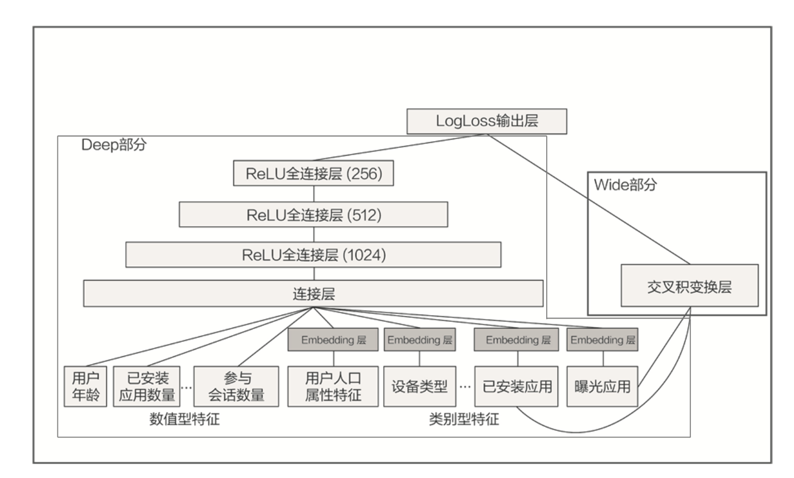
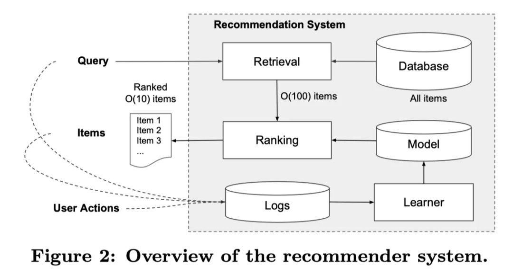

# rec_deepWide

## 模型
Wide&Deep 模型是由 Google 的应用商店团队 Google Play 提出的，在 Google Play 为用户推荐 APP 这样的应用场景下。Wide&Deep 模型的推荐目标：尽量推荐那些用户可能喜欢，愿意安装的应用。

可以看到，
- Deep部分就是常规的神经网络，将每个特征进行输入
- Wide部分则是用的是"已安装应用"特征和"曝光应用"特征的交叉，也就是说wide想学的东西是“因为A所以B”的规则——如果安装了应用A，是否会安装B这样的规则。

## 推荐

当一个用户访问app商店时，此时会产生一个请求，请求到达推荐系统后，推荐系统为该用户返回推荐的apps列表。
在实际的推荐系统中，通常将推荐的过程分为两个部分，即上图中的Retrieval和Ranking，Retrieval负责从数据库中检索出与用户相关的一些apps，Ranking负责对这些检索出的apps打分，最终，按照分数的高低返回相应的列表给用户。

其中在ranking中使用更细致的用户特征，如：

- User features（年龄、性别、语言、民族等）
- Contextual features(上下文特征：设备，时间等)
- Impression features（展示特征：app age、app的历史统计信息等）

与一般的推荐系统不同的是，Google Pay是通过检索来实现推荐的召回，将大规模的App应用缩小到小规模（例如100）的相关应用。然后在通过用户特征、上下文特征、用户行为特征等来建立推荐模型，估计用户点击每个App的概率分数，按照分数进行排序，推荐Top K个App。

## 其他

1. 区别联合训练和集成学习的差别
集成学习是多模型分别独立训练，最后再将结果进行融合；
联合训练会将wide和deep模型组合在一起，在训练时同时优化所有参数，并且进行加权求和，根据最终的loss计算出gradient，反向传播到Wide和Deep两部分中，分别训练自己的参数。也就是说，wide & deep 模型的权重更新会受到 wide 侧和 deep 侧对模型训练误差的共同影响。在论文中，wide部分是使用L1正则化的Follow-the-regularized-leader(FTRL)算法进行优化，deep部分使用的是AdaGrad完成优化。
refs:
https://bbs.huaweicloud.com/blogs/341709
Wide & Deep Learning for Recommender Systems
https://www.kaggle.com/code/matanivanov/wide-deep-learning-for-recsys-with-pytorch/notebook
https://jrzaurin.github.io/infinitoml/2021/05/28/pytorch-widedeep_iv.html
https://zhuanlan.zhihu.com/p/53361519
https://blog.csdn.net/google19890102/article/details/78171283
https://ithelp.ithome.com.tw/articles/10225452