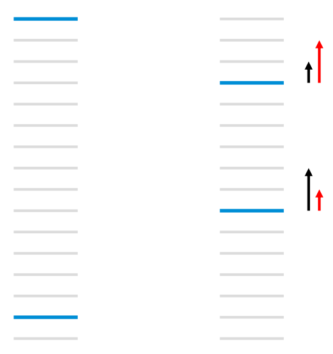

# rec_lambdaRank

A set of urls ordered for a given query using a binary relevance measure. The light gray bars represent urls that are not relevant to the query,while the dark blue bars represent urls that are relevant to the query.
Left: the total number of pairwise errors is thirteen.
Right: by moving the top url down three rank levels, and the bottom relevant url up five, the total number of pairwise errors has been reduced to eleven.
However for NDCG that emphasize the top few results, this is not what we want. The(black) arrows on the left denote the RankNet gradients(which increase with the number of pairwise errors), whereas what we'd really like are the (red) arrows on the right.

The key observation of LambdaRank is thus that in order to train a model, we do not need the costs themselves: we only need the gradients.
The arrows($\lambda$) mentioned above are exactly those gradients. the $\lambda$ for a given URL $U_1$ get contributions from all toher URLs for the same query that have different labels. The $\lambda$ can also be interpreted as forces: if $U_2$ is more relevant than $U_1$, then $U_1$ will get a push downwards of size $|\lambda|$ and $U_2$ will get an equal and opposite push upwards); if $U_2$ is less relevant than $U_1$, then $U_1$ will get a push upwards of size $|\lambda|$ and $U_2$ will get an qual and opposite push downwards.

For RankNet's gradient , we have:
$$ \frac{\partial C}{\partial w_k} = \sum_{(i,j) \in I}\frac{\partial C_{ij}}{\partial w_k}
= \sum_{(i,j) \in I}\frac{\partial C_{ij}}{\partial s_i}\frac{\partial s_i}{\partial w_k} + \sum_{(i,j) \in I}\frac{\partial C_{ij}}{\partial s_j}\frac{\partial s_j}{\partial w_k}
$$
further more, we find symmetry:
$$
\begin{aligned}
        \frac{\partial L_{ij}}{\partial s_i} & {} = \frac{\partial \biggl\{\frac12 (1 - S_{ij})\sigma\cdot(s_i - s_j) + \log\Bigl\{1 + \exp\bigl(-\sigma\cdot(s_i - s_j)\bigr)\Bigr\}\biggr\}}{\partial s_i}\\
         & {}= \frac12 (1 - S_{ij})\sigma - \frac{\sigma}{1 + \exp\bigl(\sigma\cdot(s_i - s_j)\bigr)} \\
         & {}= \sigma\Biggl[\frac12(1 - S_{ij}) - \frac{1}{1 + \exp\bigl(\sigma\cdot(s_i - s_j)\bigr)}\Biggr] \\
         & {}= -\frac{\partial L_{ij}}{\partial s_j}.
\end{aligned}
$$

so,we define:

$$
\lambda_{ij} \equiv \frac{\partial L_{ij}}{\partial s_i} = -\frac{\partial L_{ij}}{\partial s_j}
$$

because $(i,j)$ is ordered, then $S_{ij}=1$, so we can simplify the function:
$$
\lambda_{ij} \equiv - \frac{\sigma}{1 + e^{\sigma\cdot(s_i - s_j)}}
$$

Experiments have shown that modifying function above by simply multiplying by the size of the change in NDCG($|\Delta_{NDCG}|$) given by swapping the rank positions of $U_1$ and $U_2$ (while leaving the rank positions of all other urls unchanged) gives very good results.

$$ \lambda_{ij}=\frac{\partial C(s_i-s_j)}{\partial s_i} = \frac{-\sigma}{1+e^{\sigma\cdot(s_i-s_j)}}|\Delta_{NDCG}| $$

For a given pair, a $\lambda$ is computed, and the $\lambda$s for $U_1$ and $U_2$ are incremented by that $\lambda$, where the sign is chosen so that

refs:
https://liam.page/2016/07/10/a-not-so-simple-introduction-to-lambdamart/
https://zhuanlan.zhihu.com/p/270608987
https://www.microsoft.com/en-us/research/wp-content/uploads/2016/02/MSR-TR-2010-82.pdf
https://www.cnblogs.com/genyuan/p/9788294.html
https://www.cnblogs.com/bentuwuying/p/6690836.html
https://blog.csdn.net/c9Yv2cf9I06K2A9E/article/details/123058894
https://www.microsoft.com/en-us/research/wp-content/uploads/2016/02/lambdarank.pdf
https://zhuanlan.zhihu.com/p/138235048