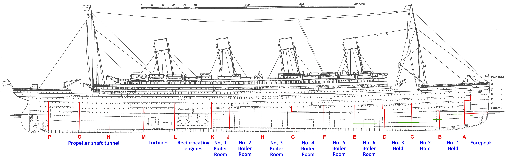
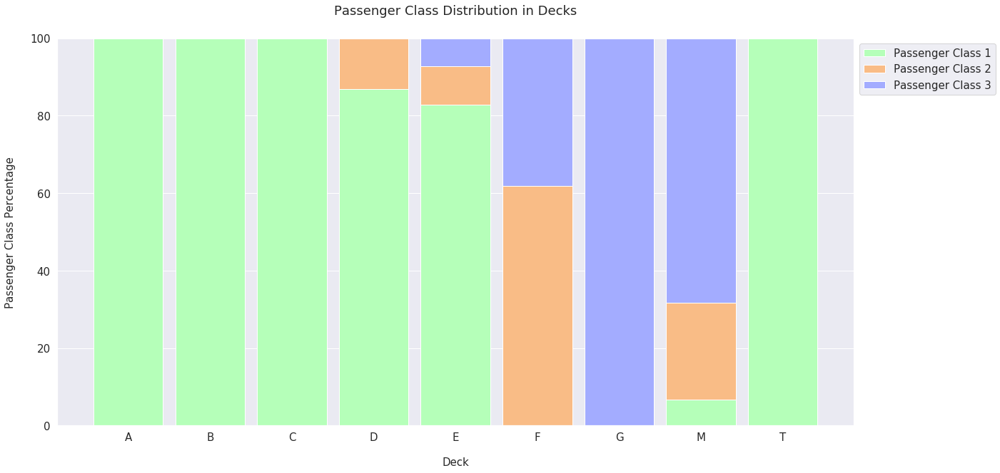
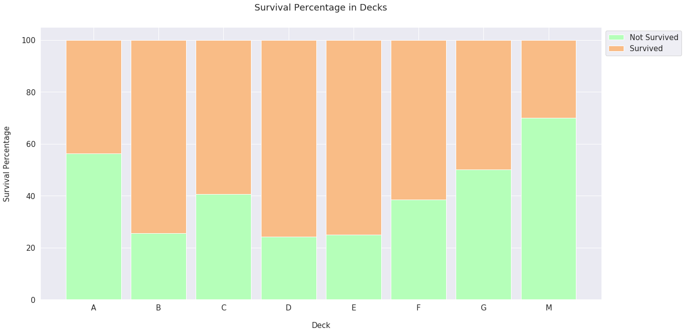

## 数据探索

1. PassengerId: 行唯一标识, 对目标没有作用
2. Survived: 要预测的目标变量(target variable), 0 或 1
    1. 1 = Survived(生还)
    2. 0 = Not Survived(未生还)
3. Pclass: Passenger Class, 乘客舱位的经济等级, 是一个分类有序变量:
    1. 1 = Upper Class(上等舱)
    2. 2 = Middle Class(中等舱)
    3. 3 = Lower Class(低等舱)
4. Name
5. Sex
6. Age
7. SibSp: siblings and spouse, 乘客的兄弟姐妹和配偶的总数
8. Parch: parents and children, 乘客的孩子和父母的总数
9. Ticket: 乘客的票号
10. Fare: 乘客的费用
11. Cabin: 乘客的区域号
12. Embarked: 登船的地点, 有分类无序变量
    1. C = Cherbourg
    1. Q = Queenstown
    1. S = Southampton


1. 训练集有891行, 12个特征
1. 测试集有418行, 11个特征
1. 训练集多的一个特征是目标变量, Survived

训练集
PassengerId|Survived|Pclass|Name|Sex|Age|SibSp|Parch|Ticket|Fare|Cabin|Embarked
--|--|--|--|--|--|--|--|--|--|--|--
690|1|1|Madill, Miss. Georgette Alexandra|female|15.0|0|1|24160|211.3375|B5|S
526|0|3|Farrell, Mr. James|male|40.5|0|0|367232|7.7500|NaN|Q
279|0|3|Rice, Master. Eric|male|7.0|4|1|382652|29.1250|NaN|Q


测试集
PassengerId|Pclass|Name|Sex|Age|SibSp|Parch|Ticket|Fare|Cabin|Embarked
--|--|--|--|--|--|--|--|--|--|--
1287|1|Smith, Mrs. Lucien Philip (Mary Eloise Hughes)|female|18.0|1|0|13695|60.0000|C31|S
1202|3|Cacic, Mr. Jego Grga|male|18.0|0|0|315091|8.6625|NaN|S
1095|2|Quick, Miss. Winifred Vera|female|8.0|1|1|26360|26.0000|NaN|S


```python
import numpy as np
import pandas as pd

import matplotlib.pyplot as plt
import seaborn as sns
sns.set(style="darkgrid")

from sklearn.ensemble import RandomForestClassifier
from sklearn.preprocessing import OneHotEncoder, LabelEncoder, StandardScaler
from sklearn.metrics import roc_curve, auc
from sklearn.model_selection import StratifiedKFold
import string

def concat_df(train_data, test_data):
    # Returns a concatenated df of training and test set
    return pd.concat([train_data, test_data], sort=True).reset_index(drop=True)

def divide_df(all_data):
    # Returns divided dfs of training and test set
    return all_data.loc[:890], all_data.loc[891:].drop(['Survived'], axis=1)

df_train = pd.read_csv('../input/train.csv')
df_test = pd.read_csv('../input/test.csv')
df_all = concat_df(df_train, df_test)

df_train.name = 'Training Set'
df_test.name = 'Test Set'
df_all.name = 'All Set' 

dfs = [df_train, df_test]

print('Number of Training Examples = {}'.format(df_train.shape[0]))  # Number of Training Examples = 891
print('Number of Test Examples = {}\n'.format(df_test.shape[0]))  # Number of Test Examples = 418
print('Training X Shape = {}'.format(df_train.shape))  # Training X Shape = (891, 12)
print('Training y Shape = {}\n'.format(df_train['Survived'].shape[0]))  # Training y Shape = 891
print('Test X Shape = {}'.format(df_test.shape))  # Test X Shape = (418, 11)
print('Test y Shape = {}\n'.format(df_test.shape[0]))  # Test y Shape = 418
print(df_train.columns)  # ['PassengerId', 'Survived', 'Pclass', 'Name', 'Sex', 'Age', 'SibSp','Parch', 'Ticket', 'Fare', 'Cabin', 'Embarked']
print(df_test.columns)  # ['PassengerId', 'Pclass', 'Name', 'Sex', 'Age', 'SibSp', 'Parch','Ticket', 'Fare', 'Cabin', 'Embarked']
```


### 缺失值(Missing Values)

将训练集和测试集的数据连接其处理缺失值, 否则会造成过拟合. Age, Embarked和Fare三个字段, 有较少的缺失值, 可以通过统计方法填补. Cabin有80%缺失值, 不能直接使用统计方法填补.

属性|训练集缺失个数|测试集缺失个数
--|--|--
PassengerId|0|0
Survived|0|?
Pclass|0|0
Name|0|0
Sex|0|0
Age|177|86
SibSp|0|0
Parch|0|0
Ticket|0|0
Fare|0|1
Cabin|687|327
Embarked|2|0


### Age
使用中位数(median)来填补Age的缺失值, 但并非使用整体的中位数, 而是使用Pclass分类后的中位数. 因为Pclass和Age有0.408106相似度, 和目标变量Survived有0.338481相似度.

```python
df_all_corr = df_all.corr().abs().unstack().sort_values(kind="quicksort", ascending=False).reset_index()
df_all_corr.rename(columns={"level_0": "Feature 1", "level_1": "Feature 2", 0: 'Correlation Coefficient'}, inplace=True)
df_all_corr[df_all_corr['Feature 1'] == 'Age']
```

Feature 1|Feature 2|Correlation Coefficient
--|--|--
Age|Age|1.000000
Age|Pclass|0.408106
Age|SibSp|0.243699
Age|Fare|0.178740
Age|Parch|0.150917
Age|Survived|0.077221
Age|PassengerId|0.028814

进一步, 将Sex也加入分组中, 因为在以Pclass分组的前提下, 可以看到, females(女性)比males(男性)的中位数相对较低.


```python
age_by_pclass_sex = df_all.groupby(['Sex', 'Pclass']).median()['Age']

for pclass in range(1, 4):
    for sex in ['female', 'male']:
        print('Median age of Pclass {} {}s: {}'.format(pclass, sex, age_by_pclass_sex[sex][pclass]))
print('Median age of all passengers: {}'.format(df_all['Age'].median()))

# Filling the missing values in Age with the medians of Sex and Pclass groups
df_all['Age'] = df_all.groupby(['Sex', 'Pclass'])['Age'].apply(lambda x: x.fillna(x.median()))
```

## Embarked
Embarked是只有2个缺失值的分类变量. 两个记录有相同的票号, 且都是女性. 也就是说她们知道彼此, 且在同一个港口登船. `Embarked`女性的众数是 C (Cherbourg), 但是并不意味着他们就是从C登船的.

Age	Cabin	Embarked	Fare	Name	Parch	PassengerId	Pclass	Sex	SibSp	Survived	Ticket
38.0	B28	NaN	80.0	Icard, Miss. Amelie	0	62	1	female	0	1.0	113572
62.0	B28	NaN	80.0	Stone, Mrs. George Nelson (Martha Evelyn)	0	830	1	female	0	1.0	113572


[Martha Evelyn Stone: Titanic Survivor](https://www.encyclopedia-titanica.org/titanic-survivor/martha-evelyn-stone.html)一文中提到Stone, Mrs. George Nelson (Martha Evelyn)和她的佣人Icard, Miss. Amelie在 S (Southampton)登船. 所以使用S填补缺失值.

```python
# Filling the missing values in Embarked with S
df_all['Embarked'] = df_all['Embarked'].fillna('S')
```


## Fare
Fare只有一个缺失值, 他和家庭成员多少(Parch, SibSp)和Pclass(舱位的经济等级)有关. 所以使用Pclass=3, Parch=0, SibSp=0的中位数填补比较合适.


Age|Cabin|Embarked|Fare|Name|Parch|PassengerId|Pclass|Sex|SibSp|Survived|Ticket
--|--|--|--|--|--|--|--|--|--|--|--
60.5|NaN|S|NaN|Storey, Mr. Thomas|0|1044|3|male|0|NaN|3701


```python
med_fare = df_all.groupby(['Pclass', 'Parch', 'SibSp']).Fare.median()[3][0][0]
# Filling the missing value in Fare with the median Fare of 3rd class alone passenger
df_all['Fare'] = df_all['Fare'].fillna(med_fare)
```

### Cabin


```python
# Creating Deck column from the first letter of the Cabin column (M stands for Missing)
df_all['Deck'] = df_all['Cabin'].apply(lambda s: s[0] if pd.notnull(s) else 'M')

df_all_decks = df_all.groupby(['Deck', 'Pclass']).count().drop(columns=['Survived', 'Sex', 'Age', 'SibSp', 'Parch', 
                                                                        'Fare', 'Embarked', 'Cabin', 'PassengerId', 'Ticket']).rename(columns={'Name': 'Count'}).transpose()

def get_pclass_dist(df):
    
    # Creating a dictionary for every passenger class count in every deck
    deck_counts = {'A': {}, 'B': {}, 'C': {}, 'D': {}, 'E': {}, 'F': {}, 'G': {}, 'M': {}, 'T': {}}
    decks = df.columns.levels[0]    
    
    for deck in decks:
        for pclass in range(1, 4):
            try:
                count = df[deck][pclass][0]
                deck_counts[deck][pclass] = count 
            except KeyError:
                deck_counts[deck][pclass] = 0
                
    df_decks = pd.DataFrame(deck_counts)    
    deck_percentages = {}

    # Creating a dictionary for every passenger class percentage in every deck
    for col in df_decks.columns:
        deck_percentages[col] = [(count / df_decks[col].sum()) * 100 for count in df_decks[col]]
        
    return deck_counts, deck_percentages

def display_pclass_dist(percentages):
    
    df_percentages = pd.DataFrame(percentages).transpose()
    deck_names = ('A', 'B', 'C', 'D', 'E', 'F', 'G', 'M', 'T')
    bar_count = np.arange(len(deck_names))  
    bar_width = 0.85
    
    pclass1 = df_percentages[0]
    pclass2 = df_percentages[1]
    pclass3 = df_percentages[2]
    
    plt.figure(figsize=(20, 10))
    plt.bar(bar_count, pclass1, color='#b5ffb9', edgecolor='white', width=bar_width, label='Passenger Class 1')
    plt.bar(bar_count, pclass2, bottom=pclass1, color='#f9bc86', edgecolor='white', width=bar_width, label='Passenger Class 2')
    plt.bar(bar_count, pclass3, bottom=pclass1 + pclass2, color='#a3acff', edgecolor='white', width=bar_width, label='Passenger Class 3')

    plt.xlabel('Deck', size=15, labelpad=20)
    plt.ylabel('Passenger Class Percentage', size=15, labelpad=20)
    plt.xticks(bar_count, deck_names)    
    plt.tick_params(axis='x', labelsize=15)
    plt.tick_params(axis='y', labelsize=15)
    
    plt.legend(loc='upper left', bbox_to_anchor=(1, 1), prop={'size': 15})
    plt.title('Passenger Class Distribution in Decks', size=18, y=1.05)   
    
    plt.show()    

all_deck_count, all_deck_per = get_pclass_dist(df_all_decks)
display_pclass_dist(all_deck_per)
```




1. 在甲板(Deck), 有6间房子被标记为 T, U, W, X, Y, Z, 但是在数据集中只显示T
2. ABC有100%的1等级舱
3. D有87%的1等舱和13%的2等舱
4. E有83%的1等舱, 10%的2等舱, 7%的3等舱
5. F有62%的2等舱, 38%的3等舱
6. G有100%的3等舱
7. DE给所有等级舱位
8. FG给2, 3等级舱位
9. 有1个乘客是T区域, 他是1等舱, T和A相似, 所以将其改为A
10. 使用M代替缺失值, 因为太难填补了.

```python
# Passenger in the T deck is changed to A
idx = df_all[df_all['Deck'] == 'T'].index
df_all.loc[idx, 'Deck'] = 'A'
```


```python
df_all_decks_survived = df_all.groupby(['Deck', 'Survived']).count().drop(columns=['Sex', 'Age', 'SibSp', 'Parch', 'Fare', 
                                                                                   'Embarked', 'Pclass', 'Cabin', 'PassengerId', 'Ticket']).rename(columns={'Name':'Count'}).transpose()

def get_survived_dist(df):
    
    # Creating a dictionary for every survival count in every deck
    surv_counts = {'A':{}, 'B':{}, 'C':{}, 'D':{}, 'E':{}, 'F':{}, 'G':{}, 'M':{}}
    decks = df.columns.levels[0]    

    for deck in decks:
        for survive in range(0, 2):
            surv_counts[deck][survive] = df[deck][survive][0]
            
    df_surv = pd.DataFrame(surv_counts)
    surv_percentages = {}

    for col in df_surv.columns:
        surv_percentages[col] = [(count / df_surv[col].sum()) * 100 for count in df_surv[col]]
        
    return surv_counts, surv_percentages

def display_surv_dist(percentages):
    
    df_survived_percentages = pd.DataFrame(percentages).transpose()
    deck_names = ('A', 'B', 'C', 'D', 'E', 'F', 'G', 'M')
    bar_count = np.arange(len(deck_names))  
    bar_width = 0.85    

    not_survived = df_survived_percentages[0]
    survived = df_survived_percentages[1]
    
    plt.figure(figsize=(20, 10))
    plt.bar(bar_count, not_survived, color='#b5ffb9', edgecolor='white', width=bar_width, label="Not Survived")
    plt.bar(bar_count, survived, bottom=not_survived, color='#f9bc86', edgecolor='white', width=bar_width, label="Survived")
 
    plt.xlabel('Deck', size=15, labelpad=20)
    plt.ylabel('Survival Percentage', size=15, labelpad=20)
    plt.xticks(bar_count, deck_names)    
    plt.tick_params(axis='x', labelsize=15)
    plt.tick_params(axis='y', labelsize=15)
    
    plt.legend(loc='upper left', bbox_to_anchor=(1, 1), prop={'size': 15})
    plt.title('Survival Percentage in Decks', size=18, y=1.05)
    
    plt.show()

all_surv_count, all_surv_per = get_survived_dist(df_all_decks_survived)
display_surv_dist(all_surv_per)
```





