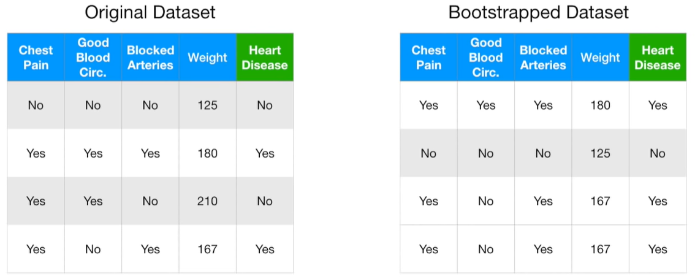
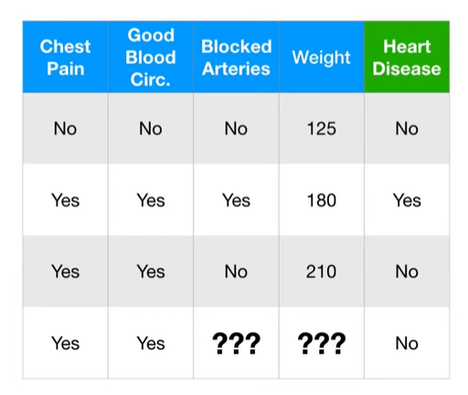
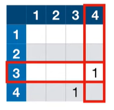
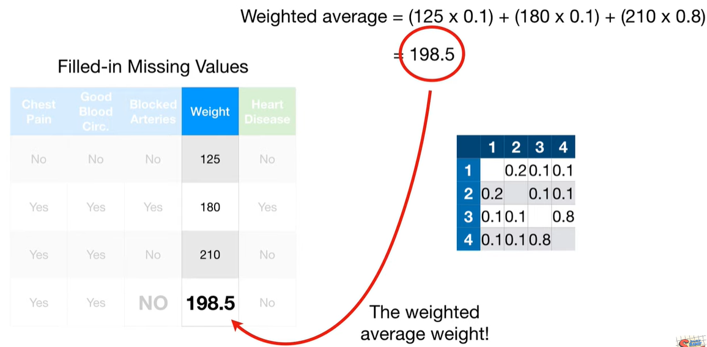
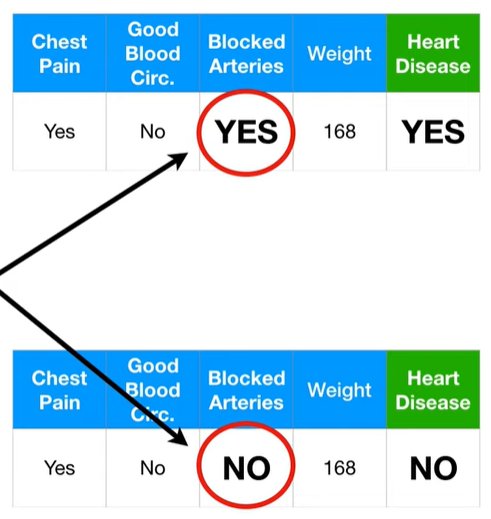

# randomforest

## 总结
1. 随机抽取样本，建立和初始数据集一样大小的样本集合，这个过程叫做`bootstrapped`
2. 使用`bootstrapped dataset`，但仅仅使用随机的特征构建树
3. 将多课树的结果进行分类打分，求最终的结果。
4. 缺失值的处理
  - 首先进行差值
  - 根据多课树预测结果，将相同的预测结果样本放在一起，然后用再权重来评估。

## 随机森林

决策树简单, 容易解释, 很容易拟合训练集, 但是在测试集上表现却不好. 随机森林结合了多个简单的决策树, 解决了这个问题.

✨但是随机森林丧失了可解释性

## 步骤1: 创建bootstrapped数据集

✨bootstrapped在统计学中，有一种称为自助法（bootstrap method）的技术，就是通过对原始样本进行有放回的抽样，多次重复这个过程以获取样本统计量的分布等信息，从而进行统计推断。这里 “bootstrapped” 就表示运用了这种自助法进行相关操作。

假设有4个样本的数据集, 为了创建和原始数据集一样大的bootstrapped数据集, 我们仅需要从原始数据集中随机抽样. 允许, 重复, 抽样.
 

✨第三个和第四个样本是相同的.

## 步骤2: 在从bootstrapped数据集中创建树时, 每一步随机选取两个属性

在每一步仅选择尚未被作为决策点的两个属性.

回到步骤1, 创建新的bootStrapped数据集, 并在每一步随机选择属性创建树

## predict

用所有创建的树, 来预测测试样本, 通过投票决定最终的结果.

## Bagging
对数据进行自助抽样（Bootstrapping）再结合聚合（aggregate）来做出决策的方法被称为 “装袋法（Bootstrap Aggregating, Bagging）

## Missing data and clustering

随机森林考虑2中缺失值:
1. 训练集中的缺失值
2. 测试集中的缺失值

### 初始猜测

一般的方法是, 先进行初始猜测, 然后再改善.

在`Heart Idsease = No`的样本中, `Blocked arteries = No`概率是2/2=100%, 所以`No`是初始的猜测.

应为`weight`是数值型, 所以初始猜测是`heart disease = No`样本中的平均值.

### 改善猜测

我们通过将具有缺失值的记录和相似记录来改善猜测. 计算相似度的方法是:

1. Step1: 创建随机森林
2. Stpe2: 在所有的树上跑所有的数据

我们在第一棵树上, 看到样本3和样本4停在相同的叶子节点, 这就意味着他们是相似的.

适用近似矩阵(Proximity Matrix)来跟踪相似的样本, 其每一行是一个样本, 每一列是一个样本, 因为样本3和样本4结束再相同的叶子节点, 所以在他们的相交格子+1.

同样的方法, 跑完所有的数据, 最终得到下图的相似矩阵:

相似矩阵中的每个值除以树的个数, 这里有10棵树, 所以都除以10:

现在, 使用近似值来优化样本4的缺失值.

对于`blocked arteries`, 计算`Yes`和`No`的频率权重:

1. $$ YES = 1/3 $$
2. $$ NO = 2/3 $$

计算`Yes`的近似权重频率:

$$ YES="YES" weighted frequency \cdot \frac{Proximity of "YES"}{All Proximities} = \frac{1}{3} \cdot \frac{0.1}{0.1+0.1+0.8} = 0.03 $$

计算`No`的近似权重频率:

$$ NO = \frac{2}{3} \cdot \frac{0.1+0.8}{0.1+0.1+0.8} = 0.6$$

`No`有更高的近似权重频率, 所以选择`No`

对于`weight`字段, 我们使用权重平均值.

## 测试集中的缺失值

假设我们已经创建好随机森林, 来预测病人.

第一步, 我们复制该条记录, 并分别将目标属性赋值为`Yes`和`No`
第二步, 适用上面讲述的方法来补全缺失值

## 参考
https://www.youtube.com/watch?v=J4Wdy0Wc_xQ&t=412s
https://www.youtube.com/watch?v=sQ870aTKqiM

