# cartTree_regression

As has been explained, Decision Trees is the non-parametric supervised learning approach. In addition to classification with continuous data on the target, we also often find cases with discrete data on the target called regression.

For regression trees, two common impurity measures are:
 
- Least squares. This method is similar to minimizing least squares in a linear model. Splits are chosen to minimize the residual sum of squares between the observation and the mean in each node.
- Least absolute deviations. This method minimizes the mean absolute deviation from the median within a node. The advantage of this over least squares is that it is not as sensitive to outliers and provides a more robust model. The disadvantage is in insensitivity when dealing with data sets containing a large proportion of zeros.

## CART Work in Regression with one predictor
CART in classification case uses Gini Impurity in the process of splitting the dataset into a decision tree. On the other hand CART in regression cases uses least squares, intuitively splits are chosen to minimize the residual sum of squares between the observation and the mean in each node.Mathematically, we can write residual as follow:
$$ \varepsilon_i = y_i - \hat{y_i}(1.0) $$
Mathematically, we can write RSS(residual sum of squares) as follow:
$$ RSS = \sum_{i=1}^{n}(y_i-\hat{y_i})^2$$
$$ RSS = \varepsilon_1^2 + \varepsilon_2^2 + ... + \varepsilon_n^2$$
In order to finde out the "best" split, we must minimize the RSS.

## Intuition
This simulation uses a "dummy" dataset as follow:
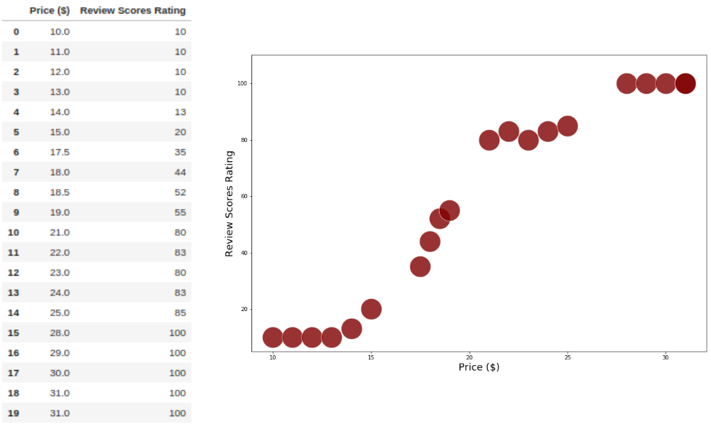
The decision tree as follow:
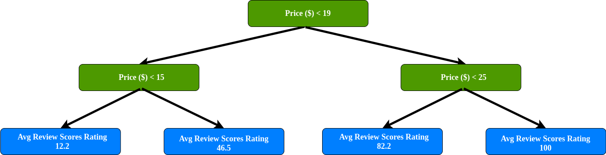

## CART process the splitting of the dataset (predictor =1)
As mentioned before, In order to find out the "best" split, we must minimize the RSS. first, we calculate RSS by split into two regions, start with index 0:

1. Start within index 0
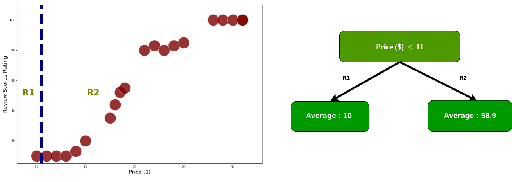
The data already split into two regions, we add up the squared residual for every index data.furthermore we calculate RSS each node using equation 2.0
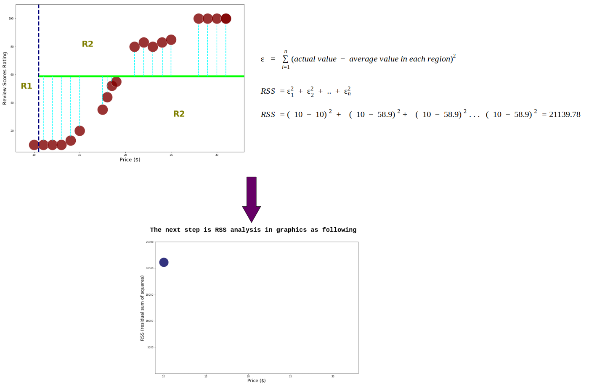

2. Start within index 1
calculate Rss by split into two regions within index 1:
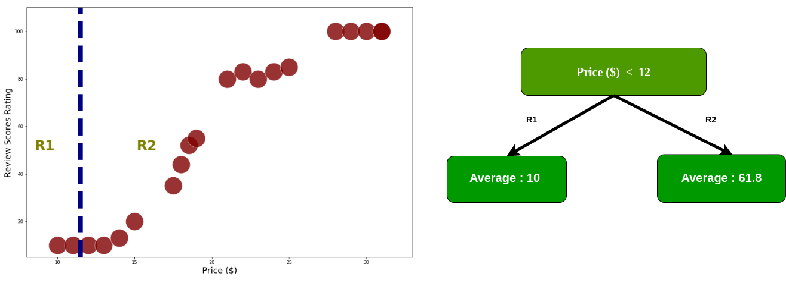
after the data is divided into two regions then calculate RSS each node using equation 2.0:
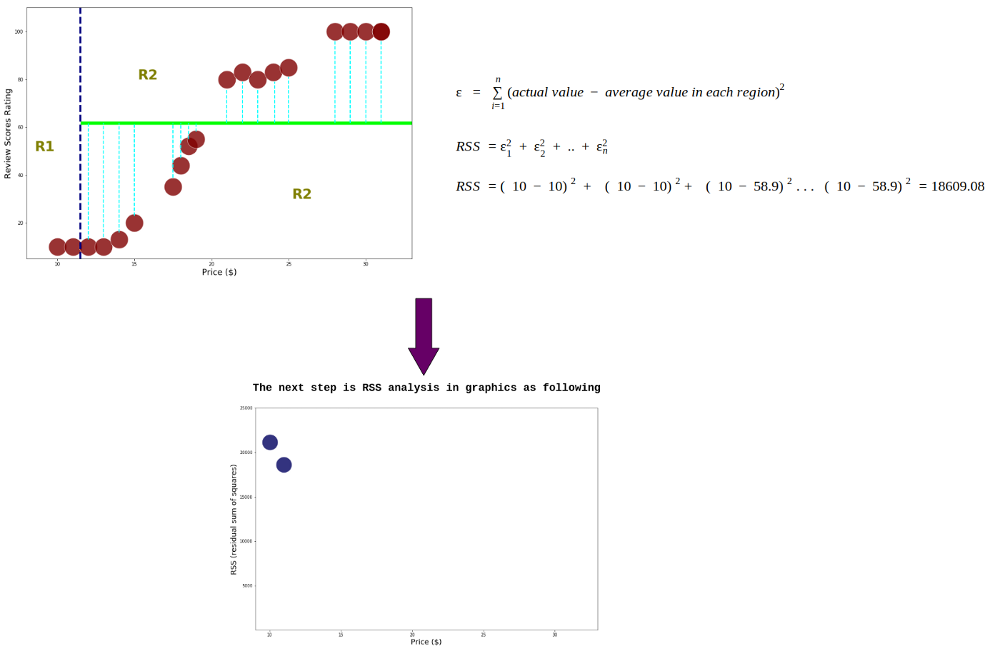

3. Start within index 2
calculate RSS by split into two regions within index2:
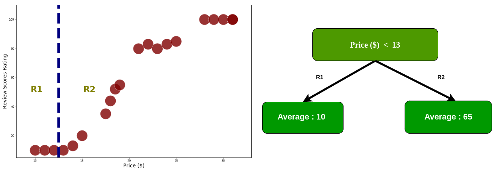
calculate RSS each node
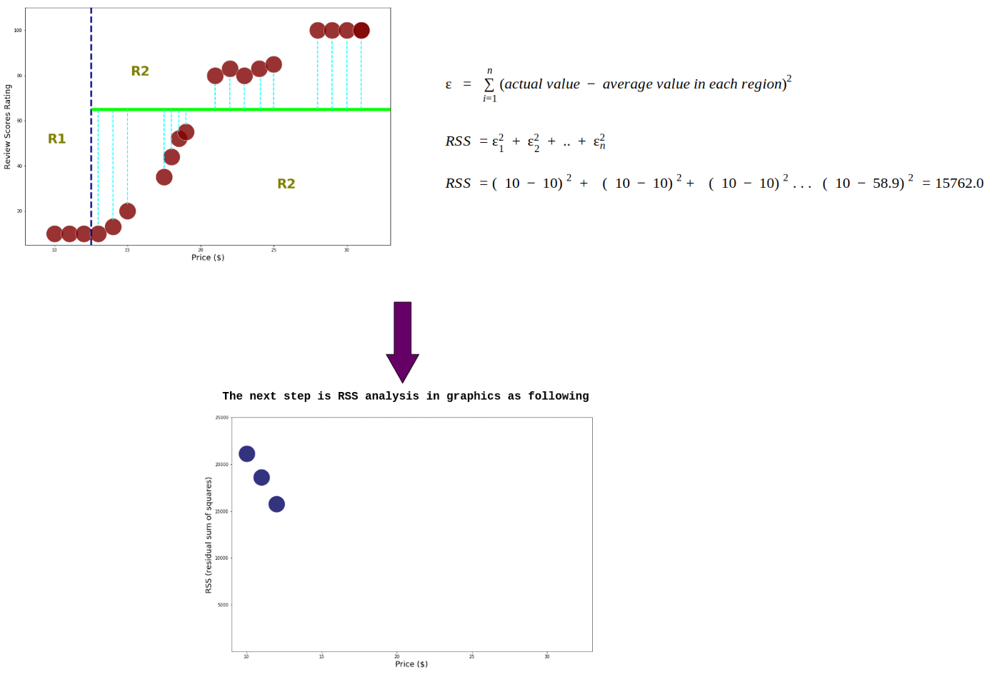

4. Last index
This process continues until the calculation of RSS in the last index
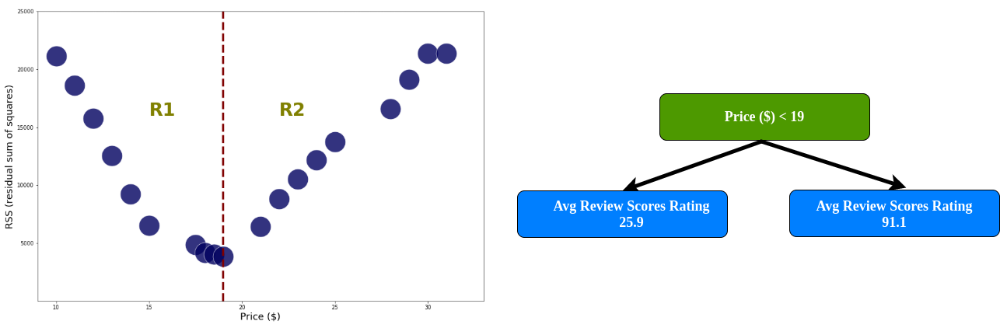
Price with threshold 19 has a smallest RSS, in R1 there are 10 data with in price $<19$, so we'll split the data in R1. In order to avoid overfitting, we define the minimum data for each region $>=6$. If the region has less than 6 data, the split process in that region stops.
Split the data with threshold 19.
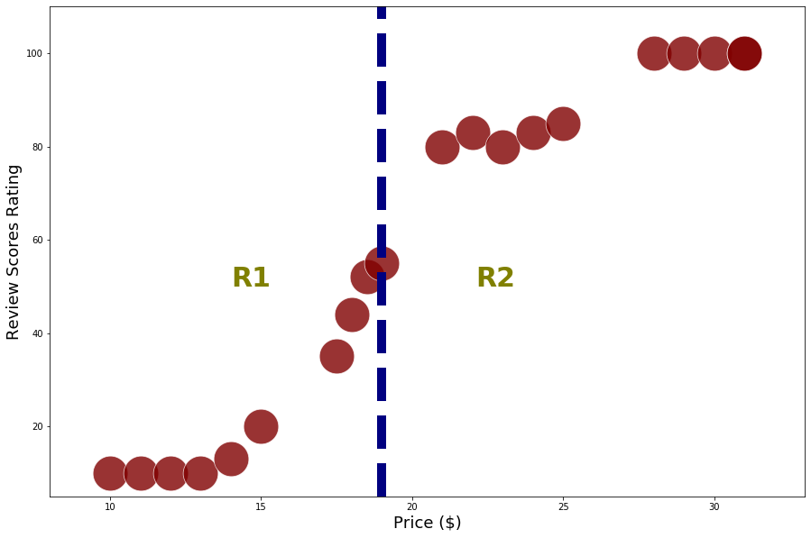

5. calculate RSS in R1, the process in this section is the same as the previous process, only define for R1.
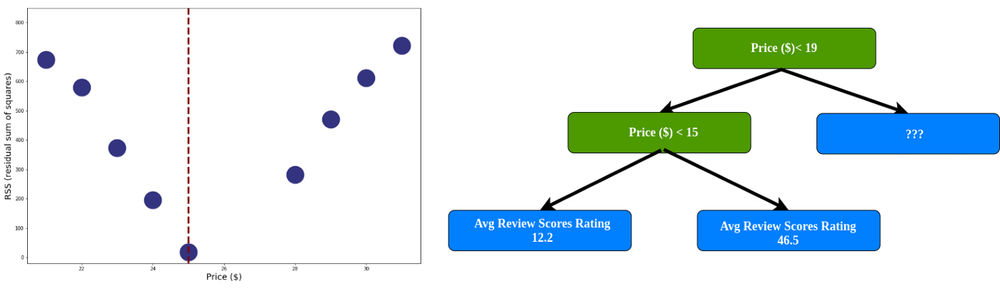

6. Do the same thing on the right branch, so the end of the a tree in this case is:

## CART process the splitting of the dataset (predictor > 1)

This simulation uses a dummy data as following:
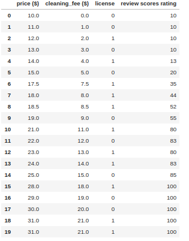

Find out minimum RSS each predictor.

1. Price RSS = 3873.79

2. Cleaning fee RSS = 64214.8
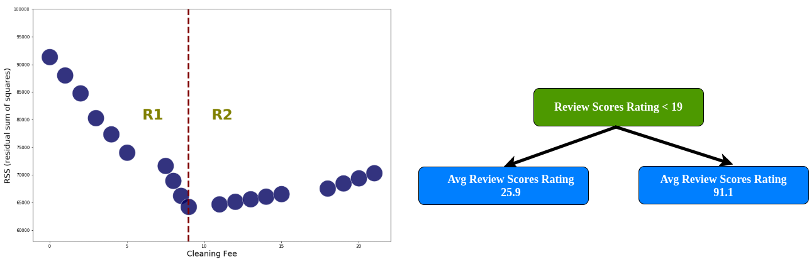

3. License RSS = 11658.5

We already have RSS every predictor, compare each RSS for each predictor, and fine the lowest RSS value. We find the License has the lowest value, so it becomes the root node.

refs:
https://arifromadhan19.medium.com/regrssion-in-decision-tree-a-step-by-step-cart-classification-and-regression-tree-196c6ac9711e