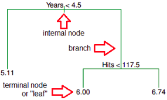
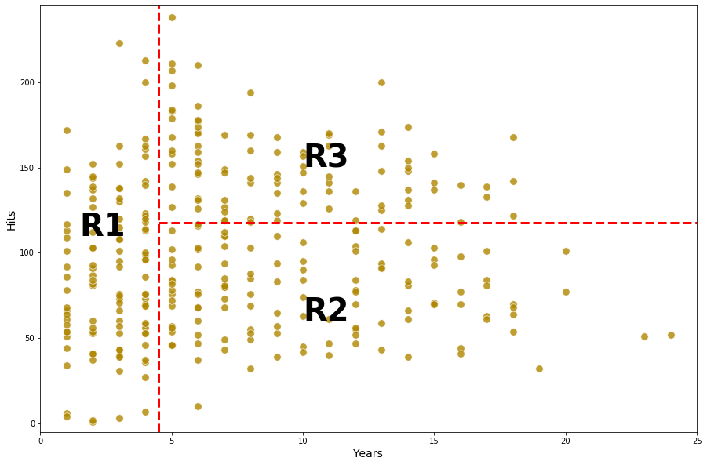
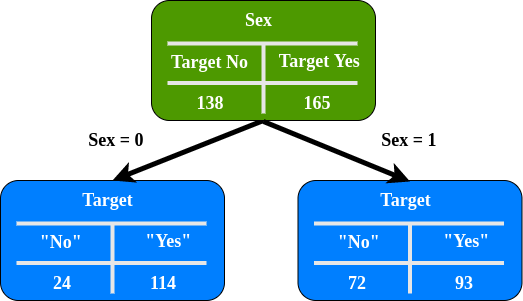

# tree

`scikit-learn` use an optimised version of the CART algorithm.

## Decision Tree Terminology

In keeping with the tree analogy, the terminology was adopted from the terminology of the tree.

- `Root node`: is the first node in decision trees
- `Splitting`: is a process of dividing node into two or more sub-nodes, starting from the root node.
- `Node`: splitting results from the root node into sub-nodes and splitting sub-nodes into further sub-nodes.
- `Leaf or terminal node`: end of a node, since node cannot be split anymore.
- `Pruning`: is a technique to reduce the size of the decision tree by removing sub-nodes of the decision tree. The aim is reducing complexity for improved predictive accuracy and to avoid overfitting.
- `Branch/Sub-Tree`: A subsection of the entire tree is called branch or sub-tree.
- `Parent and Child Node`: A node, which is divided into sub-nodes is called parent node of sub-bodes whereas sub-nodes are the child of parent node.

## Decision Tree Intuition
Let's consider the following example that a decision tree to decide tree to predict an salary on a baseball player case:

we predict a baseball players's Salary based on `Years` and `Hits`

- `Years`: the number of years that he has played in the leagues
- `Hits`: the number of hits that he made in the previous year

as the image shows us:

1. The root node split into sub-node with observation rule having $Years < 5$ to the left branch, which means the players in dataset with $Years < 4.5$ having mean los salary is 5.11
2. Players with $Years >= 4.5$ are assigned to the right branch and then that group is further subdivided by $Hits < 177.5$ having mean los salary of 6.
3. Players with $Years >= 4.5$ are assigned to the right branch and then that group is further subdivided by $hits >= 177.5$ having mean los salary of 6.74.

In this case, it can be seen that the decision tree makes a segment into three regions where this region determines to the salaries of baseball players and it can be said that the region is a decision boundary.
These three regions can be written as

- $R1 = \{X|Years<4.5\}$
- $R2 = \{X|Years>=4.5, Hits<117.5\}$
- $R3 = \{X|Years>=4.5, Hits>=117.5\}$

## Splitting in Decision Tree
In order to split the nodes at the most informative features using the decision algorithm, we start at the tree root and split the data on the feature that results in the largest information gain(IG). Here, the objective function is to maximize the information gain(IG) at each split, which we define as follows:
$$ IG(D_p,f) = I(D_p) - \sum_{j=1}^{m}\frac{N_j}{N_p}I(D_j) $$
where $f$ is the feature to perform the split,$D_p$ and $D_j$ are data set of the parent, $j-th$ child node, $I$ is out impurity measure, $N_p$is the total number of samples at the parent node, and $N_j$ is the number of samples in the $j-th$ child node.

As we can see, the information gain is simply the difference between the impurity of the parent node and the sum of the child node impurities --- the lower the impurity of the child nodes, the larger the information gain. however, for simplicity and to reduce the combinatorial search space, most libraries(including scikit-learn) implement binary decision trees. This means that each parent node is split into two child nodes, `D-left` and `D-right`.

$$ IG(d_p,f) = I(D_p) - \frac{N_{left}}{N_p}I(D_{left}) - \frac{N_{right}}{N_p}I(D_{right}) $$

impurity measure implements binary decisions trees and the three impurity measures or splitting criteria that are commonly used in binary decision trees are `Gini impurity(IG)`, `entropy(IH)` and `misclassification error(IE)`

### Gini Impurity

Gini impurity is a measure of how often a randomly chosen element from the set would be incorrectly labeled if it was randomly labeled according to the distribution of labels in the subset.
Mathematically, we can write Gini Impurity as following:
$$ I_{Gini} = 1 - \sum_{i=1}^{j}p_i^2 $$
where $j$ is the number of classes present in the node and $p$ is the distribution of the class in the node.

Simple simulation with [Heart Disease Data set](https://www.kaggle.com/datasets/johnsmith88/heart-disease-dataset?resource=download) with 303 rows and has 13 attributes. Target consist 138 value 0 and 165 value 1.

In order to build a decision tree from the dataset and to determine which separation is best, we need a way to measure and compare `Gini Impurity` in each attribute. The lowest `Gini Impurity` value on the first iteration will be the `Root Node`.

$$ I_{Gini} = 1 - (theProbabilityOfTarget"No")^2 - (the probability of target "Yes")^2 $$

In this simulation, only use the sex, fbs(fasting blood sugar), exang(exercise induced angina), and target attributes.

### How to measure Gini Impurity

Gini Impurity - Left Node
$$ I_{Left-Sex} = 1 - (\frac{24}{24+114})^2 - (\frac{114}{24+114})^2 = 0.29 $$
Gini Impurity - Right Node
$$ I_{right-sex} = 1 - (\frac{72}{72+93})^2 - (\frac{93}{72+93})^2 = 0.49 $$

Now that we have measured the Gini Impurity for both leaf nodes. We can calculate the total Gini Impurity with weight average. Left Node represented 138 patient while Right Node represented 165 patient.
Total Gini Impurity - Leaf Node.
$I_{sex} = weightAverageOfTheLeafNodeImpurities$
$I_{sex} = (\frac{138}{138+165})I_{Left-Sex}+(frac{165}{138+165})I_{Right-Sex}$
$I_{sex} = (\frac{138}{138+165})\cdot 0.29 + (frac{165}{138+165})\codt 0.49$
$I_{sex} = 0.399$

as the same way, we can compute Gini Impurity in Fbs/Exang attribute
$$ I_{Fbs} = 0.249 $$
$$ I_{Exang} = 0.399 $$

Fbs has the lowest Gini Impurity, so well use it at the Root Node.

## Entropy
Information gain is based on the concept of entropy, the entropy measure is defined as:
$$ I_{Entropy} = -\sum_{i=1}^{j}p_ilog_2p_i$$
where $j$ is the number of classes present in the node and $p$ is the distribution of the class in the node.
In the same case and same data set, we need a way to measure and compare Entropy in each attribute. The highest Entropy value on the first iteration will be the Root Node.
We need calculate entropy in Target attribute first:
$$ Entropy_{Target} = -(\frac{138}{138+165})log_2(\frac{138}{138+165}) - (\frac{165}{138+165})log_2(\frac{165}{138+165}) = 0.994 $$
measure Entropy in Sex attribute:

Entropy-Sex = 0
$$ Entropy_{Sex0} = -(\frac{24}{24+114})log_2(\frac{24}{24+114})-(\frac{114}(24+114))log_2(\frac{114}{24+114}) = 0.666$$
Entropy-Sex =1
$$ Entropy_{Sex0} = -(\frac{72}{72+93})log_2(\frac{72}{72+93})-(\frac{93}{72+93})log_2(\frac{93}{72+93}) = 0.988$$

Now that we have measured the Entropy for both leaf nodes. We take the weight average again to calculate the total entropy value.
$$ Entropy_(Target,Sex) = Entropy_{Target} - Entropy_{(Target,Sex)} $$
$$ Entropy_(Target,Sex) = 0.994 - [(\frac{138}{138+165})Entropy_{Sex0}+(\frac{165}{138+165})Entropy_{Sex1}] $$
$$ Entropy_(Target,Sex) = 0.994 - [(\frac{138}{138+165})0.666+(\frac{165}{138+165})0.988] $$
$$ Entropy_(Target,Sex) = 0.328 $$

as the same way, we can compute Gini Impurity in Fbs/Exang attribute
$$ Entropy_(Target,Fbs) = 0.389 $$
$$ Entropy_(Target,Exang) = 0.224 $$

Fbs has the highest Entropy, so we will use it at the Root Node, Precisely the same results we got from Gini Impurity.

refs:
https://medium.datadriveninvestor.com/the-basics-of-decision-trees-e5837cc2aba7
https://medium.com/analytics-vidhya/classification-in-decision-tree-a-step-by-step-cart-classification-and-regression-tree-8e5f5228b11e
https://arifromadhan19.medium.com/regrssion-in-decision-tree-a-step-by-step-cart-classification-and-regression-tree-196c6ac9711e

