# tree_AdaBoost

## 总结

1. adaboost森林中用的是stump树，stump树仅包含一个根节点和两个叶子节点
2. cart树会使用所有的特征，而stump树，仅仅使用一个特征，是weak learner
3. 随机森林中每棵树的权重是一样的，而在adaboost森林中，每棵树对最后的预测结果的权重是不一样的。
4. 随机森林中每棵树都是独立的，而在adaboost森林中，前一棵stump的error会影响到后一颗树
5. 过程：
  - 首先给每个样本初始化权重，等于总样本量的倒数
  - 使用每个特征分别创建stump树，并计算gini impurity，选择gini impurity最小的作为第一棵stump，并计算权重error。
  - 我们使用这个带权重的error来决定该棵树对最终结果的话语权。如果error越小，预测越准，则话语权越高
  - 前一棵树预测正确的样本的权重会衰减（后一棵树的话语权降低），预测错误的样本的权重会增加（后一颗树的话语权会升高）
6. 预测时，和随机森林一样，不过是每棵树的话语权会不一样

## 推导
let's start by using `Decision Trees` and `Random Forests` to explain the three main concepts behind `AdaBoost`.

In a `Random Forests`, each time you make a tree, you make a full sized tree. Some trees might be bigger than others, but there is no predetermined maximum depth.
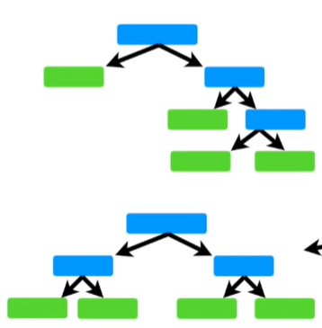
In contrast, in a `Forest of Trees` made with `Adaboost`, the trees are usually just a `node` and two `leaves`. A tree with just one node and two leaves is called a `stump`.so this is really a `Forest of Stumps` rather than trees. `Stumps` are not great at making accurate classifications.
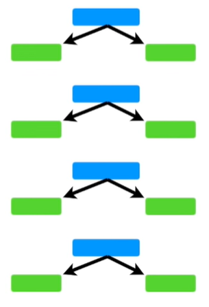
For example, if we were using this data to determine if someone has `heart disease` or not. Then a full sized `Decision Tree` would take advantage of all 4 variables that we measured(Chest Pain,Blood Circulation,Blocked Arteries and Weight) to make a decision.
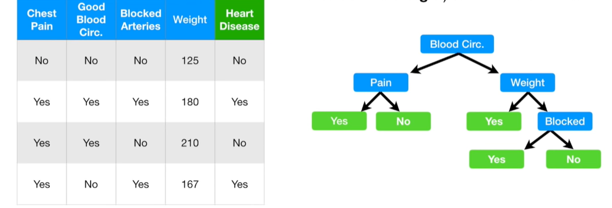
But a stump can only use one variable to make a decision.Thus, `Stumps` are technically "weak learners".
In a `Random Forest`, each tree has an equal vote on the final classification. In contrast, in a `Forest of Stumps` made with `AdaBoost`, some stumps get more say in the final classification than others. In this illustration, the larger stumps get more say in the final classification than the smaller stumps.
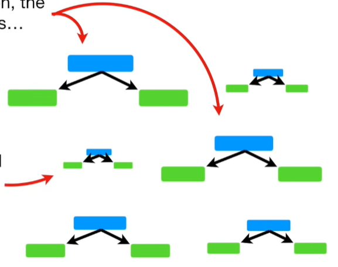
Lastly, in a `Random Forest`, each decision tree is made independently of the others. In contrast, in a `Forest of Stumps` made with `AdaBoost`, order is important. The errors that the first stump makes influence how the second stump is made and the errors that the second stump makes influence how the third stump is made. etc.etc.etc.
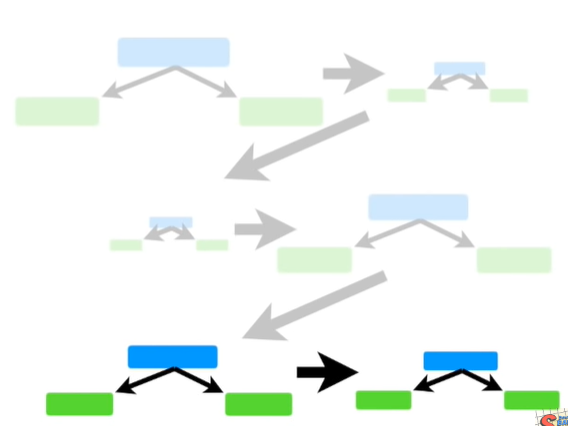

To review, the three ideas behind `AdaBoost` are:

1. `AdaBoost` combines a lot of "weak learners" to make classification. The weak learners are almost aways stumps
2. Some `Stumps` get more say in the classification than others.
3. Each `stump` is made by taking the previous `stump's` mistakes into account.

Now let's dive into the nitty gritty detail of how to create a `Forest of Stumps` using `AdaBoost`.

First, we'll start with some data.
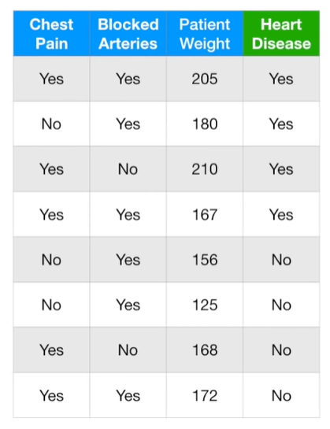
We create a `Forest of Stumps` with `AdaBoost` to predict if a patient has heart disease. We will make these predictions based on a patient's `Chest Pain` and `Blocked Artery` status and their `Weight`.
The first thing we do is give each sample a weight that indicates how important it is to be correctly classified. At start, all samples get the same weight $\frac{1}{totalNumberOfSamples}=\frac{1}{8}$ and this makes the samples all equally important.
However, after we make the first stump, these weights will change in order to guide how the next stump is created. In other words, we'll talk more about the Sample Weights later.
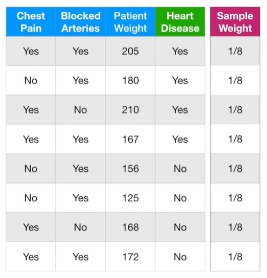
Now we need to make the first `stump` in the forest. This is done finding the variable,Chest Pain, Blocked Arteries or Patient Weight, that does the best job classifying the samples.
NOTE: Because all of the weights are the same, we can ignore them right now.
The `Gini Index` for `Patient Weight` is the lowest
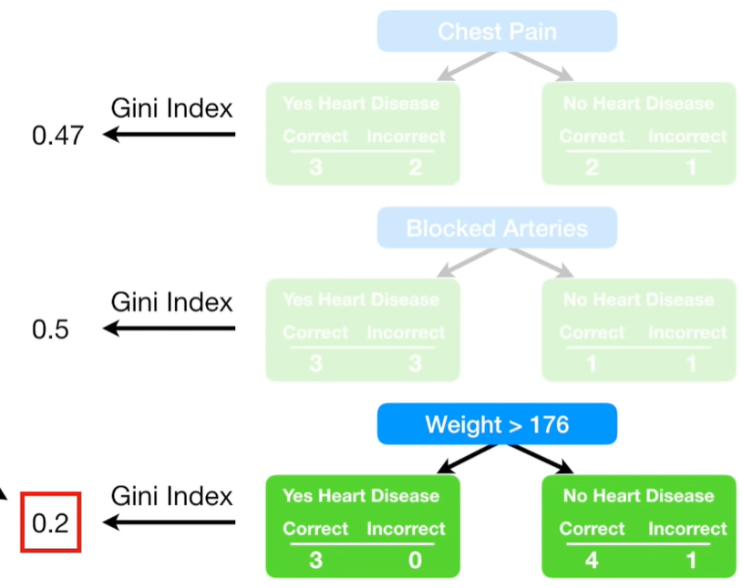
So this will be the first stump in the forest. Now we need to determine how much say this stump will have in the final classification. it's based on how well it classified the samples. This stump made on error.This patient, who weighs less than 176, has `heart disease`, but the stump says they do not. The `Total Error` for a stump is the sum of the weights associated with the incorrectly classified samples.Thus, in this case, the Total Error is 1/8.
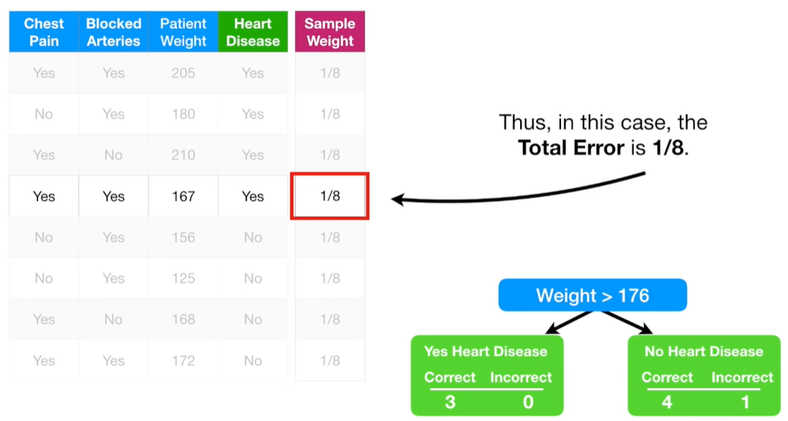
We use the `Total Error` to determine `Amount of say` this stump has in the final classification with the following formula:
$$ AmountOfSay = \frac{1}{2}log(\frac{1-TotalError}{Total Error}) $$
We can draw a graph of the `Amount of Say` by plugging in a bunch of numbers between 0 and 1 for `Total Error`.The Blue Line tells us the `Amount of Say` for `Total Error` values between 0 and 1. When a stump does a good job, and the `Total Error` is small. Then the `Amount of Say` is a relatively large, positive value. When a stump is no better at classification than flipping a coin and `Total Error = 0.5`, then the `Amount of say` will be 0. And when a stump does a terrible job and the `Total Error` is close to 1, in other words, if the stump consistently gives you the opposite classification, then the `Amount of Say` will be a large negative value. So if a stump votes for `Heart disease`, the negative `Amount of Say` will turn that vote into `Not Heart Disease`.
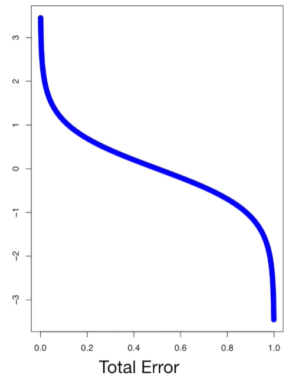
With $Patient Weight > 176$, the `Total Error` is 1/8, so we just plug and chug and the `Amount of Say` that this stump has on the final classification is 0.97.
$$ AmountOfSay = \frac{1}{2}log(\frac{1-1/8}{1/8})=0.97 $$
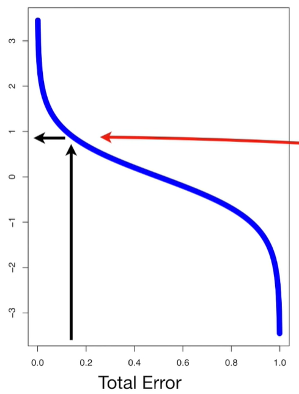

Now we know how the `Sample Weights` for the incorrectly classified samples are used to determine the `Amount of Say` each stumps gets.
Now we need to learn how to modify the weights so that the next stump will take the errors that the current stump made into account.Let's go back to the first stump that we made.
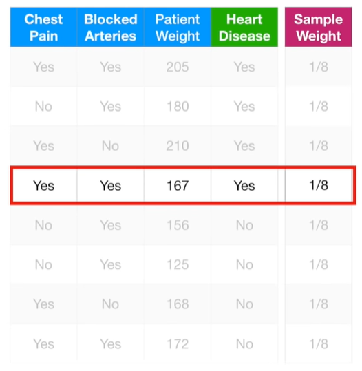

When we created this stump, all of the `Sample Weight` were the same and that meant we did not emphasize the importance of correctly classifying any particular sample.But since this stump incorrectly classified this sample, we will emphasize the need for the next stump to correctly classify it by increasing its `Sample Weight` and decreasing all of the other `Sample Weights`.Let's start by increasing the `Sample Weight` for the incorrectly classified sample.
This is the formula we will use to increase the `Sample Weight` for the sample that was incorrectly classified.
$$ NewSampleWeight = sampleWeight \cdot e^{amountOfSay}  = \frac{1}{8}e^{amountOfSay} = \frac{1}{8} \cdot e^0.97=0.33$$
To get a better understanding of how $e^{amountOfSay}$ will scale the previous `Sample Weight`,let's draw a graph.
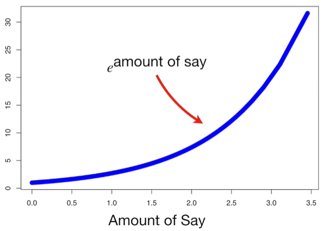

When the `Amount of Say` is relatively large(the last stump did a good job classifying samples),then we will scale the previous `Sample Weight` with a large number.This means that the `New Sample Weight` will be much larger than the old one.And when the `Amount of Say` is relatively low(the last stump did not do a very good job classifying samples) then the previous `Sample Weight` is scaled by a relatively small number.This means that the `New Sample Weight` will only be a little larger than the old one.
In this example, the `Amount of Say` was 0.97, That means the new `Sample Weight is 0.33`,which is more than the old one(1/8).

Now we need to decrease the `Sample Weight` for all of the correctly classified samples.
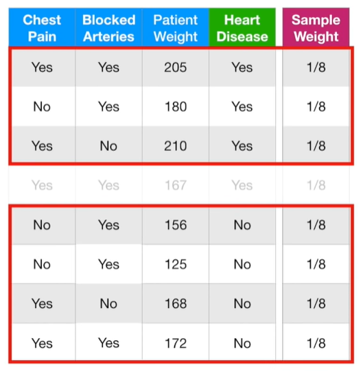

This is the formula we will use to decrease the `Samples Weights`. The big difference is the negative sign in front of `Amount of Say`.

$$ NewSampleWeight = sampleWeight \cdot e^{-amountOfSay} = \frac{1}{8}e^{-amountOfSay}=\frac{1}{8} \cdot e^{-0.97} =0.05$$

We will keep track of the New Sample Weights in this column.We plug in 0.33 for the sample that was incorrectly classified and all of the other samples get 0.05.
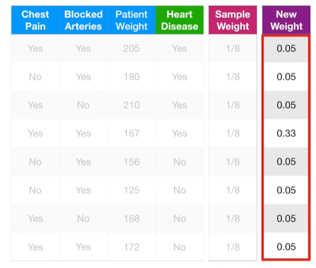
Now we need to normalize the `New Sample Weights` so that they will add up to 1.
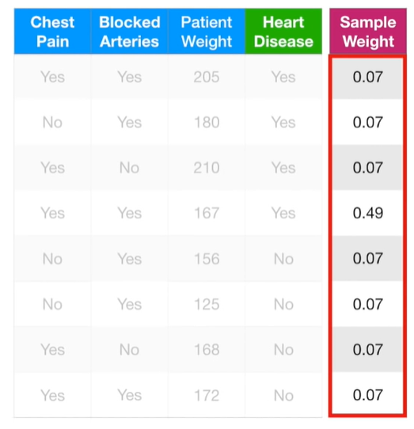
Now we can use the modified `Sample Weights` to make the second stump in the forest.In theory, we could use the `Sample Weights` to calculate `Weighted Gini Indexes` to determine which variable should split the next stump.The `Weighted Gini Index` would put more emphasis on correctly classifying this sample(the one that was misclassified by the last stump),since this sample has the largest `Sample Weight`.
Alternatively, instead of using a `Weighted Gini Index`, we can make a new collection of samples that contains duplicate copies of the samples with the largest Sample Weights.
We start by making a new, but empty, dataset that is the same size as the original.Then we pick a random number between 0 and 1. And we see where that number falls when we use the `Sample Weights` like a distribution.
If the number is between 0 and 0.07, then we would put this sample into the new collection of samples
If the number is between 0.21 and 0.70(0.21+0.49=0.70), then we would put this sample into the new collection of samples.

We get new dataset:
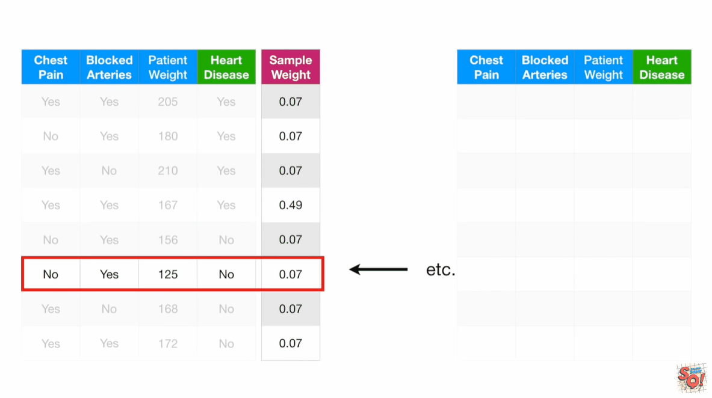
Lastly,we give all the samples equal `Sample Weights`, just like before.
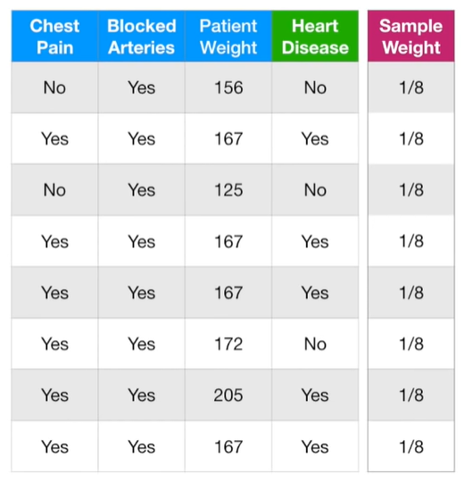
However, that doesn't mean the nex stump will not emphasize the need to correctly classify these samples.Because these samples are all the same, they will be treated as a block, creating a large penalty for being misclassified.
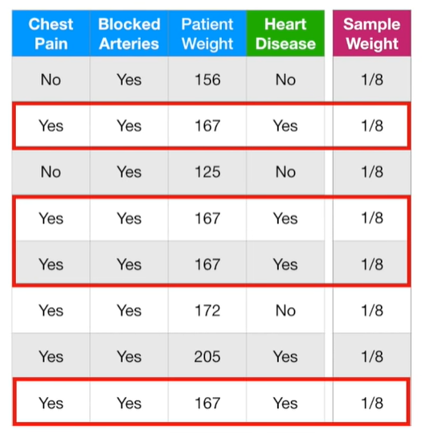
Now we go back to the beginning and try to find the stump that does the best job classifying the new collection of samples. So that is how the errors that the first tree makes influence how the second tree is made.

## predict
Now we need to talk about how a forest of stumps created by `AdaBoost` makes classifications.Imagine that these left stumps classified a patient as `Has Heart Disease` and the `Amount of Say`. the right stumps classified the patient as `Does not Have Heart Disease` and their `Amount of Say`. Now we add up the `Amounts of Say` for each group of stumps.Ultimately, the patient is classified as `Has Heart Disease` because this is the larger sum.
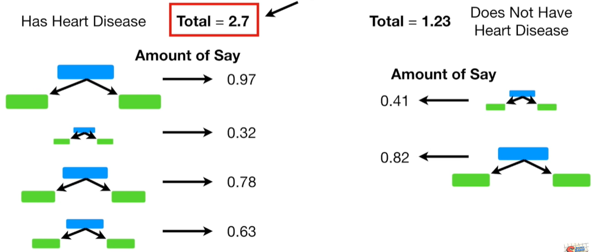

refs:
https://www.youtube.com/watch?v=LsK-xG1cLYA&t=67s