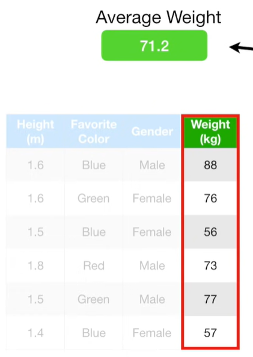
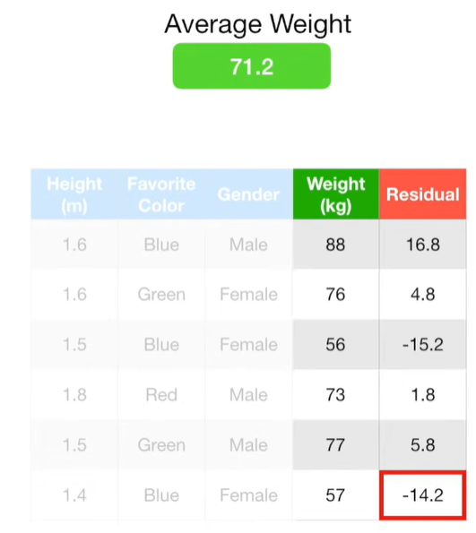
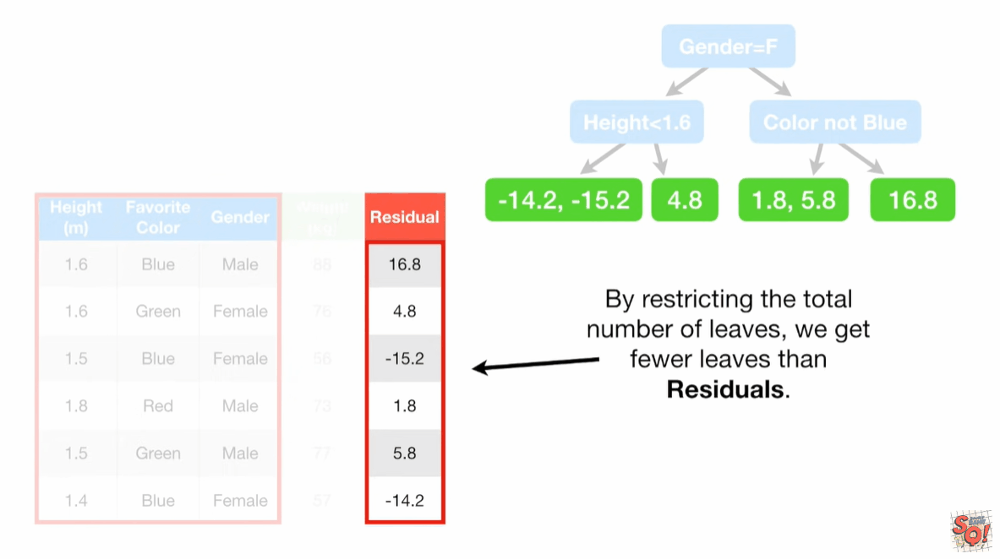
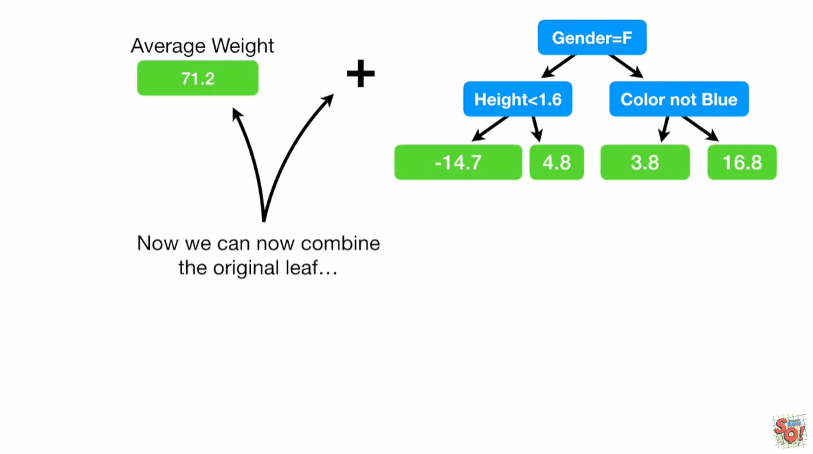
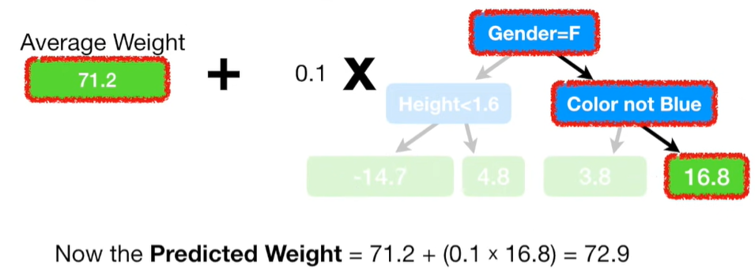
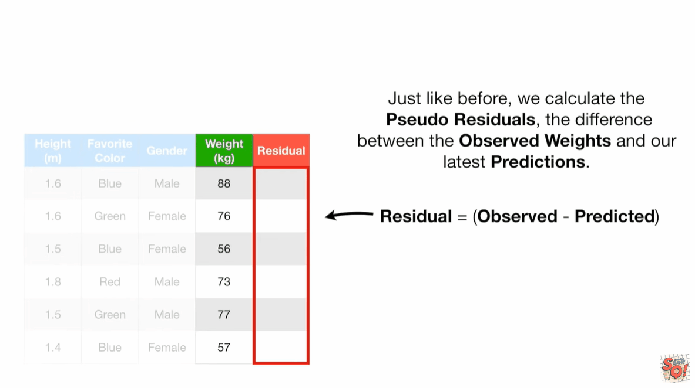
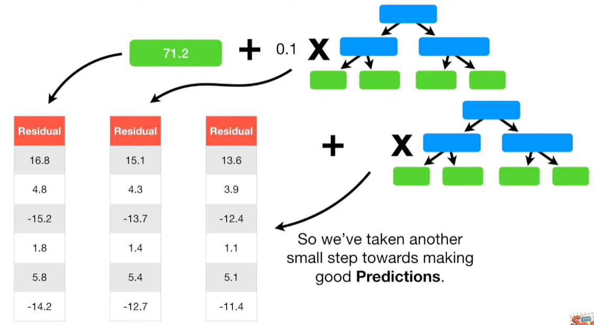

# tree_GradientBoost

## 总结
1. Gradient Boost最初会做一个单独的叶子节点，而不是tree或者stump，这个叶子节点随机猜测目标值，第一次预测是平均值
2. 将每个样本实际值，减去预测值，得到每个样本的pseudo residual
3. 然后我们建立一棵树分别预测每个样本的pseudo residual
4. 现在预测值就是最初的平均值加上这棵树的预测值（我们给这棵树的预测值加上一个权重，就是学习速率）
5. 如此循环下去

## 流程
Specifically, we will use this data where we have the `Height` measurements from 6 people, their favorite colors, their genders and their weights.

`Gradient Boost` starts by making a single leaf, instead of a tree or stump. This leaf represents an initial guess for the `Weights` of all of the samples.When trying to predict a continuous value like weight, the first guess is the average value.Then `gradient boost` builds a tree.Like `AdaBoost`,this tree is based on the errors made by the previous tree.But unlike `Adaboost`, this tree is usually larger than a stump. That said, `Gradient Boost` still restricts the size of the tree.
In practice, people often set the maximum number of leaves to be between 8 and 32.Thus, like `AdaBoost`, `Gradient Boost` builds fixed sized trees based on the previous tree's errors, but unlike `AdaBoost`, each tree can be larger than a stump.
Then `Gradient Boost` builds another tree based on the errors made by the previous tree and then it scales the tree and `Gradient Boost` continues to build trees in this fashion until it has made the number of trees you ask for, or additional trees fail to improve the fit.
Let's see how the most common `Gradient Boost` configuration would use this training data to predict weight.
The first thing we do is calculate the average weight. This is the first attempt at predicting everyone's weight.In other words, if we stopped right now, we would predict that everyone weighted 71.2 kg.

The next thing we do is build a tree based on the errors from the first tree.The errors the previous tree made are the differences between the observed weights and the predicted weight, 71.2.So let's start by plugging in 71.2 for the predicted weight and then plug in the first observed weight and do the math. And save the difference, which is called a `Pseudo Residual`, in a column.
$$ 88-71.2=16.8  $$
NOTE:The term `Pseudo Residual` is based on `linear regression`, where difference between observed values and the predicted values results in residuals. The `Pseudo` part of `Pseudo Residual` is a reminder that we are doing `Gradient Boost` not `Linear Regression`.
Now we do the same thing for the remaining weights.

Now we will build a tree,using `Height`,`Favorite color` and `Gender`.If it seems strange to predict the residuals instead of the original weights.
Remember, in this example, we are only allowing up to four leaves,but when using a larger dataset, it is common to allow anywhere from 8 to 32. By restricting the total number of leaves, we get fewer leaves than residuals.

Now we can combine the original leaf with the new tree to make a new prediction of an individual's weight from the training data. We start with the initial prediction, 71.2. Then we run the data down the tree and we get 16.8, so the predict weight = 71.2 + 16.8 = 88 which is the same as the observed weight.

The model fits the training data too well.In other words, we have low bias, but probably very high variance.`Gradient Boost` deals with this problem by using a `Learning Rate` to scale the contribution from the new tree. The `Learning Rate` is a value between 0 and 1.In this case, we'll set the `Learning Rate` to 0.1. Now the predicted weight = 71.2 + (0.1 * 16.8) = 72.9.

With the Learning Rate set to 0.1, the new prediction is not as good as it was before.But it's a little bit better than the prediction made with just the original leaf, which predicted that all samples would weight 71.2.
In other words, scaling the tree by the `Learning Rate` results in a small step in the right direction.According to the dude that invented `Gradient Boost`,Jerome Friedman, empirical evidence shows that taking lots of small steps in the right direction results in better predictions with a testing dataset, i.e. lower variance.
So let's build another tree so we can take another small step in the right direction.Just like before, we calculate the `Pseudo residuals`, between the observed weights and our latest predictions.

as above, we can continue to build tree with `Learning Rate = 0.1`, every tree, will fit the residuals the previous tree made.

Remember, the left residuals is when we just used a single leaf to `predict weight`. The middle residuals is after we added the first tree to the prediction. The right residuals is after we added the second tree to the prediction.Each time we add a tree to the prediction, the residuals get smaller.So we've taken another small step towards making good predictions.

refs:
https://www.youtube.com/watch?v=3CC4N4z3GJc