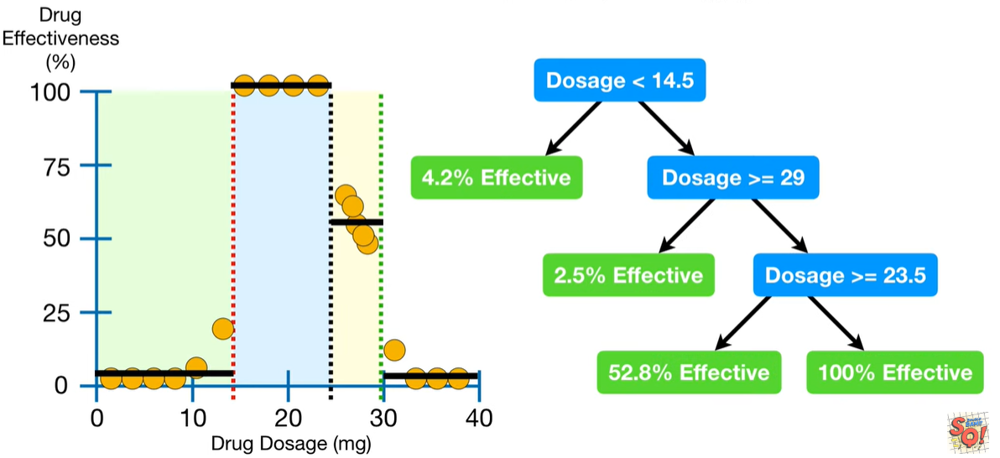

# tree_pruning

as in previous article [alg_tree_regression](/alg_tree_regression/), we build a pretty tree reflecting the training data.

However, what if these `red circle` were `testing data`. The `Residuals` for these Observations are much larger.These 4 observations from the `Training Data` with 100% `Drug Effectiveness` now look a little bit like outliers. And that means that maybe we overfit the `Regression Tree` to the `Training data`.

One way to prevent `overfitting` a `Regression Tree` to the `Training Data` is to remove some of the leaves and replace the split with a leaf that is the average of a larger number of observations.Now all of the observations between 14.5 and 29 go to the leaf on the far right.

The large `Residuals` tell us that the new tree doesn't fit the training data as well as before but the new sub-tree does a much better job with the testing data.So that we will do a better job with the `testing data`.

NOTE: If we wanted to prune the tree more,like this:

How do we decide which tree to use? The answer is `Cost Complexity Pruning`.
The first step in `Cost Complexity Pruning` is to calculate the `Sum of Squared Residuals` for each tree. 

NOTE: The `Sum of Squared Residuals` is relatively small for the original, full sized tree, but each time we remove a leaf, the `Sum of Squared Residuals` gets larger and larger.However,we knew that was going to happen because the whole idea was for the pruned trees to not fit the `training data` as well as the fill sized tree.

So how do we compare these trees?

Weakest Link Pruning works by calculating a `Tree Score` that is based on the `Sum of Squared Residuals(SSR)` for the tree or sub-tree and a `Tree complexity Penalty` that is a function of the number of leaves,or terminal nodes, in the tree or sub-tree. The `Tree complexity Penalty` compensates for the difference in the number of leaves.
NOTE: $\alpha$ is a tuning parameter that we finding using `Cross Validation` and we'll talk more about it in a bit. For now, let's let $\alpha = 10000$.

$$ TreeScore = SSR + \alpha \cdot T $$

Now let's calculate the `Tree Score` for each tree.

First, use all of the data and build a full sized `Regression Tree`.
NOTE: This full sized tree is different than before because it was fit to all of the data, not just the training data.
ALSO NOTE: This full sized tree has the lowest Tree Score when $\alpha = 0$. This is because when $\alpha = 0$, the `Tree Complexity Penalty` becomes 0 and the `Tree Score` is just the `Sum of the Squared Residuals` and, as we saw earlier, all of the sub-trees will have larger `Sum of Squared Residuals`. So let's put $\alpha = 0$ here, to remind us that this tree has the lowest `Tree Score` when $\alpha = 0$. Now we increase $\alpha$ until pruning leaves will give us a lower `Tree Score`.

In this case, when $\alpha = 10000$, we'll get a lower `Tree Score` if we remove these leaves and use this sub-tree.

In this case, when $\alpha = 15000$, we'll get a lower `Tree Score` if we remove these leaves and use this sub-tree.

And when $\alpha = 22000$, we will get a lower `Tree Score` if we remove these leaves and use this sub-tree.

Now go back to the full dataset and divide it into training and testing datasets. And just using the training data use the $\alpha$ values we found before to build a full tree and a sequence of sub-trees that minimize the `Tree Score`.

Now calculate the `Sum of Squared Residuals` for each new tree using only the `Testing Data`.

In this case, the tree with $\alpha = 10000$ had the smallest Sum of Squared Residuals for the Testing Data.

Now we just keep repeating until we have done `10-Fold Cross Validation` and the value for $\alpha$ that, on average, gave us the lowest sum of squared residual with the testing dta, is the final value for $\alpha$. In this case, the optimal trees built with $\alpha = 10000$ had, on average, the lowest `Sum of Squared Residuals`, so it is our final value.

refs:
https://www.youtube.com/watch?v=D0efHEJsfHo