# classification

## 总结

1. cart树是一个二叉树，只判断true或false，ture是左child，false是右child
2. 当最终预测的叶子节点包含了混合的预测特征的样本（比如二分类问题，最终叶子节点既包含了0，又包含了1），我们称为`impure`。如果仅包含了一种预测样本，我们称为`pure`.
3. 显然`pure`的叶子节点预测的效果更好，我们可以使用`Gini impurity`或`Entropy and Information Gain`来量化`impurity`. scikit-learn是使用`Gini impurity`
4. 计算过程
  - 遍历所有候选特征，计算每一个候选特征的`total gini impurity`, `tottal gini impurity` 等于各个子叶子的`gini impurity`的权重和
  - 每个叶子节点的`gini impurity`，对于二分类问题是`1-P(yes or no)`的概率，显然如果只有一个分类是0，而各占50%时，达到最大值。如果有多个分类，则要计算每个分类。
  - 选择`total gini impurity`作为分裂的节点
5. 对于连续性的数值特征，排序后分别取相邻两点的均值作为分裂点，既如果有n个数值，则会有n-2个分裂点

## 推演
here's a more complicated classification tree
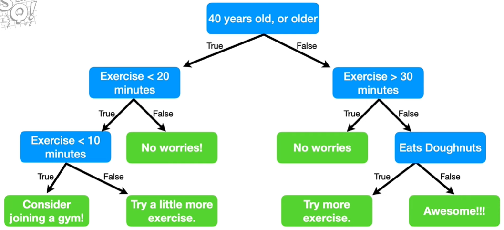
It combnines numeric data with yes/no data.
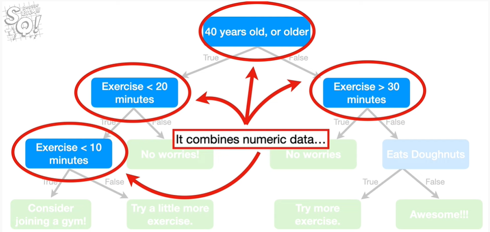
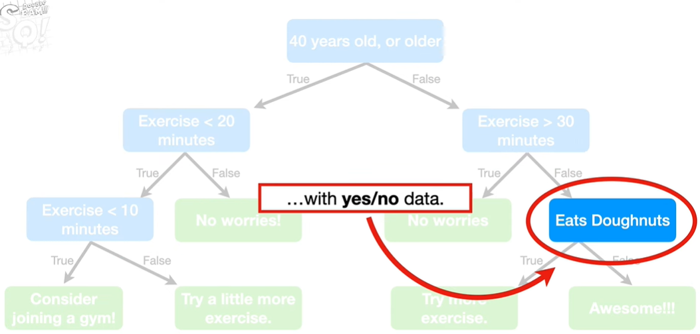
So it's Ok to mix data types in the same tree.

Also notice that the tree asks about Exercising multiple times and the amount of time Exercising isn't always the same.

So numeric thresholds can be different for the same data.
Lastly, the final classification can be repeated.

Note: So far I've been labeling the arrows with true or false, but usually it is just assumed that if a statement is true, you go to the left and if a statement is False, you go to the right. So, sometimes you see true and false labels, sometimes you don't. It's no big deal.

The very top of the tree is called the root node or just the root.

These are called internal nodes or branches.Branches have arrows pointing to them and they have arrows pointing away from them.

Lastly, these are called Leaf nodes or just Leaves.Leaves have arrows pointing to them but there are no arrows pointing away from them.

let's see how to build a tree starting with just data.

The first thing we do decide whether `Loves Popcorn`, `Loves Soda`, or `Age` should be the question we ask at the very top of the tree.
To make this decision, we'll start by looking at how well `Loves Popcorn` predicts whether or not someone `Loves Cool As Ice`.
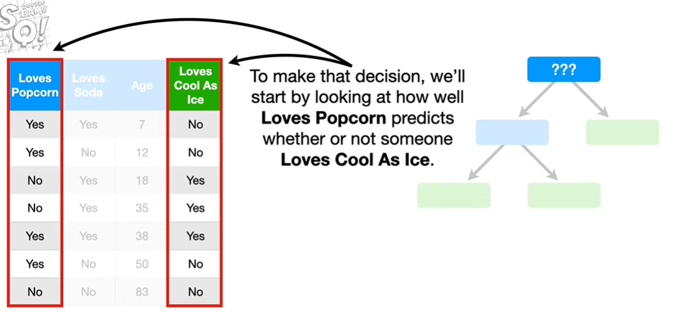
To do this, we'll make a super simple tree that only asks if someone `Loves Popcorn` and then we run the data down the tree. For example, the first person in the dataset `Loves Popcorn`, so they go the Leaf on the left. And because they do not `Love Cool As Ice` we'll keep track that by putting a `1` under the word `No`.
we'll do this for all data in the dataset.
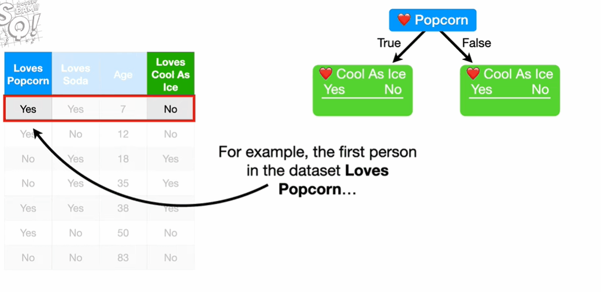

Now let's do the exact same thing for `loves Soda`.Looking at the two little trees, we see that neither one does a perfect job predicting who will and will not `Love Cool As Ice`.
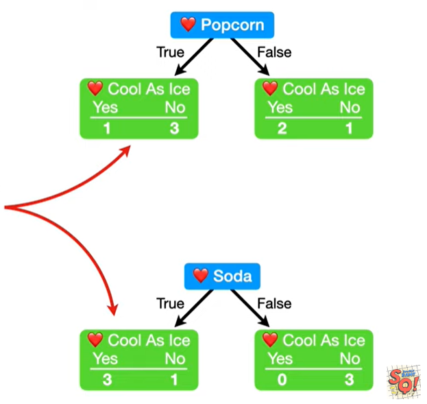

Specifically, these three Leaves contain mixtures of people that do and do not `Love Cool As Ice`.
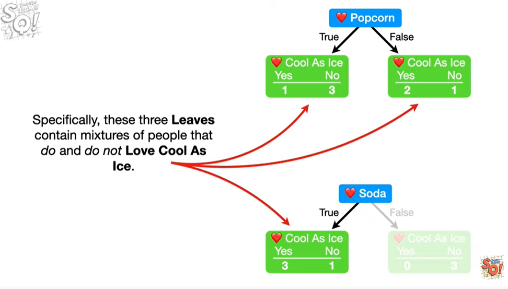

Because these three `leaves` all contain a mixture of people who do or do not `Love Cool As Ice`, so they are called `Impure`.
In contrast, this `Leaf` only contains people who do not `Love Cool As Ice`.This is called `Pure`.
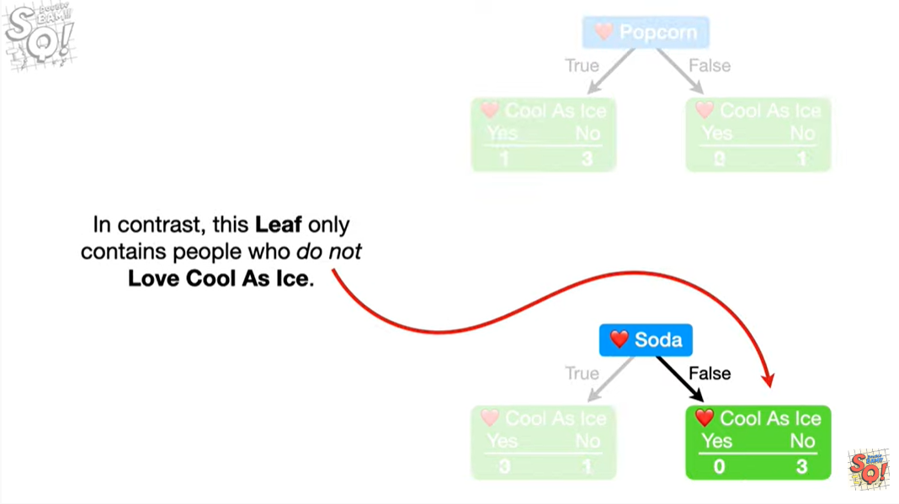
Because both `Leaves` in the `Loves Popcorn` tree are `Impure` and only one `Leaf` in the `Loves Soda` tree is `Impure`, it seems like `Loves Soda` does a better job predicting who will and will not `Love Cool As Ice`. But it would be nice if we can quantify the differences between `Loves Popcorn` and `Loves Soda`. 
The good news is that there are several ways to quantify the `impurity` of the `leaves`. One of the most popular methods is called `Gini impurity`, but there are also fancy sounding methods like `Entropy` and `Information Gain`. However, numerically, the methods are all quite similar, so we will focus on `Gini Impurity` since, not only it is very popular, I think it is the most straightforward.
So let's start by calculating the `Gini impurity` for `Loves Popcorn`.
To calculate the `Gini impurity` for `Loves Popcorn`, we start by calculating the `Gini impurity` for the individual `Child Leaves`.
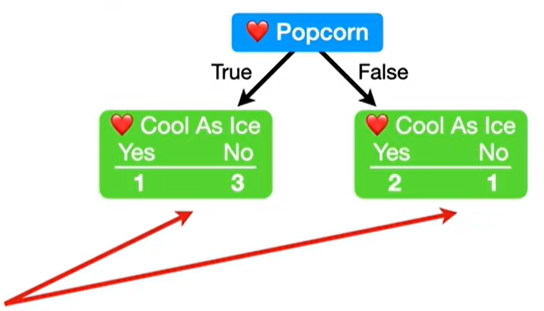

The `Gini Impurity` for the `Leaf` on the left is 
$$Gini Impurity for a Leaf = 1 - (the probability of "Yes")^2-(the probability of "No")^2$$
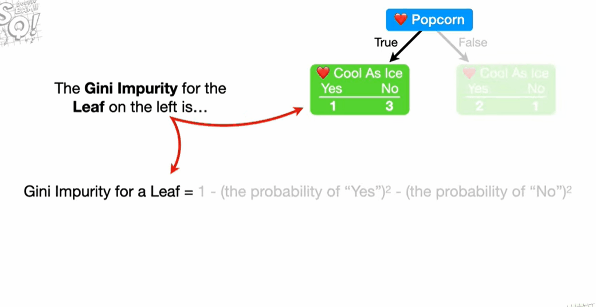
we can get:
$$Gini_{left_leaf} = 1- (\frac{1}{1+3})^2 + (\frac{3}{1+3})^2 = 0.375 $$
$$Gini_{right_leaf} = 1- (\frac{2}{2+1})^2 + (\frac{1}{2+1})^2 = 0.444 $$

Now, because the `Leaf` on the left has 4 people in it and `Leaf` on the right only has 3 people in it. The `Child Leaves` do not represent the same number of people.

$$ Total Gini Impurity = weighted average of Gini Impurities for the leaves $$
Thus, the total `Gini Impurity` is the `Weighted Average` of the `Leaf Impurities`.

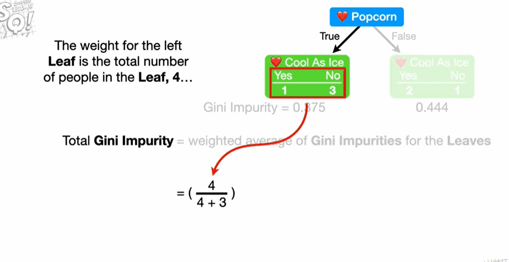

$$ Gini_{Loves_Popcorn} = \frac{4}{4+3}0.375 + \frac{3}{4+3}0.444 = 0.405 $$

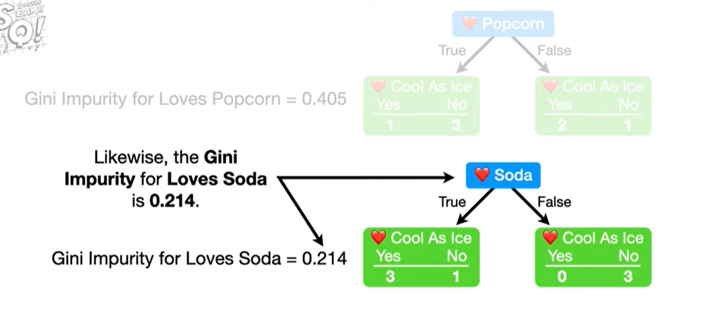
$$ Gini_{Loves_Soda} = 0.214 $$

Now we need to calculate the `Gini Impurity` for `Age`. However, because `Age` contains numeric data, calculating the `Gini Impurity` is a little more involved.
The first thing we do is sort the rows by `Age`, from lowest value to highest value. Then we calculate the average `Age` for all adjacent people. Lastly, we calculate the `Gini Impurity` values for each average age.
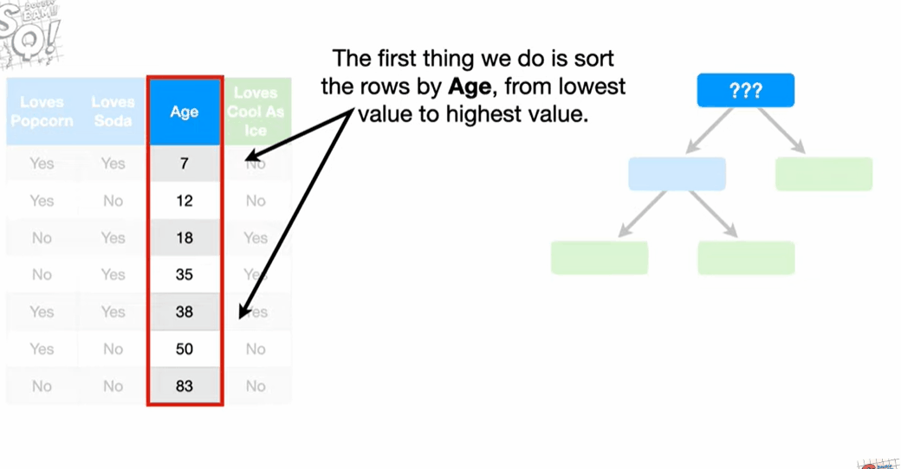

For example, to calculate the `Gini Impurity` for the first value:
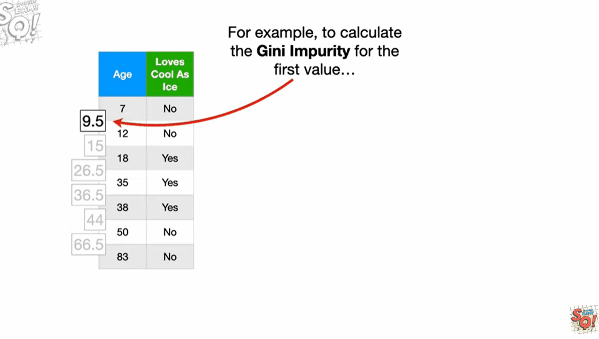
These two candidate thresholds, 15 and 44, are tied for the lowest Impurity 0.343.
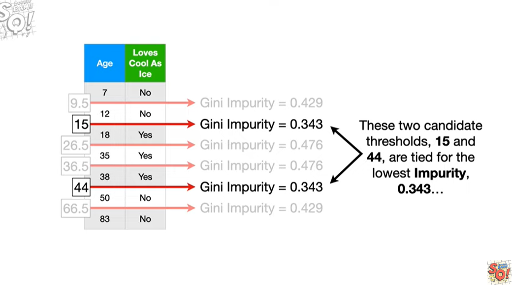
so we can pick either one.In this case, we'll pick 15
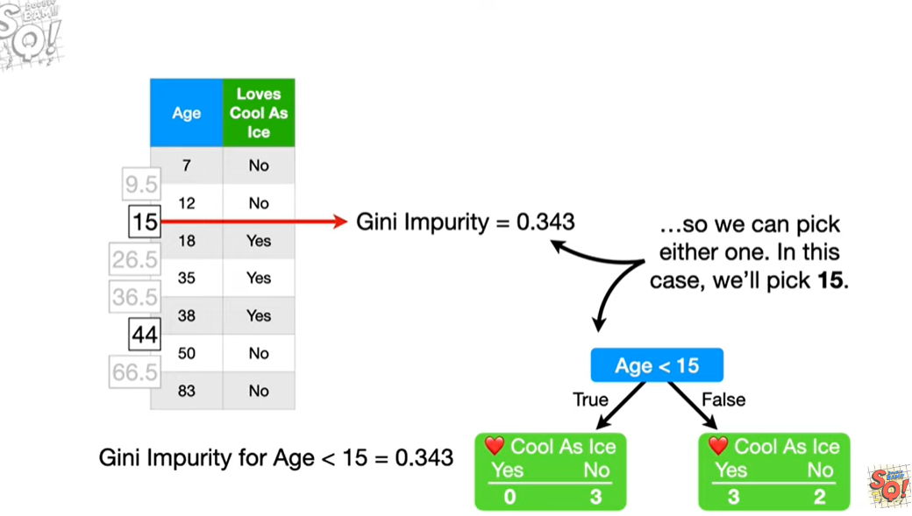

However, remember that we are comparing `Gini Impurity` values for `Age`,`Loves Popcorn` and `Loves Soda` to decide which feature should be at the very top of the tree.

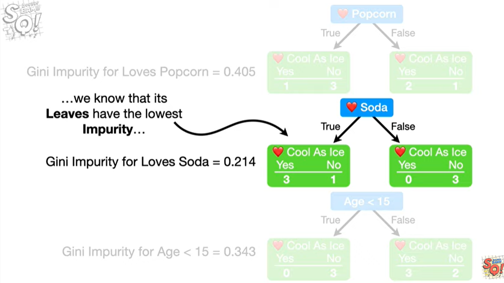
because `Loves Soda` has the lowest `Gini Impurity` overall, so we put `Loves Soda` at the top of the tree.
Now the 4 people that `Loves Soda` go to a `Node` on the left and the people that do not `Loves Soda` go to a `Node` on the right
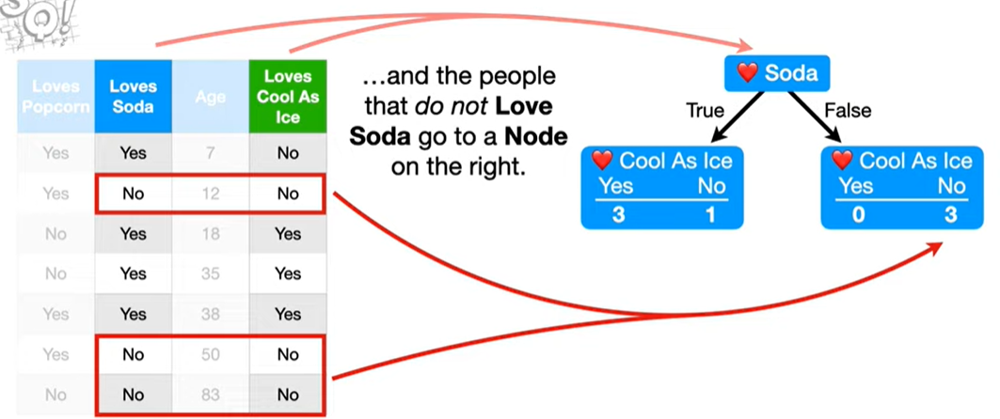

Now let's focus on the `Node` on the left. All 4 people that `Loves Soda` are in this `Node`. 3 of people `Loves cool as Ice` and 1 does not. so this node is `Impure`. So let's see if we can reduce the `Impurity` by splitting the people that `Love Soda` based on `Loves Popcorn` or `Age`.

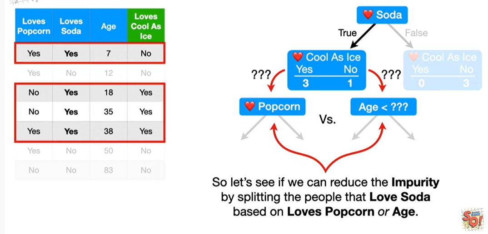

Like above, we can compute the `Gini Impurity` of `Loves Popcorn` and `Loves Age`:
$$ Gini_{Popcorn} = 0.25 $$
$$ GIni_{Age} = 0 $$
so we choose the `Loves Age` as the `Leaf` of `Loves Soda`.

NOTE: These are `Leaves` because there is no reason to continue splitting these people into smaller groups.
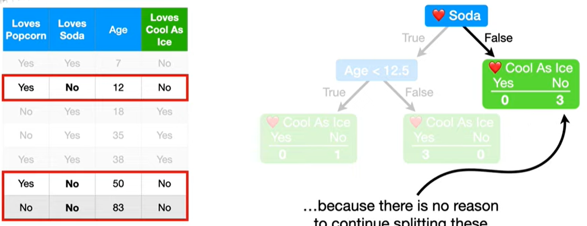
Likewise, this `Node`, consisting of 3 people who do not `Love Soda`, is also a `Leaf`, because there is no reason to continue splitting these people into smaller groups.
Now there is just one last thing we need to do before we are done building this tree. We need assign output values for each `Leaf`. Generally speaking, the output of a `Leaf` is whatever category that has the most votes. In other words, the majority of the people in that Leaves do not `Love Cool As Ice` will be replaced by `Does Not Love Cool As Ice`.On contrast, the majority of the people in that Leaves do `Love Cool As Ice` will be replaced by `Love Cool As Ice`.
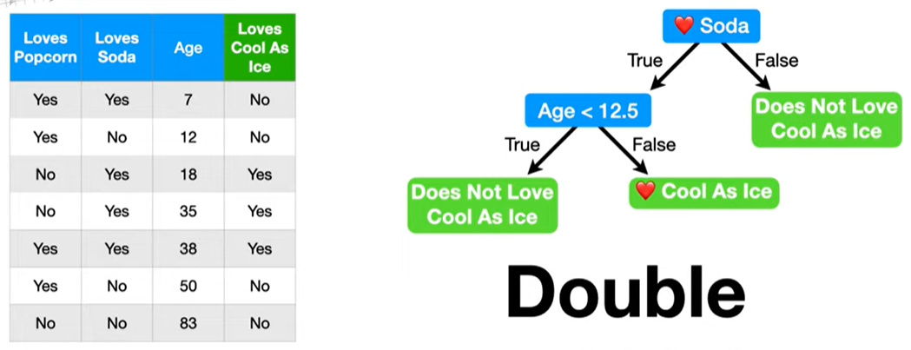
we build a tree from the data.

## more detail
when we built this tree, only one person in the original dataset make it to this `Leaf`. Because so few people made it to this `Leaf`, it's hard to have confidence that it will do a great job making predictions with future data. And it's possible that we have `Overfit` the data. Regardless, in practice, there are two main ways to deal with this problem.
One method is called `Pruning`. Alternatively, we can put limits on how trees grow, for example, by requiring 3 or more people per leaf. Now we end up with an `Impure Leaf`,but also a better sense of the accuracy of our prediction, because we know that only 75% of the people in the `Leaf Loved Cool As Ice`.

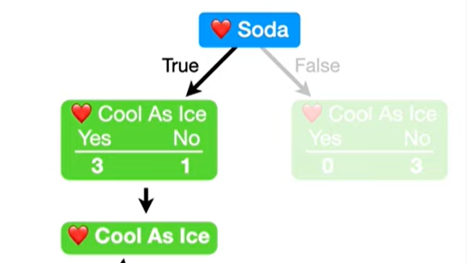

NOTE: Even when a `Leaf` is `Impure` we still need an output value to make a classification and since most of the people in this leaf `Love Cool As Ice`, that will be the output value.

