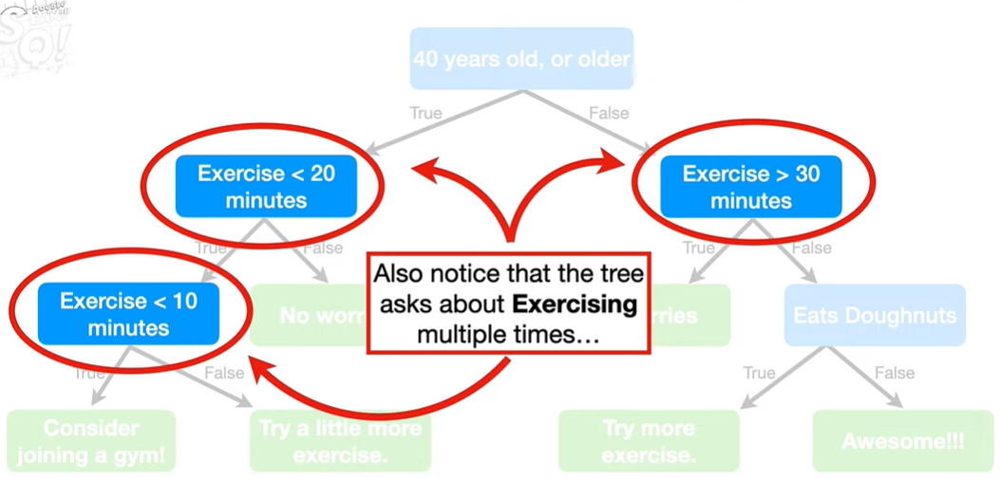
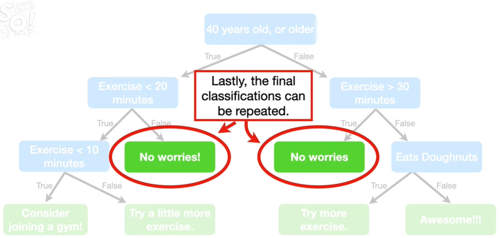
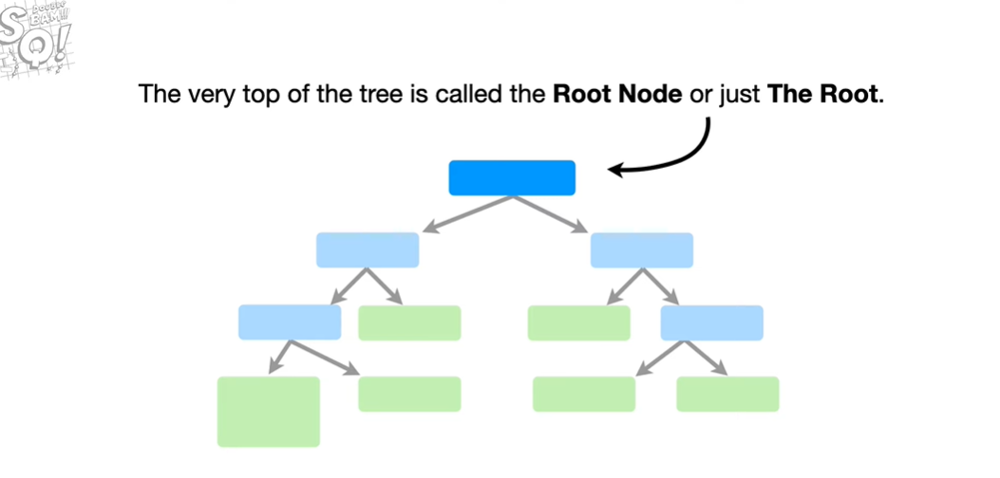
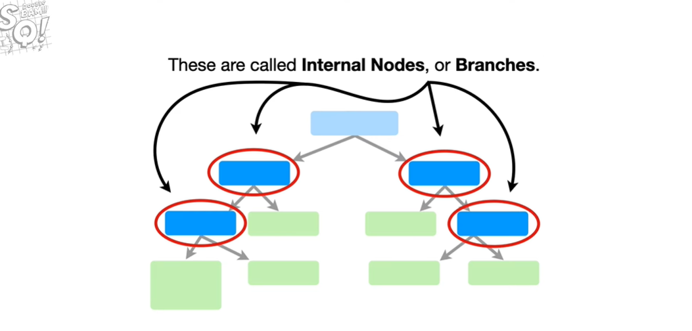
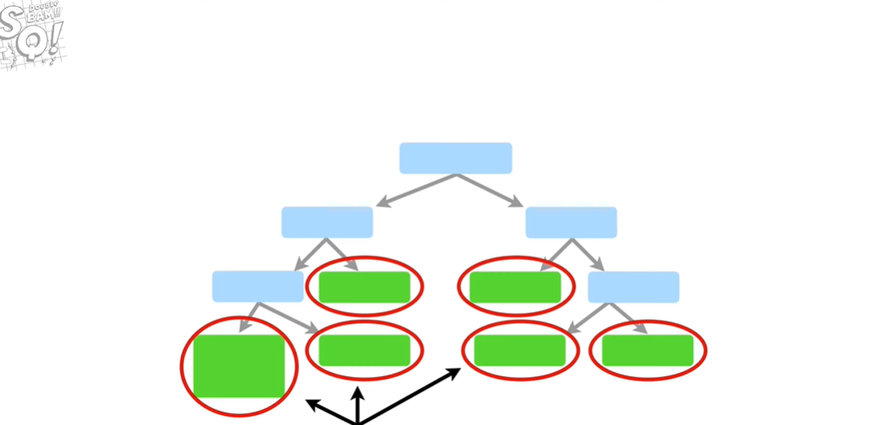
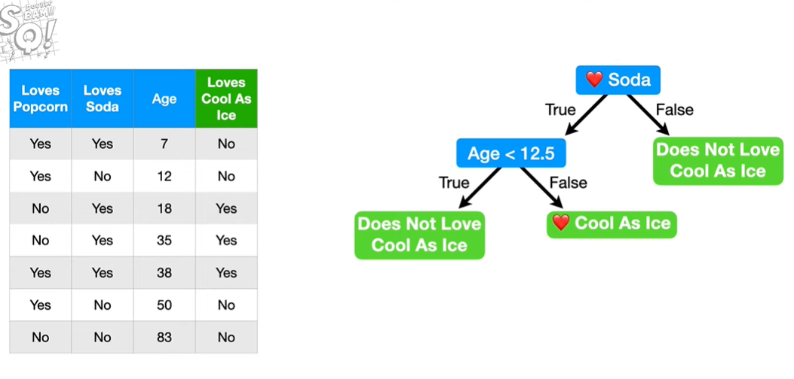

# tree_gradientBoost_classification

We start with a leaf that represents an initial prediction for every individual. When we use `gradient boost` for `classification`,the initial prediction for every individuals is the `log`(odds).think of the log(odds) as the logistic regression equivalent of the average.So let's calculate the overall `log(odds)` that someone `Loves Troll 2`.Since 4 people in the training dataset `Love Troll 2` and two people do not.Then the `log(odds)` that someone `Loves Troll 2` is $log\frac{4}{2}=0.7$, which we will put in our initial leaf.So this is the initial prediction.

Just like with `Logistic Regression`, the easiest way to use the `log(odds)` for classification is to convert to a probability.And we do that with a `Logistic Function`.
$$ ProbabilityOfLovingTroll2 = \frac{e^{log(odds)}}{1+e^{log(odds)}}  = \frac{e^{log(4/2)}}{1+e^log(4/2)} = 0.7 $$

Now, classifying everyonw in the trainning dataset as someone who `Loves Troll 2` is pretty lame, because two of the people do not love the movie.We can measure how bad the initial prediction is by calculating `pseudo residuals`, the difference between the observed and the predicted values.
$$ Residual = (observed - predicted) $$

Now we will build a tree to predict the residuals And here's the tree. In this simple example, we are limiting the number of leaves to 3.In practice people often set the maximum number of leaves to be between 8 and 32.Now let's calculate the output values for the leaves.

When we used `Gradient Boost` for `Regression`, a leaf with single `residual` had an output value equal to that residual.

In contrast, when we use gradient boost to classification, the situation is a little more complex. This is because the predictions are in terms of the `log(odds)` and this leaf is derived from a probability.So we cannot just add them together to get a new `log(odds) prediction` without some sort of transformation.

When we use gradient boost for classification, the most common transformation is the following formula:
$$ \frac{\sum Residual_i}{\sum(Previous Probability_i \cdot (1-Previous Probability_i))} $$
The numerator is the sum of the all of the residuals in the leaf and the denominator is the sum of the previously predicted probabilities for each residual times 1 minus the same predicted probability.
Let's just use the formula to calculate the output value for these leaves.
$$ \frac{-0.7}{0.7 \cdot (1 - 0.7)} =-3.3 $$
$$ \frac{0.3-0.7}{(0.7 * (1-0.7))+ (0.7 * (1-0.7))} = -1 $$
$$ \frac{0.3+0.3+0.3}{(0.7 * (1-0.7))+(0.7 * (1-0.7))+(0.7 * (1-0.7))} = 1.4 $$
We've calculated output values for all three leaves in the tree.

Now we are ready to update our predictions by combining the initial leaf with the new tree.Now let's calculate the `log(odds)` prediction for this person. The `log(odds)` prediction is the previous prediction plus the output value from the tree scaled by the learning rate and the new log(odds) prediction = 1.8.
$$ log(odds)Prediction = 0.7+(0.8*1.4)= 1.8 $$

Now we convert the new `log(odds)` prediction into a probability
$$ Probability = \frac{e^1.8}{1+e^1.8}=0.9 $$
so we are taking a small step in the right direction since this person `Loves Troll 2`.
Then we calculate the following person...

just like before, residuals are the difference between the observed and predicted probabilities

Then we will build a new tree for these residual.

Now, for the sake of keeping the example relatively simple, imagine that we configured `gradient boost` to just make these two trees and we need to classify a new person as someone who `Loves Troll 2` or does not `Love Troll 2`. The prediction starts with the leaf...

refs:
https://www.youtube.com/watch?v=jxuNLH5dXCs

