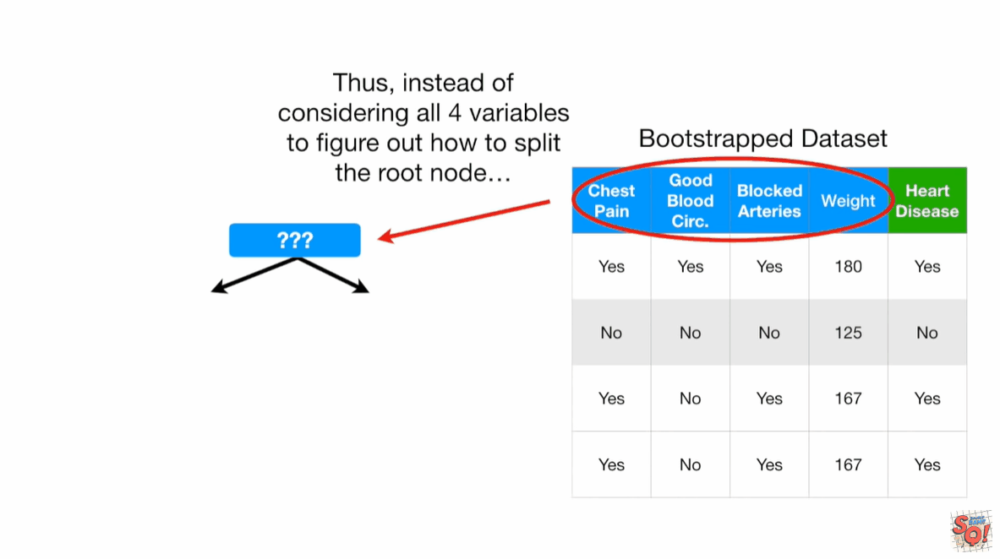
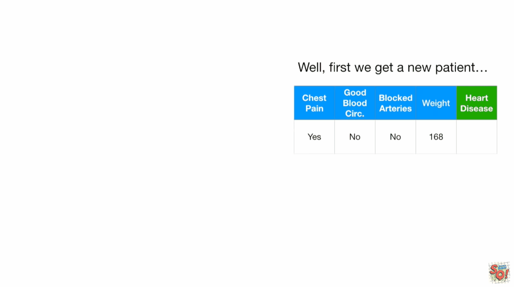
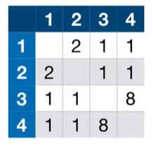
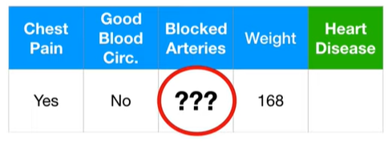

# randomforest

## 总结
1. 随机抽取样本，建立和初始数据集一样大小的样本集合，这个过程叫做`bootstrapped`
2. 使用`bootstrapped dataset`，但仅仅使用随机的特征构建树
3. 将多课树的结果进行分类打分，求最终的结果。
4. 缺失值的处理
  - 首先进行差值
  - 根据多课树预测结果，将相同的预测结果样本放在一起，然后用再权重来评估。

## 推演

Decision Trees are easy to build, easy to use and easy to interpret but in practice they are not that awesome. In other words, they work great with the data used to create them, but they are not flexible when it comes to classifying new samples. The good news is that `random froests` combine the simplicity of decision trees with flexibility resulting in a vast improvement in accuracy.

## Step1: Create a "bootstrapped" dataset
Imagine that these 4 samples are the entire dataset that we are going to build a tree from. To create a bootstrapped dataset that is the same size as the original, we just randomly select samples from the original dataset. The import detail is that we're allowed to pick the same sample more than once.

NOTE: the third sample is same as the forth sample.

## Step2: Create a decision tree using the bootstrapped dataset, but only use a random subset of variable(columns) at each step.
In this example, we will only consider 2 variables(columns) at each step. And we just build the tree as usual, but only considering a random subset of variables at each step.

Now go back to step 1 and repeat:Make a new bootStrapped dataset and build a tree considering a subset of variables at each step.

## predict

Bootstrapping the data plus using the aggregate to make a decision is called "Bagging" 

## Missing data and clustering

`Random Forests` consider 2 types of missing data:
1. Missing data in the original dataset used to create the random forest.
2. Missing data in a new sample that we want to categorize.

### initial guess
The general idea for dealing with missing data in this context is to make an initial guess that could be bad, then gradually refine the guess until it is a good guess.

Because this person did not have `heart disease`, the initial, and possibly bad, guess for the `blocked arteries` value is just the most common value for `Blocked Arteries` found in the other samples that do not have `Heart Disease`.
Among the people that do not have `Heart Idsease`, `No` is the most common value for `Blocked arteries` it occurs in 2 out of 2 samples. So `No` is our initial guess.

Since `weight` is numeric, our initial guess will be the median value of the patients that did not have `heart disease`.

### refine guess
We do this by first determining which samples are similar to the one with missing data. So let's talk about how to determine similarity.

1. Step1: Build a random forest
2. Stpe2: Run all of the data down all of the trees.

we run it in the first tree, and notice that sample 3 and sample 4 both ended up at the same leaf node. That means they are similar.

We keep track of similar samples using a "Proximity Matrix", the "Proximity Matrix" has a row for each sample and it has a column for each sample. Because sample 3 and sample 4 ended up in the same leaf node.

Ultimately, we run the data down all the trees and the proximity matrix fills in.

Then we divide each proximity value by the total number of trees. In this example, assume we had 10 trees.

Now we use the proximity values for sample 4 to make better guesses about the missing data.
For `blocked arteries`, we calculate the weighted frequency of "Yes" and "No", using proximity values as the weights.
$$ YES = 1/3 $$
$$ NO = 2/3 $$
THe weighted frequency for "Yes" is 
$$ YES="YES" weighted frequency \cdot \frac{Proximity of "YES"}{All Proximities} = \frac{1}{3} \cdot \frac{0.1}{0.1+0.1+0.8} = 0.03 $$
$$ NO = \frac{2}{3} \cdot \frac{0.1+0.8}{0.1+0.1+0.8} = 0.6$$
`No` has a way higher weighted frequency, so we'll go with it.

For weight, we use the proximities to calculate a weighted average.

## Missing data in a new sample that we want to categorize
Imagine we had already build a `random forest` with existing data and wanted to classify this new patient.

The first thing we do is create two copies of the data, one that has heart disease and onw that doesn't have heart disease. Then we use the iterative method we just talked about to make good guess about the missing values.

Then we run the two samples down the trees in the forest and we see which of the two is correctly labeled by the random forest the most times.

refs:
https://www.youtube.com/watch?v=J4Wdy0Wc_xQ&t=412s
https://www.youtube.com/watch?v=sQ870aTKqiM

