# regression

## 总结
1. cart树回归问题，是计算ssr(sum of squared residual),寻找最小的ssr作为特征的分裂点
2. 每个叶子节点的输出是该所包含连续变量的均值

## 推演
we do a clinical trial with different dosages in x axis and measure how effective each dosage is in y axis. in general, the higher the dose, the more effective the drug.
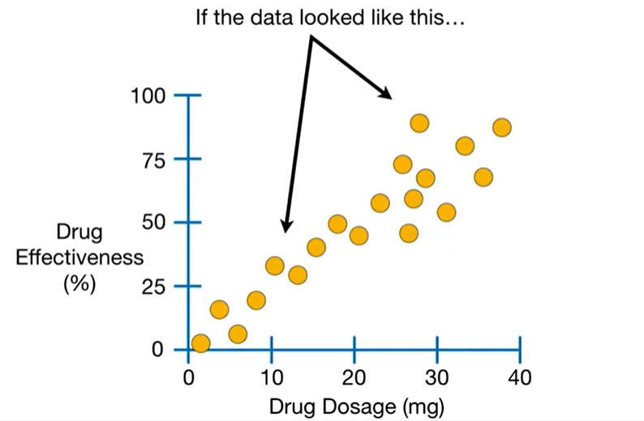
Then we could easily fit a line to the data and if someone told us they were taking a 27 mg Dose.We could use the line to predict that a 27 mg Dose should be 62% Effective.
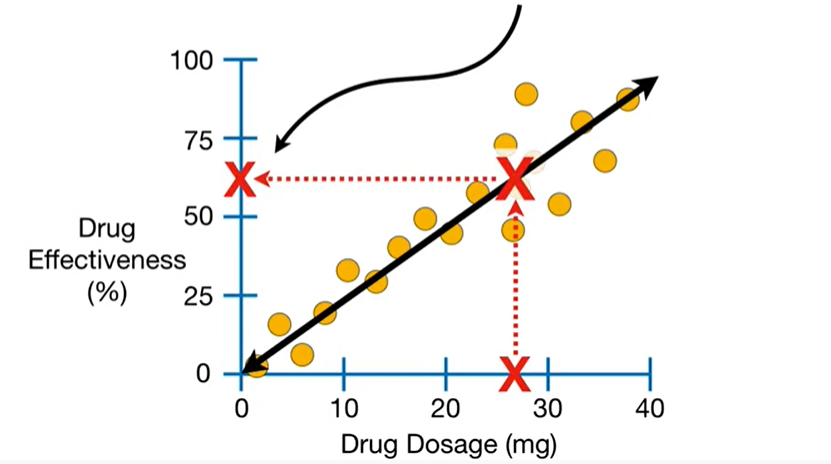
However, what if the data looked like this?
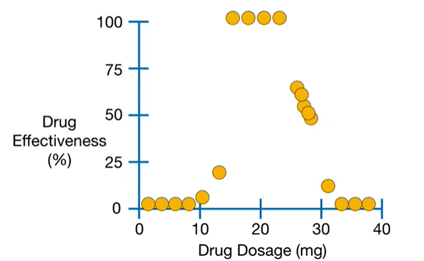
In this case, fitting a straight line to the data will not be very useful.

So we need to use something other than a straight line to make predictions.One option is to use a `Regression Tree`. `Regression Trees` are a type of `Decision Tree`. In a `Regression Tree`, each leaf represents a numeric value. In contrast, `Classification Trees` have `True` or `False` in their leaves or some other discrete category.
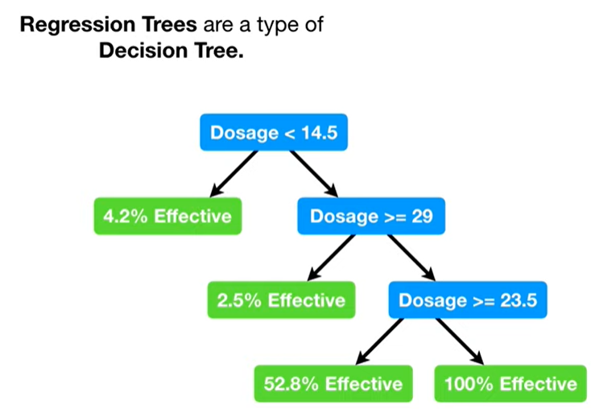
for example: If the Dosage $>= 14.5$ and $< 29$ and $<23.5$, then we are talking about these 4 observations in the training dataset. And the average `Drug Effectiveness` for these 4 observations is 100%. so the tree uses the average value, 100%,as its prediction for people with `Dosages` between 14.5 and 23.5.
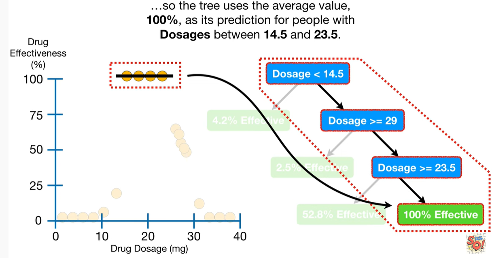
Each leaf corresponds to the average `Drug Effectiveness` in a different cluster of observations.

Let's build the tree. The first thing we do is figure out why we start by asking if `Dosage < 14.5`.
Let's focus on the two observations with the smallest `Dosages`. Their average `Dosage` is 3 and that corresponds to this dotted `red line`.Now we can build very simple tree that splits the observations into two groups based whether or not `Dosage < 3`. The point on the far left is the only one with `Dosage < 3` and the average `Drug Effectiveness` for that one point is 0. So we put 0 in the leaf on the left side, for when `Dosage < 3`. All of the other points have `Dosage >=3` and the average `Drug Effectiveness` for all of the points with `Dosage >=3` is 38.8(the green line). So we put 38.8 in the leaf on the right side, for when the `Dosage >= 3`.

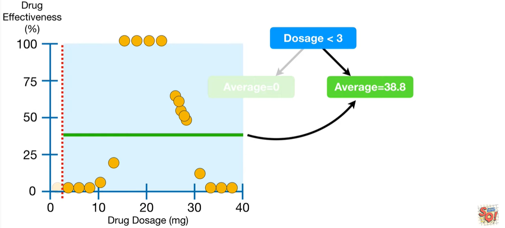

The values in each leaf are the predictions that this simple tree will make for `Drug Effectiveness`. For example, this point, on the far left, has `Dosage < 3` and the tree predicts that the `Drug Effectiveness` will be 0.It's pretty good.
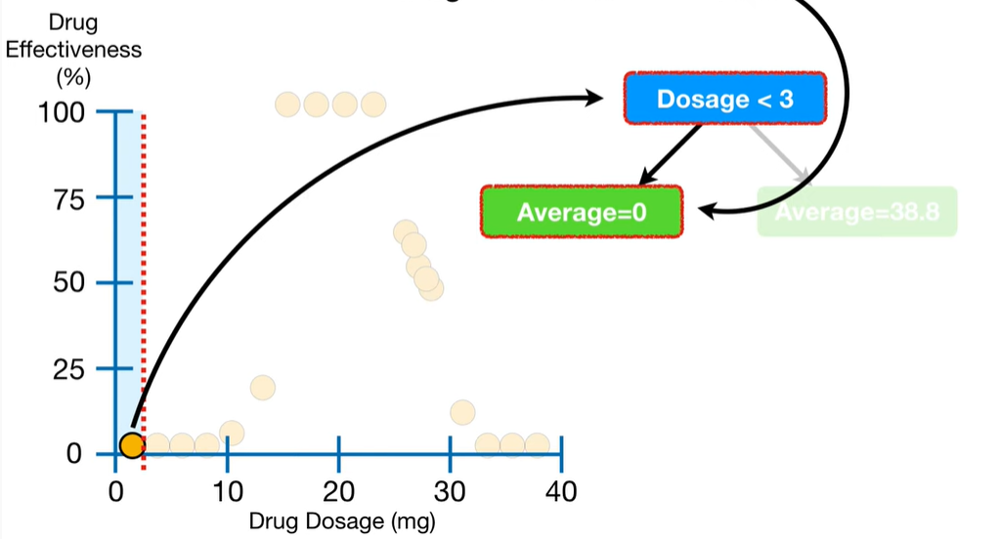

In contrast, for this point, which has `Dosage > 3`, the tree predicts that the `Drug Effectiveness` will be 38.8 ant that prediction is not very good, since the observed `Drug Effectiveness` is 100%.

NOTE: We can visualize how bad the prediction is by drawing a dotted line between observed and predicted values. In other words, this dotted line is a residual.
For each point in the data, we can draw its residual, the difference between the observed and predicted values and we can use the residuals to quantify the quality of these predictions.
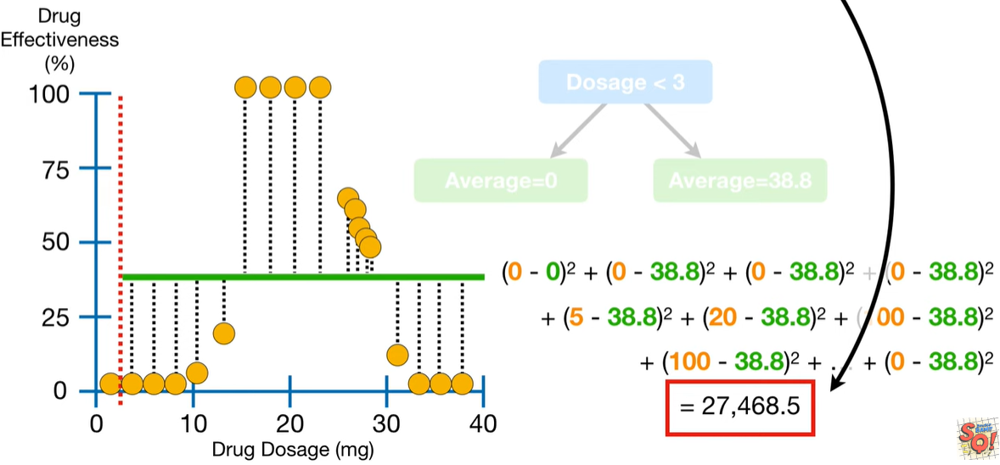

NOTE: We can plot the sum of squared residuals on this graph. The y-axis corresponds to the sum of squared residuals and the x-axis corresponds to Dosage thresholds. In this case, the `Dosage` threshold was 3

Then we can compute all the sum of squared residuals in different `Dosage` thresholds.
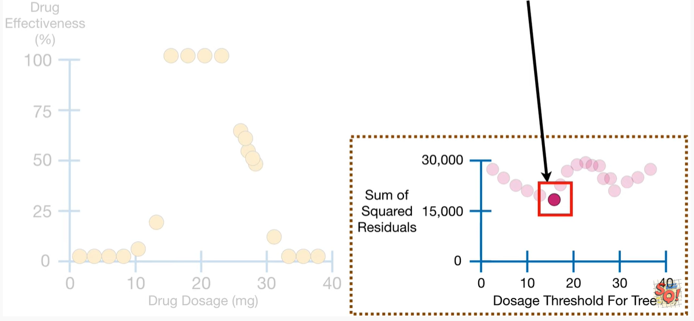
Now we can see sum of squared residuals for all of the thresholds and `Dosage < 14.5` had the smallest sum of squared residuals. So `Dosage < 14.5` will be root of the tree. In summary, we split the data into two groups by finding the threshold that gave us the smallest sum of squared residuals.
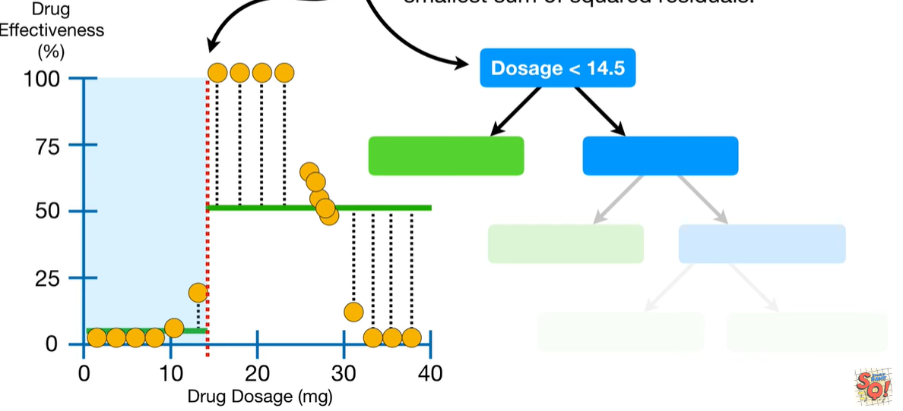

As the same process, we can divide the observations with `Dosage < 14.5` into 3 separate groups. Two of these leaves only contain one observation each and can not be split into smaller groups.In contrast, `Average = 0` leaf contains 4 observations. That said, those 4 observations all have the same `Drug Effectiveness`, so we don't need to split them into smaller groups. So we are done splitting the observations with `Dosage < 14.5` into smaller groups.
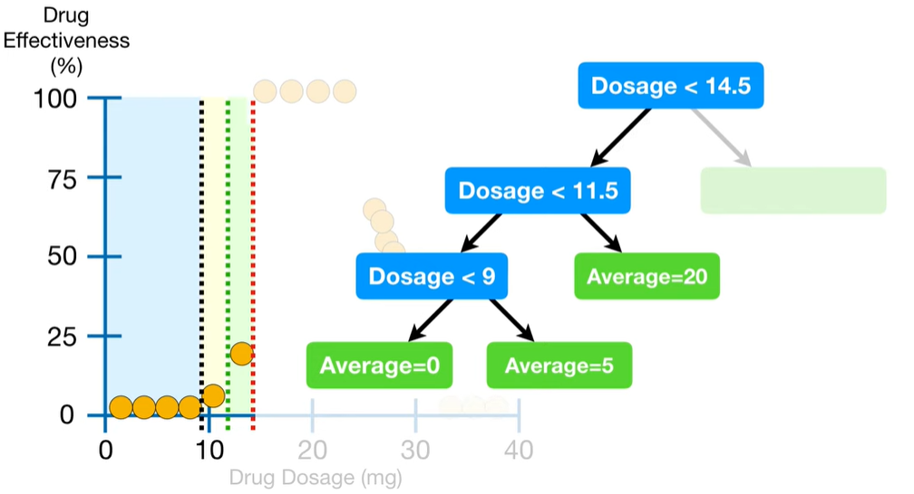

When a model fits the training set perfectly, it probably means it is overfit and will not perform well with new data. In machine learning lingo, the model has no bias, but potentially large variance.Is there a way to prevent our tree from overfitting the training data? The simplest is to only split observations when there are more than some minimum number.
Set the minimum to 7. In other words, since there are only 6 observations with `Dosage < 14.5`, we will not split the observations in this node and the output will be the average `Drug Effectiveness` for the 6 observations with `Dosage < 14.5`, 4.2%.

Since we have more than 7 observations on the right side(with `Dosage >=14.5`), we can split them into two groups and more...
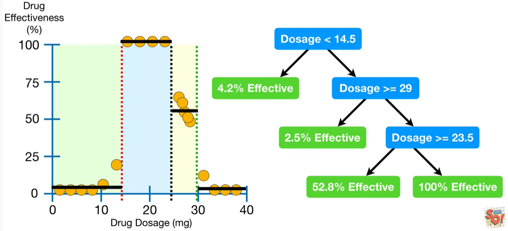

for more than one predictor, the process is same as classification tree.
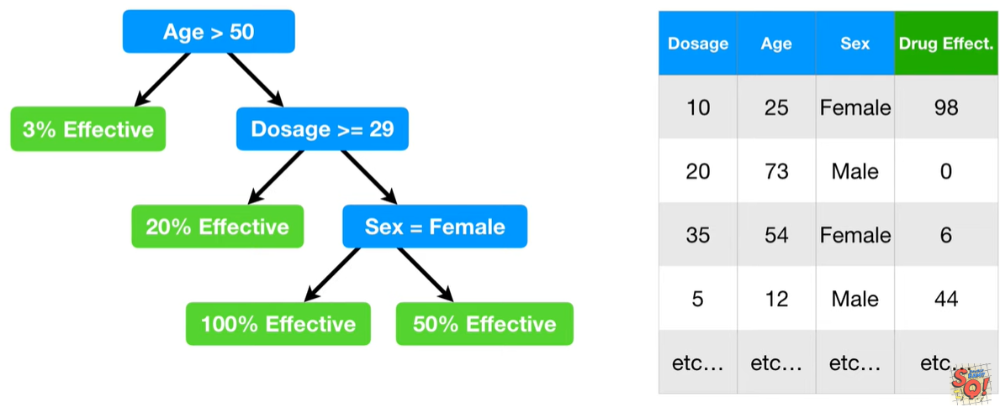

refs:
https://www.youtube.com/watch?v=g9c66TUylZ4