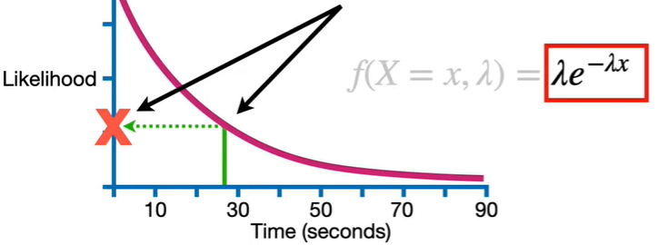
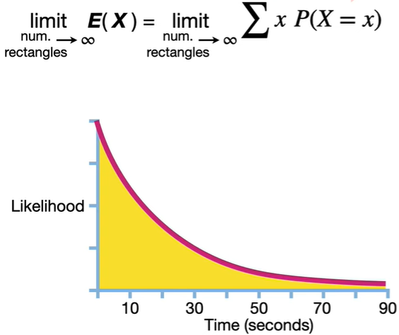

# expect

## discrete

Each person in StatLand is in one group or the other.37 of the people in statland that have heard of troll2 and the remaining 176 people in statland have never heard of troll2.That means there are 213 people living in statland.By looking at the numbers we can get a general sense of the trends in statland.If we want to know the probability that a randomly selected person in statland has heard of troll2, we simply divide the number of people that have heard of troll2,37, by the total, 213 and that gives us 0.17.That means the probability that a randomly selected person in statland has heard of troll2 is 0.17, which is relatively low.
Likewise, the probability that a randomly selected person in statland has never heard of troll2 is 0.83, which is relatively high.

"I bet you $1 that the next person we meet has heard of the movie troll 2"
Now, if the next person we meet has heard of troll2, then we will lose the bet and that means we will lose $1. So let's put -1 to represent the outcome of losing $1 if we meet someonw who has heard of troll2. In contrast, let's put a 1 to represent the outcome of winning $1 if the next person we meet has Not heard of troll 2.
So the left side of this table tells us that the probability that we will lose $1 is 0.17 and the right side tell us that the probability that we will win $1 is 0.83.

$$ E(X)= (0.17 \cdot -1)+ (0.83 \cdot 1) =0.66 =\sum{xP(X=x)}$$
Thus, the Expected value represents what we would expect per bet if we made this bet a bunch of times.

Using fancy sigma notation, the Expected value,E(X), is the sum of each outcome,x, times the probability of observing each outcome,x.
$$ E(X)=\sum{xP(X=x)}$$

## continuous
Continuous variables come from measuring things and the out comes are continuous.
I wonder how long we would have to wait, per person, to see people.after 10 seconds you meet someone， so put a dot on this number line at 10.The next person we meet shows up after 30 seconds...

equation for the exponential distribution:
$f(X=x) = \lambda e^{-\lambda x}$ when $x \ge 0$, otherwise $0$.
$\lambda$, which is also called rate, is a parameter that defines the shape of the curve.In this example, the rate refers to the number of people we met per second, because that is the unit on the x-axis.And if we set $\lambda$ to 0.05, we get a curve that fits the data that we have already collected.
$f(X=x,\lambda=0.05) = \lambda e^{-\lambda x}$ when $x \ge 0$, otherwise $0$.

Now, if we want to calculate the probability that we meet someone in 10 seconds or less then we calculate the area under the curve between 0 and 10.In other words, we integrate the exponential distribution from 0 to 10.

NOTE:I call the y-axis likelihood because the y-axis coordinates generated by this equation are the likelihood values that we use for maximum likelihood estimation.

$$\int_a^b f(X=x,\lambda=0.05)=\int_a^b \lambda e^{\lambda x}$$

we can plug the outcomes and their approximated probabilities into the equation for discrete outcomes.

$$ E(X) = \sum xP(X=x)= (10 \times 0.4)+(20 \times 0.2)+(30 \times 0.1) + ...+(90 \times 0.01) = 22 $$

Now, if we want to improve our approximation, we can cut the intervals in half, so that each one lasts 5 seconds instead of 10.And when we do the math, plugging in each outcome and its corresponding probability, we get 21.8.

$$ E(X) = \sum xP(X=x)= (5 \times 0.22)+(10 \times 0.17) = 21.8 $$
Now, to improve the estimate of the expected value even more, we can keep decreasing the width of each rectangle.

until the width of the rectangles goes to 0 and the number of rectangles goes to infinity.

remember that the probability of observing a specific outcome is the height times the width of the associated rectangle.
$$\lim_{numOfRect \rightarrow \infty}E(X)$$
$$= \lim_{numOfRect \rightarrow \infty} \sum xP(X=x) $$
$$= \lim_{numOfRect \rightarrow \infty} x(Height \times Width)$$
$$= \lim_{numOfRect \rightarrow \infty} x(L(X=x)\times Width) $$

$$= \lim_{numOfRect \rightarrow \infty} x(L(X=x)\times \delta x) $$
if the sum of the number of rectangles goes to infinity while the width of each rectangle $\delta x$, goes to 0.
$$= \int xL(X=x)dx $$

## Calculate the expected value for a continues variable from the exponential distribution
Since we use the exponential distribution equation to calculate the likelihood, let's plug it into the equation for the expected value.
$$ E(X) = \int_0^\infty x\lambda e^{-\lambdax}dx $$
$$ E(X) = \int_0^\infty x \times \lambda e^{-\lambdax}dx $$
First, because we can split this into two functions, we can use integration by parts to find the solution.
$$ \int^\infty_0f(x)g'(x)dx =f(x)g(x) \vert^0_\infty=\int_0^\infty f'(x)g(x)dx$$
we will get the result:
$$ E(x) = \frac{1}{\lambda} $$

## summary
The expected values for discrete and continuous variables are very similar.
Discrete Variables:
$$E(X) = \sum xP(X=x)$$
Continuous Variables:
$$E(X) = \int xL(X=x)dx$$

refs:
https://www.youtube.com/watch?v=OSPr6G6Ka-U
https://www.mathsisfun.com/calculus/integration-by-parts.html