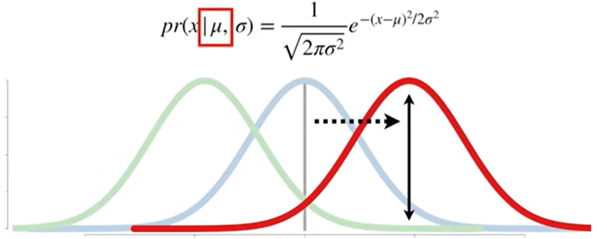
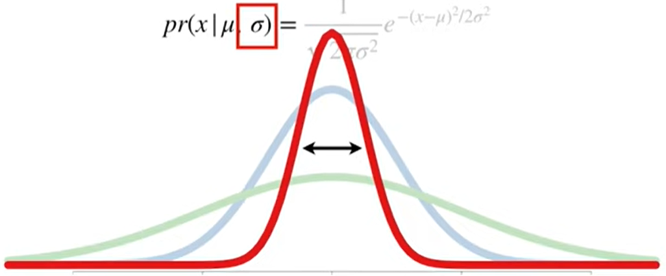
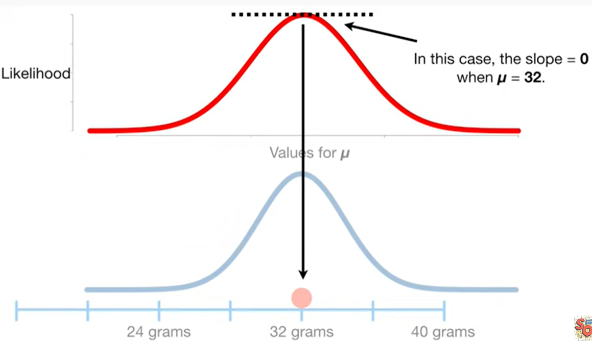
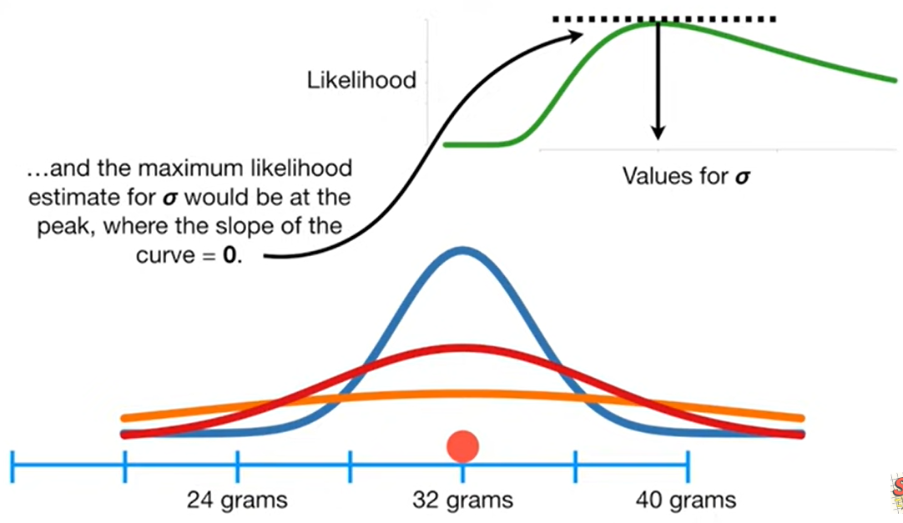
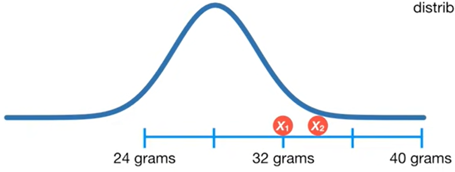
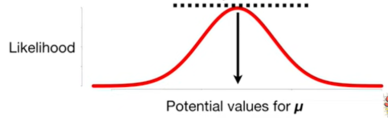
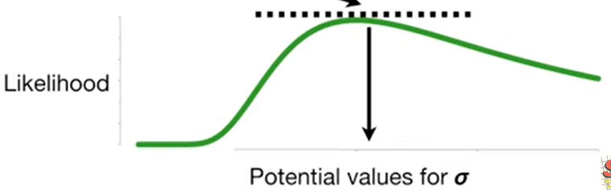
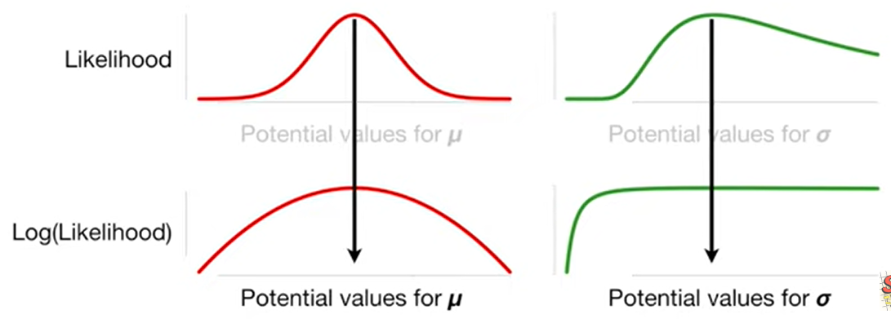
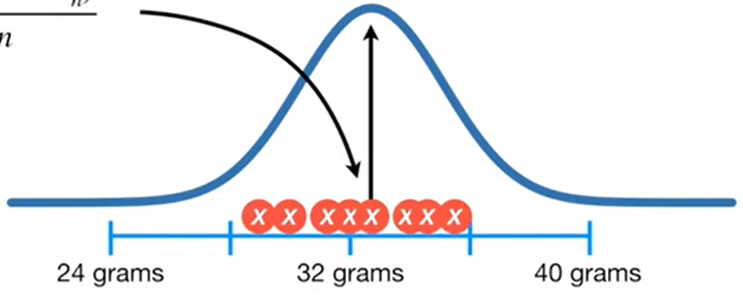
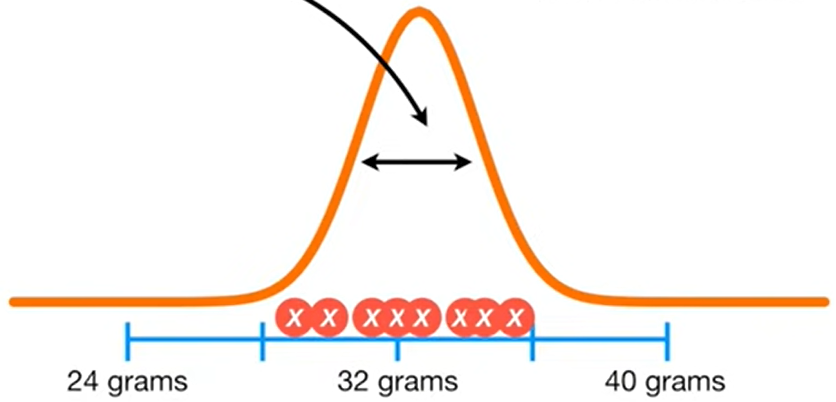

# maximumLikelihood

let's start with the nasty looking equation.
$$ pr(x|\mu,\sigma) = \frac{1}{\sqrt{2\pi\sigma^2}}e^{-(x-\mu)^2/2\sigma^2} $$
It is the equation for the normal distribution or normal curve.It has two parameters:
The first parameter: the greek character $\mu$, determine the location of the normal distribution's mean.The smaller value for $\mu$ moves the mean of the distribution to the left.And a larger value fot the $\mu$ moves the mean of the distribution to the right.

The second parameter, the greek character $\sigma$, is the standard deviation and determines the normal distribution's width.A large value for $\sigma$ makes the normal curve shorter and wider, and a smaller value for $\sigma$ makes the normal curve taller and narrower.

we are going to use the likelihood of the normal distribution to find the optimal values for $\mu$ and $\sigma$ given some data, $x$.
$$ L(\mu,\sigma|x) = \frac{1}{\sqrt{2\pi\sigma^2}}e^{-(x-\mu)^2/2\sigma^2} $$

For example, if we start with the mean of the distribution over here on the left at 20 grams and then we plug $\mu=20$ into the equation and we get a crazy small likelihood.
$$ L(\mu=20|x=32,\simgma=2) = \frac{1}{\sqrt{2\pi\sigma^2}}e^{-(x-\mu)^2/2\sigma^2} =0.0000000003 $$
and then we can plot the likelihood on a graph, the y-axis is likelihood value and the x-axis is for different values that we plug in $\mu$.Each time we change $\mu$, we calculate the likelihood and plot it.
We can identify the peek in the likelihood graph by determining where the slope of the curve = $0$. In this case, $slope = 0$ when $\mu=32$.

Now, we can fix $\mu=32$ and treat it like a give, just like the data and we can plug in different values for $\sigma$ to find one that gives the maximum likelihood.That said, if we had more data then we could plot the likelihoods for different values of $\sigma$ and the maximum likelihood estimate for $\sigma$ would be at the peak, where the slope of the curve = $0$.

## two dataset
The example with one measurement kept math simple, but now i think we are ready to dive in a little deeper, So let's use a two sample dataset to calculate the likelihood of a normal distribution.
let's overlay a normal distribution with $\mu=28$ and $\sigma=2$ onto the data.We've already seen how to calculate the likelihood for this curve given $x_1$, the mouse that weighs 32 grams and we can calculate the likelihood for the curve given $x_2$ by plugging in $34$ into this likelihood function.
$$L(\mu=28,\sigma=2|x_1=32) $$
$$L(\mu=28,\sigma=2|x_2=34) $$
$$L(\mu=28,\sigma=2|x_1=32 and x_2 = 34)$$
Because $x_1=32 and x_2 = 34$ measurements are independent(i.e. weighing $x_1$ did not have an effect on weighting $x_2$).
The likelihood of a normal distribution with $\mu=28$ and $\sigma=2$ given the data, $x_1=32$ and $x_2=34$ is just the likelihood of the distribution given $x_1$ times the likelihood of the distribution given $x_2$.

$$L(\mu=28,\sigma=2|x_1=32 and x_2 = 34) = L(\mu=28,\sigma=2|x_1=32) \cdot L(\mu=28,\simga=2|x_2=34)=0.000006$$

## n dataset
With $n$ data points, we add all $n$ data points to the "given" side of the overall likelihood function.
$$ L(\mu,\sigma|x_1,x_2,...,x_n) = L(\mu,\sigma|x_1) \cdot ... \cdot L(\mu,\sigma|x_n)  = \frac{1}{\sqrt{2\pi\sigma^2}}e^{-(x_1-\mu)^2/2\sigma^2}\cdot ... \cdot  \frac{1}{\sqrt{2\pi\sigma^2}}e^{-(x_n-\mu)^2/2\sigma^2}$$

## estimates
let's solve for the maximum likelihood estimate for $\mu$ an $\sigma$.
$$L(\mu,\sigma|x_1,x_2,...,x_n)$$
$$= L(\mu,\sigma|x_1) \cdot ... \cdot L(\mu,\sigma|x_n)$$
$$= \frac{1}{\sqrt{2\pi\sigma^2}}e^{-(x_1-\mu)^2/2\sigma^2}\cdot ... \cdot  \frac{1}{\sqrt{2\pi\sigma^2}}e^{-(x_n-\mu)^2/2\sigma^2} $$
what we need to do is take two different derivatives of this equation.One derivative will be with respect $\mu$, when we treat $\sigma$ like it's a constant and we can find the maximum likelihood estimate for $\mu$ by finding where this derivate = 0.

The other derivative will be with respect $\sigma$, when we treat $\mu$ like it's a constant. and we can find the maximum likelihood estimate for $\sigma$ by finding where this derivative = 0.

But before we try to take any derivatives, we take the log of the likelihood function. We do this because it makes taking the derivative way,way easier. And the likelihood function and the log of the likelihood function both peak at the same values for $\mu$ and $\sigma$.
$$ln(L(\mu,\sigma|x_1,x_2,...,x_n))$$
$$= ln(\frac{1}{\sqrt{2\pi\sigma^2}}e^{-(x_1-\mu)^2/2\sigma^2}\cdot ... \cdot  \frac{1}{\sqrt{2\pi\sigma^2}}e^{-(x_n-\mu)^2/2\sigma^2}) $$

First, the log transforms the multiplication into addition
$$= ln(\frac{1}{\sqrt{2\pi\sigma^2}}e^{-(x_1-\mu)^2/2\sigma^2}) + ln(\frac{1}{\sqrt{2\pi\sigma^2}}e^{-(x_n-\mu)^2/2\sigma^2}) $$

focus on the factor of the equation:
$$ ln(\frac{1}{\sqrt{2\pi\sigma^2}}e^{-(x_1-\mu)^2/2\sigma^2}) $$
convert the multiplication into addition
$$ =ln(\frac{1}{\sqrt{2\pi\sigma^2}}) + ln(e^{-(x_1-\mu)^2/2\sigma^2}) $$
convert the 1 over the square root into the exponent $-1/2$
$$ =ln((2\pi\sigma^2)^{-1/2}) + ln(e^{-(x_1-\mu)^2/2\sigma^2}) $$
and convert the exponent into multiplication
$$ =ln((2\pi\sigma^2)^{-1/2}) - \frac{(x_1-\mu)^2}{2\sigma^2}ln(e) $$
convert the -1/2 exponent into multiplication and the $ln(e)= 1$
$$ =-\frac{1}{2}ln(2\pi\sigma^2)- \frac{(x_1-\mu)^2}{2\sigma^2} $$
the log can convert the multiplication of $2\pi\sigma^2$ into addition of $2\pi$ and $\sigma^2$
$$ =-\frac{1}{2}ln(2\pi)-\frac{1}{2}ln(\sigma^2) - \frac{(x_1-\mu)^2}{2\sigma^2} $$
convert the exponent in $ln(\sigma^2)$ into $2 \cdot ln(\sigma)$
$$ =-\frac{1}{2}ln(2\pi)-ln(\sigma) - \frac{(x_1-\mu)^2}{2\sigma^2} $$

go back to the original likelihood and turn 
$$= ln(\frac{1}{\sqrt{2\pi\sigma^2}}e^{-(x_1-\mu)^2/2\sigma^2}) + ln(\frac{1}{\sqrt{2\pi\sigma^2}}e^{-(x_n-\mu)^2/2\sigma^2}) $$
into:
$$ -\frac{1}{2}ln(2\pi)-ln(\sigma)-\frac{(x_1-\mu)^2}{2\sigma^2} - ... - \frac{1}{2}ln(2\pi)-ln(\sigma)- \frac{(x_n-\mu)^2}{2\sigma^2}$$
$$ -\frac{n}{2}ln(2\pi)-nln(\sigma)-\frac{(x_1-\mu)^2}{2\sigma^2} - ... - \frac{(x_n-\mu)^2}{2\sigma^2}$$

we'll start by taking the derivative with respect to $\mu$, this derivative is the slope function for the log(likelihood) curve and we'll use it to find the peak, aka where the slope = 0.
$$\frac{\partial}{\partial\mu}ln(L(\mu,\sigma)|x_1,...,x_n) $$
$$ = \frac{\partial}{\partial\mu}-\frac{n}{2}ln(2\pi)-nln(\sigma)-\frac{(x_1-\mu)^2}{2\sigma^2} - ... - \frac{(x_n-\mu)^2}{2\sigma^2} $$
$$ = 0 - 0 + \frac{(x_1-\mu)}{\sigma^2} + \frac{(x_n-\mu)}{\sigma^2} $$
$$ = \frac{1}{\sigma^2}((x_1+...+x_n)-n\mu)  =0$$
$$ \mu = \frac{x_1+...+x_n}{n}  $$
So that is where the center of our normal curve will go.

as the way we get $\mu$, we can get the $sigma$:
$$\frac{\partial}{\partial\sigma}ln(L(\mu,\sigma)|x_1,...,x_n) $$
$$= -\frac{n}{\sigma}+ \frac{1}{\sigma^3}((x_1-\mu)^2+...+(x_n-\mu)^2)=0$$
$$ \sigma^2 = \frac{(x_1-\mu)^2+...+(x_n-\mu)^2}{n} $$
Thus, we use the formula for the standard deviation to determine the width of the normal curve that, given the data, has the maximum likelihood.

we have the math that proves that our intuition is correct.

refs:
https://www.youtube.com/watch?v=Dn6b9fCIUpM