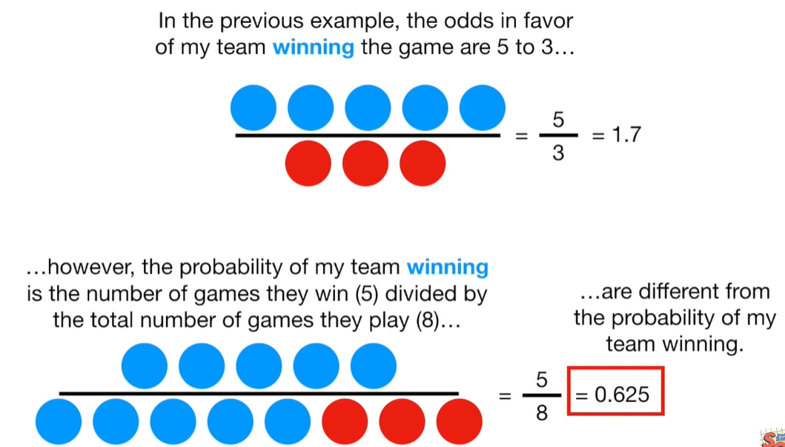

# odds_logOdds

The odds are the ratio of something happening(i.e my team winning) to something not happening(i.e. my team not winning).
The probability is the ratio of something happening(i.e my team winning) to everything that could happen(i.e. my team winning and losing).
the odds in favor if my team wining the game are 5 to 3, however, the probability of my team winning is the number of games they win(5) divided by the total number of games they play(8)

The odds of my team losing go from 0 to 1 and the odds of my team wining go from 1 to infinity.

The asymmetry makes it difficult to compare the odds for or against my team winning.For example, if the odds are against 1 to 6, then the odds are 1/6 = 0.17, but if the odds are in favor 6 to 1, then the odds are 6/1=6. The magnitude of left odds looks way smaller then the right odds are bigger.

Taking the `log()` of the odds(i.e. log(odds)) solves this problem by making everything symmetrical.
For example if the odds are against 1 to 6, then the `log(odds)` are $log(1/6) = log(0.17) = -1.79$, if the odds are in favor 6 to 1, then the `log(odds)` are $log(6/1) = log(6) = 1.79$. Using the log function, the distance from the origin(or 0) is the same for 1 to 6 and 6 to 1 odds.

refs:
https://www.youtube.com/watch?v=ARfXDSkQf1Y