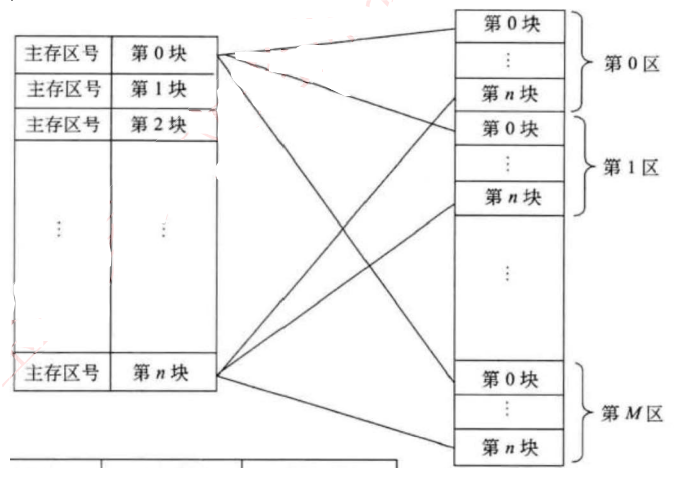
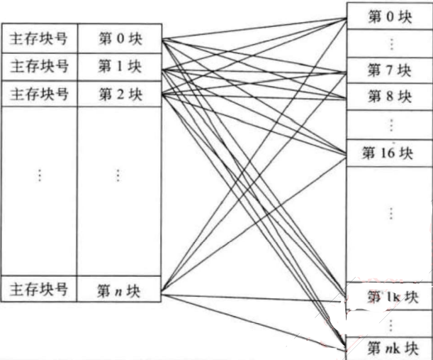
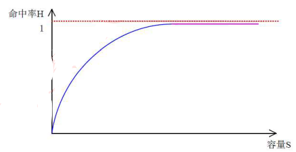
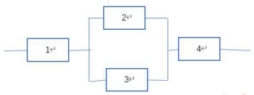

# 计算机组成与结构

## 计算机硬件组成

1. 计算机的基本硬件系统由`运算器`、`控制器`、`存储器`、`输入设备`和`输出设备`5大部件组成。
1. `运算器、控制器`等部件被集成在一起统称为`中央处理单元`（Central Processing Unit, CPU). CPU是硬件系统的核心，用于数据的加工处理，能完成各种算术、逻辑运算及控制功能。
1. `存储器`是计算机系统中的记忆设备，分为`内部存储器`(内存)和`外部存储器`(硬盘)。前者速度高、容量小，一般用于临时存放程序、数据及中间结果。而后者容量大、速度慢，可以长期保存程序和数据。
1. `输入设备`(鼠标键盘)和`输出设备`(显示器)合称为外部设备（简称`外设`），输入设备用于输入原始数据及各种命令，而输出设备则用于输出计算机运行的结果。

## 中央处理单元
### CPU的功能：逻辑运算和算术运算
(1)程序控制。CPU通过执行指令来控制程序的执行顺序，这是CPU的重要功能。
(2)操作控制。一条指令功能的实现需要若干操作信号配合来完成，CPU产生每条指令的操作信号并将操作信号送往对应的部件，控制相应的部件按指令的功能要求进行操作。
(3)时间控制。CPU对各种操作进行时间上的控制，即指令执行过程中操作信号的出现时间、持续时间及出现的时间顺序都需要进行严格控制。
(4)数据处理。CPU通过对数据进行算术运算及逻辑运算等方式进行加工处理，数据加工处理的结果被人们所利用。所以，对数据的加工处理也是CPU最根本的任务。
此外，CPU还需要对系统内部和外部的中断（异常）做出响应，进行相应的处理。

### CPU的组成：CPU主要由运算器、控制器、寄存器组和内部总线等部件组成
1. `运算器`：
    1. `算术逻辑单元ALU(Arithmetic Logic Unit)`（算术和逻辑运算）
    2. `累加寄存器ACC(Accumulator)`（存放源操作数和运算结果）
    3. `状态条件寄存器PSW(Promgram Status Word)`(保存指令运行结果的`条件码`内容，如溢出标志(内存溢出)等）
    4. `数据缓冲寄存器DR(Data Register)`(暂时存放内存的指令或数据）

    1+2=3, 操作数1和2要存起来, 运算结果3也要存起来, ALU来存1, ACC存3(将2替换掉).

2. `控制器`：
    1. `程序计数器PC(Program counter)`(存放指令执行地址）
    2. `指令寄存器IR(Instruction Register)`(暂存CPU执行指令)
    3. `指令译码器ID(Instruction Decoder,ID)`（分析指令操作码）
    4. `地址寄存器AR(Address Register)`(保存当前CPU所访问的内存地址)
    
    控制器的工作顺序是:

    5. 找到指令的地址, PC
    6. 去内存将指定取出来, 并保存到指令寄存器IR
    7. 对指令进行分析(指令是做什么), ID

3. CPU依据指令周期的不同阶段来区分二进制的指令和数据，因为在指令周期的不同阶段，指令会命令CPU分别去取指令或者数据。

### 总结
`数据缓冲寄存器DR(Data Register)`是`运算器`的, `地址寄存器AR(Address Register)`是`控制器`

### 真题
CPU执行算术运算或者逻辑运算时，常将源操作数和结果暂存在（）中。
A.程序计数器(PC)
B.累加器(AC)
C.指令寄存器(IR)
D.地址寄存器(AR)
答案: B
执行CPU指令时，在一个指令周期的过程中，首先需从内存读取要执行的指令，此时先要将指令的地址即（）的内容送到地址总线上。
A.指令寄存器(IR)
B.通用寄存器(GR)
C.程序计数器(PC)
D,状态寄存器(PSW)
答案: C

### 参考: 
[CPU内部组成及原理](https://www.cnblogs.com/yilang/p/10993051.html)
[计算机原理之CPU工作概括](https://zhuanlan.zhihu.com/p/646751303)

## 数据表示
### 进制的表示：
二进制符号为0b,一般表示为0b0011,十六进制符号为0x或H,可表示为0x18F或18FH.(十六进制可表示0-15，其中10-15用A-F来表示)

1. R进制整数转十进制

    位权展开法，用R进制数的每一位乘以R的n次方，n是变量，从R进制数的整数最低位开始，依次为0,1,2,3累加。
    例: 有6进制数5043，此时R=6,用6进制数的每一位乘以6的n次方，n是变量，从6进制数的整数最低位开始(5043从低位到高位排列：3,4,0,5),n依次为0,1,2,3,那么最终`5043=3*6^0+4*6^1+0*6^2+5*6^3=1107`。

2. 十进制转R进制：

    十进制整数（除以R倒取余数），用十进制整数除以R，记录每次所得余数，若商不为0，则继续除以R，直至商为0，而后将所有余数从下至上记录，排列成从左至右顺序，即为转换后的R进制数；
    例：有十进制数200，转换为6进制，此时R=6，将200/6，得商为33，余数为2；因为商不等于0，因此再将商33/6，得商为5，余数为3；再将5/6，得商为0，余数为5；此时商为0，将所有余数从下到上记录，得532。

3. m进制转n进制：

    先将m进制转化为十进制数，再将十进制数转化为n进制数，中间需要通过十进制中转，但下面两种进制间可以直接转化：

4. 特殊的禁止转换方法
    1. 二进制转八进制：

        每三位二进制数转换为一位八进制数，二进制数位个数不是三的倍数，则在前面补0（原则是数值不变），如二进制数01101有五位，前面补一个0就有六位，为001101，每三位转换为一位八进制数，`001=0*2^2+0*2^1+0*2^0=1,101=1*2^2+0*2^1+1*2^0=4+0+1=5`,也即`01101=15`.

    2. 二进制转十六进制：
        每四位二进制数转换为一位十六进制数，二进制数位个数不是四的倍数，则在前面补0，如二进制数101101有六位，前面补两个0就有八位，为00101101，每四位转换为一位十六进制数，`0010=0*2^3+0*2^2+1*2^1+0*2^0=2, 1101=1*2^3+1*2^2+0*2^1+1*2^0=13=D`,也即`101101=2D`。

#### 总结🔴
`重点考察`二进制, 十六进制, 十进制之间的转化. 熟记需要记住`2^0 = 1, 2^1 = 2, 2^2 = 4, 2^3 = 8, 2^4 = 16, 2^5 = 32, 2^6 = 64, 2^7 = 128, 2^8 = 256, 2^9 = 512, 2^10 = 1024`
1. 二进制与十进制的转换
    1. 二转十
        直接相加, 如二进制数`101101`, 则十进制数为`101101 = 1*2^5 + 0*2^4 + 1*2^3 + 1*2^2 + 0*2^1 + 1*2^0= 32 + 0 + 8 + 4 + 0 + 1 = 45`
        注意`1*2^3`, 1表示的是该位的数值, 二进制只有两种可能`0或1`, `2`表示进制, `3`表示位数
    
    2. 十转二
        将十进制数拆解为`1024,512,256,128,64,32,16,8,4,2,1`的和, 从高位到低位, 如果累加和小于十进制数, 则补该位的数值(二进制只能为1), 否则补0. 如十进制数`45`, 第一个选择`32`, 因为如果选择`64`会溢出, `32=1*2^5`可以确定二进制一共有五位数, 依次看各个位置是否有上面的数出现, `45 = 32 + 0 + 8 + 4 + 0 +1`, 所以对应的数就是`101001`
        
2. 十六进制与十进制的转换
    1. 十六转十
        直接相加, 如十六进制数`2D`, 转十进制数为`2D=2*16^1+D*16^0=32+13=45`
    2. 十转十六
        将十进制数拆解为`256,16,1`的和, 从高位到低位, 如果累加和小于十进制数, 则补该位的数, 否则补0. 如十进制数`45`, 第一个选择`16`, 因为选择`256`会溢出, 可以确定只有两位. 第一位的数值选择`2, 16*2=32<45`, 因为选择`3, 16*3 =48>45`. 所以`45= 2*16^1 + 13*16^0 = 2D`

3. 二进制与十六进制的转换
    1. 二转十六

        每四位二进制数转换为一位十六进制数，二进制数位个数不是四的倍数，则在前面补0，如二进制数`101101`有六位，前面补两个0就有八位，为`00101101`，每四位转换为一位十六进制数，`0010=0*2^3+0*2^2+1*2^1+0*2^0=2,1101=1*2^3+1*2^2+0*2^1+1*2^0=13=D`,也即`101101=2D`。

    2. 十六转二
        每一位十六进制数转换为十进制, 然后十进制再转换为四位二进制, 最后拼合起来. 如十六进制数`2D`, 表示为十进制`2`和`D`, `2= 2(1*2^1) + 0(0*2^0) = 0010`, `D(13) = 8 + 4 + 0 + 1 = 1101`, 拼合后得`00101101`

### 编码方式
1. 机器数：数值在计算机中表示的形式，使用`二进制`计数制。
    2. 正负符号: 机器数有无符号数和带符号数之分。`无符号`数表示`正数`，`没有符号位`。`带符号`数`最高位为符号位`，`正数`符号位为`0`，`负数`符号位为`1`.
    3. 定点表示法分为纯小数和纯整数两种，其中小数点不占存储位，而是按照以下约定：
        `纯小数`：约定小数点的位置在机器数的`最高数值位之前`。
        `纯整数`：约定小数点的位置在机器数的`最低数值位之后`。
2. 真值：机器数对应的实际数值。

#### 原码, 反码, 补码, 移码
1. `正数`(包括带符号的整数和不带符号的数): 的原码,反码,补码是一样的

2. `带符号数的负数`有下列编码方式，当真值为`-45`时：

1. 原码：一个数的正常二进制表示，最高位表示符号。-45对应原码为10101101
    `45 = 32 + 8 + 4 + 0 + 1 = 101101`, 因为一个字节是8位, 所以高位补0, `00101101`, 又因为是有符号的负数, 所以高位改成1, `10101101`
    `45 = 32 + 8 + 4 + 0 + 1 `是一种简便的十进制转二进制的方法, 中间`0`表示该位如果取值 则会超过真值, 所以该位为不能为`1*2^1`, 而应该是`0*2^1`. 
    数值0的源码有两种形式：+0(00000000)和-0(10000000)

2. 反码：`正数的反码即原码`；负数的反码是在`原码的基础上`，`除符号位外`，`其他各位按位取反`。-45对应反码为11010010
    数值0的反码也有两种形式：+0(00000000)，-0(11111111)

3. 补码：`正数的补码即原码`；负数的补码是在`原码的基础上`，`除符号位外`，`其他各位按位取反，而后末位+1，若有进位则产生进位`。-45对应补码为11010011
    数值0的补码只有一种形式+0=-0=00000000(溢出的第9位不管)

4. 移码：用作浮点运算的阶码，无论正数负数，都是将该原码的补码的首位（符号位）取反得到移码。-45对应移码为01010011

例：若机器字长为8，请给出45和-45的原码、反码、补码和移码。

真值|原码|反码|补码|移码
--|--|--|--|--
45|00101101|00101101|00101101|10101101
-45|10101101|11010010|11010011|01010011

#### 原码, 反码, 补码, 移码的范围

码制|定点整数|定点小数
--|--|--
原码|$-(2^{n-1}-1)~+(2^{n-1}-1)$|
反码|$-(2^{n-1}-1)~+(2^{n-1}-1)$|
补码|$-2^{n-1}~+(2^{n-1}-1)$|
移码|$-2^{n-1}~+(2^{n-1}-1)$|

`n =1 + n -1`, 其中`1`表示`符号位`, `n-1`表示数字位, 数字为可表示数字的个数是$2^{n-1}$, 因为是从0开始表示, 所以范围是$-2^{n-1}-1~+2^{n-1}-1$. 又因为补码和移码, 0没有正负之分, 所以范围是`$-2^{n-1}~+2^{n-1}-1$`
定点小数: 是在定点整数的基础上除以$2^{n-1}$

## 浮点数
1. 定点数: 纯小数或纯整数
2. 浮点数: 既有小数又有整数

浮点数：表示方法为$N=F*2^E$,其中`E`称为`阶码`，`F`称为`尾数`；类似于十进制的科学计数法，如$85.125=0.85125*10^2$，二进制如$101.011=0.101011*2^3$.
在浮点数的表示中，`阶码`为`带符号的纯整数`，`尾数`为`带符号的纯小数`，要注意符号占最高位(正数0负数1)，其表示格式如下：

阶符|阶码|数符|尾数
--|--|--|--

浮点数所能表示的`数值范围`由`阶码`确定，所表示的`数值精度`由`尾数`确定。🔴
尾数的表示采用规格化方法，也即带符号尾数的补码必须为1.0xxxx（负数）或者0.1xxxx（正数），其中x可为0或1.
与科学计数法类似，一个浮点数的表示方法`不是唯一的`(尾数和解码可以调整, 比如$0.1*10^2$和$100*10^{-1}$表示的意思一致)

`浮点数运算考纲不要求`

浮点数的运算：
1. 对阶（使两个数的阶码相同，小阶向大阶看齐，较小阶码增加几位，尾数就右移几位）
    1. 以10进制举例:
        $8*10^2$和$9*10^3$做运算, 首先先对阶, 将$8*10^2$转化为$0.8*10^3$然后再和$9*10^3$运算, 最后得$9.8*10^3$
    2. 以2进制举例:
        $0.101*2^2$和$0.111*2^4$, 首先对阶, 将$0.101*2^2$`右移`转化为$0.001*2^4$然后再和$0.111*2^4$进行运算.
    为什么不大阶向小阶看看齐? 小阶向大阶看齐, 如$0.101*2^2$`右移`转化为$0.001*2^4$只是尾数损失了精度. 但大阶向小阶看起, 如$0.111*2^4$`左移`转化为$0.100$, 改变了数值

2. 尾数计算(相加，若是减运算，则加负数)
3. 结果`规格化`[^规格化](即尾数表示规格化，带符号尾数转换为1.0xxxx或0.1xxxx)

[^规格化]: 规范要求, 不需要理解

### 题目
如果“2X”的补码是“90H”，那么X的真值是（）。
A.72
B.-56
C.56
D.111
答案：B
解析：这里主要是考察补码的表示，补码中无正负之分，符号位作为数值参与计数。2X的补码90H转换为二进制为10010000，可知最高位符号位为1，也就是负数，按照负数转化为补码规则(先取反后加1)，求真值应该逆向转化即对补码先-1再取反，得出2X的源码为11110000，在真值中区分正负，最高位作为符号独立显示，不参与计数（与补码的区别），因此为-1110000=-112,X就是-56.

设16位浮点数，其中阶符1位、阶码值6位、数符1位、尾数8位。若阶码用移码表示，尾数用补码表示，则该浮点数所能表示的数值范围是（）🔴
A:$-2^{64}~(1-2^8)2^{64}$
B:$-2^{63}(1-2^{-8})2^63$
C:$-2^{64}(1-2-(1-2^8)2^{64}(1-2^{-8})2^{64}$
D:$-(1-2^{-8})2^{63}(1-2^{-8})2^{63}$
答案：B
阶码用移码表示，代入阶码整数范围，可表示-6463，而尾数用补码表示，因为尾数是小数，因此代入补码小数范围的公式，可表示$-1-(1-2^{-8})$，而浮点数的表示形式是尾数*2^阶码，分别把阶码和尾数两端都代入进去，可以得出最小值和最大值，得出答案是B

## 校验码
码距：
1. 就单个编码A:00而言，其码距为1，因为其只需要改变一位就变成另一个编码。
2. 在两个编码中，从A码到B码转换所需要改变的位数称为码距，如A:00要转换为B:11,码距为2。
一般来说，码距越大，越利于纠错和检错。

奇偶校验码：在编码中增加1位校验位来使编码中1的个数为奇数（奇校验）或者偶数（偶校验），从而使码距变为2(因为如果错误说明原码有错误, 校验位也有错误)。例如：
奇校验：编码中，含有奇数个1，发送给接收方，接收方收到后，会计算收到的编码有多少个1，如果是奇数个，则无误，是偶数个，则有误。
偶校验同理，只是编码中有偶数个1，由上述，奇偶校验只能检1位错，并且无法纠错。
例, 有编码`1011`, 其中`1`有`3`个, 是奇数个. 如果做奇校验则在后面加`0`, 保持`1`是奇数个, 变为`10110`. 如果做偶校验则变成`10111`
缺点: 只能检1位数

CRC只能检错，不能纠错。使用CRC编码，需要先约定一个生成多项式G(x).生成多项式的最高位和最低位必须是1。假设原始信息有位，则对应多项式M(x)。生成校验码思想就是在原始信息位后追加若干校验位，使得追加的信息能被G(x)整除。接收方接收到带校验位的信息，然后用G(x)整除。余数为0，则没有错误；反之则发生错误。
例：
假设原始信息串为`10110`,CRC的生成多项式为$G(x)=x^4+x+1$,求CRC校验码。
1. 在原始信息位后面添0，假设生成多项式的阶为`r`，则在原始信息位后添加`r`个0，本题中，G(x)阶为4($x^4$)，则在原始信息串后加4个0，得到的新串为`101100000`,作为被除数。
2. 由多项式得到除数，多项中`x的幂指数存在的位置1，不存在的位置0`。本题中，x的幂指数为`0,1,4`($1=x^0, x^1, x^4$)的变量都存在，而幂指数为2,3的不存在，因此得到串10011.
3. 生成CRC校验码，将前两步得出的被除数和除数进行`模2除法运算`（异或运算, 同0非1, 不进位也不借位的除法运算）。得到余数, 余数不足r,则余数左边用若干个0补齐。如求得余数为11，=4,则补两个0得到0011.除法过程如下图所示:

    $$
    \begin{array}{lr} 
    & 10011\sqrt{101100000} \\ 
    & 10011\ \ \ \ \ \ \ \  \\ 
    & \overline{\ \ \ \ 10100\ \ \ \ } \\ 
    & \ \ \ \ 10011\ \ \ \  \\ 
    & \overline{\ \ \ \ \ \ \ \ 11100} \\ 
    & \ \ \ \ \ \ \ \ 10011 \\
    & \overline{\ \ \ \ \ \ \ \ \ \ 1111} \\ 
    \end{array}
    $$

    
1. 生成最终发送信息串，将余数添加到原始信息后。上例中，原始信息为10110,添加余数1111后，结果为101101111。发送方将此数据发送给接收方。
2. 接收方进行校验。接收方的CC校验过程与生成过程类似，接收方接收了带校验和的帧后，用多项式G(x)来除。余数为0(因为前面补了余数)，则表示信息无错；否则要求发送方进行重传。
    注意：收发信息双方需使用相同的生成多项式。

题目:
循环冗余校验码(（Cyclic Redundancy Check,CRC)是数据通信领域中最常用的一种差错校验码，该校验方法中，使用多项式除法(模2除法)运算后的余数为校验字段。若数据信息为位，则将其左移k位后，被长度为k+1位的生成多项式相除，所得的k位余数即构成k个校验位，构成+k位编码。若数据信息为1100，生成多项式为X3+X+1(即1011),则CRC编码是（）。
A.1100010
B.1011010
C.1100011
D.1011110
解析
CRC循环校验码的编码流程为：
1、在原始信息位后加k个000，即1100000.
2、将1100000与生成多项式1011做模2除法，得到余数为010.
3、将原始信息位与余数连接起来得到：1100010.
答案：A

### 海明码
本身难, 但考的不难, 主要考察给数据位位数, 来计算有多少位校验位

海明码：本质也是利用奇偶性来检错和纠错的检验方法，构成方法是在数据位之间的确定位置上插入k个校验位，通过扩大码距实现检错和纠错。设数据位是n位，校验位是k位，则n和k必须满足以下关系：$2^k-1>=n+k$.
例：求信息1011的海明码
1. 校验位的位数和具体的数据位的位数之间的关系
所有位都编号，从最低位编号，从1开始递增，校验位处于2的n(n=012.…)次方中，即处于第1,2,4,8,16,32，…位上，其余位才能填充真正的数据位，若信
息数据为1011，则可知，第1,2,4位为校验位，第3,5,6,7位为数据位，用来从低位开始存放1011，得出信息位和校验位分布如下：

7|6|5|4|3|2|1|位数
--|--|--|--|--|--|--
I_4|I_3|I_2| |I_1| | |信息位
 | | |r_2| |r_1|r_0|校验位

2. 计算校验码
将所有信息位的编号都拆分成二进制表示，如下图所示：
7|6|5|4|3|2|1|位数
--|--|--|--|--|--|--|--
1|0|1| |1| | |信息位
 | | |0| |0|1|校验位

第7位数据位$7=1*2^2+1*2^1+1*2^0=4+2+1$，表示7由第4位校验位(r2)和第2位校验位(r1)和第1位校验位(r0)共同校验
第6位数据位$6=1*2^2+1*2^1+0*2^0=4+2$，表示6由第4位校验位(r2)和第2位校验位(r1)共同校验
第5位数据位$5=1*2^2+0*2^1+1*2^0=4+1$，表示5由第4位校验位(r2)和第1位校验位(r0)共同校验
第3位数据位$3=1*2^1+1*2^0=2+1$, 表示3由第2为校验位(r1)和第1位校验位(r0)共同校验

第4位校验位校验第765三位数据位，因此，第4位校验位r2等于这三位数据位的值异或, 即:
$$
r_2 = I_4 \oplus I_3 \oplus I_2 = 1 \oplus 0 \oplus 1 = 0
$$
第2位校验位校验第431三位数据位, 即:
$$
r_1 = I_4 \oplus I_3 \oplus I_1 = 1 \oplus 0 \oplus 1 = 0
$$
第1位校验位校验第421三位数据位, 即:
$$
r_0 = I_4 \oplus I_2 \oplus I_1 = 1 \oplus 1 \oplus 1 = 1
$$

计算出三个校验位后，可知最终要发送的海明校验码为1010101.

3.检错和纠错原理
接收方收到海明码之后，会将每一位校验位与其校验的位数分别异或，即做如下三组运算: 
$$
r_2 \oplus I_4 \oplus I_3 \oplus I_2 \\
r_1 \oplus I_4 \oplus I_3 \oplus I_1 \\
r_0 \oplus I_4 \oplus I_2 \oplus I_1 \\
$$
7|6|5|4|3|2|1|位数
--|--|--|--|--|--|--
I_4|I_3|I_2| |I_1| | |信息位
 | | |r_2| |r_1|r_0|校验位

如果是偶校验，那么运算得到的结果应该全为0，如果是奇校验，应该全为1,才是正确，假设是偶校验，且接收到的数据为1011101（第四位出错），此时，运算的结果为：
$$
r_2 \oplus I_4 \oplus I_3 \oplus I_2 =1 \oplus 1 \oplus 0 \oplus 1 =1 \\
r_1 \oplus I_4 \oplus I_3 \oplus I_1 =0 \oplus 1 \oplus 0 \oplus 1 =0 \\
r_0 \oplus I_4 \oplus I_2 \oplus I_1 =1 \oplus 1 \oplus 1 \oplus 1 =0 \\
$$

7|6|5|4|3|2|1|位数
--|--|--|--|--|--|--|--
1|0|1| |1| | |信息位
 | | |0| |0|1|校验位

这里不全为0，表明传输过程有误，并且按照r2r10排列为二进制100，这里指出的就是错误的位数，表示第100，即第4位出错，找到了出错位，纠错方法就是将该位逆转。

题目:

海明码是一种纠错码，其方法是为需要校验的数据位增加若干校验位，使得校验位的值决定于某些被校位的数据，当被校数据出错时，可根据校验位的值的变化找到出错位，从而纠正错误。对于32位的数据，至少需要加（）个校验位才能构成海明码。
以10位数据为例，其海明码表示为D9D8D7D6D5D4P4D3D2D1P3D0P2P1中，其中Di(0si≤9)表示数据位，Pj(1≤js4)表示校验位，数据位D9由P4、P3和P2进行校验（从右至左D9的位序为14，即等于8十4+2，因此用第8位的P4、第4位的P3和第2位的P2校验），数据位D5由（）进行校验
A.3
B.4
C.5
D.6
A.P4P1
B.P4P2
C.P4P3P1
D.P3P2P1
答案：DB

## 体系结构分类

1. 按处理机的数量进行分类：
   单处理系统（一个处理单元和其他设备集成）、并行处理系统（两个以上的处理机互联）分布式处理系统（物理上远距离且松耦合的多计算机系统）

2. Flynn分类法：分类有两个因素，即`指令流`和`数据流`，
    指令流由`控制部分`处理，每一个控制部分处理一条指令流，多指令流就有多个控制部分；数据流由处理器来处理，每一个处理器处理一条数据流，多数据流就有多个处理器；至于`主存模块`，是用来存储的，`存储指令流或者数据流`，因此，无论是多指令流还是多数据流，都需要多个主存模块来存储，对于主存模块，指令和数据都一样. 
    据流，但一条数据流不能被多条指令控制`，否则会出错，就如同上级命令太多还互相冲突，不知道该执行哪个，因此`多指令单数据MISD不可能`

## 指令系统
### 体系结构类型
1. 单指令流单数据流SISD, 代表如单处理器系统
    1. 控制部分：一个
    2. 处理器：一个
    3. 主存模块：一个

2. 单指令流多数据流SIMD, 各处理器以异步的形式执行同一条指令, 代表如, 并行处理机

    1. 控制部分：一个
    2. 处理器：多个
    3. 主存模块：多个

3. 多指令流单数据流MISD, 被证明不可能

    1. 控制部分：多个
    2. 处理器：一个
    3. 主存模块：多个

4. 多指令流多数据流MIMD, 能够实现作业任务、指令等各级全而并行, 代表如, 多处理机系统
    1. 控制部分：多个
    2. 处理器：名个
    3. 主存模块：多个

### 指令系统

1. 计算机指令的组成：
   一条指令由`操作码`和`操作数`两部分组成，操作码决定要完成的操作，操作数指参加运算的`数据`及其所在的`单元地址`。
    在计算机中，操作要求和操作数地址都由二进制数码表示，分别称作`操作码`和`地址码`，整条指令以二进制编码的形式存放在存储器中。
2. 计算机指令执行过程：取指令一一分析指令执行指令三个步骤，
   首先将程序计数器PC中的指令地址取出，送入地址总线，CPU依据指令地址去内存中取出指令内容存入指令寄存器；而后由指令译码器进行分析，分析指令操作码；最后执行指令，取出指令执行所需的源操作数。

### 寻址

1. 指令寻址方式
    1. 顺序寻址方式：当执行一段程序时，是一条指令接着一条指令地顺序执行。
    2. 跳跃寻址方式：指下一条指令的地址码不是由程序计数器给出，而是由`本条指令直接给出`。程序跳跃后，按新的指令地址开始顺序执行。因此，程序计数器的内容也必须相应改变，以便及时跟踪新的指令地址。
2. 指令操作数的寻址方式
    1. 立即寻址方式：指令的`地址码字段`指出的不是地址，而是`操作数本身`。
    2. 直接寻址方式：在指令的`地址字段中`直接指出操作数在`主存中的地址`。
    3. 间接寻址方式：`指令地址码字段`所指向的存储单元中存储的是`操作数的地址`。
    4. 寄存器寻址方式：指令中的`地址码`是`寄存器的编号`。

## 复杂指令与精简指令
CISC(Complex Instruction Set Computer)是复杂指令系统，兼容性强，指令繁多、长度可变，由微程序实现；
RISC(Reduced Instruction Set Computer)是精简指令系统，指令少，使用频率接近，主要依靠硬件实现（通用寄存器、硬布线逻辑控制）

指令系统类型|指令|寻址方式|实现方式|其它
--|--|--|--|--
CISC（复杂）|数量多，使用频率差别大可变长格式|支持多种|微程序控制技术（微码）|研制周期长
RISC（精简）|数量少，使用频率接近定长格式，大部分为单周期指令，操作寄存器，只有Load/Store操作内存|支持方式少|增加了通用寄存器：硬布线逻辑控制为主适合采用流水线|优化编译，有效支持高级语言

题目: 

Flynn分类法根据计算机在执行程序的过程中（）的不同组合，将计算机分为4类。当前主流的多核计算机属于（）计算机。
A.指令流和数据流
B.数据流和控制流
C.指令流和控制流
D.数据流和总线带宽
A.SISD
B.SIMD
C.MISD
D.MIMD
答案：AD

以下关于复杂指令集计算机(Complex Instruction Set Computer,CISC)的叙述中，正确的是（）。
A.只设置使用频度高的一些简单指令，不同指令执行时间差别很小
B.CPU中设置大量寄存器，利用率低
C.常采用执行速度更快的组合逻辑实现控制器
D.指令长度不固定，指令格式和寻址方式多
答案：D

## 指令系统
取指 👉 分析 👉 执行

未使用流水线执行指令情况, 需要9个单位时间

项目|1|2|3|4|5|6|7|8|9
--|--|--|--|--|--|--|--|--|--
取指|1| | |2| | |3| | 
分析| |1| | |2| | |3|
执行| | |1| | |2| | |3

使用流水线执行指令情况, 需要5个单位时间

项目|1|2|3|4|5|6|7|8|9
--|--|--|--|--|--|--|--|--|--
取指|1|2|3| | | | | | 
分析| |1|2|3| | | | |
执行| | |1|2|3| | | |

指令流水线原理：将指令`分成不同段，每段由不同的部分去处理`，因此可以产生叠加的效果，所有的部件去处理指令的不同段
RISC中的流水线技术：
(1)超流水线(Super Pipe Line)技术。它通过细化流水、增加级数和`提高主频`，使得在每个机器周期内能完成一个甚至两个浮点操作。其实质是以`时间换取空间`。
(2)超标量(Super Scalar)技术。它通过内`装多条流水线来同时执行多个处理`，其时钟频率虽然与一般流水接近，却有更小的CPI。其实质是以`空间换取时间`。
(3)超长指令字(Very Long Instruction Word,VLIW)技术。VLIW和超标量都是20世纪80年代出现的概念，其共同点是要同时执行多条指令，其不同在于`超标量依靠硬件`来实现并行处理的调度，`VLIW则充分发挥软件的作用`，而使硬件简化，性能提高。

### 流水线时间计算
1. 流水线周期：指令分成不同执行段，其中执行时间最长的段为流水线周期, 如, 一条指令取值`3纳秒`，分析`4纳秒`，执行`1纳秒`，那么这条指令的流水线周期为`4纳秒`。
2. 流水线执行时间：1条指令总执行时间+(总指令条数-1)*流水线周期, 如, $(3 + 4 + 1) * (100 - 1) * 4 = 404$
3. 流水线吞吐率计算：吞吐率即单位时间内执行的指令条数。公式：指令条数/流水线执行时间, 如, $流水线吞吐率 = 100 / 404$
4. 流水线的加速比计算：加速比即使用流水线后的效率提升度，即比不使用流水线快了多少倍，越高表明流水线效率越高，公式：不使用流水线执行时间/使用流水线执行时间.
    1. 不使用流水线执行时间: 单条指令周期（3 + 4 + 1） x 指令条数（100） = 800
    2. 使用流水线答案是 404
    3. 流水线加速比为 800 / 404

[参考文章](https://blog.csdn.net/qq_41464123/article/details/126583018)

流水线的吞吐率是指流水线在单位时间里所完成的任务数或输出的结果数。设某流水线有5段，有1段的时间为2ns,另外4段的每段时间为1ns,利用此流水线完成100个任务的吞吐率约为（）个/s.
A.500X106
B.490×106
C.250×10^6
D.167×10^6
解析：流水线执行100个任务所需要的时间为：(2+1+1+1+1)+(100-1)*2=204ns。所以每秒吞
吐率为：(100/204)*10^9=490*10^6。注意：1秒=10^9纳秒。

答案：B

假设磁盘块与缓冲区大小相同，每个盘块读入缓冲区的时间为15us,由缓冲区送至用户区的时间是5us,在用户区内系统对每块数据的处理时间为1us,若用户需要将大小为10个磁盘块的Docl文件逐块从磁盘读入缓冲区，并送至用户区进行处理，那么采用单缓冲区需要花费的时间为（）us;采用双缓冲区需要花费的时间为（）us.
A.150
B.151
C.156
D.201
A.150
B.151
C.156
D.201
答案：
DC
单缓冲区：前两段要合并，是两段流水线，21+20*(10-1)=201
双缓冲区：标准三段流水线，21+15*(10-1)=156

流水线技术是通过并行硬件来提高系统性能的常用方法。对于一个k段流水线，假设其各段的执行时间均相等(设为t)，输入到流水线中的任务是连续的理想情况下，完成个连续任务需要的总时间为（）。若某流水线浮点加法运算器分为5段，所需要的时间分别是6ns、7ns、8ns、9ns和6ns,则其最大加速比为（）
A.nkt
B.(k+n-1)t
C.(n-k)kt
D.(k+n+1)t
A.4
B.5
C.6
D.7
答案：BA
解析：当流水线各段执行时间相等时，公式化简后，完成n个连续任务需要的总时间为(k+n-1)*t.加速比定义为顺序执行时间与流水线执行时间的比值，根据题干假设，假设一共有条指令，则顺序执行时间为(6+7+8+9+6)*n=36n,该流水线周期为最长的9ns,则在流水线中的执行时间为36+9*(n-1)=9n+27,因此加速比为36n/(9n+27),题目问的是最大加速比，由这个公式可以知道，当n越大时，该公式值越大，因此最大的时候就是趋向于无穷大的时候，此时可忽略分母的27,也就是36n/9n=4.

## 存储系统

1. 计算机采用分级存储体系的主要目的是为了解决存储容量、成本和速度之间的矛盾问题。
    1. CPU内部寄存器
    2. Cache
    3. 主存储器(内存)
    4. 联机磁盘存储器
    5. 脱机磁盘存储器
2. 两级存储：Cache-主存、主存-辅存（虚拟存储体系）。
3. 局部性原理：总的来说，在CPU运行时，所访问的数据会趋向于一个较小的局部空间地址内，包括下面两个方面：
    1. 时间局部性原理：如果一个数据项正在被访问，那么在近期它很可能会被再次访问，即在相邻的时间里会访问同一个数据项。
    1. 空间局部性原理：在最近的将来会用到的数据的地址和现在正在访问的数据地址很可能是相近的，即相邻的空间地址会被连续访问。

4. 高速缓存Cache用来存储当前`最活跃的程序和数据`，`直接与CPU交互`，`位于CPU和主存之间`，容量小，速度为内存的5-10倍，由半导体材料构成。其内容是`主存内存的副本拷贝`。
1. Cache由`控制部分`和`存储器`组成，存储器存储数据，控制部分判断CPU要访问的数据是否在Cache中，在则命中，不在则依据一定的算法从主存中替换。
1. 地址映射：在CPU工作时，送出的是主存单元的地址，而应从Cache存储器中读/写信息。这就需要`将主存地址转换为Cache存储器地址`，这种地址的转换称为`地址映像`，由`硬件自动完成映射`，分为下列三种方法：

    1. 直接映像：将`Cache`存储器`等分成块`，`主存`也`等分成块`并编号。主存中的块与Cache中的块的`对应关系是固定的`，也即二者块号`相同才能命中`。地址变换`简单但不灵活`，容易造成资源浪费。（如图所示）
    

    2. 全相联映像：同样都等分成块并编号。主存中任意一块都与Cache中`任意一块对应`。因此可以随意调入Cache任意位置，但地址变换复杂，速度较慢。因为主存可以随意调入Cache任意块，只有当Cache满了才会发生块冲突，是最不容易发生块冲突的映像方式。

    

    3. 组组相连映像：前面两种方式的结合，将Cache存储器先分块再分组，主存也同样先分块再分组，`组间采用直接映像`，即主存中组号与Cache中组号相同的组才能命中，但是`组内全相联映像`，也即组号相同的两个组内的所有块可以任意调换。

1. 替换算法的目标就是使Cache获得尽可能高的命中率。常用算法有如下几种。
    1. `随机替换算法`。就是用随机数发生器产生一个要替换的块号，将该块替换出去。
    2. `先进先出算法`。就是将最先进入Cache的信息块替换出去。
    3. `近期最少使用算法`。这种方法是将近期最少使用的Cache中的信息块替换出去。
    4. `优化替换算法`。这种方法必须先执行一次程序，统计Cache的替换情况。有了这样的先验信息，在第二次执行该程序时便可以用最有效的方式来替换。

1. 命中率及平均时间

    Cache有一个命中率的概念，即当cPU所访问的数据在Cache中时，命中，直接从Cache中读取数据，设读取一次Cachel时间为lns,若CPU访问的数据不在Cache中，则需要从内存中读取，设读取一次内存的时间为1000s,若在CPU多次读取数据过程中，有90%命中Cache,则cPU读取一次的平均时间为`(90%*1+10%*1000)ns`(注意实际应该是`(90%*1+10%*(1000+1))ns`, 因为如果要访问内存, 必须访问1次cache, 但考试就按书上的写)

2. 命中率与cache的关系

    

### 单位换算
基本概念：
1. K、M、G是数量单位，在存储器里相差1024倍。
2. b(Bit),B(Byte)是存储单位，1B=8b

1G = 1024M = 1024 * 1024K = 1024 * 1024 *1024B = 1024 * 1024 * 1024 * 8b

### 题目

按照Cache:地址映像的块冲突概率，从高到低排列的是（）
A.全相联映像→直接映像→组相联映像
B.直接映像→组相联映像→全相联映像
C组相联映像→全相联映像→直接映像
D.直接映像→全相联映像→组相联映像
答案：B

以下关于Cache.与主存间地址映射的叙述中，正确的是（）。
A.操作系统负责管理Cache与主存之间的地址映射
B.程序员需要通过编程来处理Cache.与主存之间的地址映射
c.应用软件对C ache.与主存之间的地址映射进行调度
D:由硬件自动完成Cache与主存之间的地址映射
答案：D

真题：`地址编号`从80000H到BFFFFH且`按字节编址`的内存容量为( )KB,若用16K*4bit的存储器芯片构成该内存，共需（）片
A.128
B.256
C.512
D.1024

A.8
B.16
C.32
D.64
答案：BC

解析：
1. 首先计算出地址段包含的`存储空间数`，为`BFFFFH-80000H+1=40000H`. 十六进制
2. `按字节编制`，即一个存储空间占一个字节，共`40000H个字节`，
3. 转换为十进制即256KB(特别提醒：不要硬算，要化简为2的幂指数来算。)
    1. 转换为十进制, 40000H = 4*16^4 + 0*16^3 + 0*16^2 + 0*16^1 + 0*16^0 = 2^2 * (2^4)^4 = 2^18B
    2. 转换为KB, 2^18/2^10 = 2^8 = 256KB
4. 该存储芯片总容量为16K*0.5B=8KB,因此共需256/8=32片该芯片才够存储。

## 存储系统

1. 磁盘结构和参数
    磁盘有正反两个盘面，每个盘面有`多个同心圆`，`每个同心圆是一个磁道`，`每个同心圆又被划分为多个扇区，数据就被存放在一个个扇区中`。
    磁头`首先要寻找到对应的磁道(寻道时间)`，`然后等待磁盘进行周期旋转(旋转时间)`，旋转到指定的扇区，才能读取到对应的数据，因此，会产生寻道时间和等待时间。公式为：
    `存取时间=寻道时间+等待时间(平均定位时间+转动延迟)`。
    注意：寻道时间是指`磁头移动到磁道`所需的时间；等待时间为等待读写的`扇区转到磁头下方`所用的时间。

2. 寻道调度算法
    磁盘数据的读取时间分为寻道时间+旋转时间，也即先找到对应的磁道，而后再旋转到对应的扇区才能读取数据，其中寻道时间耗时最长.
    寻道时间有如下调度算法：

    1. 先来先服务FCFS:根据进程请求访问磁盘的先后顺序进行调度。
    2. 最短寻道时间优先SSTF:请求访问的磁道与当前磁道最近的进程优先调度，使得每次的寻道时间最短。会产生“饥饿”现象，即远处进程可能永远无法访问。
    3. 扫描算法SCAN:又称“电梯算法”，磁头在磁盘上双向移动，其会选择离磁头当前所在磁道最近的请求访问的磁道，并且与磁头移动方向一致，磁头永远都是从里向外或者从外向里一直移动完才掉头，与电梯类似。
    4. 单向扫描调度算法CSCAN:与SCAN不同的是，其只做单向移动，即只能从里向
    外或者从外向里。

### 题目

假设某磁盘的每个磁道划分成11个物理块，每块存放1个逻辑记录。逻辑记录R0,R1,···,R9,R10存放在同一个磁道上，记录的存放顺序如下表所示：
项目|x|x|x|x|x|x|x|x|x|x|x
--|--|--|--|--|--|--|--|--|--|--|--
物理块|1|2|3|4|5|6|7|8|9|10|11
逻辑记录|R0|R1|R2|R3|R4|R5|R6|R7|R8|R9|R10

如果磁盘的旋转周期为33ms，磁头当前处在R0的`开始处`。若系统使用单缓冲区`顺序处理`这些记录，每个记录处理时间为3ms，则处理这11个记录的最长时间为（）；若对信息存储进行优化分布后，处理11个记录的最少时间为（）。
A.33ms 
B.336ms
C.366ms
D.376ms

A.33ms 
B.66ms
C.86ms
D.93ms
答案：CB

第一问:
1. 旋转周期为33ms, 则扫描每个物理块(扇区)是3ms, 也即读取一个扇区的时间为3ms.
2. 第1个3ms, 将R0扇区扫描完
3. 第2个3ms, 处理R0扇区的数据, 并滑过R1扇区, (磁盘不停止旋转, 而此时单缓冲区, 磁头无法再读取R1的数据)到达R2的开始
4. 因为需要顺序处理, 即下一个需要处理的是R1的数据, 所以要等磁盘旋转一圈回来, 共用时10*3ms(R2~R0). 然后处理扫描和处理R1数据, 3+3ms. 所以R1共用时3*10+3+3 = 36ms
5. 同理依次处理R2~R10, 共需要36*9 = 324ms
6. 所以总时间为 6 + 36*10 = 366ms

第二问:
第二种情况优化如下：

项目|x|x|x|x|x|x|x|x|x|x|x
--|--|--|--|--|--|--|--|--|--|--|--
物理块|1|2|3|4|5|6|7|8|9|10|11
逻辑记录|R0|R6|R1|R7|R2|R8|R3|R9|R4|R10|R5

R0扫描+R0数据处理, 正好到第3个扇区处理R1, 做到无缝连接, 所以每个数据处理的时间都是6ms.
6*11 = 66ms

在磁盘调度管理中，应先进行移臂调度(寻道调度)，再进行旋转调度。假设磁盘移动臂位于21号柱面(磁道)上，进程的请求序列如下表所示。如果采用最短移臂调度算法(最短寻道)，那么系统的响应序列应为（）。

请求序列|柱面号|~~磁头号~~|扇区号
--|--|--|--
1|17|8|9
2|23|6|3
3|23|9|6
4|32|10|5
5|17|8|4
6|32|3|10
7|17|7|9
8|23|10|4
9|38|10|8

A.283451769
B.238469157
c.123456789
D.283571469

答案：D

磁头号和柱面号对应, 不需要.

1. 首先在`柱面号`中找离21最近的数字, 即23, 共有三个, 即要访问23磁道上的3,6,4三个扇区, 扇区需要按顺序旋转, 对应的请求序列就是283(3,4,6), 832(4,6,3), 328(6,3,4).
2. 在`柱面号`中招离23最近的数字, 即17, 共有三个,  即要访问17磁道上的499三个扇区, 扇区需要按顺序旋转, 对应的请求序列号就是157(9,4,9), 571(4,9,9), 715(9,4, 9)

## 输入输出技术

计算机系统中存在多种内存与接口地址的编址方法，常见的是下面两种：
1. 内存与接口地址独立编址方法
内存地址和接口地址是完全独立的两个地址空间。访问数据时所使用的指令也完全不同，用于接口的指令只用于接口的读/写，其余的指令全都是用于内存的。因此，在编程序或读程序时很易使用和辨认。这种编址方法的缺点是用于接口的指令太少、功能太弱。
2. 内存与接口地址统一编址方法
内存地址和接口地址统一在一个公共的地址空间里，即内存单元和接口共用地址空间。优点是原则上用于内存的指令全都可以用于接口，这就大大地增强了对接口的操作功能，而且在指令上也不再区分内存或接口指令。该编址方法的缺点就在于整个地址空间被分成两部分，其中一部分分配给接口使用，剩余的为内存所用，这经常会导致内存地址不连续。

计算机和外设间的数据交互方式：
1. 程序控制（查询）方式：CPU主动查询外设是否完成数据传输，效率极低。
2. 程序中断方式：外设完成数据传输后，向CPU发送中断，等待CPU处理数据，效率相对较高。中断响应时间指的是从发出中断请求到开始进入中断处理程序；中断处理时间指的是从中断处理开始到中断处理结束。中断向量提供中断服务程序的入口地址。多级中断嵌套，使用堆栈来保护断点和现场。
3. DMA方式（直接主存存取）：CPU只需完成必要的初始化等操作，数据传输的整个过程都由DMA控制器来完成，在主存和外设之间建立直接的数据通路，效率很高。

在一个总线周期结束后，CPU会响应DMA请求开始读取数据；CPU响应程序中断方式请求是在一条指令执行结束时。

### 中断
1. 中断请求
2. 中断响应
    1. 关中断
3. 保存断点
4. 识别中断源
5. 保存现场
    1. 开中断
6. 中断服务程序
    1. 关中断
7. 恢复现场

## 总线结构
总线(Bus)，是指计算机设备和设备之间传输信息的公共数据通道。总线是连接计算机硬件系统内多种设备的通信线路，它的一个重要特征是由总线上的所有设备共享，因此可以将计算机系统内的多种设备连接到总线上。

从广义上讲，任何连接两个以上电子元器件的导线都可以称为总线，通常分为以下三类：

1. 内部总线：内部芯片级别的总线，芯片与处理器之间通信的总线。
2. 系统总线：是板级总线，用于计算机内各部分之间的连接，具体分为`数据总线`（并行数据传输位数）、`地址总线`（系统可管理的内存空间的大小）、`控制总线`（传送控制命令）。代表的有ISA总线、EISA总线、PCI总线。
3. 外部总线：设备一级的总线，微机和外部设备的总线。代表的有RS232（串行总线）、SCSI（并行总线）、USB(通用串行总线，即插即用，支持热插拔）

计算机系统中常用的输入/输出控制方式有无条件传送、中断、程序查询和DMA方式等。当采用（）方式时，不需要CPU执行程序指令来传送数据。
A.中断
B.程序查询
C无条件传送
D.DMA
答案：D

以下关于总线的说法中，正确的是（）
A.串行总线适合近距离高速数据传输，但线间串扰会导致速率受限
B.并行总线适合长距离数据传输，易提高通信时钟频率来实现高速数据传输
C.单总线结构在一个总线上适应不同种类的设备，设计复杂导致性能降低
D.半双工总线只能在一个方向上传输信息
答案：C

串行总线, 只有一条线, 每次传输1个bit, 效率低, 适合远距离
并行总线, 有n条线, 每次传输n个bit, 效率高, 适合近距离

单工: 数据只能由A到B, 不能由B到A
半双工: 数据同一时刻, 只能从A到B, 不能从B到A. 但不同时刻可以从B到A
全双工: 数据同一时刻, 即可以从A到B, 又可以从B到A

## 计算机可靠性

### 可靠性指标
平均无故障时间MTTF=1/失效率。
平均故障修复时间MTTR=1/修复率。
平均故障间隔时间MTBF=MTTF+MTTR.
系统可用性=MTTF/(MTTF+MTTR)*100%。

### 串并联系统可靠性
无论什么系统，都是由多个设备组成的，协同工作，而这多个设备的组合方式可以是串联、并联，也可以是混合模式，假设每个设备的可靠性为R1,R2,Rn,则不同的系统的可靠性公式如下：
1. 串联系统，一个设备不可靠，整个系统崩溃，整个系统可靠性R=R1*R2*,..,*Rn。
2. 并联系统，所有设备都不可靠，整个系统才崩溃，整个系统可靠性R=1-(1-R1)*(1-R2)*…*(1-Rn)。
3. N模冗余系统：N模冗余系统由N个(N=2n+1)相同的子系统和一个表决器组成，表决器把N个子系统中占多数相同结果的输出作为输出系统的输出，如图所示。在N个子系统中，只要有n十1个或n十1个以上子系统能正常工作，系统就能正常工作，输出正确的结果。

某系统的可靠性结构框图如下图所示，假设部件1、2、3的可靠度分别为0.90;0.80;0.80（部件2、3为冗余系统）若要求该系统的可靠度不小于0.85，则进行系统设计时，部件4的可靠度至少应为（）。

设部件4的可靠性为x, 则有:
R1 = 0.9(第一个串行)
R2, R3 = 1-(1-0.8)*(1-0.8)(第二个串行, 包含俩并行)
R3 = x(第三个串行)
最终方程为:
0.9*(1-(1-0.8)*(1-0.8))*x>=0.85

