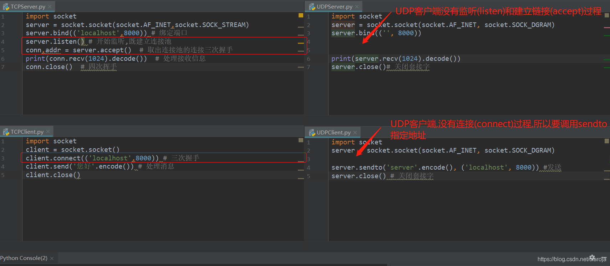

# socket_tcp


## 样例1-基本使用

### 服务端
```python
import socket
server = socket.socket(socket.AF_INET,socket.SOCK_STREAM)
server.bind(('localhost',8000)) # 绑定端口
server.listen() # 开始监听,既建立连接池
conn,addr = server.accept()  # 取出连接池的连接三次握手
conn.send('您好'.encode())  # 处理接收信息
conn.close()  # 四次挥手
```

### 客户端
```python
import socket
client = socket.socket()
client.connect(('localhost',8000)) # 三次握手
print(client.recv(1024).decode()) # 处理消息
client.close()
```


### 样例2 listen与accept
`listen`方法开始监听端口,等待客户端连接`connect`,如果收到客户端连接则放在队列FIFO里.listen参数是队列的长度,最大容纳的连接数?这个还不确定
`accept`方法从队列里取连接,返回连接对象和地址,使用连接对象来发送消息

1.服务端建立监听端口,等待链接
```python
import socket
server = socket.socket(socket.AF_INET,socket.SOCK_STREAM)
server.bind(('localhost',8001))
server.listen() # client.connect(('localhost',8001))
```
2.客户端1进行连接
```python
import socket
client1 = socket.socket(socket.AF_INET,socket.SOCK_STREAM)
client1.connect(('localhost',8001))
```

3.客户端2进行连接
```python
import socket
client2 = socket.socket(socket.AF_INET,socket.SOCK_STREAM)
client2.connect(('localhost',8001))
```

4.目前服务器,已经收到两个连接请求,两个请求放在FIFO队列里,使用accept来顺序取出
如果使用accpet后,没有发现有链接存在,则阻塞,一直到有连接为止
conn可以使用send和recv来发送和接收信息,本质上是全双工的管道,一端写,一端读
```python
conn1,addr1 = server.accept()  #  获得第一个客户端连接,文件描述符fd=1204,端口7192
print(conn1,addr1) # <socket.socket fd=1204, family=AddressFamily.AF_INET, type=SocketKind.SOCK_STREAM, proto=0, laddr=('127.0.0.1', 8001), raddr=('127.0.0.1', 7192)> ('127.0.0.1', 7192)
conn2,addr2 = server.accept()  #  获得第二个客户端连接,文件描述符fd=1256,端口7212
print(conn2,addr2) # <socket.socket fd=1256, family=AddressFamily.AF_INET, type=SocketKind.SOCK_STREAM, proto=0, laddr=('127.0.0.1', 8001), raddr=('127.0.0.1', 7212)> ('127.0.0.1', 7212)
```

### 样例3 send&recv
1.服务端建立监听端口,等待链接
```python
import socket
server = socket.socket(socket.AF_INET,socket.SOCK_STREAM)
server.bind(('localhost',8001))
server.listen() # client.connect(('localhost',8001))
```

2.客户端链接,并发送消息
```python
import socket
client1 = socket.socket(socket.AF_INET,socket.SOCK_STREAM)
client1.connect(('localhost',8001))
client1.send('client1-1'.encode())  # 向管道里写入,可以多次写入,写入操作不会阻塞
client1.send('client1-2'.encode())
```

3.服务端接收消息
```python
conn1,addr1 = server.accept()  #  获得第一个客户端连接
print(conn1,addr1) # <socket.socket fd=1036, family=AddressFamily.AF_INET, type=SocketKind.SOCK_STREAM, proto=0, laddr=('127.0.0.1', 8001), raddr=('127.0.0.1', 7623)> ('127.0.0.1', 7623)
print(conn1.recv(1024).decode()) # client1-1client1-2 直接受到客户端所有发送的信息(如果没有消息则阻塞)
```


## TCP UDP区别



