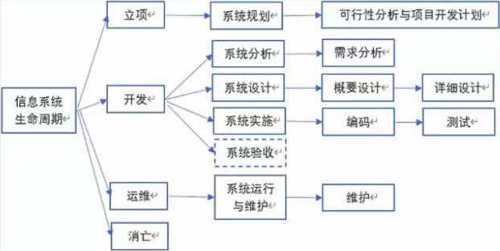
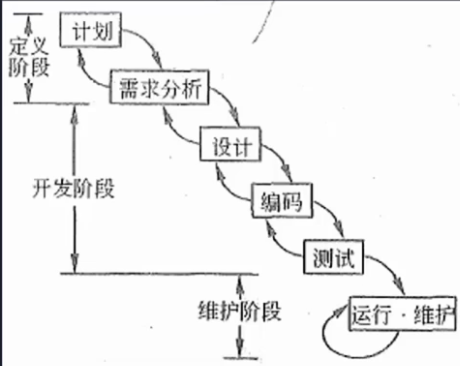
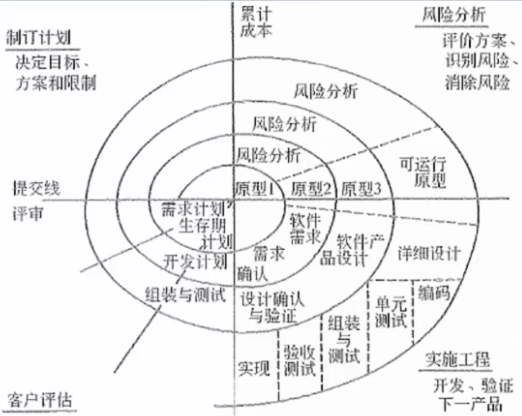
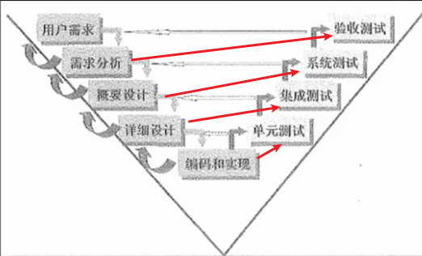
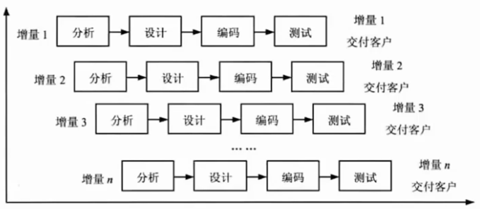

# 软件工程

## 信息系统生命周期
软件工程基本原理：用分阶段的生命周期计划严格管理、坚持进行阶段评审、实现严格的产品控制，采用现代程序设计技术、结果应能清楚的审查、开发小组的人员应少而精、承认不断改进软件工程实践的必要性。

软件工程的基本要素：`方法、工具、过程`。

软件生存周期：可行性分析与项目开发计划、需求分析、概要设计（选择系统解决方案，规划子系统）、详细设计（设计子系统内部具体实现）、编码、测试、维护。

1. 系统规划阶段：任务是对组织的环境、目标及现行系统的状况进行初步调查，根据组织目标和发展战略确定信息系统的发展战略，对建设新系统的需求做出分析和预测，同时考虑建设新系统所受的各种约束，研究建设新系统的必要性和可能性。根据需要与可能，给出制建系统的备选方案。
    
    输出：可行性研究报告、系统设计任务书。

2. 系统分析阶段：任务是根据系统设计任务书所确定的范围，对现行系统进行详细调查，描述现行系统的业务流程，指出现行系统的局限性和不足之处，确定新系统的基本目标和逻辑功能要求，即提出新系统的逻辑模型。系统分析阶段又称为逻辑设计阶段。这个阶段是整个系统建设的关键阶段，也是信息系统建设与一般工程项目的重要区别所在。

    输出：系统说明书。

3. 系统设计阶段：系统分析阶段的任务是回答系统“做什么”的问题，而系统设计阶段要回答的问题是“怎么做”。该阶段的任务是根据系统说明书中规定的功能要求，具体设计实现逻辑模型的技术方案，也就是设计新系统的物理模型。这个阶段又称为物理设计阶段，可分为总体设计（概要设计）和详细设计两个子阶段。

    输出：系统设计说明书(概要设计、详细设计说明书)

4. 系统实施阶段：是将设计的系统付诸实施的阶段。这一阶段的任务包括计算机等设备的购置、安装和调试程序的编写和调试、人员培训、数据文件转换、系统调试与转换等。这个阶段的特点是几个互相联系、互相制约的任务同时展开，必须精心安排、合理组织。系统实施是按实施计划分阶段完成的，每个阶段应写出实施进展报告。系统测试之后写出系统测试分析报告。

    输出：实施进展报告、系统测试分析报告。

5. 系统运行和维护阶段：系统投入运行后，需要经常进行维护和评价，记录系统运行的情况，根据一定的规则对系统进行必要的修改，评价系统的工作质量和经济效益。

## 能力成熟度模型
### 能力成熟度模型CMM

1. 初始级(Initia): 软件过程的特点是杂乱无章，有时甚至很混乱，几乎没有明确定义的步骤，项目的成功完全依赖个人的努力和英雄式核心人物的作用。

2. 可重复级(Repeatable): 建立了基本的项目管理过程和实践来跟踪项目费用、进度和功能特性，有必要的过程准则来重复以前在同类项目中的成功。

    软件配置管理、软件质量保证、软件子合同管理、软件项目跟踪与监督、软件项目策划、软件需求管理

3. 已定义级(Defined): 管理和工程两方面的软件过程已经文档化、标准化，并综合成整个软件开发组织的标准软件过程。所有项目都采用根据实际情况修改后得到的标准软件过程来发和维护软件。

    同行评审、组间协调、软件产品工程、集成软件管理、培训大纲组织过程定义、组织过程集点

4. 已管理级(Managed): 制定了软件过程和产品质量的详细度量标准。对软件过程和产品质量有定量的理解和控制。

    软件质量管理和定量过程管理

5. 优化级(Optimized): 加强了定量分析，通过来自过程质量反馈和来自新观念、新技术的反馈使过程能不断持续地改进。

    过程更改管理、技术改革管理和缺陷预防

能力成熟度模型集成CMMI: 

是若干过程模型的综合和改进，不仅仅软件，而是支持多个工程学科和领域的、系统的、一致的过程改进框架，能适应现代工程的特点和需要，能提高过程的质量和工作效率。

CMMI两种表示方法：

- 阶段式模型：类似于CMM,它关注组织的成熟度，五个成熟度模型如下：

    1. 初始级: 过程不可预测且缺乏控制
    2. 已管理级: 过程为项目服务
    3. 已定义级: 过程为组织服务
    4. 定量管理: 过程已度量和控制
    5. 优化级: 集中于过程改进和优化

- 连续式模型：关注每个过程域的能力，一个组织对不同的过程域可以达到不同的过程域能力等级。

题目: 
（）是系统分析阶段结束后得到的工作产品，（）是系统测试阶段完成后的工作产品。  
A.系统设计规格说明  
B.系统方案建议书  
C程序规格说明  
D.单元测试数据  
A.验收测试计划  
B.测试标准  
C.系统测试计划  
D.操作手册

答案：BD

以下关于CMM的叙述中，不正确的是（）  
A.CMM是指软件过程能力成熟度模型  
B.CMM根据软件过程的不同成熟度划分了5个等级，其中，1级被认为成熟度最高，5级被认为成熟度最低  
C.CMMI的任务是将已有的几个CMM模型结合在一起，使之构造成为“集成模型”  
D.采用更成熟的CMM模型，一般来说可以提高最终产品的质量

答案：B

## 软件过程模型
### 瀑布模型
瀑布模型（SDLC：瀑布模型是一个经典的软件生命周期模型般将软件开发分为：可行性分析（计划）、需求分析、软件设计(概要设计、详细设计)、编码（含单元测试）、测试、运行维护等几个阶段。

瀑布模型特点

- 从上一项开发活动接受该项活动的工作对象作为输入。
- 利用这一输入，实施该项活动应完成的工作内容。
- 给出该项活动的工作成果，作为输出传给下一项开发活动。
- 对该项活动的实施工作成果进行评审。若其工作成果得到确认，则继续进行下一项开发活动；否侧返回前一项，甚至更前项的活动。尽量减少多个阶段间的反复。以相对来说较小的费用来开发软件

### 螺旋模型
螺旋模型是一个演化软件过程模型，将原型实现的迭代特征与线性顺序（瀑布）模型中控制的和系统化的方面结合起来。在螺旋模型中，软件开发是一系列的增量发布。

开发过程具有周期性重复的螺旋线状。四个象限分别标志每个周期所划分的四阶段：制订计划、`风险分析`、实施工程和客户评估。螺旋模型强调了风险分析，特别适用于庞大而复杂的、高风险的系统。

### V模型
V模型从整体上看起来，就是一个V字型的结构，由左右两边组成。左边的下画线分别代表了需求分析、概要设计、详细设计、编码。右边的上画线代表了单元测试、集成测试、系统测试与验收测试。V模型的特点如下：
- 单元测试的主要目的是针对编码过程中可能存在的各种错误；
- 集成测试的主要目的是针对详细设计中可能存在的问题；
- 系统测试主要针对概要设计，检查系统作为一个整体是否有效地得到运行；
- 验收测试通常由业务专家或者用户进行，以确认产品能真正符合用户业务上的需要。
- V模型用于需求明确和需求变更不频繁的情形。

### 原型化模型
原型化模型第一步就是创建一个快速原型，能够满足项目干系人与未来的用户可以与原型进行交互，再通过与相关干系人进行充分的讨论和分析，最终弄清楚当前系统的需求，进行了充分的了解之后，在原型的基础上开发出用户满意的产品。

原型法认为在很难一下子全面准确地提出用户需求的情况下，原型应当具备的特点如下。
- 实际可行
- 具有最终系统的基本特征
- 构造方便、快速，造价低。原型法的特点在于原型法对用户的需求是动态响应、逐步纳入的。

### 增量模型

增量模型：首先开发核心模块功能，而后与用户确认，之后再开发次核心模块的功能，即每次开发一部分功能，并与用户需求确认，最终完成项目开发，优先级最高的服务最先交付。

特点：但由于并不是从系统整体角度规划各个模块，因此不利于模块划分。

难点在于如何将客户需求划分为多个增量。与原型不用的是增量模型的每一次增量版本都可作为独立可操作的作品，而原型的构造一般是为了演示。

### 其他

- 喷泉模型：是一种以用户需求为动力，以对象作为驱动的模型，适合于面向对象的开发方法。使开发过程具有迭代性和无间隙性。
- 基于构件的开发模型CBSD：利用预先包装的构件来构造应用系统。构件可以是组织内部开发的构件，也可以是商品化成品软件构件。特点是增强了复用性，在系统开发过程中，会构建一个构件库，供其他系统复用，因此可以提高可靠性，节省时间和成本。
- 形式化方法模型：建立在严格数学基础上的一种软件开发方法，主要活动是生成计算机软件形式化的数学规格说明。

题目:
假设某软件公司与客户签订合同开发一个软件系统，系统的功能有较清晰的定义，且客户对交付时间有严格要求，则该系统的开发最适宜采用  
A.瀑布模型  
B.原型模型  
C.V模型  
D.螺旋模型

答案：A
解析：功能清晰，也即需求较明确，有这样的关键字都是考察瀑布模型，牢记总结的记忆关键字。

以下关于螺旋模型的叙述中，不正确的是（）  
A.它是风险驱动的，要求开发人员必须具有丰富的风险评估知识和经验  
B.它可以降低过多测试或测试不足带来的风险  
C.它包含维护周期，因此维护和开发之间没有本质区别  
D.它不适用于大型软件开发

答案：D
解析：螺旋模型的特点是风险分析，应对风险的都正确，螺旋模型适合大型软件开发。

## 信息系统开发方法

## 软件产品线

## 逆向工程