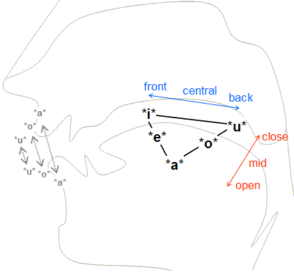
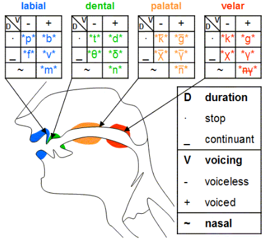

# 音标

音标的指定原则是:一音一符, 一符一音, 即一个音素只对应一个音标，反之亦然.
音标是“总结”不断变化的发音，不是“规定”以后怎么发音
发音不是一个点，而是一个范围

音标分类:
1. IPA(International phonetic Alphabet), 可以标注人类任何语言.
2. DJ(Daniel Jones), 根据IPA制作的英式发音音标, 国内采用的就是这种注音方法.

> DJ音标：1971年英国Daniel Jones教授出版了《English Pronouncing Dictionary》，他为了给Received Pronunciation（RP）注音，从Interaction Phonetic Alphabet（IPA）中借了很多符号给英语注音，也就是广义国际音标。

3. KK(John S. Kenyon & Thomas A.Knott), 根据DJ修改, 美式发音音标.

## 概括

- 元音(20个)
  - 单元音(12个)
    - 前元音(4个): /i:/, /ɪ/, /e/, /æ/
    - 中元音(3个): /ɜː/, /ə/, /ʌ/
    - 后元音(5个): /ɑː/, /ɔ:/, /ɒ/, /u:/, /ʊ/
  - 双元音(8个): /eɪ/, /aɪ/, /ɔɪ/, /ɪə/, /eə/, /ʊə/, /əʊ/, /aʊ/
- 辅音(28个)
  - 塞音(6个): /b/, /p/, /t/, /d/, /k/, /g/
  - 摩擦音(10个): /f/, /v/, /s/, /z/, /θ/, /ð/, /ʃ/, /ʒ/, /h/, /r/
  - 破擦音(6个): /tʃ/, /dʒ/, /ts/, /dz/, /tr/, /dr/
  - 鼻音(3个): /m/, /n/, /ŋ/
  - 舌边音(1个): /l/
  - 半元音(2个): /j/, /w/

## 元音

5个部位控制发音:
- 唇, 分为圆唇, 不圆唇
- 牙齿, 
- 舌, 舌前, 舌中, 舌后
- 颚, 颚前, 颚中, 颚后 

### /i://i/

- /i:/, 开口小, 不圆唇, 嘴角向两边拉伸, 微笑, 舌位`前高`的元音. 和普通话币的韵母i相似, 区别在于普通话, 较时长短.
- /i/, 和/i:/基本一致, 时长通常很短.
- 示例
  - <Au w="bee/ biː // biː /"/>
  - <Au w="fee/ fiː // fiː /"/>
  - <Au w="pea/ piː // piː /"/>
  - <Au w="read/ riːd // riːd /"/>
  - <Au w="meat/ miːt // miːt /"/>
  - <Au w="lead/ liːd // liːd /"/>

> 不必纠结长音和短音, 美音kk音标中没有长音符号.

### /ɪ/
- /ɪ/, 无需圆唇, 嘴角不需要像/i/一样向两边拉伸, 舌位相较于/i/来说, 更低更后, 舌头上方空间更大. 
- 示例
  - <Au w="lit/ lɪt // lɪt /"/>
  - <Au w="hit/ hɪt // hɪt /"/>
  - <Au w="fish/ fɪʃ // fɪʃ /"/>
  - <Au w="bit/ bɪt // bɪt /"/>
  - <Au w="fit/ fɪt // fɪt /"/>
  - <Au w="pit/ pɪt // pɪt /"/>

> 增音现象  
> 元音/i://ɪ/和/uː/和/ʊ/很容易“丝滑”地和后面的元音或者某些辅音连起来，就是因为它们本身具有辅音的特征，很容易产生增音  
> /i://ɪ/→ 增/j/  
> /uː/和/ʊ/→ 增/w/  
> 增加一个/j/（为了连读而产生的增音）  
> boil /bɔɪjl/  
> oil /ɔɪjl/  
> loyal /ˈlɔɪjəl/

### /e/

fdf

- /e/, 不需圆唇, 开口比/i:/大, 舌位前中高的元音, 舌位比/i:/低. 和同普话也的元音e一样.
- 示例
  - <Au w="bet/ bet // bet /"/>
  - <Au w="get/ ɡet // ɡet /"/>
  - <Au w="pet/ pet // pet /"/>
  - <Au w="let/ let // let /"/>
  - <Au w="met/ met // met /"/>
  - <Au w="set/ set // set /"/>

> DJ和KK音标:
> - DJ音标的/e/, 对应KK音标的/ɛ/
> - DJ音标的/eɪ/, 对应KK应标的/e/

### /æ/

- /æ/,  舌位前, 较低的元音, 比/e/更低, 比/a/(只出现在双元音里/aɪ/, 和/ɑ/不同)更高. 
- 示例
  - <Au w="bad/ bæd // bæd /"/>
  - <Au w="fat/ fæt // fæt /"/>
  - <Au w="pat/ pæt // pæt /"/>
  - <Au w="lad/ læd // læd /"/>
  - <Au w="mat/ mæt // mæt /"/>
  - <Au w="sat/ sæt // sæt /"/>

### /ə/
- /ə/, 不需要圆唇, 嘴自然张开, 舌位前后高低都在中间的元音(schwa),  唇和舌都自然放松, 声带震动.
- 示例: 
  - <Au w="about/ əˈbaʊt // əˈbaʊt /"/>
  - <Au w="problem/ ˈprɒbləm // ˈprɑːbləm /"/>
  - <Au w="easily/ ˈiːzəli // ˈiːzəli /"/>
  - <Au w="memory/ ˈmeməri // ˈmeməri/ "/>
  - <Au w="supply/ səˈplaɪ // səˈplaɪ /"/>
  - <Au w="analysis/ əˈnæləsɪs // əˈnæləsɪs /"/>

> - 央化现象：很多非重读音节，有时候连重读音节，他们都要向 /ə/ 靠拢，甚至直接拿/ə/ 去发. 很多不重读的音节都发 /ə/这个音,  这种现象被称为央化. 句子中不重要的单词也会被央化, 如比如can of等

### /ɜː/
- /ɜː/, 不需圆唇, 舌位前后高低都在中间. 和普通话的饿, 相似. 区别在于普通户话舌位更高, 更靠后.
- 示例
  - <Au w="her/ hɜː(r) // hɜːr /"/>
  - <Au w="person/ ˈpɜːs(ə)n // ˈpɜːrs(ə)n /"/>
  - <Au w="learn/ lɜːn // lɜːrn /"/>
  - <Au w="bird/ bɜːd // bɜːrd /"/>
  - <Au w="word/ wɜːd // wɜːrd /"/>
  - <Au w="fur/ fɜː(r) // fɜːr /"/>

> 儿化现象:
> - 普通话中是发出/ə/之后再卷舌
> - 美语中则是发音和卷舌同时进行

> - /ɜː/就是/ə/肌肉紧张, /ə/轻声, /ɜː/汉语四声
> - 英语中所有的元音和半元音字母都可能发/ə/
>   - a <Au w="about/əˈbaʊt/"/> <Au w="balloon/bəˈluːn/"/>
>   - e <Au w="taken/ˈteɪkən/"/> <Au w="problem/ˈprɑːbləm/"/>
>   - i <Au w="family/ˈfæməli/"/> <Au w="pencil/ˈpens(ə)l/"/>
>   - o <Au w="memory/ˈmeməri/"/> <Au w="freedom/ˈfriːdəm/"/>
>   - u <Au w="supply/səˈplaɪ/"/> <Au w="support/səˈpɔːrt/"/>
>   - y <Au w="analysis/əˈnæləsɪs/"/> <Au w="pyjamas/pəˈdʒɑːməz/"/>

### /u:/

- /u:/, 需圆唇, 舌位后高, 开口很小. 和普通话的姑的韵母u相似, 区别在于普通话更加圆唇. 但现在舌位靠前, 也不需要特别圆唇.
- 示例
  - <Au w="too/ tuː // tuː /"/>
  - <Au w="food/ fuːd // fuːd /"/>
  - <Au w="loose/ luːs // luːs /"/>
  - <Au w="music/ ˈmjuːzɪk // ˈmjuːzɪk /"/>
  - <Au w="news/ njuːz // nuːz /"/>
  - <Au w="student/ ˈstjuːd(ə)nt // ˈstuːd(ə)nt /"/>

### /ʊ/

- /ʊ/,  只需微微圆唇. 发音比/u:/更放松. 舌位后高的元音, 相较于/u:/更低, 更下.普通话没有这个音.
- 示例
  - <Au w="book/ bʊk // bʊk /"/>
  - <Au w="look/ lʊk // lʊk /"/>
  - <Au w="good/ ɡʊd // ɡʊd /"/>
  - <Au w="took/ tʊk // tʊk /"/>
  - <Au w="bush/ bʊʃ // bʊʃ /"/>
  - <Au w="would/ wʊd // wʊd /"/>

> 美音中更强调音质区别，而不是音值
> - [uː] 紧元音, 嘴巴从外往里包的感觉（汉语的 u 发音靠后，英语靠前）, tooth /tu:θ/, food /fuːd/
> - [ʊ] 松元音, 起始位置唇部放松，不要发成双元音哦, good /ɡʊd/, look /lʊk/
> 发音小技巧： 用[ə]来代替（弱读）, should /ʃʊd,ʃəd/, could /ʃʊd,ʃəd/, good /gʊd,gəd/

### /ʌ/

- /ʌ/, 舌位比/ə/稍低, 无需圆唇, 
- 示例
  - <Au w="but/ bʌt // bʌt /"/>
  - <Au w="hut/ hʌt // hʌt /"/>
  - <Au w="must/ mʌst // mʌst /"/>
  - <Au w="sum/ sʌm // sʌm /"/>
  - <Au w="ton/ tʌn // tʌn /"/>
  - <Au w="done/ dʌn // dʌn /"/>

### /ɑː/

- /ɑː/, 无需圆唇, 开口较大(上下, 不咧嘴), 舌位低后. 和普通话的啊相似, 区别是普通话舌位更靠前, 在舌位前端一半的地方
- 示例:
  - <Au w="father/ ˈfɑːðə(r) // ˈfɑːðər /"/>
  - <Au w="fast/ fɑːst // fæst /"/>
  - <Au w="glass/ ɡlɑːs // ɡlæs /"/>
  - <Au w="car/ kɑːr // kɑːr /"/>
  - <Au w="park/ pɑːrk // pɑːk /"/>
  - <Au w="mark/ mɑːk // mɑːrk /"/>

> /ɑː/和/a/是不同的音, /a/只出现在/aɪ/中
> - /ɑː/ 为竖张口 例如： dog talk not hot
> - /a/ 为横张口 一般出现在双元音中 down town
> 英音和美音发音不同
> - 英音: bath/bɑːθ/, ask/ɑːsk/, glass/ɡlɑːs/
> - 美音: hath/bæθ/, ask/æsk/, glass/ɡlæs/

### /ɔ:/
- /ɔ:/,  圆唇, 舌位后中高(和IPA的O类似, 高于IPA的ɔ)的元音,和普通话的`哦`相似, 区别在于普通话更短
- 示例:
  - <Au w="caught/ kɔːt // kɔːt /"/>
  - <Au w="bought/ bɔːt // bɔːt /"/>
  - <Au w="law/ lɔː // lɔː /"/>
  - <Au w="saw/ sɔː // sɔː /"/>
  - <Au w="door/ dɔː(r) // dɔːr /"/>
  - <Au w="four/ fɔː(r) // fɔːr /"/>

> 美音中有些地方会将/ɔ:/发成/ɑː/

### /ɒ/

- /ɒ/, 圆唇, 舌位靠后, 低的元音, 和/ɑː/是一致的, 区别是/ɑː/不需要圆唇. 和普通话的`奥`的ao相似, 区别是普通话是复韵(双音节)
- 示例:
  - <Au w="top/ tɒp // tɑːp /"/>
  - <Au w="hot/ hɒt // hɑːt /"/>
  - <Au w="lot/ lɒt // lɑːt /"/>
  - <Au w="box/ bɒks // bɑːks /"/>
  - <Au w="stop/ stɒp // stɑːp /"/>
  - <Au w="wash/ wɒʃ // wɑːʃ /"/>

> 单词在英音中含有/ɒ/, 基本在美音中都读/ɑː/, 既失去圆唇
> /ɒ/是/ɑ/反转了180度

### /eɪ/

- /eɪ/, 从/e/的舌位往/ɪ/的方向移动. 和普通话的黑的复韵母ei相似, 区别英语嘴角更向两边拉伸.
- 示例:
  - <Au w="make/ meɪk // meɪk /"/>
  - <Au w="date/ deɪt // deɪt /"/>
  - <Au w="cake/ keɪk // keɪk /"/>
  - <Au w="plane/ pleɪn // pleɪn /"/>
  - <Au w="train/ treɪn // treɪn /"/>
  - <Au w="dangerous/ ˈdeɪndʒərəs // ˈdeɪndʒərəs /"/>

> 双元音, 有两个元音的特质, 具体体现在舌位的变化
> DJ音标和KK音标的注音区别: bate, DJ音标/ beɪt /, KK音标/ bet /; bet, DJ音标/ bet /, KK音标/ bɛt /.

### /aɪ/
- /aɪ/, 双元音, 从/a/舌位往/ɪ/的方向移动. 和普通话的爱的复韵母ai很像
- 示例
  - <Au w="bike/ baɪk // baɪk /"/>
  - <Au w="nice/ naɪs // naɪs /"/>
  - <Au w="time/ taɪm // taɪm /"/>
  - <Au w="like/ laɪk // laɪk /"/>
  - <Au w="site/ saɪt // saɪt /"/>
  - <Au w="life/ laɪf // laɪf /"/>

> 注意/aɪ/是/a/, 而不是/ɑː/, 前者舌位靠前, 后者舌位靠后
> /a/只出现在双元音中

### /ɔɪ/
- /ɔɪ/, 双元音, 从/ɔ:/舌位往/ɪ/的方向移动. 
- 示例
  - <Au w="boy/ bɔɪ // bɔɪ /"/>
  - <Au w="toy/ tɔɪ // tɔɪ /"/>
  - <Au w="soy/ sɔɪ // sɔɪ /"/>
  - <Au w="voice/ vɔɪs // vɔɪs /"/>
  - <Au w="noise/ nɔɪz // nɔɪz /"/>
  - <Au w="moist/ mɔɪst // mɔɪst /"/>

### /aʊ/
- /aʊ/, 从比/a/靠后的舌位往/ʊ/的舌位移动, 起始更重. 和普通话的奥的ao很像
- 示例
  - <Au w="haʊ/ haʊ // haʊ /"/>
  - <Au w="cow/ kaʊ // kaʊ /"/>
  - <Au w="allow/ əˈlaʊ // əˈlaʊ /"/>
  - <Au w="house/ haʊs // haʊs /"/>
  - <Au w="loud/ laʊd // laʊd /"/>
  - <Au w="mouse/ maʊs // maʊs /"/>

### /əʊ/
- /əʊ/, 从/ə/的中间舌位往/ʊ/的舌位移动, 起始更重. 和普通话的欧的ou相似
- 示例
  - <Au w="open/ ˈəʊpən // ˈoʊpən /"/>
  - <Au w="hope/ həʊp // hoʊp /"/>
  - <Au w="post/ pəʊst // poʊst /"/>
  - <Au w="coat/ kəʊt // koʊt /"/>
  - <Au w="boat/ bəʊt // boʊt /"/>
  - <Au w="soap/ səʊp // soʊp /"/>

### /ɪə/
- /ɪə/, 从/ɪ/的舌位往/ə/的舌位移动, 起始更重. 
- 示例
  - <Au w="dear/ dɪə(r) // dɪr /"/>
  - <Au w="fear/ fɪə(r) // fɪr /"/>
  - <Au w="here/ hɪə(r) // hɪr /"/>
  - <Au w="bear/ beə(r) // ber /"/>
  - <Au w="cheer/ tʃɪə(r) // tʃɪr /"/>
  - <Au w="idea/ aɪˈdɪə // aɪˈdiːə /"/>

> 注意美音中使用/r/表示儿化, /r/又被称为r化原因

### /eə/
- /eə/, 从/e/的舌位往/ə/的舌位移动, 起始更重. 
- 示例
  - <Au w="hair/ heə(r) // her /"/>
  - <Au w="pair/ peə(r) // per /"/>
  - <Au w="chair/ tʃeə(r) // tʃer /"/>
  - <Au w="fare/ feə(r) // fer /"/>
  - <Au w="care/ keə(r) // ker /"/>
  - <Au w="dare/ deə(r) // der /"/>

### /ʊə/
- /ʊə/, 从/ʊ/的舌位往/ə/的舌位移动, 起始更重. 
- 示例
  - <Au w="tour/ tʊə(r) // tʊr /"/>
  - <Au w="poor/ pʊə(r) // pʊr /"/>
  - <Au w="moor/ mɔː(r) // mʊr /"/>
  - <Au w="pure/ pjʊə(r) // pjʊr /"/>
  - <Au w="cure/ kjʊə(r) // kjʊr /"/>
  - <Au w="lure/ lʊə(r) // lʊr /"/>

## 辅音

### /p//b/

> 辅音发音的三个阶段:
> 1. 成阻(catch): 气流被阻塞
> 2. 持阻(hold): 气流持续向外冲, 但仍被阻塞
> 3. 除阻(release): 阻塞被去除, 气流冲出

- /p/, ：塞音, 清辅音(unvoiced)

  /p/在英语中有三种发音, 即同一个音位(phoneme)有不同的音位变体(allophones)

  - 送气, 如果单词中字母p后有元音, 比如peak /pi:k/, /p/在除阻时会有较强烈的向外气流释放. 称为送气辅音(aspirated consonant). 完全对应了中文中的婆的声母p.

  - 不送气, 如果字母p前有s, 比如speak /spi:k/, /p/是不送气辅音(unaspirated consonant)

    > 这里的送气不送气, 翻译不够准确,  不送气是指相比送气, 没那么强. speak中/p/就是普通话中的菠的声母b, 就是一个清辅音, 而不是英语中的浊辅音/b/. 如on top of 中的/p/ 并不是清辅音浊化成/b/, 而就是不送气的/p/, 类似菠的声母b. 也就是说中文没有/b/这个音标, 中文中的b对应的是不送气的清辅音/p/.

  - 无声除阻(No Audible release), trapdoor/'træpdɔ:/, help me/help mi:/, 

    > 国内所谓的不完全爆破或失去爆破

- /b/ 是浊辅音(voiced)

  在普通话里并不存在, 汉语中的菠的b不等于/b/

  > 个人感觉不送气/p/发音靠上的b, 稍微带动一点点声带, 而/b/是发音靠下的, 声带完全震动

### /t//d/

- /t/
  塞音

    - 送气, 如果单词中字母t后有元音, 比如top /tɒp/.
    - 不送气, /s/+/t/, 比如stop /stɒp/. 和普通话du(度)的声母一样, 国际音标写成/t/, 注意不是英语中的浊辅音/d/
    - 无声除阻, /t/+辅音, 如setback /'setbæk/
    - 闪音, 元音+/t/+元音. water //, 连读中: not at all|/nɑːt(d) æt(d) ɑːl /|, told her|/toʊld (~~h~~)ər/|
  
      注意： dropt,仅有时用在非重读音节不是 drop t: maintain /meɪnˈteɪn/ 

    - 喉塞音(glottal), /t/ + /n/, water //
    - 鼻音除阻, /t/+/n/, 那么/t/的除阻可以和鼻音衔接上, 把气流释放进鼻腔.eaten / /.

      > 注意, 鼻音除阻是可以, 但非必须
    
    - 边音除阻, /t/+/l/, 把气流通过舌根两边释放. little //

      > little, 可以做喉塞音, 也可以读成闪音

    - 省略, /n/+/t/, 鼻音后的字母往往省略, 比如 winter // interview //

    - 同化现象, [t]+[j]=[tʃ] [d]+[j]=[dʒ]
    
      meet you|/mi:tʃu:/
      need you|/ni:dʒu:/

- /d/

  国语中的度du中的d, 对应的是英语中的不送气/t/, 而英语中的/d/是浊辅音

## /k//g/

- /k/清音, 塞音, 大多对应字母 c,k,ck

  - 送气, /k/+元音, 和普通话开的声母k一样
  - 不送气, /s/+/k/, sky/skai/, 和普通话该的声母g一样, 
    > 注意, 普通话声母g不是对应浊音/g/而是对应不送气清音/k/
  - 无声除阻, /k/+辅音, 如, doctor/'dɑː~~k~~ər/, make dinner/mei~~k~~'dinər/

- /g/浊音, 大多对应字母 g

## /f/,/v/
- /f/清音, 擦音, 调音部位是上齿和下唇, 声带不震动, 和中文夫的声母f一样
- /v/浊音, 擦音, 调音部位是上齿和下唇, 声带震动, 中文中没有对应

## /θ/,/ð/

- /θ/: 清音, 舌头和牙齿摩擦, 舌头不用突出太多. 中文没有对应, 如: think/θɪŋk/
- /ð/: 浊音, 相较于/θ/, 多了声带震动. 中文没有对应, 如: that/ðæt/

> 语句中，有时确实会用[d]来代替[ð] ，比如the 前后都加辅音的时候，舌头伸出来很麻烦
> Where is the car, /ðə/(/də/)
> 注意：单独强调 the 时一定要发 [ð]

## /s/,/z/
- /s/, 清音, 擦音, 调音部位是上齿龈, 声带不震动, 和中文斯的声母s一样
- /z/, 浊音, 擦音, 调音部位是上齿龈, 声带震动, 中文中没有对应
  > 中文中的再的声母z, 是塞擦音, 英语的/dz/更接近

> s 字母对应的发音[s][z]旁边是清音的时候，发清音；旁边是浊音的时候，发浊音newspaper/ˈnuːzpeɪpər/（这里可以无视音标，直接读 s）
> 关于 s 到底发[s]还是[z], 不要过度纠结， [s]和[z]在语流中是模糊的

## /ʃ//ʒ/
- /ʃ/: 清音, 卷舌, 齿龈后摩擦. 和中文史中的sh相近, 区别在于舌头没那么卷, 简单来说就是翘舌音, 不必太在意区分. 
- /ʒ/: 浊音, 相较于/ʃ/, 震动声带. 和中文日的r相近, 区别在于舌头没那么卷.
  

## /tʃ//dʒ/

- /tʃ/: 清音, 塞擦音(/t/塞音, /ʃ/擦音), 调音部位是齿龈后, 和普通话吃的声母q相似, 区别在于普通话更卷舌一点, 如, <Au w="chuck/ tʃʌk // tʃʌk /"/>, <Au w="chop/ tʃɒp // tʃɑːp /"/>, <Au w="choke/ tʃəʊk // tʃoʊk /"/>
- /dʒ/: 浊音, 和/tʃ/区别在于声带震动, 和普通话知的声母g相似, 区别在于普通话更卷舌如, <Au w="jug/ dʒʌɡ // dʒʌɡ /"/>, <Au w="job/ dʒɒb // dʒɑːb /"/>, <Au w="joke/ dʒəʊk // dʒoʊk /"/>
- /tʃ/与/dʒ/对比
  - <Au w="cheap/ tʃiːp // tʃiːp /"/><Au w="jeep/ dʒiːp // dʒiːp /"/>
  - <Au w="catch/ kætʃ // kætʃ /"/><Au w="page/ peɪdʒ // peɪdʒ /"/>
  - <Au w="pitch/ pɪtʃ /"/><Au w="college/ ˈkɒlɪdʒ // ˈkɑːlɪdʒ /"/>

## /m//n//ŋ/
- /m/ 浊音, 鼻音, 调音部位是双唇, 双唇闭拢, 舌头平放, 气流从鼻腔通过, 声带震动. 如果在元音前, 和普通话妈的ma声母一样; 在元音之后, 发音相对轻微. 如, <Au w="sum/ sʌm // sʌm /"/>
- /n/ 浊音, 鼻音, 调音部位是上齿龈, 舌尖抵住上齿龈, 和发/t//d/一样, 气流从鼻腔通过; 如果出现在元音前, 和普通话拿的声母n一样; 在元音之后, 发音相对轻微. 如, <Au w="sun/ sʌn // sʌn /"/>
- /ŋ/ 浊音, 鼻音, 调音部位是软腭, 用舌后端抵住软腭. 如, <Au w="sung/ sʌŋ // sʌŋ /"/>

  > - 在发完/ŋ/后, 舌根下降离开软腭时有除阻的感觉, 并伴随轻微的/g/声(/ŋ/和/g/的调音部位一样), <Au w="sing/ sɪŋ // sɪŋ /"/>
  > - /n//ŋ/可以简单理解为前鼻音和后鼻音, 但英语中的后鼻音更重, 这点不能忽略
  > - 很多人会把/ŋ/简化为/n/，比如`What are you doing?` 很多美国人会把`doing`这个`g`省掉还有类似的例子：
  >   - What are you doin'
  >   - Where are you goin'
  >   - What's goin'on

- /m//n//ŋ/的区别:
  - <Au w="map/ mæp // mæp /"/><Au w="nap/ næp // næp /"/>
  - <Au w="met/ met // met /"/><Au w="net/ net // net /"/>
  - <Au w="meet/ miːt // miːt /"/><Au w="neat/ niːt // niːt /"/>
  - <Au w="room/ ruːm // ruːm /"/><Au w="noon/ nuːn // nuːn /"/>
  - <Au w="tom/ tɒm // tɑːm /"/><Au w="run/ rʌn // rʌn /"/>
  - <Au w="lime/ laɪm // laɪm /"/><Au w="line/ laɪn // laɪn /"/>
  - <Au w="sin/ sɪn // sɪn /"/><Au w="sing/ sɪŋ // sɪŋ /"/>
  - <Au w="on/ ɒn // ɑːn /"/><Au w="long/ lɒŋ // lɔːŋ /"/>
  - <Au w="sun/ sʌn // sʌn /"/><Au w="song/ sɒŋ // sɔŋ /"/>

### /h/

/h/ 清音, 擦音(只通过声带, 不需要其他部位参与) 调音部位是声门. 和普通话的哈的声母h相似, 区别在于普通话的h调音部位是软腭, 摩擦感觉比英语更重, 更明显.

- <Au w="hat/ hæt // hæt /"/>
- <Au w="hot/ hɒt // hɑːt /"/>
- <Au w="high/ haɪ // haɪ /"/>
- <Au w="home/ həʊm // hoʊm /"/>
- <Au w="house/ haʊs // haʊs /"/>
- <Au w="him/ hɪm // hɪm /"/>

### /j/

/j/ 浊音, 近音, 调音部位是硬腭, 气流从舌面和硬腭之间通过, 不产生强烈的摩擦感, 声带震动. 和普通话牙的声母y一样. 

> /j/和/i:/有相似之处, 所以也被称作半元音. 当遇到/i:/+元音时, 如/i:/, /ɪ/, /eɪ/, /aɪ/, /ɔɪ/后接另一个元音时, /i/会转化为/j/.
> 近音的意思是发音部位靠的近, 不是非常近, 形成通道让气流通过. 区别于擦音/f/, /s/, /ʃ/ 发音部位需要靠的很近

- <Au w="yes/ jes // jes /"/>
- <Au w="yard/ jɑːd // jɑːrd /"/>
- <Au w="yellow/ ˈjeləʊ // ˈjeloʊ /"/>
- <Au w="young/ jʌŋ // jʌŋ /"/>
- <Au w="yoga/ ˈjəʊɡə // ˈjoʊɡə /"/>
- <Au w="use/ juːz // juːz /"/>

> - /t/, /d/, /n/ + /j/会省略/j/, 该现象称为Yod-dropping. 如, <Au w="student/ ˈstjuːd(ə)nt //ˈstuːd(ə)nt/"/>, <Au w="dwe/ djuː // duː /"/>, <Au w="new/ njuː // nuː /"/>
> - /t/, /d/, /s/, /z/ + /j/ 会发生Yod-coalescence, 融合. 如, /t/+/j/=/tʃ/, /d/+/j/=dʒ <Au w="during/ ˈdjʊərɪŋ // ˈdʊrɪŋ/ "/>, /s/+/j/=/ʃ/, /z/+/j/=ʒ

### /w/

/w/ 浊音, 近音, 调音部位有两处唇和软腭, 双唇圈起向外突出, 发音时动态扩张, 舌后端也要向软腭抬. 和普通话我的声母w一致

> 和元音/u:/很像, /w/多了一个双唇的动态变化, 是半元音. /u:/+元音 = /u:/ + /w/ + 元音, 就是/u/加音. 具体来说, /u:/, /ʊ/, /aʊ/, /əʊ/后加一个元音时, 如, who is

- <Au w="was/ wɒz // wəz /"/>
- <Au w="why/ waɪ // waɪ /"/>
- <Au w="wide/ waɪd // waɪd /"/>
- <Au w="wet/ wet // wet /"/>
- <Au w="we/ wiː // wiː /"/>

### /r/

1. 齿龈近音: 元音前的/r/, 如 <Au w="right/ raɪt // raɪt /"/>, 是浊音, 近音, 调音部位是上齿龈, 舌头后卷, 抬上上齿龈, 声带震动. 和普通话日的声母r, 相似但不同. 普通话中的r更靠后.
2. r化元音: 元音后的/r/, 如 <Au w="car/ kɑː(r) //kɑːr/"/>, 英音一般不发音或读作/ə/, 美音中会/r/化之前的元音. 

> 音位和同位异音

- <Au w="rat/ ræt // ræt /"/>
- <Au w="red/ red // red /"/>
- <Au w="read/ riːd // riːd /"/>
- <Au w="rise/ raɪs // raɪs /"/>
- <Au w="right/ raɪt // raɪt /"/>
- <Au w="room/ ruːm // ruːm /"/>

### /l/

- 清晰l(light l), 元音前的/l/, 如 <Au w="light/ laɪt // laɪt /"/> , 浊音, 边近音(边音), 调音部位是上齿龈. 和普通话了的声母l一样

  > 边近音, 是从舌头的两边释放, 腔体较大, 不形成气流湍流.(/t/, /d/是从舌尖和上齿龈交界处释放)

  - <Au w="lack/ læk // læk /"/>
  - <Au w="lake/ leɪk // leɪk /"/>
  - <Au w="like/ laɪk // laɪk /"/>
  - <Au w="look/ lʊk // lʊk /"/>
  - <Au w="lose/ luːz // luːz /"/>
  - <Au w="leak/ liːk // liːk /"/>

- 模糊l(dark l), 元音后的/l/, 发音方式和清晰l基本相同, 区别是舌尖不会做离开上齿龈释放气流的动作, 但是气流还是从两边释放(清晰l发一半音), 如 <Au w="loll/ lɒl // lɑːl /"/> . 

  > 一定要有舌尖抵住上齿龈的动作, 连读尤其重要. 连读时模糊l自然转化为清晰l

  - <Au w="help/ help // help /"/>
  - <Au w="mile/ maɪl // maɪl /"/>
  - <Au w="all/ ɔːl // ɔːl /"/>
  - <Au w="girl/ ɡɜːrl // ɡɜːrl /"/>
  - <Au w="school/ skuːl // skuːl /"/>
  - <Au w="full/ fʊl // fʊl /"/>

- 不发音l(slient l), 如 <Au w="calm/kɑːm/"/> 

  - <Au w="palm/ pɑːm // pɑːm /"/>
  - <Au w="salmon/ ˈsæmən // ˈsæmən /"/>
  - <Au w="colonel/ ˈkɜːn(ə)l //ˈkɜːrn(ə)l/"/>
  - <Au w="folk/ fəʊk // foʊk /"/>

### /ts//dz/

- /ts/, 清音, 破擦音, 和普通话词的声母c一样, 
- /dz/, 浊音, 破擦音, 和/ts/一样, 区别在于声带震动, 和普通话资的声母z相似, 区别在于普通话是清音, 而英语是浊音.
- /ts//dz/区别
  - <Au w="bats/ bæts // bæts /"/><Au w="bands/ bændz // bændz /"/>
  - <Au w="dates/ deɪts // deɪts /"/><Au w="deeds/ diːdz // diːdz /"/>
  - <Au w="kites/ kaɪts // kaɪts /"/><Au w="kids/ kidz // kidz /"/>
  - <Au w="fights/ faɪts // faɪts /"/><Au w="friends/ frendz // frendz /"/>
  - <Au w="hats/ hæts // hæts /"/><Au w="hands/ hændz // hændz /"/>
  - <Au w="lots/ lɒts // lɑːts /"/><Au w="leads/ liːdz // liːdz /"/>

破擦音:
- /tʃ//dʒ/
- /ts//dz/
- /tr//dr/

## /tr//dr/

- /tr/, 清音
- /dr/, 浊音, 声带震动版的/tr/
- /tr/和/dr/区别
  - <Au w="trip/ trɪp // trɪp /"/><Au w="drip/ drɪp // drɪp /"/>
  - <Au w="true/ truː // truː /"/><Au w="drew/ druː // druː /"/>
  - <Au w="tree/ triː // triː /"/><Au w="dream/ driːm // driːm /"/>
  - <Au w="try/ traɪ // traɪ /"/><Au w="dry/ draɪ // draɪ /"/>
  - <Au w="country/ ˈkʌntri // ˈkʌntri /"/><Au w="laundry/ ˈlɔːndri // ˈlɔːndri /"/>
  - <Au w="pantry/ ˈpæntri // ˈpæntri /"/><Au w="hundred/ ˈhʌndrəd // ˈhʌndrəd /"/>

## 参考
- [phonology](http://greek.kanlis.com/phonology.html)
- [IPA_vowel_chart](https://en.wikipedia.org/wiki/File:IPA_vowel_chart_2005.png)
- [英语兔视频整理](https://zhuanlan.zhihu.com/p/457728471)